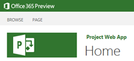

Este es un breve de resumen de las novedades de Project Server 2013. La lista incluye los 10 puntos que personalmente me resultaron más interesantes. Hay mucho más para profundizar, pero esta pequeña lista inicial, servirá para tentarse, para interesarse en la nueva versión y para comenzar a imaginar migraciones o nuevas instalaciones. ¡Qué lo disfruten!

Cada vez que Microsoft libera una nueva versión de Project Server, supera mis expectativas. La versión 2010 me había parecido el cambio más significativo de su historia. Y cuando pensaba que una versión 2013 no podría innovar demasiado, otra vez quedo sorprendido. De repente, aparece ahí todo lo que necesitábamos. ¡Bienvenidos a Project Server 2013!

1. Project Server online

No, no, no. No esperaba tener Project Server en la nube, pero ahí está. Y esto es más que importante. Para empezar, PS sigue en la carrera de los productos más consagrados de Microsoft, lo que es muy importante, porque lo hace alinearse a las tendencias y adaptarse a los estándares. Pero claro que lo más importante creo yo, es haber bajado la barrera de entrada. Montar una infraestructura de Project Server nunca es sencillo para una organización, hasta ahora, que tenemos una opción de entrada realmente viable. Bien por este cambio. Seguimos en las ligas mayores.

2. Los avances de la edición web

Desde la versión 2010 comenzamos a disfrutar de la posibilidad de crear y editar proyectos vía web, sí, desde PWA. Esto sigue avanzando con varias mejoras en la versión 2013, entre la que destaco:

-La vista de timeline, una de las hermosas novedades de Project 2010 ahora en Project Server 2013. Cool!

-No más necesidad de presionar calcular.

-Ahora podemos grabar líneas base.

-Campos de costos y materiales, deadlines, más tipos de tareas, cálculo automático de fórmulas y más!

3. SharePoint Designer para los flujos de trabajo

Sí, leyeron bien, los difíciles flujos de trabajo para gestionar la demanda que debían hacerse en Visual Studio, ahora se pueden hacer en SharePoint 2013, con limitaciones por supuesto. Tremendo cambio! Fundamental y necesario. No resolverá todos los problemas, pero simplifica la creación de flujos de trabajo poco complejos. Bienvenido sea. Esperemos que el próximo sea que Microsoft compre o desarrolle una súper potente herramienta de workflow. Marcaría la diferencia.

4. Arquitectura

Varios cambios en la arquitectura. Odata Service nos permite generar reportes en Project Server on line, donde no podemos acceder a la base de datos directamente. Las famosas 4 bases de datos fueron consolidadas en 1 para achicar costos a la hora de montar la infraestructura de Project Server. Hay muchos más, muchos de ellos relacionados con la nueva variante de PS on line.

5. Opciones pre Project Server

Podemos tener sitios de proyecto sin necesidad de usar Project Server. No manejan la conexión con PS, sí con Project. Si queremos comenzar con un proyecto de menor peso, SharePoint nos permite crear una lista de tareas de proyecto. Hasta ahí, algo normal, pero qué dirían si esa lista se puede integrar en la lista de proyectos de Project Server y sus asignaciones pudiesen ser tenidas en cuenta para el cálculo de la disponibilidad. Sí, en la versión 2013 se puede hacer, lo que supone un interesante camino para ir desde proyectos más livianos a más pesados. Punto a favor.

6. Acceso desde dispositivos móviles

Fundamentalmente para la funcionalidad de SharePoint, podremos acceder desde Windows Phone, Apple o Android con capacidades de touchscreen. Si utilizamos el cliente de Exchange, también será posible actualizar el estado de nuestras tareas. Suma!

7. Consolidación de Mis Tareas

Ahora es posible en un sólo lugar consultar tu tareas de Project Server, de SharePoint y de Outlook. Otro gran paso hacia la usabilidad, especialmente para los miembros de equipo, quienes creo apreciarán mucho este cambio. Este tipo de acciones pueden hacer a Project Server más popular.

8. Administración

Muchas de las configuraciones que anteriormente encontrábamos en Server Settings fueron movidas a la administración de SharePoint. Esto también era algo necesario, que antes lo resolvíamos con configuraciones a medida de seguridad. Apunta a separar las configuraciones más funcionales, propias de una PMO de las que corresponden más a una área de infraestructura. Administración de cola, backup, OLAP y algunas configuraciones de flujo de trabajo y políticas operacionales, ahora están en Central Administration.

9. Nuevo modelo de Seguridad

Ahora disponemos de dos modelos de seguridad, el clásico, complejo y conocido de Project Server y uno nuevo basado en SharePoint, más sencillo con ventajas y desventajas. Este nuevo modelo no maneja RBS ni categorías. A favor, está integrado con la seguridad de SharePoint y permite manejar mejor la herencia de permisos. Una mejora necesaria, que dependerá de cada caso y de acuerdos entre distintas áreas, la opción a elegir.

10. Otras cositas

Cuando configuren el fuera de oficina en Outlook, Project lo notará y lo tendrá en cuenta, así no es necesario duplicar los calendarios de vacaciones. También existe Project Pro para 365. En los sitios de proyecto, podemos ver las tareas del proyecto y abrir desde allí Project Pro. Y mucho más, pero escapa al alcance de este artículo.

Esto fue sólo una lista inicial para tentarlos y empezar a pensar en migraciones y nuevas instalaciones. Hasta la próxima!

**Juan Pablo Pussacq Laborde**
MVP SharePoint
[jpussacq@gmail.com](mailto&#58;jpussacq@gmail.com)
[@jpussacq](http&#58;//twitter.com/jpussacq)
[http://surpoint.blogspot.com/](http&#58;//surpoint.blogspot.com/)

