Cuando existen valores para asignar a columnas de tipos de datos no simples (Choice, Person or Group, External Data ó Managed Metadata) programáticamente a veces resulta un poco difícil encontrar la manera de asignar un valor que el usuario pasa por parámetro a un elemento web o tomar un valor y grabarlo manualmente en la lista/biblioteca.

En este artículo vamos a hablar de cómo trabajar con estos tipos de datos cuando tenemos que hacer un desarrollo para SharePoint 2010 con Visual Studio.

**Introducción**

En algunas ocasiones puede ser necesario de acuerdo a un requerimiento de un cliente el desarrollo de un elemento web que acepte algún valor pasado por parámetro por ejemplo que se obtenga a través de Query String o por Propiedad del elemento web.

Cuando estos valores deben asociarse a una columna de una lista o biblioteca cuyo tipo de datos no sea simple podemos optar por crear dinámicamente un formulario que contenga las columnas de la lista y además verificando si para alguna de sus columnas se ha pasado un valor como inicial.

Dependerá del tipo de dato de la columna la forma de proceder para su resolución puesto que cada una de ellas configurará y validará el dato de forma distinta.

Haremos foco a los 4 tipos de datos mencionados anteriormente: Choice, Person or Group, External Data y Managed Metadata, tanto en la forma de cómo asignar un valor como así también como procesarlo para poder guardarlo cuando se realiza manualmente la grabación de los datos.

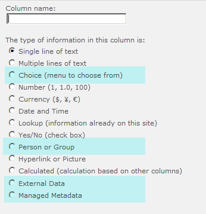

Partiré del concepto general donde me conecto dinámicamente a una lista cuyo nombre se obtiene por propiedad del elemento web, luego por cada uno de los campos existentes en la lista, se deberá verificar el tipo de campo que es para renderizar el control apropiado y si además tiene un valor predefinido asignarlo a dicho control, agrego aquí a modo de ejemplo unas líneas simples, para tener un contexto de cómo asignar los valores a cada campo.

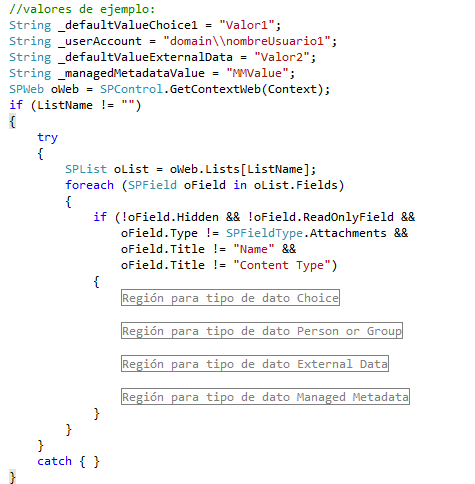

**Asignar valor a** **Tipo de Dato "****Choice****"**

En este caso particular elegí presentar el caso en donde el formato elegido para el componente se visualiza como Lista desplegable o como Botones de Radio.

Por lo cual se deberá obtener el formato de edición que tiene el campo para crear el control apropiado para ese tipo de dato.

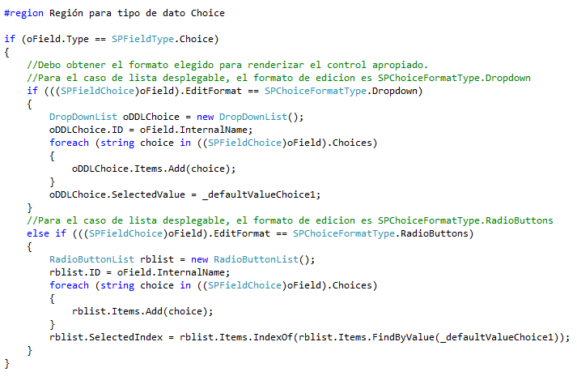

**Asignar valor a****Tipo de Dato "****Person** **or** **Group****"**

Este tipo de columna permite al usuario elegir un valor a partir de una lista de usuarios o grupos.

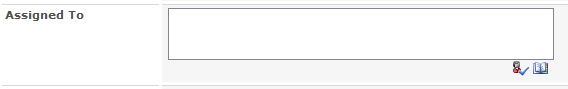

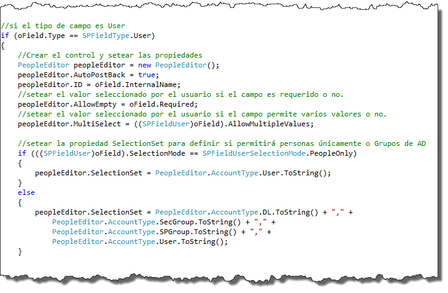

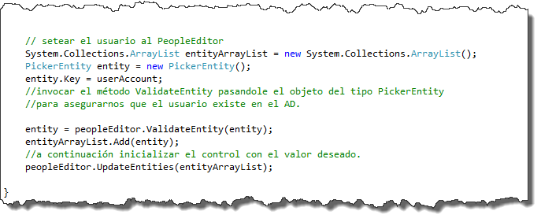

**Asignar valor a****tipo de Dato** **External** **Data**

Algunas definiciones útiles

·**Business** **Connectivity** **Services** **(BCS)** es un conjunto de servicios que facilitan la conexión entre soluciones SharePoint y sistemas externos. 
·**Business Data Connectivity Service (BDC)** Antes llamado Business Data Catalog (en MOSS 2007). El BDC en SharePoint 2010 es un servicio que actúa como intermediario entre los datos de negocio y un sitio SharePoint.
·**Lista Externa**, es una lista de SharePoint que se utiliza para mostrar información de un sistema externo en SharePoint.

Para obtener los atributos configurados por el usuario de un SPField y que no son "comunes" es decir no aparecen como propiedades del mismo, lo que hacemos es consultar la definición del campo en el esquema del mismo.

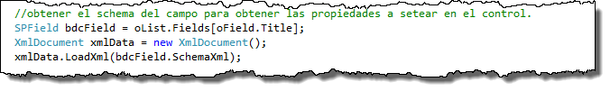

De aquí se desprende lo siguiente:
·**RelatedFieldWssStaticName**: devuelve el nombre interno correspondiente a la entidad de la columna BDC.

·**SystemInstance**: el nombre del Lob System Instance ó Aplicación BDC a la cual está ligada la columna.

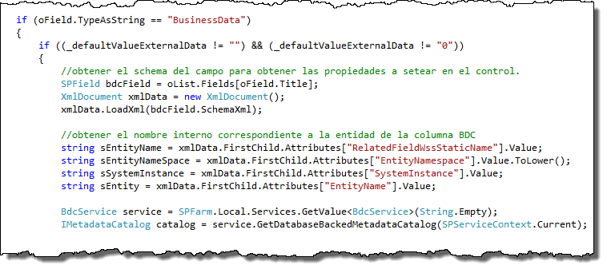

Una vez que conseguimos los datos definidos en la columna podemos obtener el content type externo utilizando el nombre y el namespace:

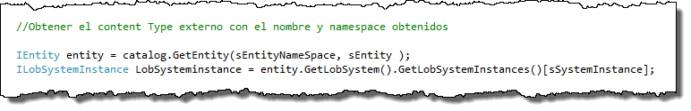

Solo nos resta ahora encontrar setear el valor al campo

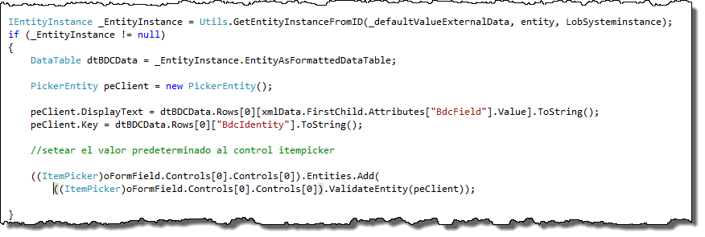

Para realizar esto me ayudo de un par de funciones que defino aquí:

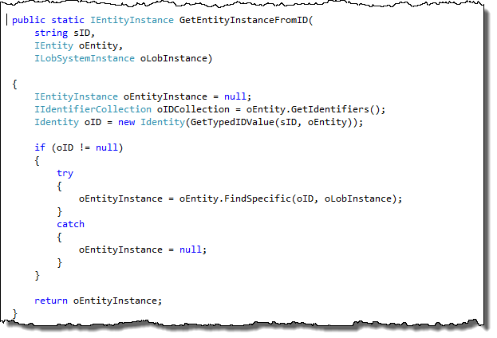

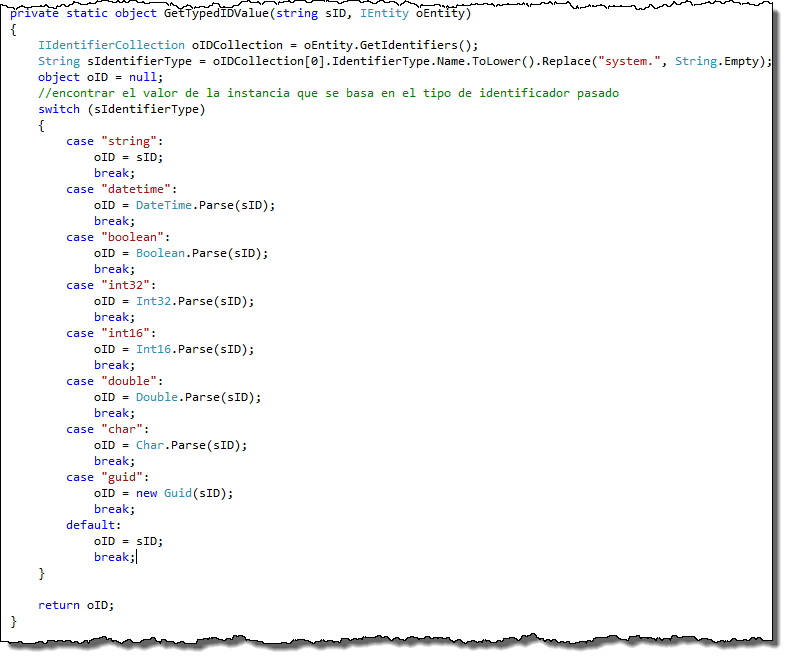

**Asignar valor a****Tipo de Dato** **Managed** **Metadata**

Definiré algunos conceptos relacionados de acuerdo a información publicada en (Technet, 2011)

·***Managed*** ***Metadata*** *es una colección jerárquica de términos administrados centralmente que se pueden definir y usar después como atributos para elementos de Microsoft SharePoint Server 2010.*

·***Término****,* *una palabra o frase que puede asociarse a un elemento de SharePoint Server 2010*

·***Conjunto de términos*** *es una colección de términos relacionados*

*Se puede especificar que una columna de Microsoft SharePoint Server contenga un término de un determinado conjunto de términos.*

*Cuando se crea una columna* *de tipo* *Managed* *Metadata**, se especifica el conjunto de términos del que debe proceder el valor de la columna.* *Una columna de metadatos administrados se usa cuando se desea que los usuarios proporcionen información de los elementos de lista (incluidos los documentos) y los valores válidos para la información están incluidos en un conjunto de términos. Se puede crear un nuevo tipo de contenido o modificar uno existente, y agregar la columna de metadatos administrados al tipo de contenido.*

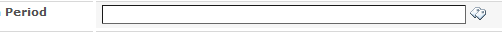

Debemos empezar por obtener el campo para conocer sus propiedades:

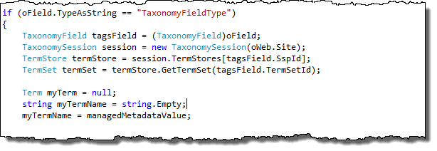

A continuación debo buscar el valor pasado por parámetro dentro de mi conjunto de términos y si existe asigno el termino al **TaxonomyFieldValue** (si es un único valor) o **TaxonomyFieldValueCollection** en caso de que el campo acepte múltiples valores, utilizando el método **PopulateFromLabelGuidPair**

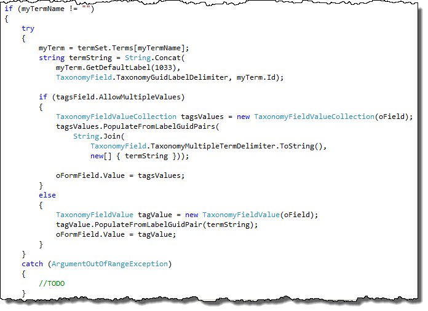

**Silvina Andrea Pizzarulli**

Especialista SharePoint en Baufest

[http://silvinapizzarulli.blogspot.com](http://silvinapizzarulli.blogspot.com/)

 
 
import LayoutNumber from '../../../components/layout-article'
export default LayoutNumber
