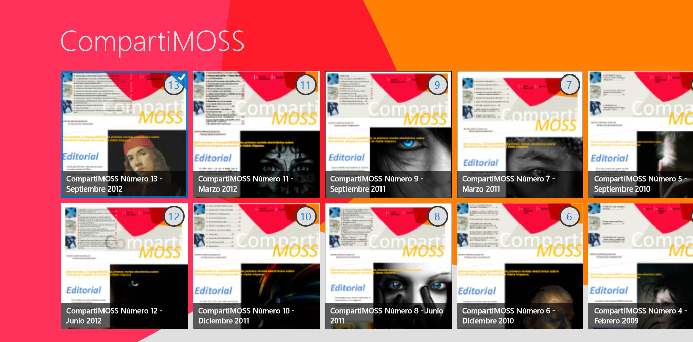
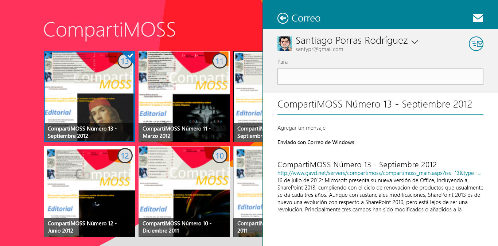
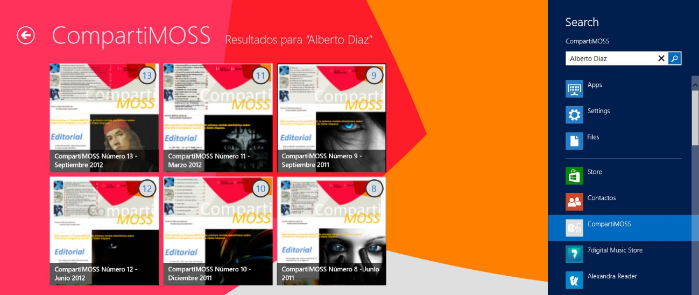
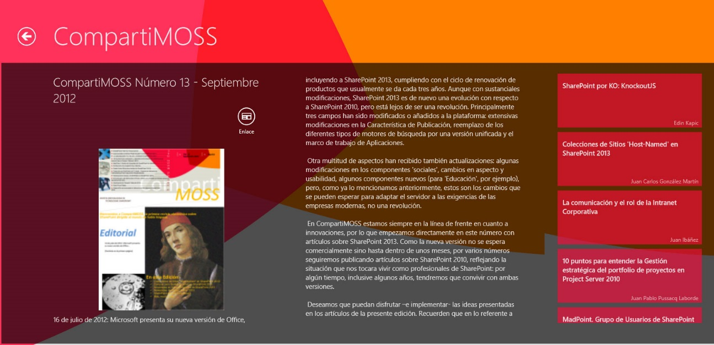
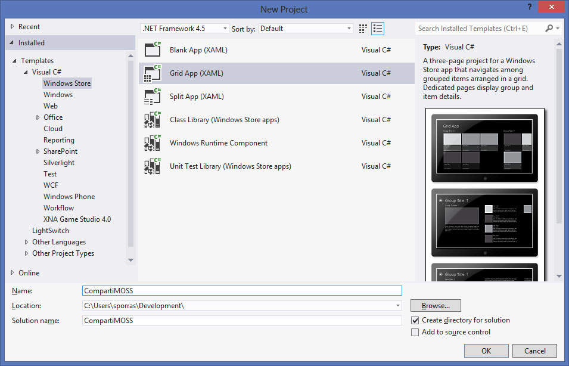

Microsoft está redefiniendo todos sus productos y adaptándose a las nuevas tendencias tecnológicas. Es por eso que pensamos que CompartiMOSS tenía que redefinirse también y, dentro de ese proceso, no podía faltar la aplicación en Windows 8

**Objetivo**

La idea de la aplicación es permitir a los usuarios acceder a los contenidos de la revista de una forma rápida, sencilla, clara y que además lo pueda hacer desde su PC o desde su Tablet con la comodidad que ello supone. Para ello, se ha implementado una primera aproximación a la aplicación ideal, frenada por la motivación de que los contenidos actualmente están publicados en formato PDF. Próximamente la aplicación irá evolucionando para ofrecer nuevas formas de acceder a los artículos.

**Funcionamiento**

Se ha intentado maximizar la facilidad con la que el lector acceda a los contenidos actualmente publicados y que pueda ver fácilmente los artículos de cada número, así como sus autores. Por ello, al entrar en la aplicación, lo primero que nos encontraremos será el listado con los números publicados en CompartiMOSS, organizados por fecha de publicación y numerados, de tal forma que sea fácil acceder a los mismos.

Además, podremos compartir el número que hayamos seleccionado, con el botón derecho del ratón o con el gesto deslizamiento hacia abajo en un entorno táctil, mediante la aplicación que queramos y que permita esta acción, ya sea el correo, Twitter, Facebook, etc. En el ejemplo he hecho uso de la aplicación de correo electrónico para compartir el número donde, como vemos, se incluye el enlace a la revista en PDF y un resumen de la editorial.

También es posible realizar una búsqueda por autor o por título de artículo haciendo uso del contrato de búsqueda de Windows 8, que nos devolverá el número de la revista que contiene datos coincidentes con los términos que hayamos ingresado.

Al seleccionar un número, veremos los detalles del mismo, incluyendo la imagen de portada, la editorial y el listado de artículos con sus autores correspondientes. Además, en esta vista podremos compartir el número igual que podíamos hacer desde la vista inicial y disponemos de un botón "Enlace" que al ser pulsado abrirá Internet Explorer para llevarnos al documento PDF del número. Otra característica de esta vista es que podremos navegar por los diferentes números de CompartiMOSS con las flechas de navegación que aparecen a los lados de la pantalla o, en un entorno táctil, haciendo el gesto de deslizar a la derecha o a la izquierda.

**Desarrollo**

La aplicación se ha desarrollado con C# + XAML basándose en la plantilla "Aplicación de cuadrícula" (Grid App) que cumplía con nuestro objetivo para esta primera versión de la aplicación que era mostrar un listado de los números y una vista de detalle de cada uno de ellos.

Las características propias de Windows 8 que se han utilizado corresponden al contrato de "compartir" para poder difundir los números que nos parezcan interesantes con nuestros amigos y compañeros, y el contrato de búsqueda que nos permite buscar los números que contengan el autor o el artículo que contenga los términos que especifiquemos.

Para obtener los datos, dado que la revista se presenta en formato PDF, se han programado unos servicios en Azure que devuelven los números publicados, los títulos de los artículos y los autores de los mismos, preparados para en un futuro próximo poder devolver además el contenido de los artículos y otros datos para enriquecer aún más la experiencia de los usuarios.

**Futuros** **pasos**

Como ya os he desvelado, esta no es sino la primera versión de la idea planteada para la aplicación de CompartiMOSS y, como nos gusta compartir, queremos daros a conocer todo lo que vendrá en el futuro.

- Mostrar los artículos dentro de la aplicación
- Búsqueda dentro del contenido de los artículos
- Mostrar los artículos de un autor así como su biografía e información adicional
- Live Tiles que muestren los últimos artículos
- Notificación de nuevo número

Todas estas características y puede que alguna más vendrán en futuras versiones que irán llegando en las próximas fechas Windows Store

**Santiago Porras Rodríguez**

UX Developer en General de Software

[http://geeks.ms/blogs/santypr](http://geeks.ms/blogs/santypr)

[@saintwukong](http://twitter.com/saintwukong)

