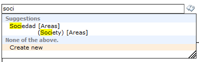
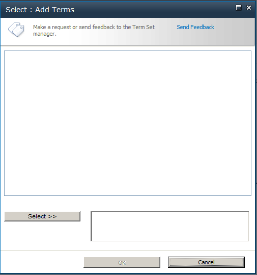
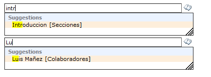
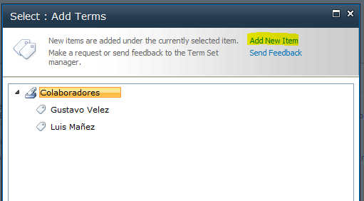
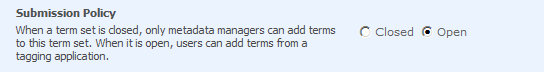
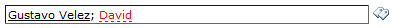
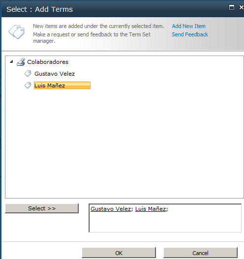
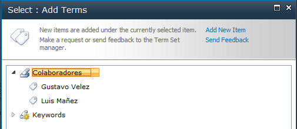
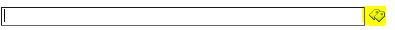

​SharePoint 2010 introduce el servicio de metadatos administrados que nos permite definir una estructura jerárquica de metadatos y keywords (palabras clave), muy útil a la hora de catalogar documentos e ítems de lista, entre otras.

Para enlazar con el almacén de términos, SharePoint 2010 proporciona un nuevo control, el *TaxonomyFieldControl* ([http://msdn.microsoft.com/en-us/library/ee572171](http://msdn.microsoft.com/en-us/library/ee572171)), y que se muestra de esta forma:



Sin embargo, este control no nos va a permitir configurar algunas funcionalidades interesantes. Por suerte, tenemos otro control llamado TaxonomyWebTaggingControl, que es usado internamente por el propio TaxonomyFieldControl y que permite más opciones de configuración.

Para empezar, vamos a ver cómo podemos añadir ese control en unos de nuestros webparts. Para ello primero debemos registrar el espacio de nombres de Taxonomy:


```
<%@ Register Tagprefix="Taxonomy" Namespace="Microsoft.SharePoint.Taxonomy" Assembly="Microsoft.SharePoint.Taxonomy, Version=14.0.0.0, Culture=neutral, PublicKeyToken=71e9bce111e9429c" >;
```


Una vez registrado, ya lo podemos utilizar con el siguiente código:


```
<Taxonomy:TaxonomyWebTaggingControl ID="myTaxonomyControl" runat="server" Visible="true" />;
```

De momento no hemos conseguido gran cosa, ya que necesitamos configurar el control para conectar al almacén de términos. Esto lo podemos conseguir con el siguiente código:


```
TaxonomySession taxonomySession = new TaxonomySession(SPContext.Current.Site);
ore termStore = taxonomySession.DefaultSiteCollectionTermStore;
TermSet termSet = termStore.Groups[0].TermSets[0];

();
myTaxonomyControl.TermSetList = termSet.Id.ToString();
myTaxonomyControl.AllowFillIn = true;
myTaxonomyControl.IsAddTerms = true;
myTaxonomyControl.IsMulti = false;
myTaxonomyControl.ExcludeKeyword = false;
myTaxonomyControl.IsAddTerms = true;
myTaxonomyControl.IsUseCommaAsDelimiter = true;
myTaxonomyControl.IsDisplayPickerButton = true;
```

Primero estamos abriendo la conexión al TermStore, para ello, usamos la clase TaxonomySession, que recibe la URL del SPSite, y posteriormente hacemos uso de la propiedad DefaultSiteCollectionTermStore, para enlazar al TermStore por defecto del Site. Finalmente obtenemos una instancia al primer TermSet del primer Group.

A partir del TermStore y el TermSet obtenido, enlazamos el control haciendo uso de las propiedades SSPList y TermSetList.


Al enlazar el control, también podemos enlazarlo con varios TermSets, haciendo uso de la propiedad TermSetId, que nos permite añadir el GUID de cada TermSet que queramos enlazar. Sin embargo, si enlazamos con varios TermSet, no podemos especificar la propiedad TermSetList, ya que esta última prevalece sobre la anterior. Esto quiere decir, que si enlazamos con varios TermSet, no podemos hacer uso del selector de términos, ya que, al no haber especificado el TermSetList, éste nos saldrá vacío, tal y como vemos en la figura 2.



Sin embargo, como vemos en la figura 3, si escribimos sobre el control, sí que nos autocompleta con los Terms de los TermSet que hemos especificado (Secciones y Colaboradores).



Veamos ahora el resto de propiedades que hemos configurado.

**AllowFillIn**

Permite que desde la pantalla de selección de términos, se puedan crear nuevos términos, desde el enlace "Add New Item".



Por supuesto, para que esto funcione, el TermSet debe haberse definido como Abierto



**IsAddTerms**

Permite que desde la caja de texto del control, podamos escribir nuevos términos que no existen en el TermSet, y el control no los valide. En la figura 4 podemos ver el efecto de esta propiedad a False, cuando se escribe un término que no existe en el TermSet.



**IsMulti**

Permite seleccionar varios términos del TermSet. Si se establece a False, sólo nos permitirá seleccionar un Término, y si escribimos más de uno sobre la caja de texto, nos lo marcará en rojo y no permitirá submitir el control.


**ExcludeKeyword**

Permite definir si queremos excluir los términos del TermStore de Keywords. Para que esta propiedad sea efectiva, primero tenemos que enlazar en control con el TermStore de Keywords. El código anterior enlaza el control con 2 TermStore, el de por defecto, y el de Keywords.

```
myTaxonomyControl.SspId.Add(termStore.Id);
myTaxonomyControl.SspId.Add(taxonomySession.DefaultKeywordsTermStore.Id);
myTaxonomyControl.TermSetId.Add(termSet.Id);
myTaxonomyControl.TermSetId.Add(taxonomySession.DefaultKeywordsTermStore.KeywordsTermSet.Id);
```



**IsUseCommaAsDelimiter**

Permite utilizar el character "," (coma), como separador de términos, además del carácter ";" (punto y coma), que es el utilizado por defecto.

**IsDisplayPickerButton**

Con esta propiedad podemos ocultar y mostrar el botón que abre la pantalla de selección de términos.



**Referencias**

- TaxonomyWebTaggingControl Class: [http://msdn.microsoft.com/en-us/library/microsoft.sharepoint.taxonomy.taxonomywebtaggingcontrol.aspx](http://msdn.microsoft.com/en-us/library/microsoft.sharepoint.taxonomy.taxonomywebtaggingcontrol.aspx)
- SharePoint 2010 Custom Taxonomy Web Service: [http://code.msdn.microsoft.com/office/SharePoint-2010-Custom-63318fa9](http://code.msdn.microsoft.com/office/SharePoint-2010-Custom-63318fa9)


**Luis Máñez**

MCPD SharePoint 2010 / Microsoft Active Professional 2012

[http://geeks.ms/blogs/lmanez/](http://geeks.ms/blogs/lmanez/)

[http://twitter.com/luismanez](http://twitter.com/luismanez)