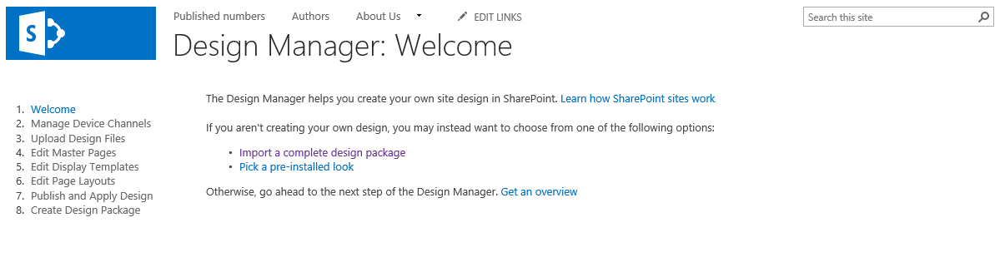
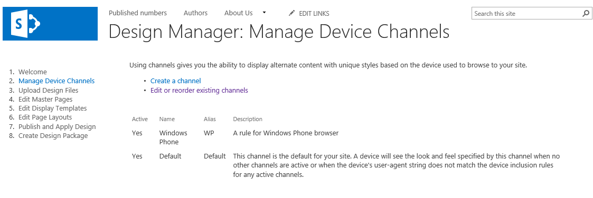
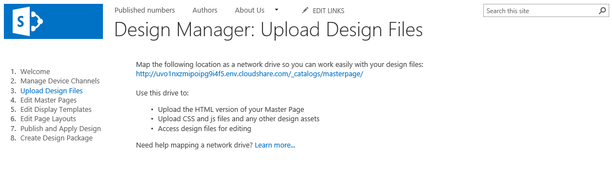
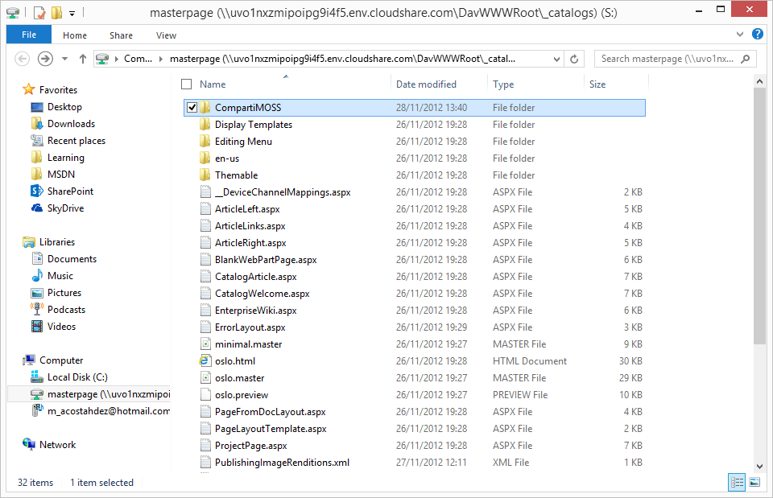
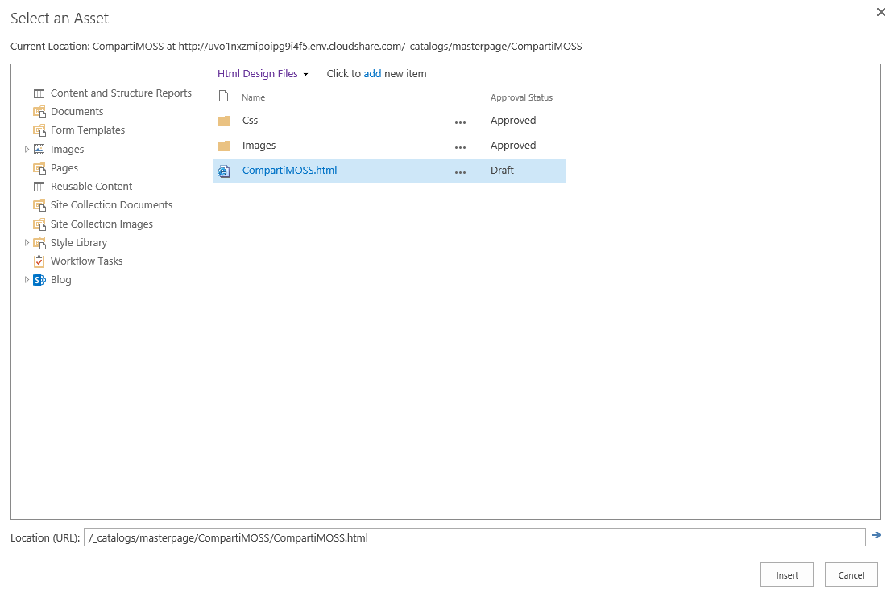
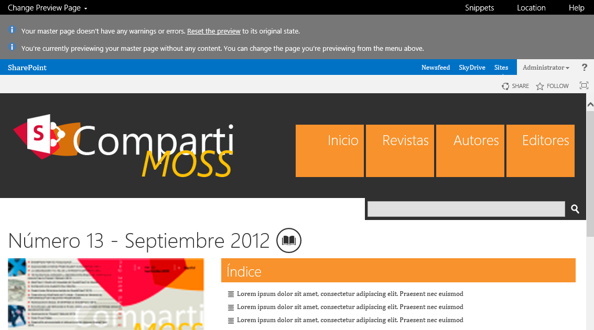
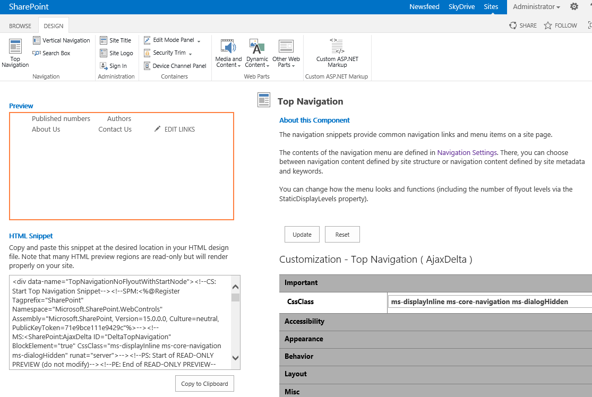
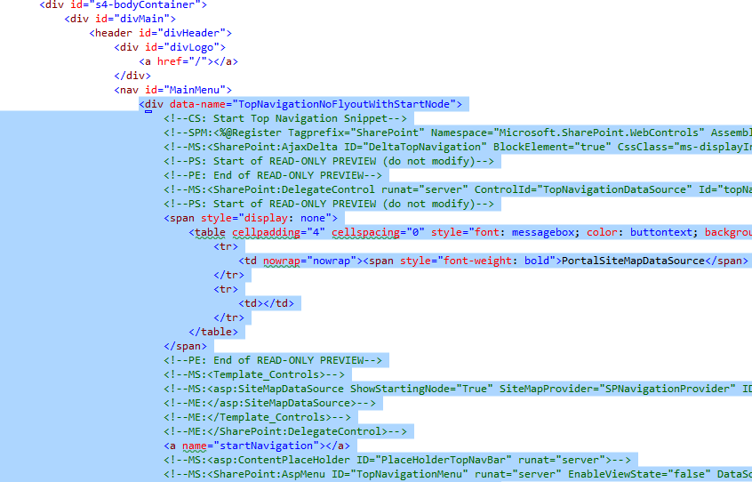
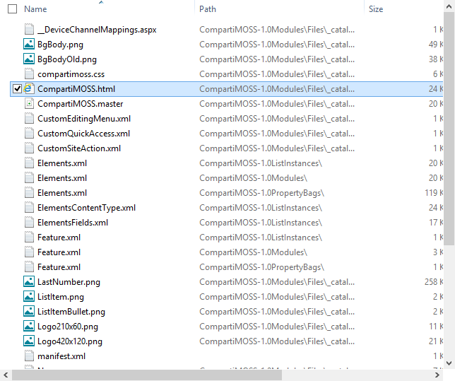

import ArticleHeader from '../../../components/article-header'

<ArticleHeader frontmatter={props.pageContext.frontmatter} />

En las versiones anteriores de SharePoint, crear una página maestra o un diseño de página no era tarea para diseñadores Web, ya que necesitaban tener los conocimientos técnicos necesarios para integrar su solución HTML en SharePoint. Los diseñadores necesitaban conocer los aspectos técnicos de las páginas maestras y los componentes necesarios que estas necesitaban para que se renderizaran correctamente.

SharePoint 2013 intenta mejorar esta limitación, acercando al diseñador web al ciclo de desarrollo y para esto se ha incluido una nueva funcionalidad llamada Design Manager o Administrador de diseños. Este administrador, entre otras cosas, ofrece una guía para que el diseñador convierta su HTML y hojas de estilos, en una página maestra de SharePoint.

Utilizando la herramienta de diseño web que se prefiera, nos conectaremos a la biblioteca de catálogos de SharePoint y subiremos los ficheros que necesitemos para construir la página maestra, html, css, imágenes, etc.

El Design Manager nos ofrece un asistente que nos guiará por los conceptos fundamentales y necesarios para implementar nuestra página maestra.

Canales de dispositivos

Los Canales de dispositivos, son un concepto nuevo en SharePoint 2013, y nos permiten definir reglas que permitan mostrar contenido alternativo basadas en el navegador. Con estas reglas podríamos definir páginas maestras alternativas, por ejemplo, para dispositivos móviles.

​

Cargar archivos de diseño

Subir nuestros diseños es tan simple como crearnos una unidad de red, en local, utilizando la URL que nos aparece en esta sección.

Tan fácil como copiar la carpeta donde tenemos los diseños y pegarla en la unidad de red que hemos creado, apuntando a la biblioteca de catálogos y páginas maestras.

Editar páginas principales

Una vez subido el diseño, tenemos que convertirlo en página maestra. Para esto, nos vamos al enlace de Convertir HTML en página maestra, seleccionamos nuestro fichero HTML y esperamos a que SharePoint haga la magia.

Una vez convertido, tendremos que editarla, comprobar que se mantiene el diseño y agregar la funcionalidad de SharePoint que necesitemos, por ejemplo, el menú de navegación, el cuadro de búsqueda, y demás. Para facilitarnos el trabajo, utilizaremos el Previsualizador de diseño y los Snippets que nos ofrecerán permiten seleccionar el código que necesitemos para incluir las funcionalidades de SharePoint en nuestro diseño.

Por ejemplo, en nuestro diseño debemos incluir el menú de navegación, con lo que los usuarios podrán administrarlo sin problemas. Para esto, nos vamos a la ventana de Snippets y seleccionamos el diseño de Top Navigation y copiamos al portapapeles el código HTML.

Con ese trozo de HTML, nos vamos a nuestra herramienta de diseño (Dreamweaver, Visual Studio, etc.) y lo insertamos en la sección que le corresponde, editando el fichero html desde la unidad de red que hemos enlazado a la biblioteca de catálogos de SharePoint y adaptando los estilos, si fuera necesario.

Fíjense que SharePoint ha modificado sustancialmente nuestro diseño inicial, incluyendo el código para la gestión de la Ribbon y otras funcionalidades necesarias para que la página maestra funcione correctamente.

Editar plantillas para mostrar

Las Display Templates, son plantillas de visualización de resultados de búsquedas y nos permiten definir el modo de visualización de los distintos resultados de los Web Parts de búsqueda, como el nuevo Web Part de búsqueda de contenido. Si vamos a trabajar con la nueva plantilla de Catálogo de Productos, con publicación Cross-Site o con el Web Part de búsqueda de contenido, lo ideal es que nos creemos nuestras plantillas para que el resultado se renderice atendiendo a los estilos de nuestra web.

Editar diseños de páginas

Los diseños de páginas definen el aspecto final de los contenidos de nuestra web. Cuando un usuario crea una página, debe de seleccionar que diseño va a usar para la visualización del contenido de la misma. Por defecto, en SharePoint tenemos diversos diseños que se pueden utilizar y desde este diseñador podemos crear los nuestros propios, utilizando el previsualizador de diseño y los Snippets que vimos en la sección de páginas maestras.

Publicar y aplicar diseño

Cuando tengamos todos nuestros diseños adaptados, las plantillas de páginas adecuadas y demás, tenemos que publicarlos. Para esto, nos vamos a la biblioteca de páginas maestras y aprobamos el contenido, el fichero html, las css, las imágenes, etc. Sin este proceso de aprobación, los usuarios que no tengan permisos de colaboración en esta biblioteca, no podrán hacer uso de ellos y no se les aplicará el diseño que hemos implementado.

Crear paquete de diseño

Es este punto el que nos permite empaquetar nuestros diseños en un wsp y llevarlo a los servidores de producción o testing para poder probarlos e implementarlos. Este paquete incluirá nuestro html, css y demás, junto con la página maestra que se ha generado en todo el proceso.

**Conclusiones**

El Design Manager nos llevará paso por paso a la implementación de un diseño en nuestro SharePoint, sin embargo, aunque nos abstrae bastante de algunos conocimientos técnicos sobre la plataforma, creo que sigue siendo necesario que nuestro Diseñador Web tenga esos conocimientos o haga la implementación de su diseño con la ayuda de un desarrollador de SharePoint. Un gran paso que nos permite iniciar el proceso de creación de las páginas maestras y, sobre todo, utilizar nuestra herramienta favorita de diseño web para poder hacer todo esto.

**Alberto Diaz Martin**
MVP SharePoint
[adiazcan@hotmail.com](mailto&#58;adiazcan@hotmail.com)
[@adiazcan](http&#58;//twitter.com/adiazcan)
[http://geeks.ms/blogs/adiazmartin](http&#58;//geeks.ms/blogs/adiazmartin)

