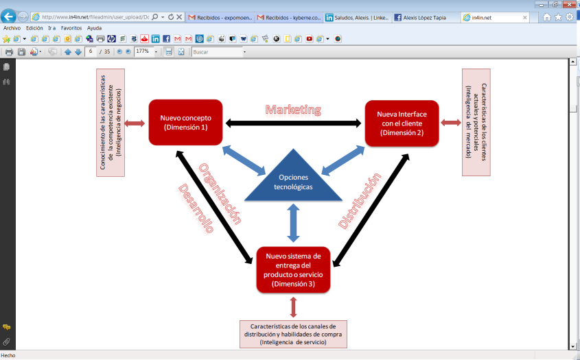
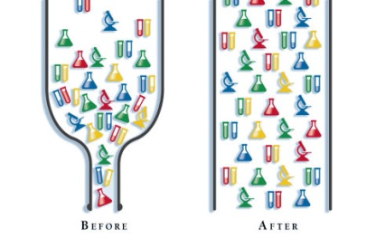

​Desde su inconspicua y casi tímida aparición en 2001, como un simple add-on en el CD de Office llamado “SharePoint Team Services”, a la recientemente liberada versión preliminar 2013, la actual plataforma de colaboración empresarial -verdadero buque insignia de Microsoft en el ámbito corporativo-, ha recorrido un largo camino, tanto tecnológico como comercial.

Como bien señala Gustavo Vélez en la editorial del último número de la revista [CompartiMOSS](http&#58;//www.gavd.net/servers/compartimoss/compartimoss_main.aspx): “Sharepoint 2013 es de nuevo una evolución con respecto a SharePoint 2010, pero está lejos de ser una revolución”… y quizá sea mejor así, porque a mi modesto juicio como biólogo, “el ecosistema SharePoint” aún no está maduro para revoluciones, y además, porque evolución es fundamentalmente adaptación y -tras 12 años de la plataforma en el mercado-, muchas “especies empresariales” no han logrado siquiera adaptarse plenamente a su uso.

Finalmente, para muchos de quienes hemos venido trabajando en ella desde sus comienzos, además de constituirse en fuente permanente de desafíos intelectuales y de oportunidades laborales -y a causa precisamente de ello-, el uso y desarrollo de soluciones sobre SharePoint se ha terminado transformando en un verdadero modus vivendi: ha sido entonces más bien una evolución constante y no una revolución temporal.

De igual modo, para los usuarios finales, y para la mayoría de las miles de empresas que han venido implementando SharePoint en cualquiera de sus versiones, la experiencia quizá haya sido similar: la plataforma se transforma en un “modo de vida” dentro de la organización, y de allí la “notable relevancia de hacer notar” el cambio cultural y conceptual que se requiere al interior de las empresas, desde el momento mismo de comenzar a pensar en el uso de SharePoint, e incluso desde antes.

Y es que pese a la ya larga existencia –en “tiempo informático”- de SharePoint en el mercado, a los millones de usuarios que diariamente realizan allí sus labores, y a la importancia cada vez más notoria que Microsoft le ha venido asignando entre sus productos, muchas sino la mayoría de las empresas que lo han implementado suelen sub utilizarlo, o al menos, no le sacan todo el provecho que podrían obtener… lo que a estas alturas se ha transformado en un hecho de la causa: la mayoría de las organizaciones utiliza menos de la mitad de las capacidades nativas de la plataforma, y algunas, quizá ni eso.

De allí que incluso hoy, la mayoría de las Empresas utilice SharePoint como un simple servidor de archivos o un gestor de contenidos –y no lo digo porque la gestión documental en sí misma sea simple-, otras lo privilegian como espacio colaborativo o para cierto nivel de gestión de proyectos, como motor de búsquedas, o una mezcla de todas las anteriores.

Y por supuesto, también se da el caso de que muchas empresas lo implementan únicamente para cumplir con determinas certificaciones ISO, aunque en realidad no lo aprovechan ni desarrollan.

Si bien en cada una de esas áreas por separado, o en todas ellas, SharePoint responde plenamente a los requerimientos, suele suceder que estos son menores a sus capacidades reales, o bien, que el enfoque y alcance de su uso es limitado.

Por ello, desde la aparición en la versión SharePoint 2007 de los primeros flujos de trabajo nativos –Workflows–, el desafío estratégico, tecnológico y cultural para las empresas que utilizan o piensan utilizar la plataforma se ha vuelto aún mayor.

Al respecto, ya en un artículo de 2009, Héctor Insua sostenía es su [Blog](http&#58;//hinsua.blogspot.com/2009/03/analisis-de-soluciones-de-workflows.html#%21/2009/03/analisis-de-soluciones-de-workflows.html): “los Workflows Nativos fueron una buena noticia al momento del lanzamiento de SharePoint 2007, pero ya casi 2 años después, realmente nos damos cuenta de que sirven para pocas aplicaciones, y es que en realidad, la mayoría de los procesos corporativos son muy distintos y muy “a medida” de las organizaciones, para lo cual, las soluciones Estándar NO son recomendables”.

De este modo, paralelamente al lanzamiento de esa versión, varias empresas comenzaron a ofrecer poderosos Motores de Workflow para SharePoint, entre las que destacan la australiana [Nintex](http&#58;//www.nintex.com/), que es el líder del mercado, tanto para las versiones 2007, 2010 y ya está disponible también para 2013; [Kaldeera](http&#58;//www.kaldeera.com/es-ES/Paginas/default.aspx), únicamente para SharePoint 2007; [K2 blackpoint](http&#58;//www.k2.com/en/blackpoint.aspx), para SharePoint 2003, 2007, 2010 y en demo para 2013; [Datapolis Workbox](http&#58;//www.datapolis.com/Products/DatapolisWorkbox2010.aspx), para SharePoint 2010; [SharePoint Workflow Essentials](http&#58;//sharepointsolutions.com/SharePoint-Add-ons/2010-products/Pages/SharePoint-Workflow-Essentials-2010.aspx?productKey=WE2010), para SharePoint 2010; sin dejar de mencionar suites integradas, como la hindú [Skelta SharePoint Accelerator](http&#58;//www.skelta.com/products/sharepoint-accelerator/index.aspx), para SharePoint 2010, o la española [AuraPortal](http&#58;//www.auraportal.com/ES/ES0-PRODUCTS-5-Documents.aspx), que utiliza SharePoint para gestión documental, tanto en la versión 2007 como 2010. En general, todas estas empresas ofrecen soluciones que, o bien utilizan y se integran completamente a SharePoint para el diseño y ejecución de los Workflows, como Nintex, o bien utilizan algunas de sus capacidades para integrarlas en robustas soluciones paralelas de BPM, como Skelta y AuraPortal.

En cualquiera de estos casos –e independientemente de la solución utilizada–, lo que estas herramientas proporcionan es una poderosa gama de acciones que supera ampliamente las capacidades nativas de Workflow de SharePoint, además de interfaces amigables, que en la mayoría de los casos evitan tener que codificar, y que representan y diseñan gráficamente los procesos a ejecutar.

El efecto de estas nuevas tecnologías en las Empresas que utilizan SharePoint ha sido notorio.

Ya en la Encuesta de 2011 [¿Cómo utilizan Microsoft SharePoint las Empresas?](http&#58;//www.muycanal.com/2011/10/14/estudio-microsoft-sharepoint-2010), de Open Text, se evidenció que SharePoint 2010 superaba a la anterior versión en implantaciones, y que la principal causa era la gestión de procesos de negocio y flujos de trabajo de la actual versión. De hecho, en esa encuesta, el 67% de los encuestados indicaron que estaban utilizando o planeaban utilizar BPM y Workflows con la implementación de SharePoint, además de que los motores de Workflow -como los mencionados anteriormente-, son las principales aplicaciones, o add-ons que las empresas requieren o utilizan en sus entornos de SharePoint.

Sin embargo, en esa misma encuesta se advertía una “preocupación creciente sobre la falta de estrategias de negocio en las implementaciones de SharePoint”, que aparecía como el segundo mayor reto a la hora de implementar la plataforma en las organizaciones.

Nuestra reflexión comienza en este punto.

¿Por qué la Gestión de Procesos es un desafío para las Empresas?

Puede parecer de Perogrullo: si evolucionar es adaptarse, entonces todo cambio sería evolución.

La verdad biológica –y para efectos de este artículo, tecnológica-, es que no es así: en la gran mayoría de las especies ocurren cambios que no son adaptativos, es decir, que no proporcionan ventajas reproductivas, que a la larga son las que operan en la selección natural, y se terminan transformando en factores evolutivos concretos para esa especie.

El ejemplo más habitual de lo anterior son las mutaciones –las mismas que, en alguna época, fueron consideradas el “motor del cambio evolutivo” –, y que sin embargo, en la gran mayoría de los casos no sólo no son adaptativas, sino que por el contrario, eliminan rápidamente a los individuos y las poblaciones que las sufren.

A contrario sensu –y me perdonarán esta extrapolación entomológica en un artículo de Tecnologías de la Información, fruto de los dos últimos años sabáticos que he pasado dedicado a ese otro gran tema que me apasiona–, muchas especies vivas actualmente, no han sufrido cambios en cientos de millones de años, como el pequeño Mecóptero chileno Nothiothauma reedi, uno de los llamados “Fósiles vivientes”, que habita en los bosques australes de mi país, y que ha permanecido inalterable desde al menos el período Pérmico, hace más de 250 millones de años.

Esta excéntrica digresión tiene un solo propósito: advertir que el “cambio por el cambio” puede resultar nefasto, tanto en términos de las especies en los ecosistemas, como de las empresas en los sistemas de información.

Veamos un pequeño caso de ejemplo.

En 2009, mi pequeña empresa participó en la Licitación de una gran compañía minera, que nos invitó –junto a otras cuatro grandes empresas de consultoría TI–, para realizar una “migración” de su obsoleta plataforma de Workflow, a SharePoint.

Ya en la reunión inicial, me sorprendió que el gerente a cargo del proyecto especificara que la minera requería “que todos los procesos y el entorno de usuario, se ejecutaran y operaran con la misma lógica y estructura de la plataforma que se debía “migrar”, ya que se encontraba sin actualizaciones y la empresa que la desarrolló ya no existía”. Es decir, no era que los Workflows no funcionaran, era más bien que la plataforma ya no podía actualizarse.

También me sorprendió, debo decirlo, que las otras consultoras comenzaran inmediatamente a proponer soluciones –la mayoría de código–, para hacer que SharePoint se pareciera lo más posible a la plataforma en uso de la minera.

Por ello, después de escuchar a los otros proponentes, le señalé al gerente que, a mi juicio, el proyecto estaba mal enfocado desde el inicio, porque la mera idea de hacer que SharePoint funcionara como lo que no era –de allí que ellos hablaran de “migración” –, y que la lógica de los Workflows operara sobre los parámetros de la antigua plataforma que se quería remplazar, implicaba un problema básico de concepto, de estrategia, de enfoque y, claro está, de conocimientos sobre SharePoint.

En otras palabras, lo que el gerente estaba planteando era un “cambio por el cambio”, no una adaptación, que realmente significara una evolución en la gestión de procesos de la empresa.

No les quiero comentar la reacción de los otros participantes, pero lo cierto es que después de esa intervención, nos retiramos de la reunión agradeciendo la invitación, y declinando participar.

Finalmente, la Licitación se la adjudicó una de las consultoras, que una semana más tarde nos invitó a participar juntos en el proyecto, específicamente en el desarrollo de los Workflows, en este caso, con Nintex, por los siguientes cuatro meses, mientras que el proyecto global se entregaría en un semestre. Sin embargo, nosotros no tuvimos oportunidad de imponer el cuestionamiento central que ya habíamos expuesto en la reunión: la consultora cedió ampliamente a la lógica implícita que había establecido la minera, y el proyecto intentó emular el concepto, la estructura, ¡e incluso la interfaz! de la aplicación anterior.

El resultado: nuestra participación terminó en el plazo acordado, pero el proyecto completo se demoró más de dos años en ser finalizado... lo que no significa que necesariamente haya sido exitoso.

Dicho esto, la gestión de procesos en las empresas es un desafío que comienza mucho antes de implementar SharePoint u otra plataforma, y que no se relaciona directamente con el motor de Workflow que se pretende utilizar.

El desafío central por cierto, es el cambio –lo “nuevo” –, pero vale reiterar que no todo cambio es adaptativo, y por ende, no toda novedad significa evolución.

En términos de mercado, el estudio del Dr. Utz Dornberger & Carlos Palacios, “[Desafíos en la Gestión de la Innovación](http&#58;//www.in4in.net/fileadmin/user_upload/Downloads/WorkingPaper_Desafios.pdf)”, establece que la innovación, es decir el cambio, se considera como la utilidad comercial de una novedad (en términos biológicos, la utilidad reproductiva de una adaptación), y puede realizarse en las siguientes dimensiones:

- En productos/servicios como innovaciones de productos,
- En procesos de producción internos como innovaciones de procesos o
- En la reorganización de una empresa como innovaciones organizacionales

Esa descripción general, se encuentra resumida en el siguiente gráfico del mismo estudio:

Al respecto, el texto señala:

“Los nuevos desarrollos tecnológicos tienen una influencia decisiva sobre el desarrollo de nuevos conceptos de productos y servicios (Dimensión 1) y simultáneamente definen el punto de partida para el desarrollo de nuevas interfaces con el cliente (Dimensión 2) así como un nuevo sistema de entrega de productos/servicios al cliente (Dimensión 3). Particularmente las nuevas tecnologías de información y comunicaciones han incitado un sinnúmero de innovaciones, las cuales han cambiado el panorama de las actividades en áreas tales como Marketing, Distribución y Organización de procesos.”

Cabe destacar que el centro de este diagrama lo constituyen precisamente las opciones tecnológicas, entre las que se cuenta precisamente SharePoint, pero ni el desafío, ni tampoco la respuesta al mismo están allí: ambos se encuentran fuera del diagrama.

El desafío de la gestión de procesos comienza con dos simples preguntas: ¿cómo hacemos lo que hacemos?, y ¿por qué lo hacemos como lo hacemos?

Lo primero es entonces, identificar cuáles son y cómo se ejecutan los procesos que se desarrollan en la Empresa –la llamada ingeniería de procesos–, y la primera respuesta es que, no necesariamente, todos los procesos que se ejecutan “manualmente” en la actualidad, pueden, deben, o incluso, “desean” ser mejorados, ya sea con SharePoint y Workflows, o no.

Como ejemplo de lo último, cabe comentarles la siguiente anécdota:

Un cliente nos encargó el desarrollo de un Workflow para la asignación de presupuestos contra requerimientos. Una vez ejecutada la solicitud, la revisión, discusión, aprobación preliminar y otros muchos pasos, el flujo de trabajo terminaba enviando un correo para que el gerente de presupuestos aprobara o rechazara la asignación solicitada, respondiendo con un “sí” o un “no” en el cuerpo del mensaje (“Lazzy approval”, en Nintex). Por supuesto, la asignación también podía aprobarse directamente en la intranet SharePoint.

Sin embargo, cuando el Workflow fue presentado a la gerente responsable del proyecto, nos indicó que no se necesitaba enviar un correo para solicitar la aprobación, puesto que el gerente de presupuestos ya tenía problemas con la enorme cantidad de correos diarios que recibía, así que ni siquiera quería saber de que le iban a llegar correos automatizados. Y –por supuesto–, tampoco tenía tiempo para ingresar a la intranet.

Por eso, para ella “era mucho más fácil imprimir la asignación, y golpearle la puerta para que la firmara directamente cuando se requería”…

Evidentemente en este caso, no valía ni siquiera la pena intentar explicarle que precisamente, la cantidad de correos diarios que el gerente recibía, se debía probablemente a que el resto de las tareas que ejecutaba no estaban automatizadas… pero ni modo: si el cambio no se desea, no hay Workflow que lo resuelva.

No es que la automatización de la gestión de procesos sea un problema de deseos, claro. Pero el primer desafío a nivel de la Gerencia, es tener la voluntad de cambio.

En este sentido, uno de los problemas habituales de todos los desarrollos de gestión de procesos es dónde comienzan los proyectos:

Suele suceder que la Gerencia de TI –que ha implementado SharePoint en primer lugar–, un buen día “descubre” que puede llevar sus procesos y los de otras áreas en el portal… y suele comenzar entonces un crecimiento de la demanda de Workflows en forma inorgánica, y absolutamente carente de estrategia.

El resultado, al igual que en las intranets donde se habilita la creación de Sitios y Subsitios, Listas y Bibliotecas en forma libre e indiscriminada, es que a corto plazo la plataforma se llena de Workflows, así como de sitios casi vacíos, de listas inútiles, y bibliotecas paupérrimas, que en la práctica no resuelven ni mejoran en gran cosa el desempeño de la Empresa, aunque si afectan ¡y muy rápido!, la performance del Servidor de SharePoint.

En términos biológicos esta situación es la que más se asemeja a una “mutación”, que como vimos, rápidamente termina por matar a la especie que la sufre: como hemos dicho, no todo cambio es adaptativo.

Es necesario entonces, que el desafío de la gestión de procesos sea asumido y liderado a alto nivel, idealmente por la Gerencia General, que debe tener la voluntad, recursos, perseverancia y paciencia para llevar adelante un cambio que afectará dramáticamente –para bien o para mal–, el modo en que la Empresa hace las cosas que hace.

Y por cierto que directamente relacionado con lo anterior, está la resistencia al cambio, que es uno de los obstáculos más difíciles de resolver, sobre todo en organizaciones donde los procesos se han venido ejecutando de la misma forma desde “eras geológicas”.

Si la sola introducción de SharePoint como simple repositorio documental, en remplazo de los discos compartidos, suele implicar grandes dificultades a nivel de usuarios sin conocimiento, imagine usted lo que implica que el trabajo que hasta ayer se hacía de una forma determinada, estructurada bajo cierta lógica, y con el peso de una tradición asentada, sea cambiado en cosa de semanas –incluso de días-, por procesos automatizados que pueden incluir reglas de negocio, bucles, validaciones múltiples, cálculos, revisiones, documentos, aprobaciones, límites, y un sinnúmero de otras acciones que hasta ese momento ni siquiera se tomaban en cuenta: el “estado de shock” también se produce en las organizaciones.

Así que además de la voluntad de cambio, es indispensable que este sea establecido con una clara estrategia que involucre todas las áreas de la organización, tanto en su desarrollo como en su implementación, ya que como vimos, el mejor flujo de trabajo del planeta está condenado al fracaso, si quienes deberían liderar el cambio, prefieren “hacer las cosas a la antigua”…

El uso del concepto estrategia para definir este desafío no es aleatorio: en efecto, el término deriva del griego ΣΤΡΑΤΗΓΙΚΗΣ, stratos= ejército, y agein=dirigir, es decir “dirigir ejércitos”, y por ello se aplica con toda coherencia a los medios, planificación, y disposición de las propias fuerzas para lograr un objetivo.

Pero, más específicamente, se refiere a la idea de que se trata de una conducción, de un navegante o guía. De alguien que traza un plan de acción para dirigir a un conjunto de operaciones, con el propósito de aunar recursos para lograr algo que –en el caso de que cada elemento interviniera de forma aislada, descoordinada o falta de dirección–, sería simplemente imposible.

Al respecto, cabe destacar que los términos Gobierno y Cibernética derivan del griego Kyberne, “navegante”, y en ese sentido la gestión de procesos es –por definición– un sistema cibernético, circular, como son todos los organismos vivos.

Dicho lo anterior, es claro que todo flujo de trabajo, todo Workflow, se encuentra conectado, depende y es –a la vez– causa y efecto de todos los demás procesos que se llevan a cabo en la organización, o dicho de otro modo, un organismo depende de todos sus órganos, y estos dependen a su vez de todos los demás. Es una concepción holística, total.

En términos técnicos, los flujos de trabajo se centran básicamente en funciones de comunicación y control, que son a la vez factores internos y externos de la organización.

Esta mirada –que es la mirada de la “Teoría de Sistemas”, surgida originalmente desde la biología–está en la base de cualquier proyecto de gestión de procesos, y si no se entiende adecuadamente, o simplemente se soslaya para intentar abordar cada área de la empresa en forma separada, el resultado suele ser nefasto.
Uno de los problemas habituales que deriva de implementar flujos de trabajo aislados y sin una estrategia conductora, es que rápidamente aparecen los llamados “cuellos de botella”.  
En ingeniería, un “cuello de botella” es un fenómeno en donde el rendimiento o capacidad de un sistema completo es severamente limitado por un único componente. El componente es generalmente llamado “punto del cuello de botella”. El término es una derivación metafórica que hace referencia al cuello de una botella, donde la velocidad del flujo de un líquido es limitado por este cuello angosto.

A modo de paradigma divertido de lo anterior, vale la pena recordar un filme clásico de Charles Chaplin: “[Tiempos Modernos](http&#58;//www.youtube.com/watch?v=7RHtkFhfJqI)”: la escena más famosa es sin duda la secuencia de la cadena de producción, donde Chaplin no logra seguir el ritmo, y termina tragado por la banda transportadora, cayendo literalmente al “motor del Workflow”:

| ​ | ​ |
| --- | --- |
| ​ | ​ |

En los Worflows de SharePoint, los cuellos de botella aparecen allí donde aún no se han implementado –y por ende las tareas y procesos siguen siendo “manuales” –, o bien, se han implementado, pero no se diseñaron para la carga de trabajo que en realidad deben soportar, y que el servidor es capaz de procesar, como en el ejemplo de Chaplin.

Dicho todo esto, es claro que un proyecto efectivo de gestión de procesos en SharePoint, comienza necesariamente por una [reingeniería de procesos](http&#58;//es.wikipedia.org/wiki/Reingeniería_de_procesos), a nivel de toda la organización, y está fundamentalmente centrado en la automatización de los mismos.

Lo anterior no significa que un proyecto de esta naturaleza deba necesariamente ser implementado de una sola vez y en un único instante para toda la organización. Un error frecuente, es creer o pretender que la organización será capaz de absorber el cambio a todo nivel, de la misma forma, y sobre todo, en los mismos tiempos.

Como decíamos al comienzo entonces, para superar este desafío, lo que se requiere es una evolución, no una revolución.

¿Cuándo y cómo implementar y desarrollar gestión de procesos en SharePoint?

Si bien no existe una única receta, –amen de que este artículo no es un libro de cocina–, hay ciertos factores comunes que deben necesariamente ser tomados en cuenta, antes incluso de pensar en SharePoint, o de comenzar a diseñar flujos de trabajo en él, o en los motores de Workflow que antes hemos mencionado.

Lo primero, claramente, es establecer la necesidad del cambio, y las razones para ello. Un “listado de ingredientes” habitual en reingeniería, indica que un proyecto de esta naturaleza debe abordarse cuando:

·La organización está en crisis

·Cuando está detrás de la competencia

·Cuando se quiere ser el líder del mercado

·Cuando se es el líder y se quiere seguir siéndolo

·Cuando la competencia es agresiva

Todos estos ejemplos son lo que, en Evolución, se conocen como “presiones evolutivas”.

Sin embargo, a mi juicio un factor determinante que no está considerado en los anteriores es la necesidad de adaptación al ecosistema, y aquí permítanme volver por un momento al ejemplo del insecto que comenté al principio:

El hecho de que una especie haya permanecido sin cambios durante más de 250 millones de años, significa e implica que no ha necesitado adaptarse a los cambios del entorno, simplemente porque estos no se han producido. En efecto, el pequeño “fósil viviente” de Chile, vive en bosques húmedos que no han sufrido mayores variaciones en más de trescientos millones de años, así que este insecto, no ha tenido presiones evolutivas que hayan hecho necesaria su adaptación a nuevas condiciones ecosistémicas.

Dicho en términos de comerciales, en la medida que una Empresa se encuentra adaptada a su mercado, y que las condiciones de este permanecen estables, no existe una verdadera necesidad de cambio y adaptación, porque en realidad no existen presiones evolutivas.

En los hechos, esto suele producirse cuando en un mercado hay monopolios que evitan la competencia, y que controlan el ciclo completo de producción y comercialización –algo que en Chile aún es evidente en ciertas áreas productivas–, y por ende, no hay variaciones substanciales que obliguen a realizar cambios de la estructura de procesos de esas Empresas.

Por ejemplo, el monopolio de las telecomunicaciones durante décadas estuvo concentrado en la antigua [Compañía Chilena de Teléfonos](http&#58;//www.scielo.cl/scielo.php?script=sci_arttext&amp;pid=S0717-71942000003300003), que comenzó a operar en 1880, con el “el derecho exclusivo de importar al país los elementos necesarios para establecer el servicio telefónico en el país”. A largo plazo sin embargo, ese monopolio terminó por anquilosar el desarrollo y la inversión de la empresa, y esta se transformó en un verdadero “fósil viviente”, más aún cuando el avance tecnológico de las telecomunicaciones ingresó en la era digital.

La apertura del mercado a nuevas empresas, la aparición de la telefonía celular, y la portabilidad numérica, han despejado el camino para que las presiones evolutivas en esta industria ahora se expresen con toda su magnitud.

El ejemplo anterior nos sirve como buen indicador, para saber cuándo es el momento de implementar y desarrollar la gestión de procesos al interior de la organización, simplemente “mire el bosque”:

Si sigue igual que siempre, entonces tal vez usted puede seguir como está… pero si nota que hay “árboles nuevos, bichos y otros animales que hasta ayer no existían”, entonces preocúpese, el cambio ya está aquí.

En síntesis, una de las principales razones para implementar la gestión de procesos en SharePoint, es simplemente que “todos los demás lo están haciendo”, y eso significa –en términos ecosistémicos y de mercado–, que su empresa pronto podría ser un “enorme y obsoleto dinosaurio en medio de los pequeños y ágiles mamíferos”.

Si bajamos a tierra este ejemplo, se trata simplemente de que la mayoría de las empresas que utilizan SharePoint, están implementado o ya llevan la gestión de sus procesos en la plataforma. Si usted la tiene y no la usa para esto, no se está adaptando al cambio de las condiciones de mercado, y por ende, no está evolucionando. Y si usted simplemente no la tiene, entonces es como el dinosaurio que mencioné anteriormente.

Ahora bien, lo anterior no es una alerta para que usted tome el teléfono y llame al gerente de TI preguntando si la empresa tiene instalado SharePoint y cuántos Workflow hay corriendo en él. Como hemos señalado reiteradamente a lo largo de este artículo, se trata de una evolución y no de una revolución: se debe planificar estratégicamente la implementación, desarrollo y ciclo de vida de esta iniciativa, y particularmente, se debe sensibilizar a la organización a todo nivel, respecto al cambio profundo que estas tecnologías implicarán en la forma de hacer las cosas.

Al respecto, vale recordar que SharePoint es una plataforma que posee muchos niveles de profundidad, y un horizonte de servicios muy amplio: sin Workflows, todos ellos constituyen sólo mejores formas de hacer lo que hacemos, como siempre lo hemos venido haciendo, aunque ahora sea en la Intranet.

Con Workflows, y en la medida de que efectivamente se trate de un proyecto de reingeniería global, van a ser los procesos productivos lo que van a cambiar, y con ello, específicamente va a cambiar la forma en que hacemos lo que hemos venido haciendo hasta ahora: la organización será la misma, pero sus procesos no sólo se automatizarán en amplio grado, sino más aún, adquirirán un nuevo nivel de complejidad, profundidad y riqueza, a la par de volverse más simples y menos rutinarios para los usuarios.

Si a este desafío agregamos un nivel mayor, llegamos a la Gestión estratégica de Proyectos –en Project Server 2010 sobre SharePoint–, pero por hoy, sólo queremos llegar hasta aquí.

Sabemos que este es un artículo demasiado conceptual, tal vez muy biológico y claramente muy poco técnico, pero esperamos que al menos sirva para que usted reflexione un poco acerca del “bosque en que está viviendo su Empresa”…

Nunca es tarde para evolucionar… a menos que tenga la mala suerte de un dinosaurio, y que mañana caiga un meteorito gigante en la península de Yucatán.

**Alexis López Tapia**

Consultor en SharePoint y Nintex Workflow
[kyberne.com@gmail.com](mailto&#58;kyberne.com@gmail.com)

