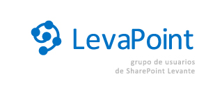

​

**¡Estamos de celebración!** Para todos los profesionales, usuarios y amantes de la plataforma SharePoint y que además vivan por la zona del Levante, comprendida entre Castellón, Valencia, Alicante y Murcia tenemos buenas noticias. Ha nacido un grupo de usuarios de SharePoint en nuestra región.

El objetico del grupo, es reunir a todos los que compartimos las mismas inquietudes y además de aprender en el camino, ¿por qué no? también hacer de esto algo más social y juntarnos para todo tipo de eventos.

Además, el grupo será un canal de información y ayuda en el que todos los miembros podremos compartir experiencias y conocimientos de SharePoint en cualquiera de sus versiones. Dicen que cuatro ojos ven más que dos, y en el mismo sentido, podemos montar algo en lo que todos los usuarios seamos partícipes y podamos aportar nuestro granito de arena.

LevaPoint os anima a que participéis en todos los eventos de este grupo que, todo sea dicho, se están cociendo en estos precisos instantes y pronto anunciaremos el primer evento presencial, que será anunciado a través de nuestros canales de información disponibles que son:

-Twitter: [@LevaPoint](http&#58;//twitter.com/LevaPoint)

-Linked-in: [http://www.linkedin.com/groups/LevaPoint-Grupo-Usuarios-SharePoint-Levante-4642699](http&#58;//www.linkedin.com/groups/LevaPoint-Grupo-Usuarios-SharePoint-Levante-4642699)

Si además, quieres colaborar activamente con nosotros, puedes contactar con:

-José Quinto: [jquinto@solidq.com](mailto&#58;jquinto@solidq.com)

-Adrian Diaz: [addiacer@gmail.com](mailto&#58;addiacer@gmail.com)

-Jose Andreu: [joseandreu@gmail.com](mailto&#58;joseandreu@gmail.com)

-Guillermo Bas: [gbas@solidq.com](mailto&#58;gbas@solidq.com)

