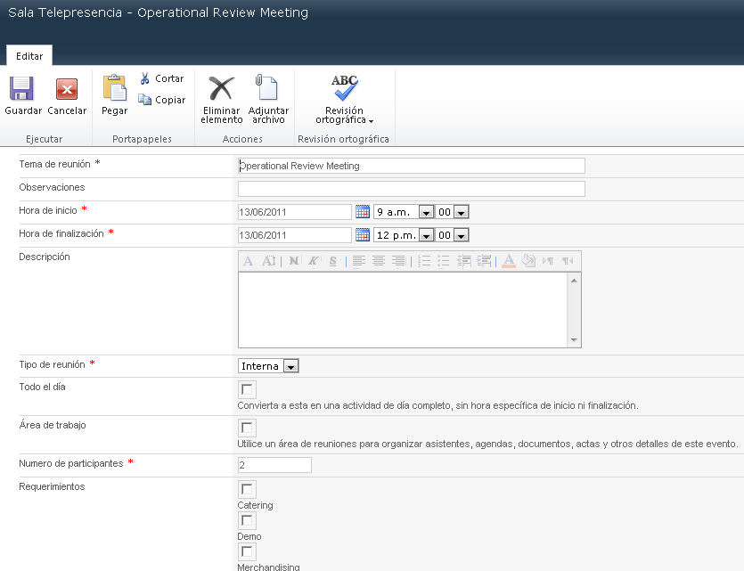
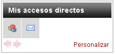

​**Aspectos del desarrollo de una Intranet Corporativa. (IC)**

Se considera importante detallar en este capítulo los procedimientos concretos que deberían seguir losprofesionales de la comunicación empresariala la hora de desarrollar unaIC, así como también describir las particularidades de cada una de las secciones que la componen y analizar sus funciones y ventajas como elementos que colaboran en el proceso de comunicación interna.

Enel capítulo anteriorse ha hecho referencia y se han comentado procesos y metodologías, pero en este capítulo se describirán cada uno de los pasos que elprofesional de la comunicación empresarialdeberíarealizar para llevar a cabo correctamente las tareas que le competen en el desarrollo de unaIC.

Para determinar los objetivos de laIC, y específicamente los relacionados con la comunicación interna que laICdeberá resolver y articular, es necesario que elprofesional de la comunicación empresarialcomprenda y defina hacia dónde la empresa quiere ir con el desarrollo de esta herramienta de comunicación, qué se quiere conseguir y cómo se espera que laICresuelva estas problemáticas.

¿Qué se quiere conseguir? Esta pregunta está referida a los objetivos que persiguen las organizaciones con la puesta en funcionamiento de unaIC. Generalmente se encuentran enfocados en la mejora de los procesos internos, sin embargo, como se ha descripto enel capítulo anterior, puede haber otros objetivos que están íntimamente relacionados con aspectos comunicacionalesy no de tecnología. Estos pueden ser: motivar a los empleados y que éstos se sientan parte de la empresa, evitar o disminuir los errores en la comunicación, mejorar el trabajo en equipo desde el punto de vista comunicacional mejorando el entendimiento y el clima laboral, mejorar la información interna sobre clientes y proveedores de la empresa, mejorar procesos de comunicación interna, compartir conocimientos entre los empleados de la empresa que tienen acceso y son usuarios de laIC.

“La red es la ‘anécdota’, lo que realmente es importante son las personas, los recursos, la información y los conocimientos, así como los procesos y procedimientos de la organización.” (Moner. 2002, p. 5)

El proceso que describe Moner (2002) indica que los profesional de la comunicación, en su trabajo inicial de conceptualización de laIC, para asegurar el éxito del proyecto en el marco de la estrategia general, deberá establecer las responsabilidades desde el inicio del proceso detallando y describiendo las tareas y los responsables. Esto quiere decir que deberá definir:

·Qué área y qué persona dirigirá el proyecto.

·Qué área y quién, dentro de ella, será el responsable de la gestión, publicación y actualización de los contenidos.

·Qué área será la responsable del soporte técnico, de la seguridad del sistema y la definición de los tipos y perfiles de acceso.

Dado el carácter transversal que tienen lasICen la organización y la implicancia de las distintas áreas de la empresa a la hora de su desarrollo, es que es importante que losprofesionales de la comunicación empresarialplanteen la creación de un equipo interno interdisciplinario dedicado al proyecto de desarrollo de laIC. En muchos casos estos equipos internos están conformados por los responsables de cada área de la empresa. El especialista en usabilidad y desarrollos de intranets corporativas, Jakob Nielsen (2008), denomina a estos equipos internos como, comité de Intranet. Termino que será utilizado en este PG mutará a comité deIC. Por su lado Adela Moner (2002) indica, al referirse a esta etapaespecífica, que es indispensable implicar en la definición del diseño de laICy para el trabajo de mantenimiento a personas de departamentos distintos.

En el proceso de definición de la arquitectura de la información y de la estructura de los contenidos que va a contener laICes aprovechado para actualizar la documentación de la empresa y sus procesos. El objetivo es como poner accesible para los usuarios los tanto los documentos y la información como, las aplicaciones a través de un entorno web.

**Análisis de la información interna**

Una vez que elprofesional de la comunicación empresariala cargo del proyecto ha definido los objetivos que la empresa y los usuarios claves esperan para laIC; se han asignado las responsabilidades del comité deICpara cada área y para cada persona interviniente, se deberá realizar un análisis y auditoría de la información interna de la empresa que se incluirá como contenidos en laIC.

En principio, es importante discriminar la información interna y externa más crítica para la empresa, para cada área o departamento y para las personas clave de la empresa. En tal sentido, hay que detectar los flujosde información que se dan en la empresa y también el conocimiento práctico que tenga mayor impacto para cada actividad de la empresa.

El procesos de análisis de la información interna prosigue identificando claramente las fuentes de la información dentro de la empresa, quién o quienes la generan, a quiénes se dirige y para quiénes puede ser de utilidad esta información.

Para llevar a cabo el análisis de la información interna relevante para los usuarios será indispensable que elprofesional de la comunicación empresarialrealICun trabajo de campo dentro de la empresa que se concrete en entrevistas con los directivos y responsables de cada departamentos y, además, a partir de la observación del trabajo diario de las personas dentro de la empresa y entrevistas individuales con personas de distintos departamentos que tienen un papel o conocimiento importante de la organización empresarial, aunque no ocupen un puesto de responsabilidad (Nielsen, 2000).

**Etapas del proceso de desarrollo.**

Elprofesional de la comunicación empresarialdeberá proveer la información que podrá ser consultada desde fuera de la empresa a través de internet para asegurarse de que se transmita una imagen corporativa acorde a lo esperado.

Siguiendo con la definición del proyecto de unaIC, para lograr la concreción de las fases es necesario dividirlas por orden de prioridad. Por lo tanto es imprescindible desarrollar un calendario de trabajo y de tareas. Especificando las etapas y los objetivos de cada una de estas. Para ello, elprofesional de la comunicación empresarialdeberá evaluar en conjunto con el equipo de trabajo dedicado al proyectoICqué es lo que se puede implementar más rápido, como también qué puede tener más impacto en la empresa y más incidencia en las personas y en los procesos.

Con el fin de poder visualizar con el cliente interno, usuario, los pasos que se irán cumplimentando a lo largo del desarrollo es que elprofesional de la comunicación empresarialdeberá detallar las etapas. Se describen las etapas determinadas por la empresaargentinaPaginar.net (2012),especializada en el desarrollo de Intranets corporativas. Ellas son:

*Etapa 1: Definiciones*

·Definición de alcances. Elprofesional de la comunicación empresarialtrabajará con los encargados de las distintas áreas y el comité de laICen la definición de los alcances.

·Plan de migración de contenidos (en el caso que se trate del rediseño de unaIC).

·Capacitación inicial de los usuarios de laIC. Elprofesional de la comunicación empresarialdeberá trabajar en la definición, en conjunto con los especialistas en sistemas, de los contenidos y el nivel de profundidad de la capacitación teniendo en cuenta a los destinatarios de dicha capacitación.

·Análisis de esquema de infraestructura. Tarea que estará a cargo del departamento deTIde la empresa.

El profesional de la comunicación, en su tarea de líder del proyecto de laIC, contemplará la realización de la capacitación inicial enfocada en los usuarios y gestores de laICcon el fin de que éstos puedan valorar y utilizar las distintas herramientas constituyentes del sistema y sus funcionalidades.

*Etapa 2: Diseño e Implementación*

·Arquitectura de la información,wireframe. A continuación se presenta una imagen con un ejemplo de wireframes correspondiente a una empresa de tecnología internacional con sede en Argentina, sucursal que nuclea cincopaíses (Argentina, Chile, Uruguay, Paraguay y Perú). El motivo por el cual se a seleccionado la siguienteICes debido a que se considera que cumple con todas las características explicadas en este PG que componen a unaIC. Desde el aspecto comunicacional, de la arquitectura de la información y desde sus módulos y funcionalidades. Los módulos fueron desarrollados a medida de los requerimientos estipulados por los responsables del desarrollo de estaIC. Sin embargo es importante subrayar que independientemente de laICanalizada, se puede observar que las funcionalidades delos módulos se mantienen de unaaotraIC

En la imagense destaca la estructura canónica de lasICsy su formato de portal, explicados por Nielsen (2011), y los distintos módulos que la componen. Comenzando con elHeader, con los nombres de las secciones que conforman el menú principal de laIC. La columna izquierda donde se encuentran los módulos de comunicación, la columna derecha con los módulos de gestión e interacción y por último la zona central de laICcon el contenido relevante para los usuarios.

·Definición del diseño de la interfaz gráfica. Se definirá en función de las necesidades y conceptos a comunicar determinados por elprofesional de la comunicación empresarialy validados por el Comité deIC.

·Aprobación de diseños. Elprofesional de la comunicación empresarialpresentará los diseños seleccionados al comité de la intranet, o a los directivos, que aprueban los diseños finales.

·Configuración de la plataforma. Tarea a realizar por el departamento de sistemas.

·Carga de contenidos iniciales. Se realizará la carga en el sistema de laICde los contenidos con los cuales se lanzará dichaIC.

·Programa de comunicación interna para el lanzamiento de laIC.

En esta etapa el profesional de la comunicación, en conjunto con los distintos responsables de cada área y el comité deIC, trabajará en la definición de la arquitectura de la información, maquetasy en la definición de los diseños de la interfaz gráfica, en conjunto con los diseñadores gráficos. En un proceso dinámico entre elprofesional de la comunicación empresarialy el diseñador grafico encargado del diseño de la interface gráfica. Diseños que se deben ajustar a la estructura definidos previamente.

En elejemplo que se adjunta a continuación se puede observar el diseño de la interface gráfica ajustadoa la estructura, wireframe,definidaen los pasos anteriores.Muestracuál debería ser el trabajo que el profesional de comunicación deberíarealizar en conjunto con el diseñador responsable del diseño de las interfaces.

Por último: Implementación de laICen producción. El departamento de sistemaso IT de la empresarealiza la puesta en producción de laIC. Los usuarios ya pueden acceder y utilizarla.

*Etapa 3: Plan de mantenimiento*

·Relevamiento y priorización. Elprofesional de la comunicación empresarialen conjunto con el Comité delaICrealizarán un relevamiento de las necesidades que se hayan detectado y se encargará de la priorizar según el nivel de importancia para la empresa.

·Nuevas funcionalidades. Se plantea el desarrollo de nuevas funcionalidades que se detectaron como importantes en el trabajo de relevamiento.

·Mejoras. El profesional de comunicación en conjunto con el Comité delaICplanificarán las mejorasque se realizarán en la misma.

Una vez concluido el proceso de desarrollo (Etapa 1 y Etapa 2) se comienza con el periodo de mantenimiento (Etapa 3). Elprofesional de la comunicación empresarialen conjunto con el Comité delaICrealizarán reuniones de evaluación de los resultados del relevamiento acerca del uso, comentarios y sugerencias de los usuarios, priorizando los trabajos a realizar.

Elprofesional de la comunicación empresarialdeberá desarrollarla capacidad en saber concretar un primer prototipo delaICque se base en la regla del 80/20 (el 80% de las consultas se satisfacen con el 20% de los contenidos de laIC). Es necesario que determine los contenidos iniciales de este 20%, contenido éste, que por lo tanto, es de mayor utilidad para el trabajo diario de los empleados de la empresa.

**Definición de las funcionalidades de los módulos de una IC.**

Las siguientes funcionalidades que se procederá a describir son las que elprofesional de la comunicación empresarialdeberá analizar en conjunto con el equipo de sistemas encargado del dimensionamiento de la infraestructura y del sistema tecnológico de desarrollo en el cual se estará implementando laIC. Será de utilidad que elprofesional de la comunicación empresarialanalicecada una de estas funcionalidades para poder estructurar el proyecto a medida de las necesidades de la empresa.

Por otro lado tendrá que evaluar el crecimiento exponencial que podrá tener laICy cómo se comportarán los distintos elementos, Webparts,que la componen a lo largo del tiempo, con el fin de conocer si la estructura que fue definida está preparada para soportar el crecimiento esperado. LasICsson desarrolladasen SharePointpermiten la autogestión de los contenidos,Content Management System(CMS). Este elemento permite mantener actualizado los contenidos mediante la publicación dinámica de los mismos a través de un administrador descentralizado que le permitirá a las distintas áreas de la empresa y a los usuarios de laICla publicación de forma autónoma. Este sistema de administración de contenidos dinámico permite, además, la descentralización de la carga de trabajo y la confección de los contenidos por áreas de específicas.

**Tipificación de los módulos (Webparts) componentes de una IC**

Se cree necesario para el análisis pormenorizado de unaIC, desarrollada o no en SharePoint,la partición de esta en unidades menores que permitan un estudio más preciso, móduloso Webparts.

En función de sus características preponderantes se pudedeterminar a su vez si este se encuentra enfocadoen los aspectos comunicacionales o en los meramente de gestión del usuario.

erea los módulos cuya dimensión preponderante sea su aspecto comunicacional siempre que su funcionalidad sea informar, atraer al usuariohacialaIC. Su interacción directa coneste tipo de módulos es secundaria, puede o no hacerclic.Puede, simplemente, leerlos. Ej.:modulo de novedades y noticias.

Se define como módulos de gestión a todos aquellos cuya funcionalidad básica y objetivo sea la interacción del usuario con el módulo. Esto quiere decir que se espera que el usuario realcealgún un tipo de interacción. Ej.: que el usuario realceunclicsobre el módulo y cargue sus pedido de días de vacaciones.

Cada módulo será nombrado en relación a su objetivo y funcionalidad específica. Ej.: Módulo de cumpleaños. Módulo de Novedades, Módulo de reserva de sala, etc.

El módulo de administración de perfiles: este módulo le permite alprofesional de la comunicación empresarialcrear, junto al responsable de sistemaso IT, los diferentes perfiles de usuarios a través del administrador de perfiles del sistema. Perfiles de usuarios que fueron definidos previamente con el Comité delaIC.

Hay distintos niveles de usuarios y cada nivel tiene un perfil definido: usuarios administradores, usuarios editores, usuarios subscriptores. Cada usuario pertenecerá a un perfil y según el perfil se le limitarán sus tareas de administración dentro del sistema de administración.

El profesional de la comunicación como responsable de laICdeberá tener en cuenta los distintos segmentos de contenido ya que dentro de laICexisten secciones y contenidos de acceso restringido.Los sistemascomo SharePointya contemplan un sistema de validación de usuarios para el ingreso a las áreas restringidas.

Los encargados de determinar cuáles serán las secciones de acceso restringido serán elprofesional de la comunicación empresarialy los propios usuarios administradores que publican contenidos dentro de laIC.

**Módulos de Comunicación y módulos de Gestión.**

Existen módulos en lasICscuyas funcionalidades promueven la participación de los empleados/usuariosy que son esencialmente herramientas de comunicación interna muy importantes, como, por ejemplo, foros, encuestas, weblogs, módulos de rendiciones de gastos, módulos de presentación de proyectos internos, etc. También existen diferentes módulos cuyas funcionalidades permiten que los usuarios puedan establecer, por medio de laIC, un vínculo con otros usuarios de la empresa, por ejemplo: la posibilidad vender pertenencias por medio de la aplicación de clasificados, publicar fotos personales dentro de un álbum de fotos, publicación de cumpleaños con un destacado de los cumpleaños de la fecha y una opción para enviarle de forma ágil una tarjeta de salutación, etc. Se pueden crear, además, aplicaciones de auto servicio (self servIC) para que los usuarios puedan gestionar trámites relacionados con el área de recursos humanos.

La utilización de estos módulos destacados en las versiones iniciales de unaICpermite que se genere rápidamente un hábito en el uso de esta herramienta, derribando las distintas trabas internas que tienen los usuarios frente a nuevas propuestas y soluciones.

**Módulos de Comunicación.**

A continuación se presenta de forma desarticulada laICpresentada anteriormente como ejemplo y con el fin de describir con mayor nivel de detalle los módulos de comunicación que la componen. Estos son:

Módulo de Publicación de cumpleaños: módulo que permitepublicar la lista de personas de la empresa con sus fechas de cumpleaños. Podría existir inclusive un módulo específico para buscar los cumpleaños de los empleados ingresando el nombre y el apellido del empleado para encontrar su fecha de cumpleaños.

En la imagen adjunta perteneciente al ejemplo deICpresentado permite visualizar la lista de cumpleaños del personal. Se muestran los próximos cumpleaños, n (n: cantidad a definir) ordenados por fecha en forma descendente. Los del día y los de la semana, y la posibilidad de saludar a la persona directamente desde el módulo.

Detalle de las personas de la empresa que cumplen años en el día, en la semana, con la posibilidad de enviar un mensaje de salutación desde el mismo módulo. Ejemplo de Intranet de empresa local de tecnología de la información.

Módulo de Acceso al directorio telefónico:lasICspermiten la publicación de los números telefónicos y los internos de cada empleado de la empresa. Este modulo genera un valor muy importante para la gestión diaria de la tarea de los empleados. Esto permite buscar los internos de los empleados ingresando el nombre y el apellido del empleado buscado y encontrar su número de interno telefónico.

Esta funcionalidad permite realizar una búsqueda sobre la base de datos(Active Directory)de personas de la empresa. Se muestra una página de resultados con las coincidencias encontradas; haciendo clic sobre el nombre de cada persona, se pueden ver todos los detalles cargados en su perfil.

Reservas de salas de reuniones, aulas, vehículos, equipamiento, etc.: el foco de este módulo esta puesto principalmente en generar tráfico y concurrencia de usuarios hacia la IC ya que canaliza necesidades que hacen a la gestión de recursos. Esta aplicación tiene, además, la particularidad de evitar conflictos entre los empleados de una empresa.

Para dar un ejemplo, desde la IC se podrán reservar las salas de reuniones de la empresa u otros recursos. A partir del sistema de administración de este módulo, que se encuentra en el Back Office de la IC, se podrán dar de alta las diferentes salas de reuniones de la empresa para luego poder visualizar su disponibilidad desde el la página de inicio o home de la IC.

La modalidad de reserva de un horario disponible para una sala de reunión permitirá que un empleado ingrese por medio de este módulo a una sala y visualice el calendario con las diferentes posibilidades de horarios y días disponibles. Al seleccionar un horario determinado se le presentará al usuario un formulario que le permitirá ingresar la solicitud de reserva de salas. Este pedido se almacenará dentro de la base de datos de la IC.

El usuario administrador de las salas podrá visualizar, aprobar o rechazar estas solicitudes. Los horarios ya reservados para futuras reuniones se visualizarán dentro de este calendario como, no disponibles.

El modulo presentado ejemplifica la lista de salas de reunión; los usuarios pueden reservar las mismas en el día y horario deseados. La imagen extraída de la IC muestra el calendario de la sala de reuniones.

Módulo de Busquedas Laborales Internas: La funcionalidad del modulo de busqueda laborlaes permite a los empleados de la empresa de informacrse acerca de las ofertas laborales que la empresa está necesitando completar con personal interno, prrioritariamente, o externo, por referencias. Este tipo de comuicaciones, como ejemplifica la imagen adjunta, permite a su vez que el personal de la empresa pueda interiorizarse sobre los requisitos de la búsqueda y auto postularse.

Módulo del Clima y la Hora Local: La funcionalidad de este módulo permite visualizar la hora y clima actuales en la ubicación configurada por cada usuario. En caso que la empresa posea sucursales en distintos piases o regiones.

Modulo de Mis accesos directos: la funcionalidad de este módulo permite visualizar una lista de vínculos cargada por el usuario, cada uno con un texto e imagen asociados. Pueden ser vínculos externos o internos al sitio. Al hacer clic en cada uno, los vínculos se abren en una nueva ventana.

Sugerencias y comentarios: estemóduloes de suma importancia para losprofesionales de la comunicación empresarialya que permite obtener feedback de los usuarios. Este módulo permite enviar comentarios de forma anónima al área de comunicación y recursos humanos de la empresa.

Módulo del Blog del CEO:El ejemplo tomado para este PG pertenece a laICde una empresa en la que se puedeinferir que tiene como característica de su comunicación interna la comunicación vertical. Esto queda evidentemente reflejado en la disposición en la página de inicio del módulo Blog o bitácora del CEO (Chief Executive OffICr), Director Ejecutivo. Este modulo le permite al Director Ejecutivo publicar y llegar directamente a sus empleados con el mensaje que quiere transmitir sin que exista, aparentemente, un mediador.

**Módulos de gestión.**

Elprofesional de la comunicación empresarialhabrá definido previamente en su trabajo de análisis de procesos de gestión cuál es la prioridad en la implementación y desarrollo de los distintos módulos de gestión que puede contener laIC. Estos procesos deberán ser relevados y analizados por elprofesional de la comunicación empresarialy el Comité delaICpara evaluar cuál es el impacto de digitalizarlos e incluirlos en laIC.

Entre los módulos de gestión se pueden señalar los siguientes:

Búsqueda: las imágenes extraídas del ejemplo deICpresentada muestran el módulo del buscador y el resultado de la búsqueda. Los sistemas deIC, sistemas tecnológicos de software, cuentas con la posibilidad de programarlos para que la búsqueda se realICsobre todos los contenidos de la base de datos del sistema de laIC. Permite incluir operadores booleanos y opciones de refinamiento.

Módulo de Anuncios Destacados: el modulo de anuncios permite destacar información que la empresa y elprofesional de la comunicación empresariala cargo del proyecto definen que tiene una importancia relevante.

Módulo de Próximos Eventos:Este modulo permite visualizar los eventos que ocurren en el día de la fecha o eventos programados. Estos pueden ser internos, a realizarse dentro de las instalaciones de la empresa o eventos en los cuales la empresa participa. Los eventos se cargan desde una ficha tipo calendario.

Módulo de Anuncios de Prensa: en estaICse desarrollo una funcionalidad específica para el área de prensa. Este módulo permite que los usuarios puedan acceder al extracto de las publicaciones que han sido publicadas en los distintos medios de comunicación del mercado y la industria en los cuales se mencionan a la empresa. (Cliping de Medios). De esta manera todos los empleados con un simple clic sobre el texto tienen acceso a información que de otra manera no podrían tener. Esta información generalmente quedaba en manos de las aéreas de comunicación y marketing.

Módulo Banner Destacado central: el módulo Banner Destacado central le permite a losprofesionales de la comunicación empresarialy responsables de la comunicación dentro de la empresa destacar y dar acceso a contenidos e información mediante una imagen llamativa. Esta imagen puede rotar y cambiar según un periodo de tiempo estipulado previamente. En el ejemplo deICpresentada se puede observar una acción de comunicación interna realizada por el departamento de comunicación. En la cual presentan todos los empleados de la empresa semana a semana un empleado de la empresa desde un rol diferente al laboral. Haciendo clic sobre la misma imagen el usuario accede a los datos del empleado que se presenta cada semana.

Módulo de Últimas Noticias: el sector central de laICse compone básicamente de un compendio de información noticiosa para los usuarios. Losprofesionales de la comunicación empresarialencargados de laICcategorizarán las noticias en función delpúblicointerno al cual se dirigen. Ejemplo categorías: Varios, Comercial, Marketing, RRHH. Etc. Estas noticias están divididas por categoría, con los datos de la fecha hora de su publicación. La noticia que fue publicada recientemente se presenta en primer lugar y así sucesivamente.

El valor que tiene estemóduloes el de permitirle acceder a todos los usuarios de la empresa a información y noticias relativas al negocio de la empresa seleccionada y compilada de forma ordenada. Este tipo de contenidos de acceso libre a través de laICno podría haber sido compartido con estas características más que a través de laIC.

**Módulos y funcionalidades que pueden formar parte de una IC.**

Es importante aclarar que los módulos presentados en este trabajo tienen dos tipos de proceso para la publicación de los contenidos y esta es definida por elprofesional de la comunicación empresarialy el Comité delaIC. Los procesos pueden ser de publicación directa o indirecta. El término publicación directa se utiliza cuando no existe un paso intermedio entre el usuario y la publicación de su contenido. El usuario publica directamente en laICel contenido que desea sin previa evaluación y aprobación. No hay unproceso,workflow,de aprobaciones entre la creación del contenido y su publicación en laICpara la lectura de todos los usuarios. La publicación indirecta se da cuando los empleados de una empresa no pueden publicar en laIClos contenidos sin previa aprobación.

Módulo de Publicación de avisos clasificados: este modulo es otra herramienta que losprofesionales de la comunicación empresarialsuelen utilizar para generar tráfico de usuarios en laICy mantenerla constantemente activa ya que permite que los usuarios publiquen, por ejemplo, aquellos objetos personales que deseen vender. Este módulo funcionaría como un canal de venta interno entre los empleados de la empresa.

Módulo de Personalización de contenidos (miIC): módulo que, dependiendo del grado de madurez de la cultura organizacional y de la evaluación delprofesional de la comunicación empresarialy el Comité delaIC, podrá permitir a cada usuario personalizar a su gusto, costumbre o necesidad la página de inicio de laIC, haciéndola suya. Podrá colocar los accesos a los contenidos a los que recurre habitualmente. Desde un módulo de personalización el usuario podría seleccionar las categorías o subcategorías de laICque utiliza habitualmente. De esta forma podría personalizar el uso de laIC.

Módulo de Envío de boletines o newsletters:como herramienta de comunicación interna es muy efectiva ya que por medio de esta aplicación los administradores de laICpodrán enviar ciertos contenidos de forma proactiva a las casillas de correos electrónicos de los empleados. Este tipo de acciones de comunicación interna a su vez son convenientes para incentivar a distintos usuarios a que ingresen a ver las novedades en laIC.

Módulo de Encuestas: por medio de este módulo el profesional de la comunicación, o cualquier área con accesos a la gestión de los contenidos, podrá crear y publicar encuestas en laIC. Estas encuestas podrán estar conformadas por preguntas y opciones de respuestas. Cada encuesta podrá estar compuesta por más de una pregunta y cada pregunta podrá tener como respuesta más de dos opciones. Los usuarios podrán votar, opinar, contestar marcando alguna de las opciones de las preguntas de cada encuesta. Se publicaran de forma privada o pública. Elprofesional de la comunicación empresarialen conjunto con el área que desarrolle la encuesta seleccionará en qué modo serán presentadas para los usuarios de laICy podrá definir en función del objetivo de la encuesta qué perfiles de usuario podrán participar de ella.

Los sistemas generalmente posibilitan emitir reportes de los resultados de las encuestas que se podrán visualizar online al finalizar la votación. Los responsables del departamento de recursos humanos en conjunto con el profesional de la comunicación utilizan habitualmente este recurso para realizar encuestas denominadas de Medición del Clima Laboral.

Módulo de Autoservicio:este módulo, tiene su foco en el aspecto funcional y de captación de usuarios recurrentes para laIC. Este módulo permitirá que los empleados puedan gestionar algunos trámites en línea directamente interactuando y colaborando con el sistema central de recursos humanos (RR.HH). Estos trámites son de publicación indirecta, requerirán de aprobaciones previas antes de su aprobación final.

A modo de ejemplo, los empleados podrían informar de forma proactiva algún cambio de datos dentro de su legajo, solicitar sus vacaciones por medio de un workflow de aprobación, etc., evitando errores y aliviando la carga de trabajo del departamento de RRHH.

Módulo de Rendición de gastos:esta aplicación se podría definir mediante diferentes workflows para la aprobación y rendición de gastos internos.

Módulo de Aprobación de presupuestos:desde esta aplicación los usuarios de laICpodrán definir diferentes workflows para la aprobación y rendición de gastos internos, compras, etc.

Por medio de este tipo de aplicaciones se busca agregarle valor a laICya que optimizará parte de los procesos y llevarlos a un ambiente controlado que almacene las solicitudes y permita gestionarlas de forma más ágil por medio de una aplicación web como laIC.

Módulo de Mesa de ayuda: son aplicaciones que impactan directamente sobre la problemática del área responsable de la mesa de ayuda. Por lo general dentro de las empresas son los departamentos de sistemas quienes reciben, por mail o por teléfono, las solicitudes dirigidas a la mesa de ayuda. La aplicación trabaja como elemento de recepción, almacenamiento y seguimiento de los casos para la mesa de ayuda. De esta forma el área tiene un mejor control sobre los diferentes casos y se puede almacenar un histórico de los mismos.

**Juan Ibáñez**

Lic. en Negocios de comunicación y diseño.

[jibanes@paginar.net](mailto:jibanes@paginar.net)

Bs As.Argentina

 
 
import LayoutNumber from '../../../components/layout-article'
export default LayoutNumber
