​Una de las grandes bazas de la nueva versión de SharePoint, y en especial su nuevo modelo de desarrollo de aplicaciones, es que no haya diferencias entre lo que se puede hacer en la Nube y en nuestros propios servidores locales. En este contexto de empeño por parte de Microsoft de equiparar los servicios en la Nube a los servicios locales, nace una plataforma de desarrollo de SharePoint y Office apps cuyo nombre en clave es Napa. Este nombre, para aquellos que no somos naturales de Estados Unidos, nos suena más bien pintoresco (a mí personalmente me recuerda a un personaje del mismo nombre en la serie de dibujos Dragon Ball), pero en realidad no tiene mucho misterio, es el nombre de una región llamada Valle de Napa (Napa Valley) situada en el estado de California, en los Estados Unidos, que es famoso por sus viñedos y la producción de vino (ver Imagen 1).

Pero más allá de nombres curiosos y paisajes idílicos, Napa es una plataforma de desarrollo que hace posible el desarrollo de aplicaciones para SharePoint y Office desde la Nube, sí, lo mismo que Visual Studio, pero directamente desde nuestro navegador sin necesidad de instalar absolutamente nada en nuestra máquina local.

Por supuesto, Napa, en su versión actual, marcada en el Office Store como beta, no nos ofrece todas las posibilidades que podemos encontrar en herramientas de escritorio como Visual Studio. Por eso, a continuación vamos a detallar qué tipos de aplicación nos permitirá desarrollar Napa y en qué condiciones.

- **Aplicaciones para SharePoint**. Solo podremos desarrollar aplicaciones para SharePoint del tipo SharePoint-hosted, ni las Provider-hosted ni las Autohosted estarán soportadas.

- **Aplicaciones para Word**. Solo podremos crear aplicaciones de tipo Panel de tareas lateral (Task Pane). En este caso se requiere Office 2013 para desplegar la aplicación.

- **Aplicaciones para Excel**. Podremos crear dos tipos de aplicaciones para Excel, por una parte los mismos Paneles de tareas laterales (Task Pane) de Word nos servirán para Excel, y por otra parte también podremos desarrollar aplicaciones de contenido para Excel (Content Apps) que son aquellas que se despliegan directamente sobre el contenido de una hoja de cálculo de Excel. En este segundo caso, sí funcionarían sobre la Excel

Web App directamente sin necesidad de tener Excel 2013 instalado en el escritorio.

- **Aplicaciones para Outlook**. Podremos crear las también llamadas Mail Apps sin problemas.

En este artículo solo iniciaremos el desarrollo de una pequeña aplicación para SharePoint haciendo uso de Napa.

**Navegadores soportados**

El lema principal de Napa es que puedas desarrollar tus aplicaciones desde cualquier parte y en cualquier momento, con este objetivo Napa está soportado para los tres navegadores más utilizados en sus versiones más recientes, Internet Explorer 9 o superior, Firefox 15 o superior y Google Chrome 21 o superior. Además, como no se utiliza ningún tipo de plugin externo al propio navegador, también es compatible con la versión táctil de Internet Explorer 10 (accesible desde la parte Metro de Windows 8) (ver Imagen 2)

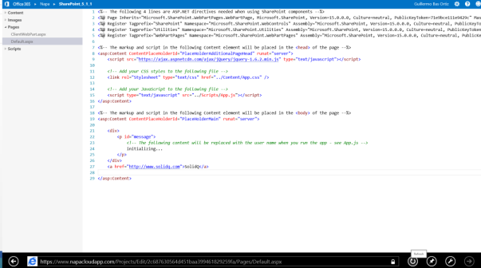

Con esto podemos dar por sentado que funcionará también en tabletas con Windows 8 RT, lo que resulta bastante impresionante.

Lamentablemente, no todo son buenas noticias en este sentido ya que en esta fase de desarrollo, Napa no es compatible con ninguna versión de Safari, ni Windows ni Mac ni iOS, es decir, no es posible ejecutarlo desde dispositivos iPad, por ejemplo. Si lo intentamos, obtendremos un mensaje diciendo que el navegador que estamos utilizando no está soportado.

**Instalando y ejecutando NAPA por primera vez**

Para utilizar Napa necesitamos obtenerlo e instalarlo en forma de aplicación para SharePoint desde el Office Store. Para la instalación de la aplicación seguiremos los siguientes pasos.

En primer lugar, para poder instalar Napa vamos a necesitar una colección de sitios creada a partir de la plantilla “Sitio de desarrollador” (ver Imagen 3).

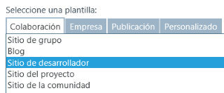

Una vez creado nuestro sitio de desarrollador, desde la página principal tenemos un enlace directo a la aplicación de Napa para instalarla (ver Imagen 4).

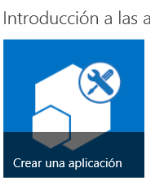

Una vez agregada la aplicación, solo tenemos que hacer clic sobre el icono de la misma para acceder a ella y comenzar un nuevo proyecto de aplicación para SharePoint. En la primera pantalla de la aplicación, ésta nos ofrece comenzar un tipo de aplicación (de los mencionados anteriormente en este mismo artículo) y ponerle un nombre al proyecto (ver Imagen 5). En nuestro caso, vamos a crear la aplicación ejemplo SharePoint\_5\_1\_1.

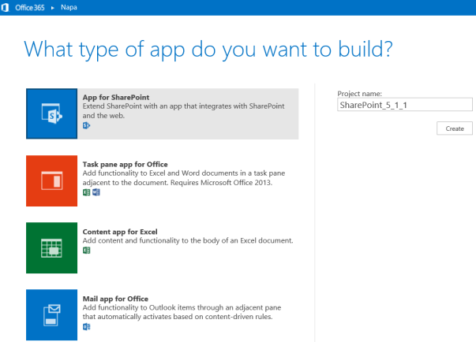

Una vez le hemos dado nombre a nuestro proyecto y pulsamos en el botón “Crear” (“Create”), la aplicación nos trasladará directamente al entorno integrado de desarrollo en el navegador. Este entorno consta de cuatro partes bien diferenciadas.

En la Imagen 6 se presentan todos los componentes de la interfaz principal de Napa etiquetados para referencia del lector.

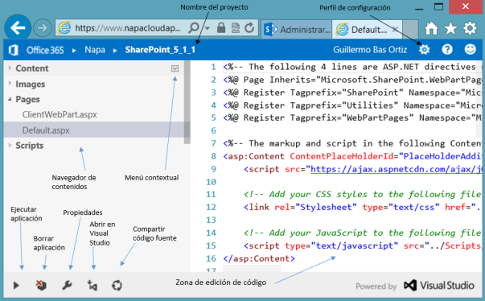

Por un lado, está la zona de edición del código fuente, en la que podemos escribir nuestro código y editar los distintos ficheros que componen la aplicación que estamos desarrollando; esta zona queda situada en la zona central de la pantalla a la derecha del navegador de contenidos del proyecto. En esta parte, además, disponemos de un Intellisense avanzado, similar al de Visual Studio (ver Imagen 7).

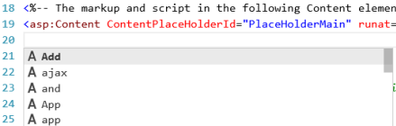

El navegador de contenidos queda situado en la columna derecha agrupando los tipos de fichero por tipos: Contenido (Content), Imágenes (Images), Páginas (Pages) y Código (Scripts). Además de mostrar los ficheros que componen nuestra aplicación, nos permite su administración a través de un menú contextual a nivel de grupo (crear o subir nuevos ficheros) y a nivel particular de fichero (renombrar o eliminar el fichero) (ver Imagen 8).

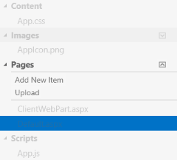

Una de las partes más importantes es la barra inferior de opciones. En ella podemos encontrar las herramientas para ejecutar, borrar, configurar y compartir nuestra aplicación y nuestro código. Además, existe una opción muy interesante para abrir nuestro código en Visual Studio y no quedar permanentemente limitados a esta interfaz de desarrollo, pudiendo empezar una aplicación en Napa y llegado a un punto de complejidad en el que necesitemos una herramienta más completa podamos pasar a Visual Studio para continuar con el desarrollo.

Vale la pena detenernos a comentar el menú de “Propiedades” (“Properties”) de la barra inferior. Mediante este botón se accede a una ventana de propiedades en la que podemos configurar desde las propiedades más importantes del manifest de nuestra aplicación hasta los endpoints y permisos que necesitará la misma para llevar a cabo su funcionalidad (ver Imagen 9).

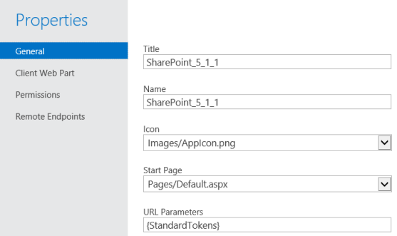

Otra de las opciones interesantes que cabe destacar de la barra inferior de opciones es el botón para continuar nuestro desarrollo en Visual Studio. Cuando hacemos clic por primera vez en este botón nos muestra una advertencia de que se lanzará el Web Platform Installer. Para asegurarnos de que los componentes necesarios para el desarrollo de aplicaciones están instalados, obviamente, necesitamos tener previamente instalado nuestro propio Visual Studio 2012. En la Imagen 10 se puede ver cómo es la apariencia del instalador.

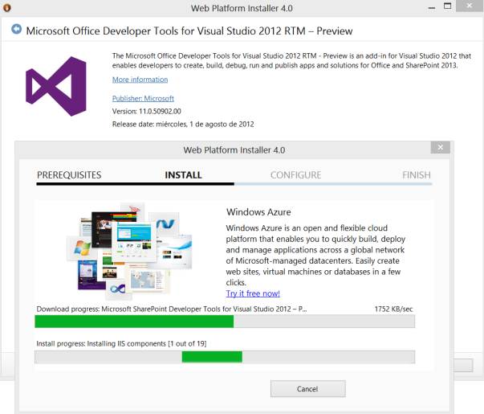

Una vez abierto el proyecto en Visual Studio 2012, tendremos toda la estructura del mismo disponible y cuando intentemos modificar cualquier cosa del proyecto el propio Visual Studio nos pedirá las credenciales de Office 365 Preview necesarias para mantener el código conectado a la Nube, de forma que se mantenga sincronizado con lo que tenemos en Napa.

Por último, tenemos la barra superior en la que podemos encontrar, por una parte la miga de pan contextual, que nos muestra el nombre del proyecto en el que estamos y nos permite volver al menú principal de Napa, y por otra parte, a la derecha encontramos un menú de opciones que nos da acceso a un perfil de configuración que nos permite configurar el tipo de proyecto en caso de abrirlo en Visual Studio (Visual Basic o C#) y la dirección de correo electrónico que utilizaremos para las pruebas con aplicaciones para Outlook. En nuestro perfil, también encontraremos un botón para eliminar toda la información de los proyectos y dejar de utilizar la aplicación completamente en este entorno, de forma que borremos todo rastro de su uso (ver Imagen 11).

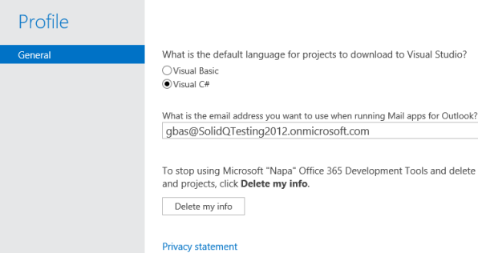

Una vez tenemos claro todo el entorno de desarrollo de Napa ya estamos listos para ejecutar nuestra primera aplicación desde la Nube. Por quedar fuera del objeto de este artículo no desarrollaremos una aplicación nueva para probar la funcionalidad de Napa, utilizaremos el código base que viene incluido de serie en la plantilla de aplicación para SharePoint del mismo entorno, que muestra el nombre del usuario actual por pantalla al ejecutar la aplicación. Así pues, pulsamos sobre el botón “Ejecutar” (“Run Project”) de la barra de opciones inferior y aparecerá una ventana de carga que nos muestra el proceso de subida, compilación y despliegue de la aplicación para terminar ofreciéndonos acceder a nuestra aplicación en una nueva ventana.

Una vez salgamos de la ejecución de la aplicación y volvamos a nuestro sitio de desarrollador, en este sitio nos aparecerá un listado con las aplicaciones que hemos creado bajo el subtítulo “Aplicaciones en fase de prueba” (ver Imagen 12).

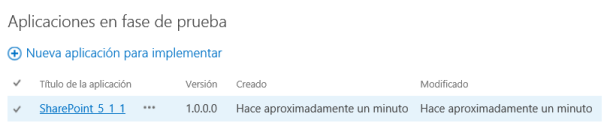

Desde este listado podemos ejecutar las aplicaciones que hemos ejecutado anteriormente desde Napa, haciendo muy sencillo el acceso a estas aplicaciones para las pruebas con usuarios en este entorno de desarrollo.

La próxima vez que queramos continuar nuestro desarrollo desde Napa debemos entrar de nuevo en nuestro sitio de desarrollador y desde el mismo menú que instalamos Napa (el de “Crear una aplicación” en la página principal de nuestro sitio) ahora accederemos directamente a Napa viendo las aplicaciones que tenemos guardadas de veces anteriores y pudiendo también comenzar nuevos desarrollos (ver Imagen 13).

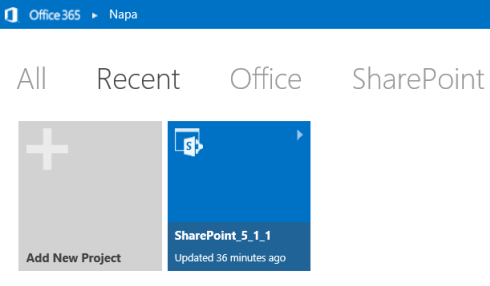

**Conclusiones**

La plataforma de desarrollo en la Nube para Office 365 Preview, Napa, ha sido posiblemente una de las más gratas sorpresas que nos ha deparado a los desarrolladores la nueva plataforma de desarrollo de aplicaciones para SharePoint y Office. Con Napa Microsoft llega un paso más lejos en la batalla por llevar todo y a todos a la Nube iniciando un camino que posiblemente acabe en un Visual Studio para la Nube mucho más completo en futuras versiones.

Obviamente, en su versión actual, Napa no remplaza por completo, en ningún caso a Visual Studio 2012, pero sí lo complementa, tal y como hacen las Office Web Apps con el Office de escritorio, flexibilizando la edición y ejecución de nuestro código desde prácticamente cualquier parte en la que tengamos acceso a Internet y a un navegador soportado. Con todo esto podemos concluir que Napa es el germen de algo mucho más grande, además de enriquecer la actual plataforma de desarrollo de que disponemos los desarrolladores que hacemos aplicaciones para SharePoint y Office.

**Guillermo Bas**

MCPD y MCITP SharePoint

[gbas@solidq.com](mailto:gbas@solidq.com) 

@guillebas 

[http://blogs.solidq.com/sharepoint](http://blogs.solidq.com/sharepoint)

