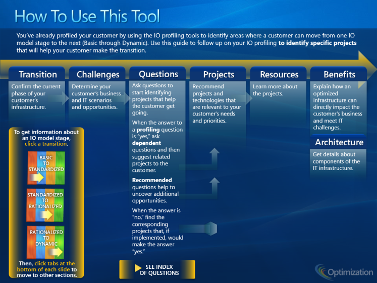

​Muchas veces en los proyectos de SharePoint, hablando con los clientes, surge el tema de la visión estratégica de SharePoint en la empresa. Se suele argumentar que no existe una aproximación integradora que recoja las diferentes facetas de SharePoint en el contexto del negocio y que aporte una visión de “dónde estamos” y “adónde vamos”. La realidad es que estos modelos existen pero son muy poco conocidos fuera de ámbitos muy especializados. El propósito de este artículo es arrojar un poco de luz sobre estos modelos y acercarlos a la comunidad de SharePoint de habla hispana.

**Modelos de madurez**

Bajo el paraguascomúndel nombre de“modelos de madurez”(maturitylevels) existenvarias abstracciones que buscan sintetizar la capacidad o el grado de habilidad de una organización en un aspecto concreto. El modelo de madurez más conocido en el mundo técnico es elCMMI(CapabilityMaturityModelIntegration) desarrollado originalmente por el Instituto de Ingeniería de Software de la universidad americana de Carnegie-Mellon. CMMI mide la capacidad que tiene una organización para crear software de manera controlada y monitorizada.Otro modelo de madurez muy extendido en el mundo de la empresa es elPCMM(PeopleCapabilityMaturityModel) que mide la capacidad de los trabajadoresen una organización.

El modelo de madurez define, en general, cinco niveles de aptitud o capacidad. El nivel más bajo es el inicial y a partir de aquí cada nivel aporta un cambio cualitativo en la aptitud o capacidad que se mide. Por ejemplo, en CMMIse definen los siguientes cinco niveles:

| Centrado en la mejora continua de procesos | Optimizado |
| --- | --- |
| Proceso medido y controlado | Gestionado cuantitativamente |
| Proceso caracterizado para la organización y proactivo | Definido |
| Proceso caracterizado para los proyectos y a menudo reactivo | Gestionado |
| Proceso imprevisible, poco controlado y reactivo | Inicial |

El modelode madurezjuega un doble papel. Por un lado, ayuda a definir elestadoactualde la madurez de la organización, facilitando una definición clara y que se pueda compartir contodos los implicados. Por el otro lado, permitetrazar un camino de evolucióndesde el nivel actual hasta el nivel deseado, porque cada nivel tiene asociada una serie de prácticas que la organización tiene que adoptar.

Para SharePoint existendos modelos de madurezen la actualidad: el modelo BPIO de Microsoft y el SPMM deSadalitVanBuren.

**Business Productivity Infrastructure Optimization (BPIO)**

Microsoft introdujoa principios de 2007el concepto de optimización de infraestructura (InfrastructureOptimization, IO) para ayudar a las organizaciones a evaluar su grado de madurez tecnológica.En la actualidad Microsoft está evolucionando este modelo para ponerlo al día pero la mayor parte de las bases sigue siendo válida.

El modelo IO de Microsoft tienetres componentesprincipales:

·Infraestructura clave (CoreInfrastructureOptimization, CIO)

·Productividad de negocio (BusinessProductivityInfrastructureOptimization, BPIO)

·Plataforma de aplicaciones (ApplicationPlatformOptimization, APO)

Cada componente tienecuatro niveles de madurez:

·Básico

·Estandarizado

·Racionalizado (oAvanzado)

·Dinámico

De los trescomponentes de IO, el que toca directamente a SharePoint es elBPIO, de optimización de los procesos de negocio. Dentro de BPIO se definencincocapacidadesde productividad de negocio, en los que SharePoint se puede aplicar a todos ellos:

·Comunicaciones unificadas (UC)

·Colaboración

·Gestión de contenido empresarial (ECM)

·Búsqueda empresarial (ES)

·Inteligencia de negocio (BI)

La organización se evalúa por parte de unpartnercapacitado (o se autoevalúaa sí misma), siguiendo un cuestionario extenso que Microsoft tiene preparado. Una vez determinado el nivel, se identifican los desafíos y los problemas asociados a ese nivel y se recomiendan los proyectos de implementación de tecnologías o productos que pueden facilitar la transición a un nivel superior. Microsoft provee a suspartnersde mucha documentación para abordar este proceso, aunque la mayor parte de la información está disponible de manera pública.

Por ejemplo, para pasar de modelo estandarizadoaracionalizado en el área de gestión de contenido web, Microsoft propone implementarmúltiples entornos(authoring,staging, producción), tenerworkflowsde aprobación de contenidoy prepararpaquetes de plantillas y recursospara facilitar el traspaso entre los entornos. Estas tres cosas se pueden traducir en proyectos concretos de implementación.

Para hacer el trabajo de evaluación y recomendaciones más fácil, Microsoft pone a disposición una herramienta de diagnóstico alojada enAzure.

En resumen, BPIO es un modelo con mucha profundidad y enfocado principalmente a lospartnerspara que agreguen valor a sus propuestas para los clientes. Como tal, es una herramienta bastante elaborada y valiosa.

**SharePoint****Maturity****Model****(SPMM)**

SPMM(SharePointMaturityModel) es un modelo desarrollado en finales de 2010 por Sadalit Van Buren, una consultora de SharePoint en Estados Unidos. Sadalit define tres grandes competencias de SharePoint y profundiza en cada una de ellas con funcionalidades.

| Competencia  Core | Esta es la competencia básica de SharePoint y cubre las funcionalidades más frecuentes |
| --- | --- |
| Publicación | Se publica lainformación para su consumo(lectura) por parte de toda laempresa |
| Colaboración | Varias personas trabajandojuntas en un proyecto o aspecto |
| Procesos de negocio | Automatización de los procesos en la empresa |
| Búsqueda | Encontrar la información que se necesita en un momento dado |
| Competencia  Advanced | Esta competencia cubre el resto de las funcionalidades menos frecuentes en las implementaciones de SharePoint |
| Personas y comunidades | Perfiles, Mi Sitio y comunidades transversales a la organización |
| Compositesy aplicaciones | Soluciones ad-hoc comolas deExcel y Access |
| Integración | Conexión de SharePoint conotros sistemas de informaciónen la empresa |
| Analíticas | Ver los datos de negocio en los diferentes sistemas, engloba BusinessIntelligence(BI) |
| Competencia  Readiness | Esta competencia agrega los aspectos que no se traducen en funcionalidades de SharePoint |
| Infraestructura | Hardware, software y los procesos alrededor de ellos |
| Personal y formación   | Las personas que dan soporte a SharePoint y su nivel de formación |
| Personalizaciones | Losniveles y calidad de desarrollo a medida sobre SharePoint |

Cada una de estas funcionalidades y competencias tiene definidos cinco niveles, de 100 a 500 (donde 100 es el nivel básico y 500 el más avanzado):

| 100 | Inicial | Nivel en el que las organizaciones empiezan a usar SharePoint |
| --- | --- | --- |
| 200 | Gestionado | Aquí cada área de negocio define sus requerimientos de manera segregada. |
| 300 | Definido | Hay una estandarización pero no a nivel de toda la empresa. |
| 400 | Predecible | Estandarización alineada con la empresa, con definición de gobernanza. |
| 500 | Optimizado | Se monitoriza y se optimiza según mejora continua y las métricas de negocio. |

Hay una tabla de resumen de los niveles por competenciaque facilita la evaluación.

De una manera parecida a BPIO, este modelo define el estado actual de la organización en cuanto a SharePoint y permite trazar ideas para mejorar de puntuación, que se traducen a proyectos de implementación de mejoras. La “madurez” de SharePoint avanza de los niveles más bajoshacialos más altos así como de las competencias más básicas hacía las más complejas.

A diferencia de BPIO, este modelono incluye todas las funcionalidadesde SharePoint (como por ejemplo sitios web públicos o temas de retención de registros) ni es tan orientado a negocio (por ejemplo no se tratan las comunicaciones unificadas). Sin embargo, esmás práctico, sencillo y fácil de seguirque el BPIO.

SadalitVanBurenpone a disposición de los interesados una herramienta de autoevaluación[6](file:///C:/Users/adm/SkyDrive/CompartiMOSS/web/HTML_14/Edin%20Kapic_CompartiMOSS%20-%20Niveles%20de%20madurez%20de%20SharePoint.html#edn6)y una plantilla Excel para generar la matriz de evaluación con gráficos[7](file:///C:/Users/adm/SkyDrive/CompartiMOSS/web/HTML_14/Edin%20Kapic_CompartiMOSS%20-%20Niveles%20de%20madurez%20de%20SharePoint.html#edn7).También publica de manera periódica[8](file:///C:/Users/adm/SkyDrive/CompartiMOSS/web/HTML_14/Edin%20Kapic_CompartiMOSS%20-%20Niveles%20de%20madurez%20de%20SharePoint.html#edn8)los datos recogidos según su modelo (a día de hoy hay unas 300 evaluaciones) para poder hacerse una idea del estado de madurez de SharePoint en diferentes aspectos y tipos de empresas.

**Conclusión**

Los modelos de madurez permiten añadir una visión más estratégica a las implementaciones de SharePoint en la empresa. Sitúan a la organización en un punto de madurez concreto y permiten visualizar el camino hacia la mejora deseada en los diferentes ejes de funcionalidad o capacidad. Además, son una herramienta extremadamente valiosa para los profesionales y consultores de SharePoint.

BPIO de Microsoft es un modelo más extenso, completo y “corporativo” pero SPMM es más comprensible, centrado en SharePoint y sencillo. La elección entre los dos dependerá del grado de alineación de IT en los procesos de la empresa, donde SPMM es un buen punto de partida y BPIO provee más valor una vez que la visión estratégica está en marcha.

**Edin Kapić**

KeyConsultant, PasionaConsultingS.L.

[http://www.pasiona.com](http://www.pasiona.com/)

[http://www.edinkapic.com](http://www.edinkapic.com/)

[http://spblogedin.blogspot.com](http://spblogedin.blogspot.com/)

@ekapic
 
 
import LayoutNumber from '../../../components/layout-article'
export default LayoutNumber
