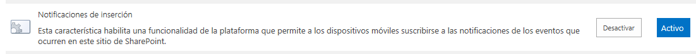

​Una de las nuevas características que introduce SharePoint 2013es que permite a los dispositivos móviles registrarse en nuestra aplicación. Una vezregistradoel dispositivose puede escribir código de controlador de eventos para interactuar con el servicio de notificacionespushde Microsoft(MPNS o Microsoft PushNotificationsService)o con servicios de notificación de otras plataformas de dispositivos móviles.

Una de las características de losmóvilescon WP es que tienen un servicio de notificaciones Push, que permite que cualquier aplicación externa pueda comunicarse con este servicio y de esta forma mostrar un aviso a nuestra aplicación tal y como se muestra en esta figura.


Existen tres tipos de notificaciones que podemos utilizaren los dispositivos con Windows Phone 7.5 (en la versión 8 se han añadido más tipos de notificaciones):

Notificaciones Toast:Es aquella que se muestra ocupando la parte superior de la pantalla, con un color de fondo igual al color de resaltado del dispositivo. Se compone de tres elementos:

·Titulo:Texto en negrita que se muestra justo a continuación del icono de la aplicación y se establece en la propiedad Text1 del elemento del esquema XML.

·Subtitulo:Texto sin negrita mostrado después del titulo y establecido por la propiedad Text2 del esquema XML.

·Parámetro:Un parámetro que no será mostrado pero será enviado a la aplicación cuando el usuario presione la notificación Toast, definido en la propiedadParamdel esquema XML.

Notificaciones Tile:Actualiza el Live Tile para la aplicación en la pantalla de inicio del teléfono, cambiando el gráfico, el título del mosaico, y el contador numérico en el mosaico. Son recibidas incluso si la aplicación está ejecutando.Al trabajar con notificaciones Tile debemos tener en cuenta las siguientes restricciones:

·A ser posible usaremos locales y no remotas para los tiles, de esta forma reduciremos el consumo de transferencia y evitaremos retardos al enviar imágenes con la notificación.

·Las imágenes para los tiles deben estar en formatopngojpg.

·No está soportado HTTPS para imágenes remotas.

·El tamaño máximo de imagen remota es de 80KB, si la imagen tiene un tamaño será descartada y no se descargará.

·Si por alguna razón la imagen frontal o trasera falla al descargarse, ninguna de las demás propiedades se establecerá.

Notificaciones RAW(o en bruto):Nos permite enviar información a nuestra aplicación para que este la procese y use. No es un tipo de notificación para mostrar directamente al usuario, como lo son las notificaciones Toast y Tile. Este tipo de notificación nos permite enviar información a nuestra aplicación de cualquier tipo, otorga mayor flexibilidad que los tipos anteriores, porque no estamos obligados a usar unos campos concretos.

Para hacer mas ameno la explicación vamos a ponernos en un ejemplomas o menos real, tenemos en un servidor SharePoint donde tenemos la información de los números de Compartimos, así como los artículos que hay en la revista. En base a estos datos tenemos una aplicación Windows Phone en la que se visualiza esta información y recibe las notificaciones cada vez que sale un nuevo número de la revista.

Manos a la obra

En primer lugar,						 vamos a realizar la parte que tenemos que implementar en la nueva						 versión de						 nuestro servidor favorito.

Para permitir que en el sitio puedan subscribirse los dispositivos móviles para poder recibir las notificaciones que se producen en						 los eventos del sitio tenemos						 que activar esta característica:



Esta característica la podemos activar con el siguiente código en C# añadido en el momento que activamos nuestra característica y de esta forma						 siempre que despleguemos nuestra solución tendremos activada la característica y nos olvidamos de problemas						 (para mi esta es la opción adecuada):


spWeb.Features.Add(newGuid(PushNotificationFeatureId),false);


A continuación						 partimos que tenemos dos listas en SharePoint:

Revista esta compuesta por estas tres columnas:

- Titulo: donde se guarda el titulo de este número de la revista
- Fecha: de publicación de la revista
- Imagen: Donde almacenamos la caratula de la revista
- Número de artículos


Articulo esta compuesta por tres columnas:

- Titulo : donde se guarda el titulo del artículo
- Autor: persona que ha escrito el artículo en la revista
- Contenido: En este campo es de tipo multi línea y en el que esta almacenado el desarrollo del artículo.
- Revista de tipo Lookup donde indicamos en que número de la revista se ha publicado este artículo.


Nuestra intención es que cada vez que se agregue un elemento a						 lista						 Revista						 dentro						 de nuestra aplicación se envié:

- una notificación Toast en la que se indique que ha salido un nuevo ejemplar de nuestra revista.
- una notificación Tile en el que le enviaremos la nueva portada de la Revista, asi como el número de artículos que la componen.
- una notificación Raw que la utilizara la aplicación Windows Phone internamente para tareas de administración interna.


Para crearnos						 las listas						 bien la podemos hacer de dos formas con la interfaz						 de usuario						 de SharePoint o mediante programación						 como por ejemplo el siguiente código para crear la lista						 Articulo:


```
internalvoidCreateListArticulo(SPWebspWeb)

{

stringlistTitle="Articulos";

stringlistDescription="Lista donde están losarticulospublicados en la revistaCompartiMOSS.";


Dictionary&lt;string,SPFieldType&gt; columns =newDictionary&lt;string,SPFieldType&gt;();

columns.Add("Autor",SPFieldType.Text);

columns.Add("Contenido",SPFieldType.Note);


GuidlistId=spWeb.Lists.Add(listTitle,listDescription,SPListTemplateType.GenericList);

SPListlist =spWeb.Lists[listId];

SPViewview =list.DefaultView;


foreach(stringkeyincolumns.Keys)

{

list.Fields.Add(key, columns[key],false);

view.ViewFields.Add(key);

}


list.Update();

view.Update();

}
```


Una vez ya tenemos						 las listas creadas, abrimos un						 proyecto SharePoint 2013 en blanco.						 Agregamos una clase						 Notificacion						 en la que nos vamos a crear los métodos que se encargaran de enviar las notificaciones						 a los						 dispositivos						 Windows Phone						 subscritos a nuestra lista.


Creamos un procedimiento						 que se va a encargar de enviar las notificaciones. La principal novedad es que vamos a utilizar una variable de tipo						 SPPushNotificationSubscriber						 este tipo de variable es una de las novedades						 del modelo de objetos de						 SP2013. Lo importante de este tipo de variables es que						 tienen						 almacenado la dirección Uri donde tenemos que enviar la notificación.						 Este procedimiento es valido para los tres tipos de notificaciones en base a que tipo de notificación						 pondemos						 un valor distinto en la variable “notificationType”. Dependiendo de que tipo de notificación sea,						 la variable						 message						 tendrá						 una estructura de XML diferente


```
///&lt;summary&gt;

///Procedimiento para enviar la notificación WP

///&lt;/summary&gt;

///&lt;paramname="notificationType"&gt;Tile = 1, Toast = 2, Raw = 3&lt;/param&gt;

///&lt;paramname="subscriber"&gt;&lt;/param&gt;

///&lt;paramname="message"&gt;Mensaje de lanotificacion&lt;/param&gt;

///&lt;paramname="intervalValue"&gt;Intervalo para esperar lanotificacion&lt;/param&gt;

///&lt;returns&gt;&lt;/returns&gt;

privatevoidSendPushNotification(NotificationTypeEnumnotificationType,SPPushNotificationSubscribersubscriber,stringmessage,intintervalValue)

{

// Creamos un objeto HTTP WebRequestque es el encargado de comunicar.

stringsubscriptionUri=subscriber.ServiceToken;

HttpWebRequestsendNotificationRequest= (HttpWebRequest)WebRequest.Create(subscriptionUri);


// MPNS espera un vector de bytes por lo que lo codificamos el mensaje.

byte[]notificationMessage=Encoding.Default.GetBytes(message);


//Establecemoslas propiedaddelHTTPRequestpara enviar la notificación

sendNotificationRequest.Method=WebRequestMethods.Http.Post;

sendNotificationRequest.ContentLength=notificationMessage.Length;

sendNotificationRequest.ContentType="text/xml";

sendNotificationRequest.Headers.Add("X-MessageID",Guid.NewGuid().ToString());


switch(notificationType)

{

caseNotificationTypeEnum.Tile:

sendNotificationRequest.Headers.Add("X-WindowsPhone-Target","token");

break;

caseNotificationTypeEnum.Toast:

sendNotificationRequest.Headers.Add("X-WindowsPhone-Target","toast");

break;

caseNotificationTypeEnum.Raw:

// En el caso de las notificacionesRawno se especifica ningún tipo de cabecera.

break;

}


sendNotificationRequest.Headers.Add("X-NotificationClass",intervalValue.ToString());


using(StreamrequestStream=sendNotificationRequest.GetRequestStream())

{

requestStream.Write(notificationMessage, 0,notificationMessage.Length);

}


try

{

//Enviamos la notificación, en un caso real esperaríamos la respuesta y bien la almacenamos en alguna lista o tomamos alguna determinación como volver a enviar la notificación.

HttpWebResponseresponse = (HttpWebResponse)sendNotificationRequest.GetResponse();


}

}

```

A continuación						 en						 esta clase						 vamos a añadirle el procedimiento						 PushToast, que será el que invoquemos para enviar la notificación al móvil. Este procedimiento va a generar la estructura del XML que tenemos que enviar, tiene tres valores que hay que rellenar Text1, donde en nuestro caso estará el titulo del articulo, Text2 que en nuestro caso pondremos el nombre de la persona que ha escrito el articulo, y en la parte del						 Param						 la vamos a dejar en blanco (generalmente en el						 param						 se pone una pagina que se quiera						 mostrar cuando en el dispositivo móvil)..


```
publicvoidPushToast(SPPushNotificationSubscribersubscriber,stringtoastTitle,stringtoastMessage,

stringtoastParam,ToastIntervalValuesEnumintervalValue)

{

stringtoastNotification="&lt;?xml version=\"1.0\" encoding=\"utf-8\"?&gt;"+

"&lt;wp:Notificationxmlns:wp=\"WPNotification\"&gt;"+

"&lt;wp:Toast&gt;"+

"&lt;wp:Text1&gt;"+toastTitle+"&lt;/wp:Text1&gt;"+

"&lt;wp:Text2&gt;"+toastMessage+"&lt;/wp:Text2&gt;"+

"&lt;wp:Param&gt;"+toastParam+"&lt;/wp:Param&gt;"+

"&lt;/wp:Toast&gt; "+

"&lt;/wp:Notification&gt;";


SendPushNotification(NotificationTypeEnum.Toast, subscriber,toastNotification, (int)intervalValue);

}
```


También añadiremos un procedimiento						 PushTile						 que como parámetros tiene						 los siguientes: Imagen de Fondo, Contador, Titulo, Imagen de Fondo Trasera y Titulo de fondo.


```
publicvoidPushTile(SPPushNotificationSubscribersubscriber,stringtileFrontal,stringtileImagenF,stringtileContador,stringtileTrasero,

stringtileImagenT,stringtileContenido, ToastIntervalValuesEnumintervalValue)

{

// Construct toast notification message from parameter values.

stringtileNotification="&lt;?xml version=\"1.0\" encoding=\"utf-8\"?&gt;"+

"&lt;wp:Notificationxmlns:wp=\"WPNotification\"&gt;"+

"&lt;wp:Tile&gt;"+

"&lt;wp:BackgroundImage&gt;"+tileImagenF+"&lt;/wp:BackgroundImage&gt;"+

"&lt;wp:Count&gt;"+tileContador+"&lt;/wp:Count&gt;"+

"&lt;wp:Title&gt;"+tileFrontal+"&lt;/wp:Title&gt;"+

"&lt;wp:BackBackgroundImage&gt;"+tileImagenT+"&lt;/wp:BackBackgroundImage&gt;"+

"&lt;wp:BackTitle&gt;"+tileTrasero+"&lt;/wp:BackTitle&gt;"+

"&lt;wp:BackContent&gt;"+tileContador+"&lt;/wp:BackContent&gt;"+

"&lt;/wp:Tile&gt; "+

"&lt;/wp:Notification&gt;";


returnSendPushNotification(NotificationTypeEnum.Toast, subscriber,tileNotification, (int)intervalValue);

}
```


Finalmente añadiremos un procedimiento						 PushRaw						 donde no se establece ningún tipo de						 parametrización, le enviaremos un mensaje con la estructura que nosotros queramos. Va a ser una notificación interna que se utiliza para labores internas en la aplicación móvil.


```
publicvoidPushRaw(SPPushNotificationSubscribersubscriber,stringrawMessage,RawIntervalValuesEnumintervalValue)

{

returnSendPushNotification(NotificationTypeEnum.Raw, subscriber,rawMessage, (int)intervalValue);

}
```


A continuación						 a nuestro proyecto le						 añadimos un						 EventReceiver						 (Receptor de Eventos), seleccionamos una Lista Personalizada y seleccionamos el evento de añadir un elemento en una lista.


Implementamos el siguiente código consulta todos los dispositivos móviles que están subscritos en este sitio y a cada dispositivo le envía una notificación con los datos que acabamos de añadir						 en la lista.

```
///&lt;summary&gt;
///Cuando añadimos un elemento a la lista.

///&lt;/summary&gt;

publicoverridevoidItemAdded(SPItemEventPropertiesproperties)

{

SPWebspWeb=properties.Web;

SPPushNotificationSubscriberCollectionpushSubscribers=spWeb.PushNotificationSubscribers;

PushNotificationpushNotification=newPushNotification();


SPListItemlistItem=properties.ListItem;


stringtitleRevista=listItem["Title"].ToString();

stringfechaRevista=listItem["Fecha"].ToString();

stringimagenRevista=listItem["Imagen"].ToString();

stringcontadorRevista=listItem["contador"].ToString();


foreach(SPPushNotificationSubscriberpsinpushSubscribers)

{

//Enviode notificaciones ToastpushNotification.PushToast(ps,titleRevista,fechaRevista,string.Empty,ToastIntervalValuesEnum.ImmediateToast);

//Enviode notificaciones Tile

pushNotification.PushTile(ps,titleRevista,string.Empty,imagenRevista,contadorRevista,string.Empty,string.EmptyToastIntervalValuesEnum.ImmediateTile);

//Enviode notificacionesRaw

pushNotification.PushRaw(ps,titleRevista,"NuevoNumero",ToastIntervalValuesEnum.ImmediateRaw);


}

base.ItemAdded(properties);

}
```


¿Comoenviar las notificacionesenSharePoint2010?

Tal y como habéis visto con anterioridad,en la nueva versión deSharePoint el gran beneficio que tiene es que se almacena internamente los dispositivos que están subscritos a nuestras listas, que esto no es más que hay una lista oculta en el que se almacena esta información. Por lo tanto el primer paso para empezar es crearnos una lista “Subscriptores” que solo va a tener dos camposGuidyChannelUri(elGuidpara tener un control de los dispositivos que tenemos almacenados y elChannelUripara tener la dirección a la cual enviamos la notificación).

El siguiente paso al igual que en SharePoint 2013 es crearnos una clase					 PushNotificacion, la única diferencia es que no vamos a utilizar las variables de tipo						 SPPushNotificationSubscriber						 y las vamos a sustituir por cadenas de tipo						 string(lo único que necesitamos para enviar la notificación es la dirección URI). El código resultante quedaría de la siguiente forma:


```
privatevoidSendPushNotification(NotificationTypeEnumnotificationType,stringsubscriber,stringmessage,intintervalValue)

{

// Creamos un objeto HTTP WebRequestque es el encargado de comunicar.

HttpWebRequestsendNotificationRequest= (HttpWebRequest)WebRequest.Create(subscriber);


El resto del código a implementar						 es exactamente igual.


Una vez ya tenemos implementada la clase						 PushNotification, añadimos un						 eventReceiver						 (del mismo tipo que en el sitio de 2013), y ahora lo que tenemos que implementar es el funcionamiento del objeto “SPPushNotificationSubscriberCollection” que no es más que consultar las direcciones URI que tenemos almacenada en la lista de subscriptores						 para hacerlo en 2010- Una vez tenemos los subscriptores les enviamos la notificación a los dispositivos vinculados. Aquí está el código que implementa esta acción:


public override void ItemAdding(SPItemEventProperties properties)

{

base.ItemAdding(properties);


List&lt;string&gt; Subscripter= GetListSubscriptores(properties);

SPListItem listItem = properties.ListItem;


stringtitleRevista=listItem["Title"].ToString();

stringfechaRevista=listItem["Fecha"].ToString();

stringimagenRevista=listItem["Imagen"].ToString();

stringcontadorRevista=listItem["contador"].ToString();


foreach (string UriSubcripcion in Subscripter)

{

// Envio de notificaciones Toast

pushNotification.PushToast(UriSubcripcion,titleArticulo, autorArticulo, string.Empty, ToastIntervalValuesEnum.ImmediateToast);

//Enviode notificaciones Tile

pushNotification.PushTile(UriSubcripcion,titleRevista,string.Empty,imagenRevista,contadorRevista,string.Empty,string.EmptyToastIntervalValuesEnum.ImmediateTile);

//Enviode notificacionesRaw

pushNotification.PushRaw(UriSubcripcion,titleRevista,"NuevoNumero",ToastIntervalValuesEnum.ImmediateRaw);


}

}

/// &lt;summary&gt;

/// Devuelve las direcciones de los dispositivos subscriptos

/// &lt;/summary&gt;

/// &lt;param name="properties"&gt;&lt;/param&gt;

/// &lt;returns&gt;&lt;/returns&gt;

private List&lt;string&gt; GetListSubscriptores(SPItemEventProperties properties)

{

List&lt;string&gt; resultado = new List&lt;string&gt;();

foreach (SPListItem item in properties.Web.Lists["Subscriptores"].GetItems())

{

resultado.Add(item["ChannelUri"].ToString());

}

return resultado;

}
```


Resumen

Eneste artículo hemos visto una de las grandes novedades que trae consigo SharePoint2013 y es como enviar notificaciones a dispositivos moviles que estan subscritos a estas listas de SharePoint. De la misma forma hemos visto como es relativamente utilizar las listas de Sharepoint en Windows Phone y otorgarle un plus de interacción con el usuario, algo que estamoda esta con la llegada de los nuevos productos de Microsoft.

A su vez tambien es visto como a pesar de todas estas mejorasen SharePoint 2013 no es mas que una evolución deSharePoint2010, en la que mejora muchas cosas, pero esto no impide que se puedan hacer, aunque para ello es necesario realizar unas pequeñas modificaciones.Muchos de nosotros nos va a tocar pelearnos durante un cierto tiempo con la versión 2010 y siempre es muy util obtener todas las mejoras posibles y que esten adaptadas a las necesidades del usuario final de la aplicación.

Para el siguiente número dejamos la parte de como implementar la aplicación Windows Phone tanto en su versión 7.5 como en la recientemente liberada 8, un paso más para hacer el circulo cada vez más estrecho y más sencillo para el desarrollador con lo cual siempre se puede ofrecer un mejor producto al cliente final.

Referencias

Novedades de los dispositivos móviles (SharePoint 2013 Preview)

[http://technet.microsoft.com/es-es/library/fp161352(v=office.15).aspx](http://technet.microsoft.com/es-es/library/fp161352%28v=office.15%29.aspx)

How to: Configure and use push notifications in SharePoint 2013 apps for WindowsPhone

[http://msdn.microsoft.com/es-es/library/jj163784(office.15).aspx](http://msdn.microsoft.com/es-es/library/jj163784%28office.15%29.aspx)

**Adrián						 Díaz						 Cervera**

MCPD SharePoint 2010

Microsoft Active Professional 2012

[addiacer@gmail.com](mailto:addiacer@gmail.com)

[@AdrianDiaz81](http://twitter.com/AdrianDiaz81)

