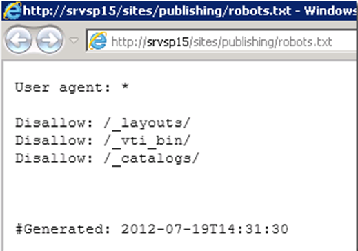

​Un sistema gestor de contenidos web ([Web Content Management							 System](http://en.wikipedia.org/wiki/Web_content_management_system)[1]en inglés) es un programa orientado a ayudar a crear, actualizar, eliminar páginas web a aquellos usuarios que no tienen conocimientos de programación. En definitiva cualquier sistema WCM que se precie debe tener herramientas para diseñar páginas web teniendo en cuenta factores como: incluir imágenes, incluir vídeos, poner estilos a los párrafos, hacer distintos diseños de página, añadir metadatos a las páginas, flujos de trabajo de aprobación, y como no facilitar la inclusión de todos aquellos factores SEO que se implementan directamente en las páginas y aquellos otros de los que depende el sitio web completo.

Poniendo a SharePoint en la ecuación, recuerdo que en SharePoint 2010 para había que tomarse el tiempo de desarrollar ciertos componentes a medida para[hacer un sitio web SEO-amigable](http://blogs.solidq.com/sharepoint/post.aspx?id=77&amp;title=search+engine+optimization+%28seo%29+and+sharepoint+2010+tips%2c+improving+our+ranking+relevance.)[2]. Y claro, esto supone que tengamos que hacer inversión doble, una para adquirir SharePoint y otra para adaptarlo para cumplir con todos los factores SEO (de los que hablaremos a continuación).Además, poca información existe en la Internet sobre SharePoint y SEO y menos en español. Personalmente, el posicionamiento en la web es un tema que me interesa mucho, hasta el punto de asistir a congresos nacionales sobre SEO, donde sinceramente, aprendí la importancia que tiene cada una de las etapas del proceso SEO.En este congreso preguntaba por optimizar un SharePoint para SEO y observé un desconocimiento general, además de varios comentarios en plan, se requiere mucho esfuerzo. Por ello decidí montar un[pequeño seminario de SEO y SharePoint 2010](http://www.solidq.com/squ/courses/Pages/SEO-y-SharePoint-2010-Online.aspx)[3], donde en un par de días cualesquiera es capaz de montar su SharePoint 2010 y ponerle las características SEO de las que carece.Despuésde leer esto, no hace falta decir quesoy unfrikide lasbúsquedas J, por ello me he llevado el mote “theSEOman” dentro de[SolidQ](http://www.solidq.com/)(además de por implementar toda la estrategia de posicionamiento a nivel mundial).

Historias personales aparte,					 el equipo de SharePoint de Microsoft					 nos					 ha					 escuchado					 y por fin han incluido en su versión 2013 una colección completísima de características SEO “out-of-the-box” (de serie).

Este artículo tiene doble objetivo, por un lado, que el					 lector comprenda algunos de los factores SEO que influyen a nivel de página y sitio, y por otro lado,					 asociar estos factores a SharePoint 2013 y aprender a como utilizarlos de forma adecuada.

**Factores SEO**

Una de las cosas más importantes que he aprendido a lo largo de los años, es que para sacarle todo el partido a una técnica, debes aprenderla a fondo, ya que son los pequeños detalles los que marcan la diferencia, por ello, veamos una pequeña introducción al mundo del SEO.

Optimización de motores de búsqueda (Search					 Engine					 Optimization					 - SEO) es el proceso de optimización de nuestro sitio web con el objetivo de conseguir un buen posicionamiento en los motores de búsqueda. Dicho de otro modo, cuando aplicamos técnicas SEO estamos siguiendo unas buenas prácticas para que nuestro sitio web tenga bien definida la arquitectura, la navegación, cumpla con las métricas de código bien estructurado, tenga contenido útil, etc… lo que se traduce en un buen sitio tanto para los usuarios como para los robots de búsqueda. En definitiva los motores de búsqueda van a dar más relevancia a aquellos sitios que crean que son más útiles y accesibles para los usuarios.

No obstante, nadie nos va a poder asegurar 100 % estar en la primera posición en los buscadores, pero siguiendo una serie de buenas prácticas o técnicas que optimizan nuestro sitio web podemos aumentar nuestras posibilidades. Lo que sí se puede asegurar es que si no se cumplen estas buenas prácticas no estaremos en las primeras páginas de los buscadores. Algunos consejos básicos sobre como optimizar un sitio web para usuarios y motores de búsquedas son:

-Buen contenido (incluyendo palabras clave bien definidas)

-Ayudar a los buscadores a descubrir todo tu sitio (sitemaps, evitar errores 404, etc...)

-Ganarse enlaces entrantes de alta calidad (a través de contenido único y original)

-Código HTML muy bien definido y accesible

-Y mucho más que veremos en detalle más adelante.

En realidad, para llevar a cabo con éxito un proyecto de SEO, debemos tener en cuenta que el proceso consta de las etapas: Investigación inicial, planificación, link					 building,					 keyword					 research, etc. Véase la					 					 para el detalle del proceso SEO con respecto a que rol debe afrontar cada actividad.

Ilustración					 . Proceso SEO

El ámbito de este artículo no pretende ser un tutorial de SEO en su completitud, por ello, nos centraremos solamente en el rol del desarrollador y concretamente en aquellos factores técnicos que se refieren a las páginas (On-Page					 Factors) y al sitio completo (On-Site					 Factors).

Cuando creamos una página web lo primero que tenemos que hacer es definir las palabras clave que mejor la identifiquen, con respecto a como queremos que los usuarios nos encuentren. Una vez definidas las palabras clave, veamos que para crear la página web debemos de tener en cuenta una serie de buenas prácticas SEO en cada uno de los campos: URL, Título, Descripción-SEO, Contenido, Imágenes, etc…

**URL**

Lo primero que creamos es la URL. Dicha URL debe tener todas las palabras clave. Además debe seguir unas pautas.

Pautas

-Deben ser amigables

oEvitar: www.sample.com/12324/Pages/sample.aspx?id=2312

oBuena práctica: www.sample.com/category/page

-Debe tener entre				 60 y 80 caracteres

-Debe				 contener todas las PALABRAS CLAVE TRIUNFADORAS.

-NO poner caracteres raros				 (^, \*, [, …)

oCUIDADOcon la codificación de caracteres raros en las URL, me refiero a por ejemplo las palabras “C#”. En lasURLsno se pueden escribir caracteres como #, por esto hay una página donde te dice cada caráctera que codificación corresponde:[http://www.e-planning.net/es/soporte/codificacion\_caracteres\_en\_url.html](http://www.e-planning.net/es/soporte/codificacion_caracteres_en_url.html). Viendo esto vemos que “#” corresponde a “%22”.

oEl caso de la letra “ñ”, pondríamos SIEMPRE una “n”. Es decir, la palabra “Español” en una URL sería “Espanol”.

Cambios en				 URLs

El cambio en las					 URLs					 es muy peligroso, ya que si se hace un cambio se puede perder todo el posicionamiento que tenemos hasta el momento.

Siempre que se quiera cambiar una URL debemos de tener en cuenta que:

-La				 URL antigua podría estar en algún Blog, Foro, además no olvidemos que en los buscadores la clave primaria o atributo único es la URL, etc…

-La URL antigua podría estasasociada en alguna regla de redireccióncomo por ejemplo[http://www.solidq.com/es/MasterBI](http://www.solidq.com/es/MasterBI)hacia[http://www.solidq.com/squ/courses/Pages/Master-BI-Certified-Business-Intelligence-Microsoft-Espanol.aspx](http://www.solidq.com/squ/courses/Pages/Master-BI-Certified-Business-Intelligence-Microsoft-Espanol.aspx)

-La URL antigua				 DEBE				 redirigirse a la nueva mediante una regla de				 redirección 301.

Por todos estos motivos hay que tratar los cambios de URL con mucho cuidado, ya que un simple cambio de URL podría hacernos descender muchas visitas y posicionamiento.

**Canonicalización**

A veces no es tan obvio como parece saber exactamente cuál va a ser la URL que muestre nuestro sitio web. Ya que un sólo sitio en un único dominio puede ser mostrado de distintas maneras, por ejemplo:

- [www.sample.com](http://www.sample.com/)
- sample.com/
- [www.sample.com/Pages/sharepoint.aspx](http://www.sample.com/Pages/sharepoint.aspx)
- www.sample.com/Pages/sharepoint.aspx?Sesion=1

Esto puede convertirse en una					 divisón					 de popularidad o Page Rank de esta página, así pues para solucionarlo tenemos dos opciones:

1.Redirección					 de					 tipo					 301

www.sample.com						   à						 (301)						   à						 www.sample.com/Pages/sharepoint.aspx

sample.com/						   à						 (301)						   à						 www.sample.com/Pages/sharepoint.aspx

2.HTML Tag					 rel=“canonical”

En la sección &lt;head&gt; de la página:

&lt;link						 rel="canonical"						 href="http://www.sample.com/Pages/sharepoint.aspx" /&gt;

**&lt;title&gt;**

La etiqueta &lt;title&gt; de la página web. Y también se corresponde con el título que sale en las páginas de resultados de los buscadores (SERPs					 –					 Search					 Engines					 Results					 Pages).

Pautas

-Máximo de 70 caracteres

-Debe				 contener todas las PALABRAS CLAVE.

-Debe ser				 distinto para cada una de las páginas				 de un sitio web, sino somos penalizados.

oPor ejemplo, si tienes una página de Master BI y una noticia de Master BI, NO ponerle el mismo &lt;title&gt;.

-Evitar caracteres raros				 (^, [, ¨, …)

**Description-SEO**

La descripción se corresponde con la etiqueta HTML &lt;meta					 name=’description’					 content=’xxx’ /&gt;. También se corresponde con la descripción que sale en las páginas de resultados de los buscadores.

Pautas

-Máximo de 156 caracteres

-Debe				 contener todas las PALABRAS CLAVE.

-Debe ser				 distinto para cada una de las páginas				 de un sitio web, sino somos penalizados.

**Meta				 keywords**

Los					 Keywords-SEO					 se corresponde con la etiqueta HTML &lt;meta					 name=’keywords’					 content=’xxx’ /&gt;.

Pautas

-Máximo 48 palabras

-Se					 separanmediante					 comas: “SharePoint; SharePoint 2010; SharePoint 2013;…”

oUn				 keyword				 puede estar formado por más de una palabra. Ejemplo “SharePoint 2013”.

-Deben ser las palabras clave					 (Todas ellas).

**Contenido**

Llegamos a la parte más difícil, el contenido. Digo difícil porque aquí es donde tendremos que insertar dentro del contenido el mayor número de Palabras Clave posible.

Además debemos de tener					 encuenta la proximidad entre las palabras. Es decir, que si mi palabra clave es					 SharePoint BI. Debemos de intentar poner siempre juntas estas dos palabras para que la proximidad afecte positivamente en los					 rankings					 de resultados.

Pautas

-Poner				 bastantes veces las palabras clave triunfadoras					 (hasta un 6% está permitido)

oEs decir que podemos poner cada				 palabra				 clave 6 de cada 100 palabras del total del texto. Si nos pasamos seremos penalizados por “Keywords				 Stuffing”.

-Resaltar con				 H1, H2, H3, H4, H5 y H6				 las palabras clave.

-Resaltar en				 Negrita, Cursiva, etc…

Una vez vistos algunos de los aspectos a nivel de página más importantes para SEO y teniendo en menta la importancia de estos dentro del proceso de SEO, veamos como se implementan en SharePoint 2013.

**SEO en SharePoint 2013**

La verdad es que cuandoinstaléSharePoint 2013y creé mi primer sitio de publicación me quedé sorprendido con las mejoras de SEO. Las capacidades WCM (Web Content Management) de SharePoint 2010 habían mejorado respecto a la versión 2007, pero en lo que a SEO se refiere, se había quedado como materia pendiente. Pero todo llega, ya tenemos un SharePoint 2013 que es mucho más WCM.Cabe mencionar que ha habido pequeños cambios entre la versiónPreviewde SharePoint 2013 y la RTM. Por un lado las novedades SEO en laPreviewpodemos verla[aquí](http://blogs.solidq.com/sharepoint/post.aspx?id=210&amp;title=novedades+seo+para+sitios+p%C3%BAblicos+de+sharepoint+2013)[4]. Y las de la versión RTM, las veremos a continuación:

**Redirecciones 302 de las Home				 Pages**

En SharePoint 2010 cuando queríamos entrar en un sitio, por ejemplo,						 [www.solidq.com/ib-es/servicios](http://www.solidq.com/ib-es/servicios), automáticamente SharePoint nos redirigía con una redirección de tipo 302 hacía su correspondiente página de bienvenida, en este caso:						 [www.solidq.com/ib-es/servicios/Pages/Home.aspx](http://www.solidq.com/ib-es/servicios/Pages/Home.aspx).

Ahora en SharePoint 2013, ya no se hace esta redirección ya que la página es servida directamente desde						 [www.solidq.com/ib-es/servicios](http://www.solidq.com/ib-es/servicios).

**URLs				 amigables (Clean				 URLs)**

En SharePoint 2010 uno de los mayores problemas para el posicionamiento venía dado por que las						 URLs						 eran muy poco SEO-amigables.

Por ejemplo esta URL:						 [http://www.solidq.com/ib-es/servicios/Pages/home.aspx](http://www.solidq.com/ib-es/servicios/Pages/home.aspx).

- Tiene la palabra “Pages” o “Paginas” que para quitarla de la URL había que romperse la cabeza, es más debido los problemas de mantenimiento que podía causar la mayoría de las veces se asumía la penalización SEO que conlleva antes de ponerse a modificarlo.

- Tiene los caracteres “.aspx” que tampoco son necesarios para una URL bien formada.

Con						 SharePoint 2013, podremos crear						 URLs						 del tipo "[http://www.solidq.com/ib-es/servicios](http://www.solidq.com/ib-es/servicios)” gracias a la navegación por metadatos administrados.

Ya, pero						 ¿Cómo se activa esta opción en SharePoint 2013?

Bien, nos disponemos a probar esto de las						 URLs						 amigables y todo el tema de SEO y para ello creamos una colección de sitios de publicación de SharePoint 2013.

Y entonces en la página predeterminada vemos lo siguiente:						 http://srvsp15/sites/publishing/Pages/default.aspx: es igual que en SharePoint 2010 y además vamos a la						 Ribbon, a la pestaña de Página o Page y vemos que tanto la opción de “Page						 URLs” como la de “Edit						 SEO						 Properties” están deshabilitadas:

Bien, para poder utilizar todas las ventajas de						 URLs						 y de SEO necesitamos que la navegación de SharePoint 2013 esté configurada en modo “Metadatos Administrados” en lugar del modo tradicional de SharePoint 2010.

Vale, y						 ¿Cómo activamos este tipo de navegación por metadatos en SharePoint 2013?

1.						 Vamos						 a Site Settings

2. Bajo la sección Look and						 Feel, clicamos en “Navigation”

3. En la “Global						 Navigation” tenemos dos opciones ahora:						 Structural						 Navigation						 y						 Managed						 Navigation						 (nueva en SharePoint 2013):

4. Si seleccionamos “Managed						 Navigation” entonces podremos seleccionar un “Term						 Set” de metadatos administrados que actúe como fuente de						 términos						 para la navegación.

NOTA: La primera vez que configuramos esto						 es probable que tengamos						 que crear el						 Term						 Set para poder asignarlo en la navegación. Es importante crear el						 Term						 set con ámbito abierto para que los diseñadores de sitios pueda añadir entradas de navegación en él.

5. Una vez activada la navegación nos damos cuenta que la URL de la home cambia y ahora es amigable: “http://srvsp15/sites/publishing/” y además ahora ya tenemos activas las opciones de “Page						 URLs” y “Edit						 SEO						 Properties”.

La Home page de forma automática corresponde con el nombre del sitio, pero						 si creo una página nueva ¿cómo configuro para que tenga una URL amigable?

1.						 Creamos						 una						 página						 nueva

2. Editamos la página y le damos a guardar. Entonces vemos como ya tiene como URL amigable el nombre de la página que hemos asignado.

3. Sin embargo podemos cambiar esto desde la opción “Page						 URLs” que tenemos en la sección Page de la						 Ribbon.

4. Vemos como a la dirección física “/Pages/Prueba.aspx” tenemos asociado el término “prueba”.

5. Además podemos asignar varios términos o						 urls						 a una misma página física por si queremos realizar algún tipo de filtrado dependiendo de la URL. Para ello clicamos en “Add						 a						 friendly						 URL						 to						 this						 page” e insertar allí el término de metadatos administrados.

6. De esta forma en la navegación nos quedarían dos enlaces amigables que apuntan a la misma página.

**Propiedades SEO**

Aunque, bajo mi punto de vista, la mejor novedad en cuanto a SEO con las						 URLs						 amigables, seguimos con las novedades de SEO que tenemos en SharePoint 2013. Una muy buena también es la posibilidad de, para cada página de nuestro sitio, editar las propiedades SEO:

Entre ellas tenemos la posibilidad de editar las siguientes:

Title:						 Título de la etiqueta Meta						 Title						 que será mostrado en las páginas de resultados de los motores de búsqueda.

Browser						 Title: el atributo &lt;title&gt; de la página HTML. Debe ser único para cada página del sitio.

Meta						 Description: El atributo &lt;meta …&gt; utilizado por los motores de búsqueda para generar los						 snipets						 o descripciones que salen en las páginas de resultados.

Keywords: Palabras clave del contenido de la página.

Exclude from Internet Search Engines and sitemap?:						 Si o no.

NOTA: La ventaja de todo esto es que estas propiedades están incluidas en el tipo de contenido “Page”.

Soporte Código de País en Dominio en Variaciones

En SharePoint 2010 utilizamos variaciones para traducir contenidos en los sitios web públicos (en algunos escenarios). De esta forma podemos tener						 [http://www.solidq.com/en-us/Pages/Home.aspx](http://www.solidq.com/en-us/Pages/Home.aspx)						 y						 [http://www.solidq.com/ib-es/Pages/Home.aspx](http://www.solidq.com/ib-es/Pages/Home.aspx).

Ahora con SharePoint 2013, las						 variaciones (Variations) soportaran que estas traducciones se hagan a nivel de						 ccTLDs, es decir, dominios de cada país. Por ejemplo:						 www.solidq.com/services						 y						 www.solidq.es/services.

Fichero Robots.txt

De forma automática se crea el fichero Robots.txt:

**XML				 Sitemaps**

De forma automática se generará el fichero sitemap.xml y se referenciará en el Robots.txt. Las páginas que se incluirán serán aquellas seleccionadas para ello desde las propiedades SEO que hemos visto antes.

Para poder activar esta característica en los sitios de publicación debemos tener autenticación como anónimo activada y activar una característica a nivel de Colección de sitios.						 Esta característica se llama “SearchEngineSitemap”:

Este proceso de actualización del						 sitemap						 lo hace un Time Job llamado “SearchEngineSitemap						 Job”:

Si ejecutamos el Job desde el administrador de contenido y estructura vemos como se han añadido varios ficheros para el						 sitemap:

Entonces se añade la siguiente línea al Robots.txt:

#Sitemap index						 
Sitemap:						 [http://srvsp15:80/sites/publishing/sitemap.xml](http://srvsp15/sites/publishing/sitemap.xml)

Y se generan dos versiones de						 SiteMap, una para móviles y otra para el resto:

Inclusión del código de verificación para					 WebMaster					 Tools

Sí, a nivel de colección de sitios podemos configurar el código de verificación que automáticamente se incluirá en todas las páginas de nuestro sitio.

Para configurarlo entramos en “Site						 Settings” (acordaos que es desde la ruedecita de configuración que tenemos arriba a la derecha – esto lo han cambiado).

Configuración de					 URLs					 canónicas

SharePoint 2013 nos permite asignar el meta						 tag						 de URL canónica para aquellos sitios que tienes páginas muy similares, cuya única diferencia es un filtrado por						 query						 string.

Esto también los podemos configurar a nivel de colección de sitios desde la misma opción que en la sección anterior.						 Véase						 la						 imagen						 para						 más						 información:

Más información acerca de URL canónigas y SEO[aquí](http://www.seomoz.org/blog/canonical-url-tag-the-most-important-advancement-in-seo-practices-since-sitemaps)						 [5].

Como hemos observado podemos configurar muchas de las propiedades SEO que hasta ahora no teníamos la opción de hacerlo por defecto.						 Sin embargo, otro aspecto importante es el rendimiento del sitio (tiempo de carga), cosa que también se ha mejorado en SharePoint 2013, incluyendo entre otras cosas, las						 ImageRenditions, que consiste en generar distintos tamaños de imagen al subirlas a SharePoint para de esta forma utilizar la más adecuada en cada caso.						 Si quieres más información de						 ImageRenditions						 puedes ver este						 [webcast](https://msevents.microsoft.com/CUI/EventDetail.aspx?culture=es-ES&amp;EventID=1032529676&amp;CountryCode=ES)						 [6].

**Conclusión**

El SEO no es un tema nuevo, sin embargo los sistemas gestores de contenido web, van poniéndose al día poco a poco en esta materia. No obstante, SEO no es solamente el poder configurar un					 sitemap					 xml, o unas propiedades por cada página. El SEO engloba todo el proceso desde la creación del					 site					 hasta su mantenimiento para no quedarse abajo en los resultados de búsqueda. Y con esto quiero decir, que un proyecto SEO engloba los departamentos de desarrollo, gestión de contenido y marketing. Siendo de las tareas más importantes el obtener las palabras claves triunfadoras (Keyword					 Research), el conseguir unos buenos enlaces externos (Link					 Building) y el completar para cada página del sitio correctamente estos campos mencionados en este artículo.

Referencias

[1]						 Web content management system:[http://en.wikipedia.org/wiki/Web\_content\_management\_system](http://en.wikipedia.org/wiki/Web_content_management_system)

[2]						 Search Engine Optimization (SEO) and SharePoint 2010 tips, improving our ranking relevance:						 [http://blogs.solidq.com/sharepoint/post.aspx?id=77&title=search+engine+optimization+(seo)+and+sharepoint+2010+tips%2C+improving+our+ranking+relevance](http://blogs.solidq.com/sharepoint/post.aspx?id=77&amp;title=search+engine+optimization+%28seo%29+and+sharepoint+2010+tips%2c+improving+our+ranking+relevance)

[3]Seminario de SEO y SharePoint 2010:[http://www.solidq.com/squ/courses/Pages/SEO-y-SharePoint-2010-Online.aspx](http://www.solidq.com/squ/courses/Pages/SEO-y-SharePoint-2010-Online.aspx)

[4]Novedades en SEO para SharePoint 2013.[http://blogs.solidq.com/sharepoint/post.aspx?id=210&title=novedades+seo+para+sitios+p%C3%BAblicos+de+sharepoint+2013](http://blogs.solidq.com/sharepoint/post.aspx?id=210&amp;title=novedades+seo+para+sitios+p%C3%BAblicos+de+sharepoint+2013)

[5]Canonical URLTag(inglés):[http://www.seomoz.org/blog/canonical-url-tag-the-most-important-advancement-in-seo-practices-since-sitemaps](http://www.seomoz.org/blog/canonical-url-tag-the-most-important-advancement-in-seo-practices-since-sitemaps)

[6]Novedades en SharePoint 2013.Sección deImageRenditions:[https://msevents.microsoft.com/CUI/EventDetail.aspx?culture=es-ES&EventID=1032529676&CountryCode=ES](https://msevents.microsoft.com/CUI/EventDetail.aspx?culture=es-ES&amp;EventID=1032529676&amp;CountryCode=ES)

[7]WaldekMastykarz.Search Engine Optimization in SharePoint 2013:[http://blog.mastykarz.nl/search-engine-optimization-sharepoint-2013/](http://blog.mastykarz.nl/search-engine-optimization-sharepoint-2013/)

José Quinto Zamora

MCPD y MCITP en SharePoint 2010

[jquinto@solidq.com](mailto:jquinto@solidq.com)

@jquintozamora

[http://blogs.solidq.com/sharepoint](http://blogs.solidq.com/sharepoint)

 
 
import LayoutNumber from '../../../components/layout-article'
export default LayoutNumber
