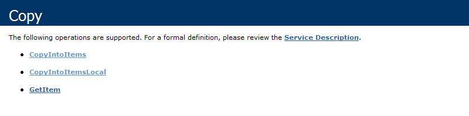
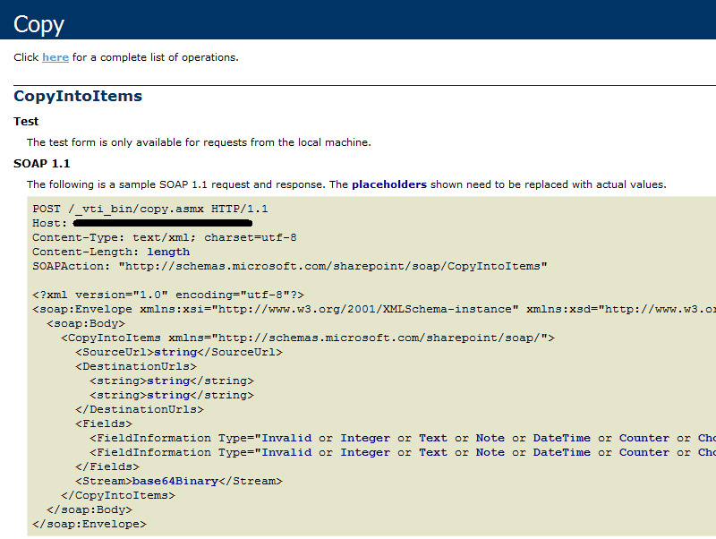
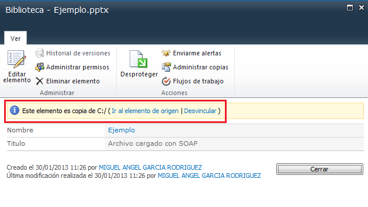
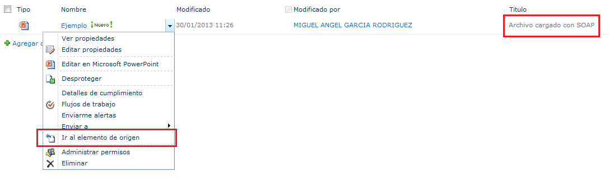
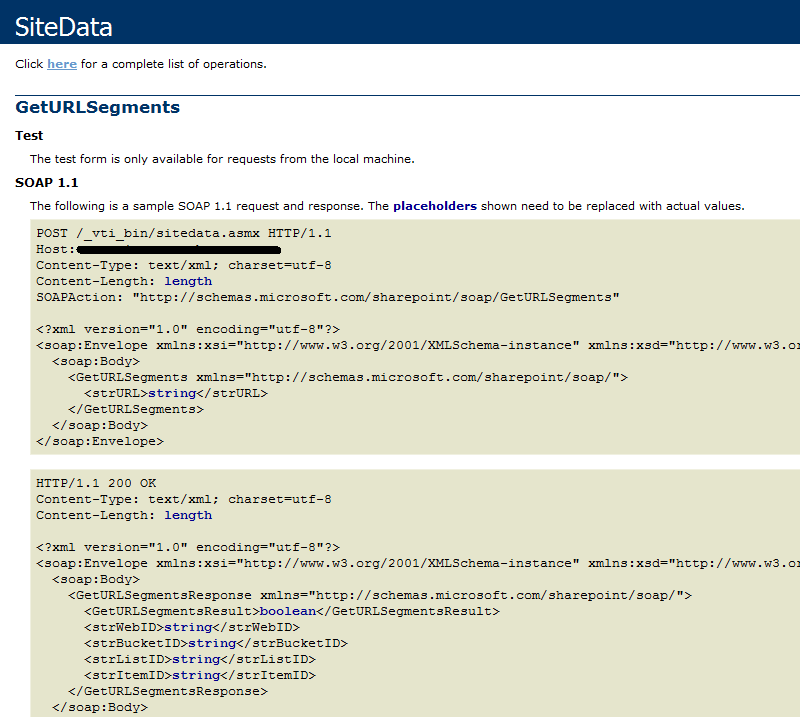
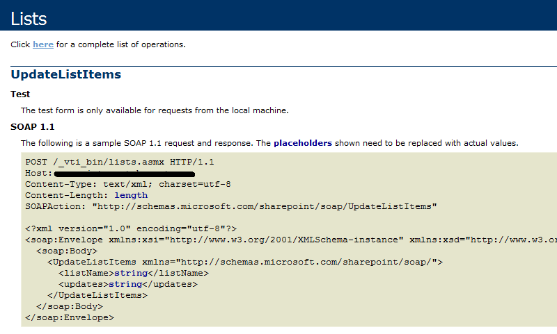

**Objetivo y Alcance**

Existen varias maneras de cargar documentos en una biblioteca de documentos de SharePoint. Algunas son procesos manuales como el que ofrece la propia herramienta o a través del "Guardar como" si estamos hablando de documentos Office. También existen procesos automáticos para este propósito. Uno de ellos son los servicios web.

Sólo debe considerarse como una aproximación ya que no se establecen mecanismos para controlar los errores que se puedan producir por denegación de permisos, tamaño del archivo, carga de archivos ejecutables, etc.

Trabajaremos entonces con el servicio web copy.asmx  (operación CopyIntoItems), aunque será fácilmente extensible a los servicios Imaging.asmx (operación Upload) y Lists.asmx (operación AddAttachment). Mientras que el primero nos permite cargar documentos en una biblioteca de documentos el segundo nos permite cargar imágenes en una biblioteca de imágenes y el tercero añadir un adjunto a un elemento de una lista.

**Herramienta**

Utilizaremos en este caso Visual Basic Script Edition por la facilidad que tiene de ejecución en cualquier estación de trabajo o servidor.

**Preliminares**

Para conocer las operaciones disponibles del servicio copy.asmx deberemos ejecutar en nuestra instalación de SharePoint la URL:  http://&lt;&lt;Misitio&gt;&gt;/\_vti\_bin/copy.asmx y si queremos conocer la sintaxis de la operación CopyIntoItems :  http:// &lt;&lt;Misitio&gt;&gt; /\_vti\_bin /copy.asmx?op=CopyIntoItems.

Es aquí donde nos damos cuenta que el archivo que carguemos necesita ir codificado en base64Binary. Crearemos objetos que nos permitirán realizar las cuatro funciones principales de las que consta esta aproximación:

- Leer el contenido del archivo en modo binario.
- Codificar dicho contenido a base64Binary.
- Construir y ejecutar una petición Http (SOAP 1.1) para cargar el documento.
- Construir y ejecutar dos peticiones Http (SOAP 1.1) que nos permitirán actualizar el documento cargado.

**Definición de constantes y objetos**

Utilizaremos dos constantes: Ruta y nombre del archivo local, URL de la biblioteca de SharePoint incluyendo nombre de archivo destino.

Utilizaremos además cuatro objetos: Un objeto Stream para la lectura del archivo, un elemento de un objeto XMLDOM para la codificación del documento y para la recuperación de la respuesta del servidor y un objeto XMLHTTP para la ejecutar las peticiones.
 
Const  ArchivoLocal = " Ejemplo.pptx "
 Const  URLDestino = " http://.../Biblioteca/Ejemplo.pptx "

Set ObjetoStream = CreateObject(" ADODB.Stream ")
 Set ObjetoDOM = CreateObject(" Microsoft.XMLDOM ")
 Set ObjetoElemento = ObjetoDOM.CreateElement(" TMP ")
 Set ObjetoHTTP = CreateObject(" Microsoft.XMLHTTP ")

**Lectura del contenido del archivo y Codificación**

A continuación obtenemos el archivo codificado en base64Binary
 
'Lectura del archivo en binario
 ObjetoStream.Open
 ObjetoStream.type= 1 'Tipo Binario
 ObjetoStream.LoadFromFile(ArchivoLocal)
 ArchivoBinario = ObjetoStream.Read()
 ObjetoStream.Close

'Conversion a Base64
 ObjetoElemento.DataType = " bin.base64 " 'Tipo Base64
 ObjetoElemento.NodeTypedValue = ArchivoBinario
 ArchivoCodificado = ObjetoElemento.Text

**Construcción y ejecución de la Petición de carga del documento**

Tal y como se ve en la Imagen 2, la operación SOAP CopyIntoItems se basa en un archivo XML que debemos construir con las constantes definidas y las variables que hemos obtenido.  Analizaremos algunos elementos:

- &lt;SourceURL&gt; Contiene el origen del documento a copiar. Este valor es utilizado por SharePoint para recuperar el origen de la copia del documento. Este valor no puede estar en blanco. Como en nuestro caso el origen es un archivo local ajustaremos este dato a "C:/" aunque posteriormente deberemos realizar otras peticiones que nos permitan modificar el valor.
- &lt;DestinationUrls&gt; Una serie de Urls donde queremos copiar el archivo origen. Podemos hacer diferentes copias en diferentes bibliotecas desde el mismo origen.
- &lt;Fields&gt; Una serie de valores que se asignan a columnas definidas en las bibliotecas. En nuestro caso establecemos el valor: "Archivo cargado con SOAP" a la columna Título.
- &lt;Stream&gt; Documento a copiar debidamente codificado que hemos obtenido previamente.

'Construye texto Peticion de carga del documento
  URLServicio = " http://.../\_vti\_bin/copy.asmx "
 AccionSOAP = " http://schemas.microsoft.com/sharepoint/soap/CopyIntoItems "
 Peticion= "&lt;?xml version='1.0' encoding='utf-8'?&gt;"+\_
 "&lt;soap:Envelope xmlns:xsi='http://www.w3.org/2001/XMLSchema-instance' xmlns:xsd='http://www.w3.org/2001/XMLSchema' xmlns:soap='http://schemas.xmlsoap.org/soap/envelope/'&gt;"+\_
 "&lt;soap:Body&gt;"+\_
 "&lt;CopyIntoItems xmlns='http://schemas.microsoft.com/sharepoint/soap/'&gt;"+\_
 "&lt;SourceUrl&gt;C:/&lt;/SourceUrl&gt;"+\_
 "&lt;DestinationUrls&gt;"+\_
 "&lt;string&gt;"+URLDestino+"&lt;/string&gt;"+\_
 "&lt;/DestinationUrls&gt;"+\_
 "&lt;Fields&gt;"+\_
 "&lt;FieldInformation Type='Text' InternalName='Title' DisplayName='Titulo' Value='Archivo cargado con SOAP' /&gt;"+\_
 "&lt;/Fields&gt;"+\_
 "&lt;Stream&gt;"+ArchivoCodificado+"&lt;/Stream&gt;"+\_
 "&lt;/CopyIntoItems&gt;"+\_
 "&lt;/soap:Body&gt;
 &lt;/soap:Envelope&gt;"

EjecutaPeticion

Una vez construida la petición podemos enviarla al servidor por medio del procedimiento que utiliza el objeto "Microsoft.XMLHTTP"

Private Sub EjecutaPeticion
 ObjetoHTTP.Open "Get", URLServicio, false
 ObjetoHTTP.SetRequestHeader "Content-Type", "text/xml; charset=utf-8"
 ObjetoHTTP.SetRequestHeader "SOAPAction", AccionSOAP
 ObjetoHTTP.Send Peticion
 End Sub

El archivo se carga correctamente en la biblioteca de SharePoint, pero como comentamos antes, el documento  almacena un enlace al archivo original. Se trata del parámetro &lt;SourceURL&gt; que se copia en el metadato \_CopySource del documento.

**Construcción y ejecución de las peticiones adicionales**

Podemos desvincular manualmente este documento ya que su origen es un archivo local y no se aplica a nuestro ejemplo. Pero podemos hacerlo programáticamente mediante dos nuevas peticiones, la primera recuperará el ID del elemento publicado y el GUID de la biblioteca y la segunda modificará el metadato \_CopySource para que desaparezca el vínculo innecesario.

En la primera petición utilizaremos el servicio web http://&lt;&lt;Misitio&gt;&gt;/\_vti\_bin/sitedata.asmx con la operación GetURLSegments que incluye en el pedido la URL del documento y nos devuelve el GUID de la Lista y el ID del elemento.

'Peticion para recuperar los Ids del documento cargado
 URLServicio = "http://.../\_vti\_bin/sitedata.asmx"
 AccionSOAP = "http://schemas.microsoft.com/sharepoint/soap/GetURLSegments"
 Peticion = "&lt;?xml version='1.0' encoding='utf-8'?&gt;"+\_
 "&lt;soap:Envelope xmlns:xsi='http://www.w3.org/2001/XMLSchema-instance' xmlns:xsd='http://www.w3.org/2001/XMLSchema' xmlns:soap='http://schemas.xmlsoap.org/soap/envelope/'&gt;"+\_
 "&lt;soap:Body&gt;"+\_
 "&lt;GetURLSegments xmlns='http://schemas.microsoft.com/sharepoint/soap/'&gt;"+\_
 "&lt;strURL&gt;" + URLDestino + "&lt;/strURL&gt;"+\_
 "&lt;/GetURLSegments&gt;"+\_
 "&lt;/soap:Body&gt;"+\_
 "&lt;/soap:Envelope&gt;"
 
EjecutaPeticion

ObjetoDOM.loadXML(ObjetoHTTP.responseText)
 Set nodeBook = ObjetoDOM.selectSingleNode("//strItemID")
 IDDocumento = nodeBook.text
 Set nodeBook = ObjetoDOM.selectSingleNode("//strListID")
 IDBiblioteca = nodeBook.text

En la segunda petición actualizaremos el metadato \_CopySource de este documento actualizándolo a Null. Con esto lograremos eliminar el vínculo al elemento origen que no es necesario en este caso. Utilizaremos el servicio web http://&lt;&lt;Misitio&gt;&gt;/\_vti\_bin/lists.asmx con la operación UpdateListItems que necesita como parámetros de entrada los dos datos que hemos conseguido con la petición anterior.

'Peticion para actualizar \_CopySource en el documento
 URLServicio = "http://.../\_vti\_bin/lists.asmx"
 AccionSOAP = "http://schemas.microsoft.com/sharepoint/soap/UpdateListItems"
 Peticion = "&lt;?xml version='1.0' encoding='utf-8'?&gt;"+\_
 "&lt;soap:Envelope xmlns:xsi='http://www.w3.org/2001/XMLSchema-instance' xmlns:xsd='http://www.w3.org/2001/XMLSchema' xmlns:soap='http://schemas.xmlsoap.org/soap/envelope/'&gt;"+\_
 "&lt;soap:Body&gt;"+\_
 "&lt;UpdateListItems xmlns='http://schemas.microsoft.com/sharepoint/soap/'&gt;"+\_
 "&lt;listName&gt;" + IDBiblioteca + "&lt;/listName&gt;"+\_
 "&lt;updates&gt;"+\_
 "&lt;Batch OnError='Return'&gt;&lt;Method ID='1' Cmd='Update'&gt;&lt;Field Name='ID'&gt;" + IDDocumento + "&lt;/Field&gt;&lt;Field Name='MetaInfo' Property='\_CopySource'&gt;&lt;/Field&gt;&lt;/Method&gt;&lt;/Batch&gt;"+\_
 "&lt;/updates&gt;"+\_
 "&lt;/UpdateListItems&gt;"+\_
 "&lt;/soap:Body&gt;"+\_
 "&lt;/soap:Envelope&gt;"

EjecutaPeticion

WScript.Echo "Documento publicado"

**Conclusiones**

En este artículo hemos visto cómo utilizar uno de los servicios expuestos por la plataforma SharePoint, copy.asmx, junto con las operaciones disponibles para facilitar el trabajo remoto con información almacenada en un sitio de SharePoint.

**Referencias**

[1]          [http://msdn.microsoft.com/en-us/library/ee705814(v=office.14).aspx](http&#58;//msdn.microsoft.com/en-us/library/ee705814%28v=office.14%29.aspx)

[2]          [http://msdn.microsoft.com/en-us/library/dd955870.aspx](http&#58;//msdn.microsoft.com/en-us/library/dd955870.aspx)

**Miguel Ángel García Rodríguez**
 Analista SharePoint
 [miganggarrod@hotmail.com](mailto&#58;miganggarrod@hotmail.com)

