En SharePoint 2013 se ha potenciado la presencia de los sitios de publicación dado el radical cambio que ha sufrido la plataforma en su actualización.

El primero y más importante de estos cambios lo podemos encontrar en el núcleo de los sitios de SharePoint, HTML + JavaScript componen la estructura sea cual sea la plantilla, con lo que no será tan complicado realizar Branding en una Intranet al igual que en los sitios de Publicación.

El segundo de los cambios tiene efecto en la libertad que se otorga a los diseñadores para usar el programa que deseen para modelar con HTML, JavaScript y CSS el diseño de los sitios de SharePoint. De esta forma, no tendrán que aprender a usar SharePoint Designer ni hacer un desarrollo en su programa preferido para después irlo trasladando a SharePoint paso a paso. A partir de ahora, podrán controlar sus páginas maestras, hojas de estilo, scripts de JavaScript, etc., desde su programa habitual con sólo conectarse a la dirección de los ficheros de diseño del sitio.

Finalmente, desde Microsoft se han afanado en facilitar la vida al diseñador, así que han dispuesto un nuevo lugar de administración sólo para diseño denominado *Administrador de diseños (Design Manager)* desde donde los diseñadores podrán perfilar sus páginas maestras, los diseños de página y las plantillas para elementos de contenido.

**Comenzar un sitio de publicación de SharePoint 2013**

Para mostrar un ejemplo claro, explicaré paso a paso la construcción del nuevo portal de CompartiMOSS (http://www.compartimoss.com) para el que seguimos los siguientes pasos.

1. Diseño gráfico
2. Traducción del diseño gráfico a una plantilla HTML
3. Exportar boceto con Design Manager
4. Completar página maestra con Design Manager y programa de edición web
5. Crear diseños de página (Parte II)
6. Definición de plantillas de elementos de contenido (Parte II)

**Diseño gráfico**

Para empezar, establecimos diferentes ideas de cómo debía ser el portal de CompartiMOSS para que resultara atractivo pero que sobre todo, sirviera a su cometido, que no es otro que facilitar la lectura a los usuarios. Además, también teníamos que tomar como referencia la aplicación que ya hemos desarrollado para Windows 8. Para ello, usamos un programa de edición gráfica con el que se creó el diseño definitivo que podéis apreciar.

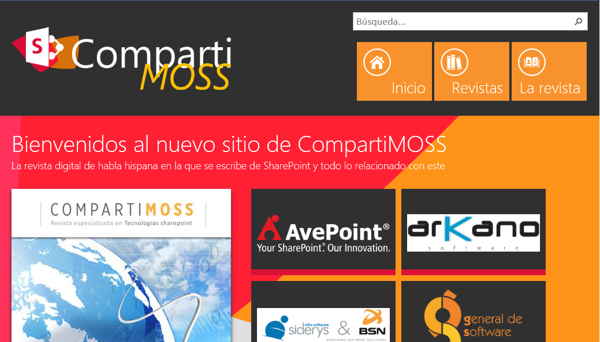

**Traducción del diseño gráfico a una plantilla HTML**

Una vez tenemos el diseño decidido, el siguiente paso fue traducirlo como plantilla HTML, con las imágenes, hojas de estilo y scripts. No es necesario que se programe la navegación, ni siquiera el contenido, sino tan sólo una página principal, porque lo que vamos a realizar en este caso, sería el paso previo para generar la página maestra con sus estilos, scripts y recursos personalizados. El resto de elementos los veremos más adelante. Antes de continuar, es necesario introducir la estructura de directorios en la que me he basado y que recomiendo encarecidamente:

- Nombre de proyecto:
    - CSS.
    - Images.
    - JavaScript-
    - Fichero HTML principal con el nombre del proyecto.

Para realizar esta tarea, podemos usar el programa de edición que más nos guste, lo que facilitará notablemente el trabajo. Para CompartiMOSS hice uso de WebMatrix que funciona a las mil maravillas con este tipo de trabajos.

**Exportar boceto con el Administrador de diseños**

Los chicos de Microsoft nos han puesto las cosas bastante fáciles gracias al *Administrador de diseños* desde donde podremos realizar todos los cambios necesarios en cuestiones de diseño, desde administrar los canales de los diferentes dispositivos que accedan a nuestro sitio hasta exportar un paquete con nuestras personalizaciones.

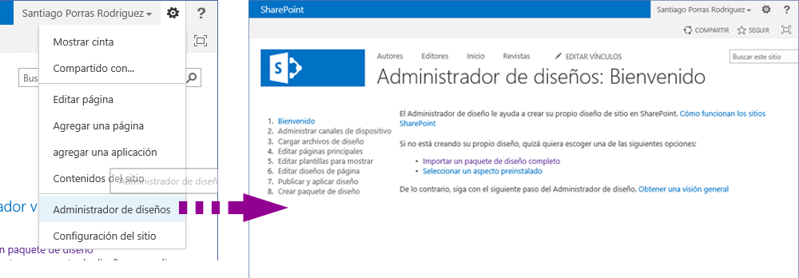

En nuestro caso, debemos empezar por cargar la plantilla HTML que hemos creado, para lo que al seleccionar la opción *Cargar archivos de diseño*, SharePoint nos ofrece una dirección que debemos abrir con un explorador de archivos (recomendado que se establezca como unidad de red), donde podremos ubicar la plantilla que generamos en el paso anterior.

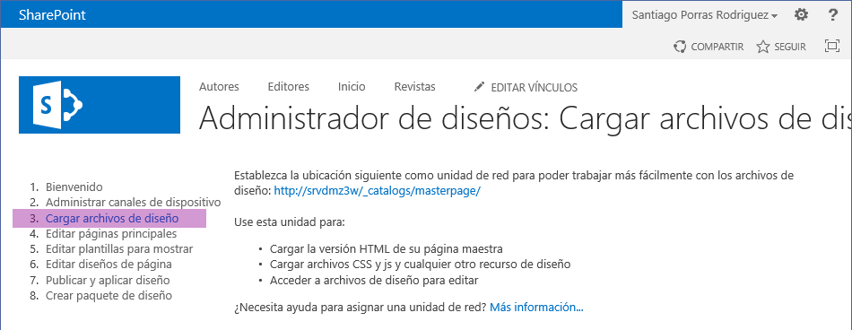

Tan solo tendríamos que copiar la estructura de directorios (completa), que os propuse en el paso anterior, dentro de la carpeta *nombre-servidor/\_catalogs/masterpage* para tener la Página Maestra creada.

***NOTA****: Esta acción generará un archivo .master con el nombre del fichero HTML de la plantilla que se regenerará cada vez que modifiquemos el fichero .html.*

***IMPORTANTE****: A partir de ahora, trabajaremos con los ficheros copiados y no los originales, es decir, debemos conectar nuestro programa de edición web a la estructura de directorios de SharePoint.*

**Completar página maestra con Design Manager y programa de edición web**

Llegados a este punto, ya tenemos creada nuestra *Página Maestra* sin haber hecho más esfuerzos que podremos centrar en agregar los elementos de SharePoint que necesitamos, tales como el menú.

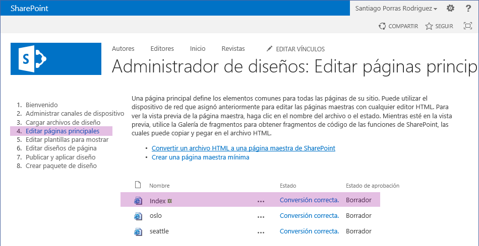

Como podéis comprobar en la imagen, aparece una nueva Página Maestra llamada *index* que se corresponde con la que acabo de crear. Si seguisteis mi recomendación de ponerle el nombre del proyecto al archivo HTML de la plantilla, os saldría en este caso una Página Maestra con el nombre del proyecto.

Ahora debemos proceder a añadir los elementos de SharePoint que necesitamos, tales como el menú. Para ello, desde la opción *Editar páginas principales*, sólo tenemos que seleccionar la Página Maestra que acabamos de crear, lo que nos llevará a la página de vista previa de la misma.

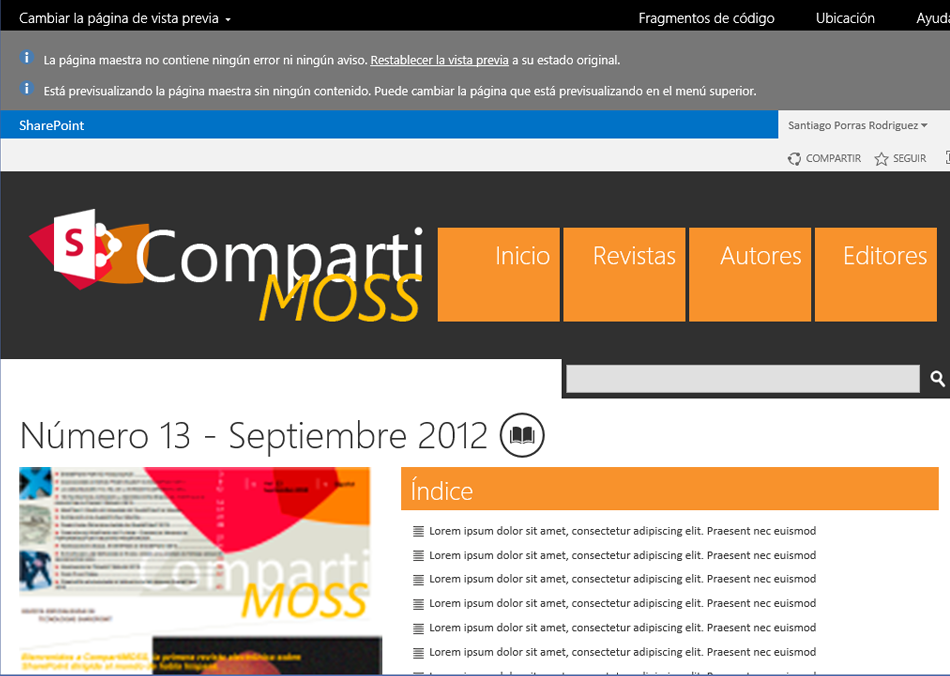

Desde está página podremos seleccionar la opción *Fragmentos de código* que nos permitirá generar el código necesario para cada uno de los elementos que necesitemos insertar en nuestra Página Maestra. *Menú de navegación, título, logotipo*, etc. pueden ser *generados desde aquí* y, posteriormente *copiados a nuestra plantilla HTML*.

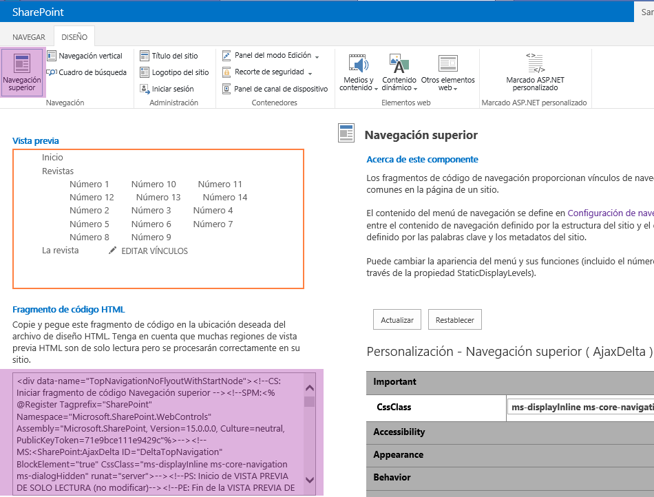

Como se puede ver en la imagen, si se selecciona uno de los elementos que aparecen en la Cinta, se podrá ver debajo una vista previa, el Fragmento de código HTML generado y, en la derecha de la página, una zona para definir las propiedades del elemento al estilo de Visual Studio.

Para la Página Maestra de CompartiMOSS se ha hecho uso de los siguientes elementos:

- Navegación superior.
- Cuadro de búsqueda.
- Logotipo del sitio.

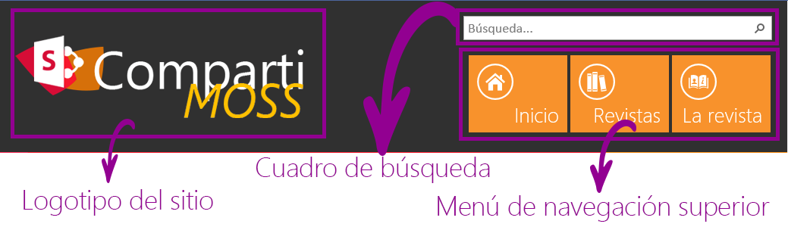

Estos elementos se han de insertar en el fichero HTML de nuestra plantilla, pero como avisé anteriormente, deben ser hechos en la plantilla que hemos copiado dentro de la carpeta *\_catalog/masterpages*. Al guardar los cambios en este fichero HTML, automáticamente se regenerará el fichero *.master* que es realmente la Página Maestra que podrá usar SharePoint.

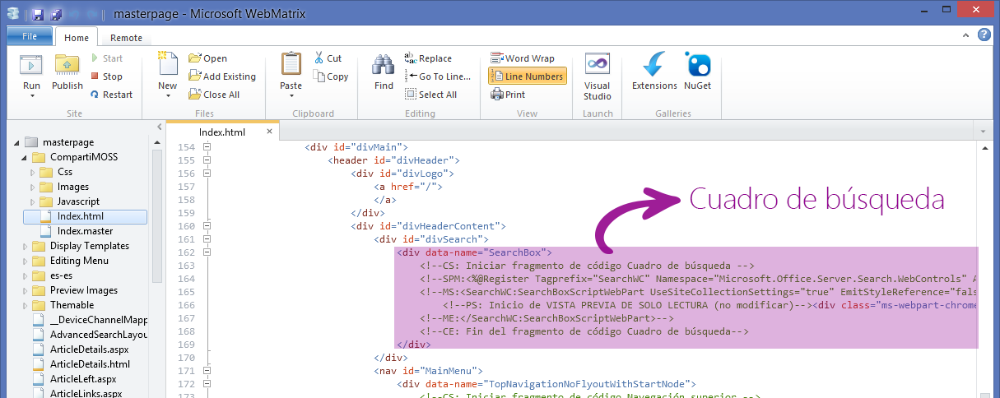

Una vez hayamos completado la Página Maestra con los elementos de SharePoint vamos a publicarla y aplicarla a nuestro sitio por medio de la opción *Publicar y aplicar diseño* desde el Administrador de diseños.

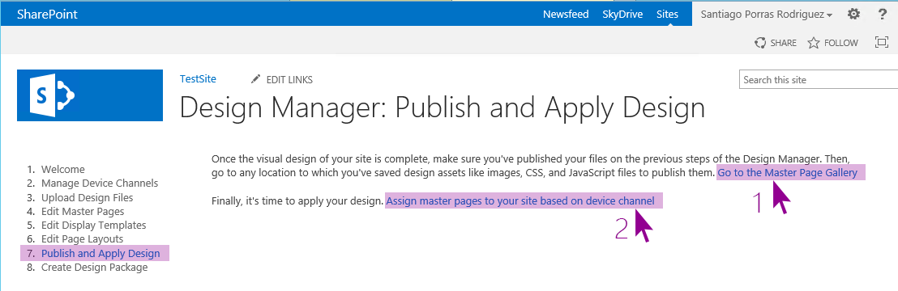

Publicarla significa publicar todos y cada uno de los elementos que componen nuestra plantilla HTML, esto es, archivos html, hojas de estilo, imágenes y scripts. Para ello, seleccionando el vínculo marcado como 1 en la imagen anterior, llegaremos a la página de *Páginas maestras y diseños de página* a la que también podemos llegar desde *Configuración de sitio*. Una vez aquí deberemos ir publicando todos los elementos.

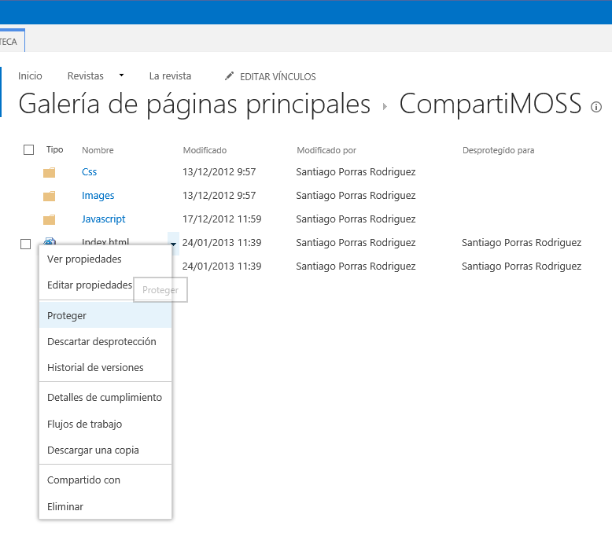

Ahora que tenemos todo publicado, sí que podemos aplicar la Página Maestra a nuestro sitio, acción que podemos lograr seleccionando el vínculo marcado como 2 en la imagen de la opción *Publicar y aplicar diseño*.

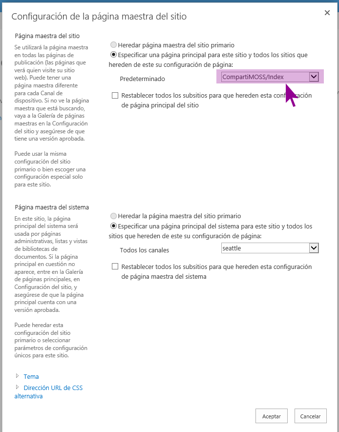

Finalmente, ya tenemos aplicada la Página maestra como podréis comprobar y estamos un paso más cerca del resultado final que completaremos en un *próximo artículo* donde trataremos los *diseños de página*y las *plantillas de elementos de contenido*.

**Santiago J. Porras Rodríguez**

UX Developer

[http://geeks.ms/blogs/santypr](http://geeks.ms/blogs/santypr)

@saintwukong

