Cuando nos encontramos ante esta necesidad de crear una vista con cierto look & feel diferente de los elementos de una lista generalmente terminamos utilizando SharePoint Designer 2010, lo que nos resuelve el requerimiento de "ese sitio" de "tal servidor", voy a mencionar 2 problemas que es bastante común que se nos puedan presentar:

Problema conocido 1:

Cuando aprueban el comportamiento de la personaliación en desarrollo y dan el OK para el pasaje al ambiente de QA: ¿Qué hacemos? ¿Repetimos todo desde cero de nuevo?

Problema conocido 2:

La customización está en un sitio que se migrará haciendo un "export". El efecto que causa esta metodología es que se recrean los ID de listas, elementos de lista, etc. Por lo que como nuestra customización está atada a cierto ListID que ya no existe, tendremos como resultado que el elemento web desapareció de nuestra página.

Solución a los problemas:

Para resolver el primer problema tenemos que pensar en que nuestra customización sea desplegable en otros ambientes. Para resolver el segundo problema nuestra customización NO tiene que depender del ListID sino del ListName.

Para solucionar estos problemas vamos a apoyarnos en el Visual Studio 2010 para que nuestra solución sea deployable y configurable a través del ListName.

**Paso a Paso**

A modo de ejemplo, personalizaremos una vista que se muestre en 4 columnas.

Paso 1:

Con SharePoint Designer insertamos en una página un Data View, configuramos el Data Source y el campo a mostrar. Para este ejemplo, insertamos un **Empty Data View**, seleccionamos una lista de tipo "Links" llamada Topics como Data Source y mostramos la columna correspondiente a la URL.

Paso 2:

Cambiar el diseño de la vista a la vista 2 columnas: "Two columns repeating form with border" como primer paso.

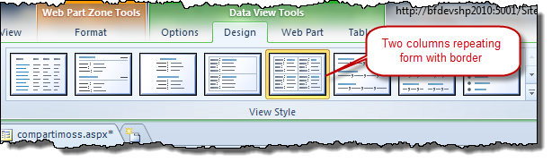

Paso 3:

Para visualizar el contenido en 4 columnas:

> a. Buscar las líneas y reemplazar el valor "50%" por "25%" como muestra el código de ejemplo:

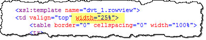

> b. Para cambiar a 4 columnas, buscamos en el código de la página las líneas que contienen “mod 2”, como muestra la imagen, y lo reemplazamos por “mod 4”.

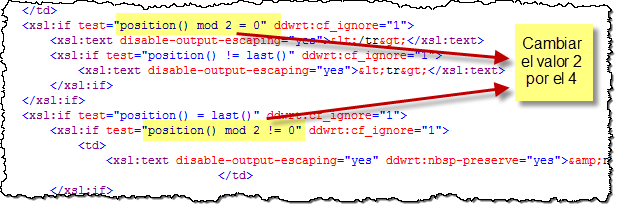

Paso 4:

Una vez que terminamos de editar el Data View y modificar el look & feel del mismo, guardamos los cambios y visualizamos los resultados en el browser.

Si el resultado es el esperado entonces estamos listos para exportar el elemento web y guardar el archivo ".webpart" generado.

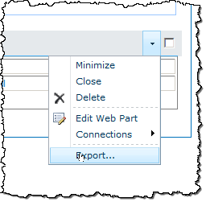

Paso 5

Ya estamos listos para realizar las modificaciones al Data View y hacerlo desplegable a otro ambiente donde reconozca la lista del origen de datos. Ejecutamos el Visual Studio 2010 como **Administrador** (**Nota:** Cuando se requiere depurar un desarrollo contra un sitio de SharePoint, es necesario iniciar el IDE con un usuario Administrador).

Creamos un nuevo proyecto del tipo "Empty SharePoint Project" y elegimos la opción "deploy as a farm solution".

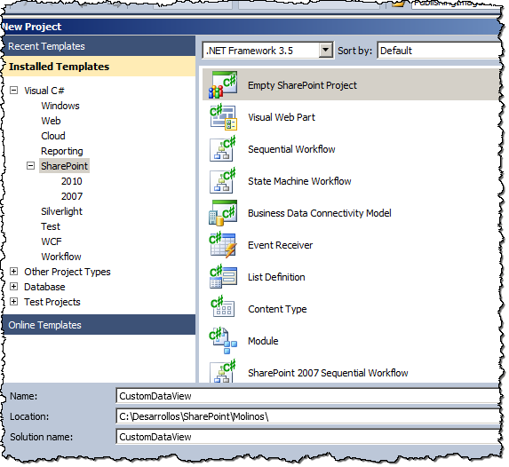

Paso 6

Agregamos un nuevo ítem al proyecto y seleccionamos el tipo Web Part, le damos un nombre en mi ejemplo, "myCustomDataView," y luego hacemos clic en el botón "Add"

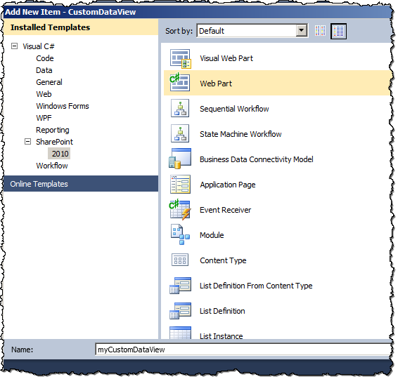

Una vez agregado, eliminamos el archivo “myCustomDataView.cs” del proyecto

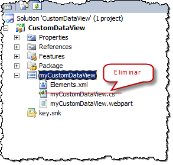

Paso 7

Buscamos el archivo ".webpart" que exportamos en el  Paso 4, copiamos el contenido y lo pegamos en el archivo de nuestro proyecto "myCustomDataView.webpart".

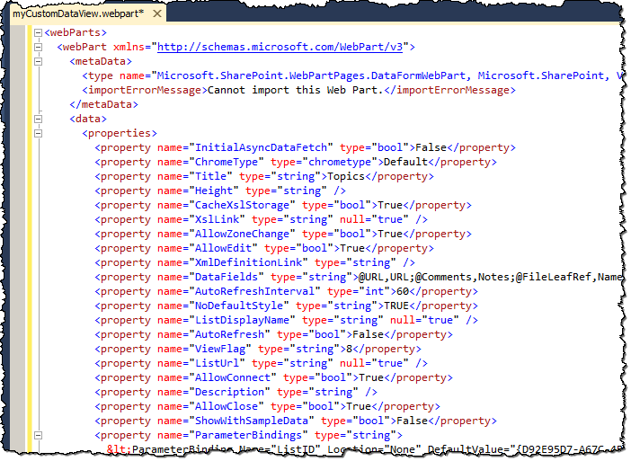

Paso 8:

Para que en el despliegue reconozca a la lista a través de su nombre y no de su ID lo que tenemos que hacer ciertas modificaciones en las propiedades y en el código xsl generado por el SharePoint Designer.

> a. Buscar la línea donde aparece la siguiente propiedad ListDisplayName

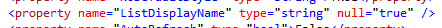

> b. Y cambiarla a:

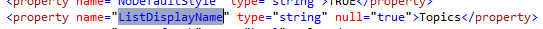

> c. En la propiedad ListName, cambiar el ID de la lista por el nombre de la Lista:

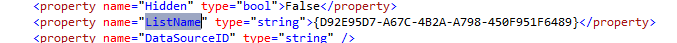

> d. Cambiar el ParameterBinding “ListID” como se muestra abajo, por el valor “ListName” y completar el DefaultValue con el nombre de la lista:

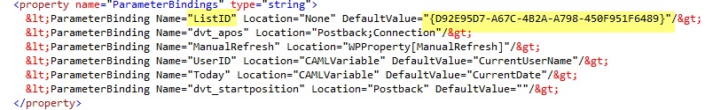

> e. Eliminar la línea:

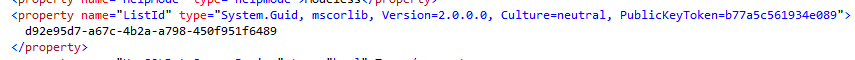

> f.  Reemplazar cada ListID por ListName y el ID por el nombre de la lista respectivamente dentro de la propiedad DataSourcesString:

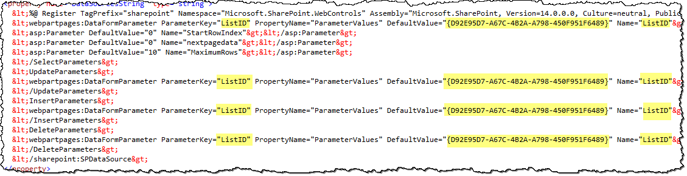

Paso 9:

Una vez realizados los cambios, le damos una descripción apropiada al Web Part para que se muestre al usuario, al feature correspondiente y hacemos el despliegue de la solución para probar.

Cómo lo reusamos:

Si tenemos una lista de links que queremos mostrar con ese mismo look & feel podemos reusar el elemento web. Simplemente, lo agregamos a nuestra página, editamos el elemento web, hacemos clic en el botón "Parameter Editor…"  y cuando se abra la ventana modal editamos y modificamos el valor del ListName existente por el nombre de la lista de links que queremos visualizar.

Aceptamos los cambios y veremos la nueva lista de links con el mismo diseño que se creó para la lista de links inicial.

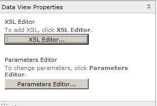

Resumiendo, usamos el SharePoint Designer una vez, customizamos el look & feel de cómo se verá la lista en la página, exportamos el xsl del webpart y lo agregamos a un nuevo proyecto en Visual Studio para eliminar toda referencia al ID de la lista y que ésta se referencie a través de su nombre.
 
**Silvina Andrea Pizzarulli**
Especialista SharePoint en Baufest
[http://silvinapizzarulli.blogspot.com](http://silvinapizzarulli.blogspot.com/)

