​SharePoint a lo largo de su historia ha ido añadiendo funcionalidades nuevas, concretamente con cada nueva versión se añaden aquellas funcionalidades que, previo estudio por parte del equipo de producto, creen que tienen más sentido de acuerdo a las necesidades actuales. Y es cierto, que actualmente las tendencias tecnológicas y de mayor adopción son los servicios web, HTML5, JavaScript, AJAX, REST/Odata, Mapas, y todo lo referente a que el procesamiento quede cada vez más del lado de "la nube". Tenemos que tener constancia de la importancia a nivel de desarrollo que están adquiriendo estos conceptos a lo largo de toda la plataforma Microsoft: Windows 8 tiene nueva API basada en JavaScript y permite desarrollar Apps con HTML5, CSS3 y JavaScript; Office y SharePoint 2013 entran en el modelo de "Marketplace" proporcionando las tecnologías citadas como medio de desarrollo de las Apps; y sin dejar de lado que estos lenguajes de desarrollo son multiplataforma y soportado por todos los sistemas operativos del momento. Con todo esto, quiero concientizar a los desarrolladores de la importancia que va adquiriendo lo que hasta ahora era el desarrollo web. Y de la importancia de los servicios externos como puede ser poner en nuestras aplicaciones un mapa de Bing o Google.

Este artículo se va a dividir en dos partes: primero explicaremos a nivel conceptual el nuevo tipo de columna de SharePoint que permite almacenar valores espaciales; y después veremos cómo añadir un nuevo tipo de campo modificando su representación gráfica con HTML y JavaScript, característica nueva en SharePoint 2013, que se ha nombrado "client-side rendering" (a lo que le doy la traducción de representación del lado del cliente).

Geolocalización en SharePoint 2013

En SharePoint 2013 tenemos de forma nativa un tipo de columna (field type) para la geolocalización. Concretamente en un campo de tipo Geolocation podemos introducir coordenadas como valores decimales, tanto para la latitud como longitud, aunque también podemos configurarlo de modo que obtenga las coordenadas del usuario actual directamente desde el navegador (siempre que implemente la API W3C de Geolocalización).

Este tipo de campo nuevo se implementa en SharePoint 2013 en sus dos capas:

- Almacenamiento de coordenadas. La forma en la que SharePoint almacena la información de las coordenadas es a través de un tipo de columna nuevo y esto a nivel de SQL Server queda representado con los nuevos tipos de datos geometry, geography y hierarchy ID, que requieren tener instalado SQLSysClrTypes.msi en el servidor de SQL Server. Para descargarlo, podemos usar este paquete: [Microsoft® SQL Server® 2008 R2 SP1 Feature Pack](http&#58;//www.microsoft.com/en-us/download/details.aspx?id=26728) [1].
- Representación gráfica de mapas: En cuanto a la representación gráfica de los puntos geográficos, SharePoint 2013 utiliza los mapas de Bing, concretamente "Bing Maps Ajax control V7". Además de representarse el mapa en la propiedad en sí, también tenemos un nuevo tipo de vista que es de tipo Mapa.

Esto es la teoría, pero ahora, ¿cómo hacemos para crear este campo en SharePoint?

Lo primero que tenemos que hacer es activar y configurar la clave de Bing Maps para que se enlace nuestro SharePoint con algunos credenciales aptos para usar el API de Bing. Para obtener tu clave de Bing Maps, puedes entrar en esta dirección [http://bingmapsportal.com](http&#58;//bingmapsportal.com/) [2], requiere registro con un Live ID y la creación de una clave donde te pedirán la URL de tu aplicación donde vas a utilizar el mapa. Una vez tengamos activado esto a nivel de granja (en SharePoint OnPremise) o a nivel de sitio / colección de sitios (en SharePoint Online 2013), el siguiente paso es crear un campo de tipo Geolocation en cualquier lista que lo requiera. Como en todo, siempre hay varias formas de hacer lo mismo, a continuación veremos cómo hacer todos estos pasos de varias formas tanto para SharePoint 2013 OnPremise como para SharePoint 2013 Online, que como bien sabemos lo lanzaron dentro del paquete [Office 365](http&#58;//office.microsoft.com/) [3] el pasado 27 de Febrero de 2013.

Configurar la clave de Bing Maps en SharePoint 2013

Tal como comentaba, para habilitar el mapa de Bing en nuestra granja de SharePoint 2013, debemos establecer la "clave" de Bing Maps o bien mediante modelo de objetos cliente o bien mediante PowerShell:

Set-SPBingMapsKey –BingKey "&lt;clave de Bing Maps&gt;"

No obstante, si nuestro SharePoint 2013 es Online, es decir, pertenece a un Office 365, no podremos activar la clave de Bing con este método y tendremos que ejecutar un programa de consola que acceda a la propiedad

Uri oUri = new Uri("&lt;url&gt;");

MsOnlineClaimsHelper claimsHelper = new MsOnlineClaimsHelper(oUri, "&lt;id&gt;", "&lt;password&gt;");

using (ClientContext context = new ClientContext(oUri))

{

context.ExecutingWebRequest += claimsHelper.clientContext\_ExecutingWebRequest;

Web web = context.Web;

web.AllProperties["BING\_MAPS\_KEY"] = "&lt;clave&gt;";

web.Update();

context.ExecuteQuery();

}

Para ver más detalles sobre configurar la clave de Bing en SharePoint Online, véase el post de [Sundar Narasiman](http&#58;//msmvps.com/blogs/sundar_narasiman/archive/2012/11/22/how-to-add-geolocation-fields-to-sharepoint-2013-site.aspx) [4]. Además con el fin de facilitar la tarea adjunto el código que me he montado para probar esta asignación de clave en SharePoint 2013 Online. Lo podéis descargar desde el vínculo dado en la referencia [5]. ([ConfigurarClaveBingSharePointOnline.zip](http&#58;//blogs.solidq.com/sharepoint/Documents/ConfigurarClaveBingSharePointOnline.zip)).

Una vez que tenemos configurada la clave el siguiente paso es crear la columna de tipo GeoLocation.

Añadir Campo de tipo GeoLocation en SharePoint 2013

La mala noticia es que no se puede añadir este tipo de campo desde la interfaz gráfica de SharePoint 2013. Por el contrario si se podrá añadir mediante código, por lo que la forma más rápida y común usada por un desarrollador es arremangarse y decir, ¡lo tengo!, esto es una aplicación de consola J. Entonces abrimos Visual Studio 2012 (por supuesto, la última versión) y añadimos este sencillo código en un proyecto de tipo "Console Application":

class Program

{

static void Main(string[] args)

{

AddGeolocationField();

Console.WriteLine("Location field added successfully");

}

private static void AddGeolocationField()

{

// Reemplazar la url y los nombres de lista y columna.

ClientContext context = new ClientContext("http://sitio");

List oList = context.Web.Lists.GetByTitle("Lista");

oList.Fields.AddFieldAsXml("&lt;Field Type='Geolocation' DisplayName='Columna'/&gt;", true, AddFieldOptions.AddToAllContentTypes);

oList.Update();

context.ExecuteQuery();

}

}

Pero claro, ahora nos queda la duda de si cada vez que queramos crear un campo de este tipo vamos a tener a mano este programa para ejecutarlo, además de la duda de si este código va a funcionar bien en SharePoint Online o no. Entonces es cuando pasamos a la segunda fase de superación y decidimos hacer la creación de esta columna con modelo de objetos cliente, pero de JavaScript con toda la idea de poner esto en una página web (con un Content Editor o un Code Embed) y ya tenemos una página desde la cual crear este tipo de columnas.

Veamos como ejemplo la creación de esta página en un SharePoint 2013 Online:

- Creamos una nueva página en nuestro sitio:

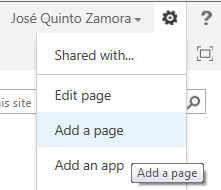

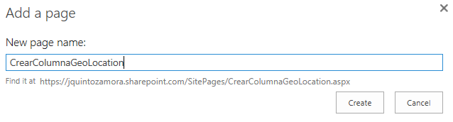

- Editamos la página y le insertamos un código embebido:

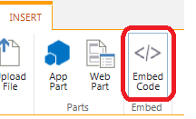

- Copiamos este código

&lt;script type="text/javascript"&gt;

var contexto;

function CrearColumna()

{

var nombreLista = document.getElementById('nombreLista').value;

var nombreColumna = document.getElementById('nombreColumna').value;

contexto = new SP.ClientContext.get\_current();

var lista = contexto.get\_web().get\_lists().getByTitle(nombreLista);

contexto.load(lista);

this.newField = lista.get\_fields().addFieldAsXml(

"&lt;Field Type='Geolocation' DisplayName='" + nombreColumna + "'/&gt;",

true,

SP.AddFieldOptions.defaultValue

);

lista.update();

contexto.executeQueryAsync(Function.createDelegate(this, this.CreadaCorrectamente),Function.createDelegate(this, this.ErrorAlCrear));

}

function CreadaCorrectamente()

{

alert('Columna GeoLocation creada.');

}

function ErrorAlCrear(sender, args)

{

alert('Error: ' + args.get\_message() + '\n' + args.get\_stackTrace());

}

&lt;/script&gt;

&lt;div&gt;

&lt;div&gt;Crear columna de tipo GeoLocation:&lt;/div&gt;

&lt;span&gt;Nombre de Lista: &lt;/span&gt;&lt;input type="text" value="" id="nombreLista" /&gt;

&lt;span&gt;Nombre de Columna: &lt;/span&gt;&lt;input type="text" value="" id="nombreColumna" /&gt;

&lt;input type="button" value="CrearColumna" onClick="CrearColumna();" /&gt;

&lt;/div&gt;

- Click en Insert
- Guardamos la página y ya tenemos algo parecido a esto:

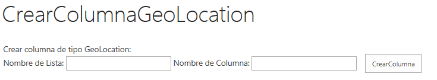

Desde donde podemos indicar el nombre de la lista y de la columna a crear para hacer lo propio. Debemos de tener en cuenta que existe un límite de 2 columnas de tipo GeoLocation por lista, por lo que si intentamos crear más de dos nos dará un mensaje de error parecido a este:

*"There are too many columns of the specified data type. Please delete some other columns first. Note that some column types like numbers and currency use the same data type".*

Una vez tenemos el campo añadido en nuestra lista, solamente nos queda saber cómo utilizarlo.

**Añadiendo coordenadas a listas de SharePoint 2013 y viéndolas en mapas**

Hasta ahora, hemos creado una lista y le hemos añadido una columna de tipo GeoLocation. Ahora si vamos a añadir un nuevo elemento en esta lista veremos como la columna de coordenadas se representa así:

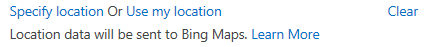

Desde donde podremos o bien introducir unas coordenadas o bien utilizar las nuestras actuales (que se obtienen desde el navegador). Para especificar nuevas coordenadas podemos utilizar Bing Maps por ejemplo, ya que poniendo el nombre de un lugar nos saca automáticamente sus coordenadas, fijaos cuando busco el pueblo donde vivo (Albatera):

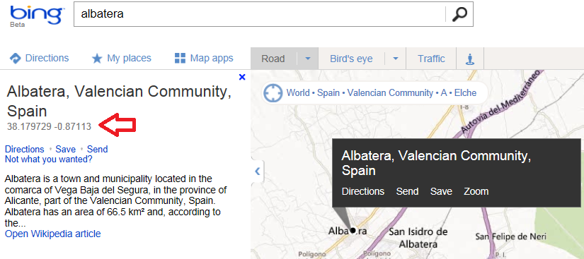

Si pongo las coordenadas:

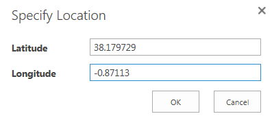

Vemos como SharePoint automáticamente nos representa este punto en el mapa:

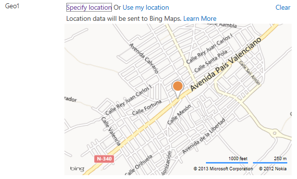

Además si guardo el elemento y voy a la vista de todos los elementos de la lista, veré como se representa el tipo de columna con un nuevo icono, que cuando lo clicas, se abre el mapa:

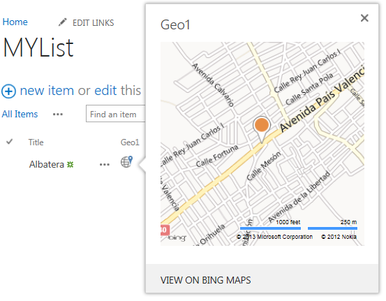

¿A qué esta guapo?

Pues aún hay más, y es que imaginar el escenario en que tenemos una lista de puntos de interés, y en cada punto de interés decidimos guardar una coordenada. Está claro que tarde o temprano vamos a querer ver un mapa y todos estos puntos representado en él. Pues para esto hay una tipo de vista nueva, que se llama "Mapa" y si creamos esta vista sobre una lista que contiene columna de tipo GeoLocation, nos representará en el mapa todos los puntos:

- Creamos la vista:

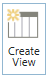

- De tipo Map View:

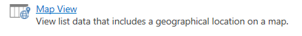

- Y aquí tenemos nuestros puntos de interés:

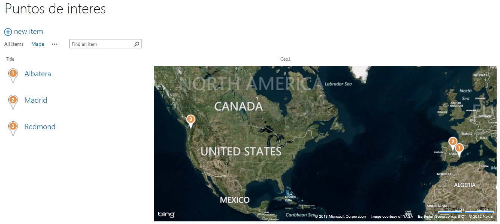

Esta forma en la que se representan los mapas, se puede cambiar mediante código JavaScript, es más, se puede implementar para que estos campos se representen en mapas de Google o de Nokia. Esta parte es la referida a "client-side rendering" que la abordaremos en la segunda parte del artículo.

**Referencias**

[1]          Microsoft® SQL Server® 2008 R2 SP1 Feature Pack: [http://www.microsoft.com/en-us/download/details.aspx?id=26728](http&#58;//www.microsoft.com/en-us/download/details.aspx?id=26728)

[2]          Registrarse y obtener clave de Bing Maps: [http://bingmapsportal.com](http&#58;//bingmapsportal.com/)

[3]          Office 365: [http://office.microsoft.com](http&#58;//office.microsoft.com/)

[4]          How to add geolocation fields to SharePoint 2013 site: [http://msmvps.com/blogs/sundar\_narasiman/archive/2012/11/22/how-to-add-geolocation-fields-to-sharepoint-2013-site.aspx](http&#58;//msmvps.com/blogs/sundar_narasiman/archive/2012/11/22/how-to-add-geolocation-fields-to-sharepoint-2013-site.aspx)

[5]          Office 365 - SharePoint 2013 Online. Establecer clave de Bing Maps para el campo de tipo Geolocation: [http://bit.ly/BingMapsSharePointOnline](http&#58;//bit.ly/BingMapsSharePointOnline)

[6]          eBook Gratuito de SharePoint 2013 Apps: [http://bit.ly/SharePoint2013AppsEbook](http&#58;//bit.ly/SharePoint2013AppsEbook)

**José Quinto Zamora**

MCPD y MCITP en SharePoint 2010

[jquinto@solidq.com](mailto&#58;jquinto@solidq.com)

@jquintozamora

[http://blogs.solidq.com/sharepoint](http&#58;//blogs.solidq.com/sharepoint)

