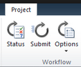
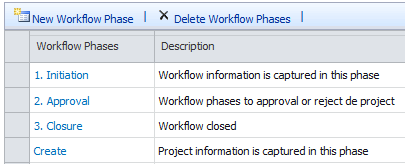
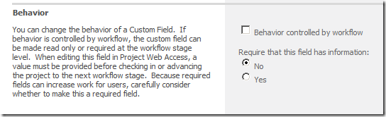

​ En este breve artículo voy a resumir algunas lecciones aprendidas en un proyecto de implementación de flujo de trabajo en Project Server 2010. A pesar de que estos proyectos deben desarrollarse en Visual Studio (excepto que usen Nintex), no voy a centrar el artículo en cuestiones técnicas, sino en aspectos funcionales y de arquitectura. Esto se debe a que muchas veces no sabemos cuál es el mejor enfoque para resolver un problema en esta tecnología, debido fundamentalmente a la falta de información. A continuación, mis experiencias en casos reales, que intentan poner un granito más de arena a este mundo, en donde una búsqueda en Google arroja tan pocos resultados que nos hace sentir cierto temor.

Introducción

La funcionalidad de flujos de trabajo en Project Server se utiliza muchas veces para manejar el proceso de aprobación de los proyectos antes de su ejecución. Si bien la arquitectura de flujos de trabajo de Project Server está montada sobre la de SharePoint, posee muchos aspectos propietarios que nos dirigen con mucha fuerza hacia un formato de solución. Estos lineamientos principales se pueden resumir en los siguientes puntos:

- A través de configuración se define un conjunto de fases y etapas que constituyen los pasos de nuestro flujo de trabajo. Las etapas son importantes porque pueden definir detalles como la obligatoriedad de los campos de empresa o la posibilidad de definirlos como sólo lectura. También pueden definir qué páginas de empresa pueden estar visibles. Y por último no debe olvidarse que servirán de filtros en nuestras vistas de Project Server.
- La arquitectura de las PDPs nos permite crear páginas de SharePoint que se muestran dentro del contexto de uno o varias etapas de nuestro flujo de trabajo. Al ser páginas de SharePoint, nos permiten agregar cualquier tipo de elemento web, no es necesario usar elementos web exclusivos de Project Server. Esto nos brinda una posibilidad enorme de extender nuestros flujos de trabajo, con configuración y/o desarrollo.
- Por último, los campos de empresa clásicos de Project Server, forman parte del corazón del flujo de trabajo. Constituyen la manera más sencilla de capturar información en cada uno de los pasos. Pero no es la única forma y tiene algunas limitaciones.

Lección 1) Maestro detalle

Es casi imposible escaparle a este requerimiento. En algún momento vamos a necesitar que en alguno de los pasos se cargue o visualice información de detalle. Ejemplos: productos, documentos, notas, etc. La forma más sencilla que se puede utilizar es creando una PDP que contenga varios elementos web: un elemento de la lista de SharePoint en donde guardaremos el detalle; un elemento de formulario InfoPath que sirva para crear elementos de detalle asociados al maestro (el proyecto); y un elemento de filtro de URL para pasar el dato de ID del Proyecto a los otros elementos web. Este esquema no requiere programación y es muy potente. Y puede ser mejorado con Client Object Model.

Más información en: [http://surpoint.blogspot.com/2012/12/workflow-en-project-server-2010-como.html](http://surpoint.blogspot.com/2012/12/workflow-en-project-server-2010-como.html)

Lección 2) Valores predeterminados en campos de empresa

Con el uso de las pdps y toda su estructura para manejo de campos de empresa, seguramente necesitarás completar valores predeterminados en los campos e incluso ocultarlos. Esta característica no funciona como se espera con las opciones fuera de la caja, en particular con la configuración del valor predeterminado del campo en la configuración de  Project Server. Sin embargo, siempre es posible usar algo de código jQuery para ayudar. La siguiente porción de código, que pueden incluir en una CEWP muestra cómo resolver esta problemática:

$('input[title="'+id\_campo+'"]').attr("value",texto\_valor);

$('input[title="'+id\_campo+'"]').attr("LTValue",guid\_valor);

$('input[title="'+id\_campo+'"]').parent().parent().parent().parent().parent().parent().css("display","none");

Más información en: [http://surpoint.blogspot.com/2013/01/workflow-en-project-server-2010-valores.html](http://surpoint.blogspot.com/2013/01/workflow-en-project-server-2010-valores.html)

Lección 3) Manejo de rechazos en un paso del flujo de trabajo

Manejar vuelta a pasos anteriores siempre es algo complicado en un flujo de trabajo. Un requerimiento muy común, es que ante un rechazo, se pueda modificar la información y relanzar el proceso. Una forma sencilla de resolver esto en Project Server es:

- Asignar tareas a los distintos aprobadores, en la que puedan elegir entre Aprobar o Rechazar.
- Ante una aprobación, pasar a la siguiente etapa.
- Ante un rechazo terminar el flujo de trabajo.
- Si el iniciador quiere volver a iniciar el proceso, deberá hacer uso de la opción Restar Workflow, para lo cual habrá que haberle asignado el permiso correspondiente.
- Lo bueno es que la información de campos de empresa no se pierde, así que sólo debe modificar lo que cambió.

Una posible mejora es crear una lista en SharePoint que muestre un log de aprobaciones y rechazos histórico, para que el usuario pueda conocer en cada caso las razones de los rechazos.

Lección 4) Asignación de tareas basada en roles

Un requerimiento típico es que las tareas de aprobación de cada paso deban ser asignadas a diferentes personas, dependiendo de una condición, basada en algún campo completado en algún paso. Una forma de resolver esto es crear una lista en SharePoint que maneje las reglas de asignación. El usuario configura en esta lista la regla, por ejemplo: "cuando el país es Argentina y el sector es Marketing, entonces el grupo de asignación es Gerentes de Marketing de Argentina."

Internamente, el flujo de trabajo consulta la lista con el fin de obtener el grupo de asignación para cierta condición. Ese grupo, no es más que un grupo de SharePoint que puede incluir uno o varios miembros. Cuando el flujo de trabajo asigna la tarea al grupo, SharePoint envía el mail en forma automática. Este tipo de reglas le dan enorme flexibilidad al flujo de trabajo.

Lección 5) Visibilidad de PDPs

Project Server nos permite definir qué PDP puede estar visible en cada etapa del flujo de trabajo. Esto nos da mucho  poder con poco esfuerzo. A continuación enumero sólo algunos ejemplos, como para entender el alcance funcional:

- Diferentes campos de empresa en cada etapa.
- Habilitar la PDP de Schedule sólo a partir de una determinada etapa.
- Mostrar información de una lista de SharePoint de forma distinta en diferentes etapas. Por ejemplo con opciones de creación y edición en una etapa, y con opciones de sólo lectura en otras etapas.
- Diferentes páginas de estado en diferentes etapas.

Estos fueron sólo algunos ejemplos y nunca debemos olvidar la innumerable cantidad de opciones que tenemos al poder personalizarlas con diferentes elementos:

- Varios elementos web de Project Fields, que nos permiten agrupar la información.
- InfoPath.
- SQL Reporting Services.
- Listas de SharePoint.
- CEWP (WebPart de editor de contenido) con código JavaScript y con Client Object Model.
- Librearías de documentos.
- Estado visual del flujo de trabajo.
- Elementos de filtro por URL.
- Etc.

Más información en:

- Fases y etapas: [http://surpoint.blogspot.com/2012/11/workflow-en-project-server-2010-como\_3147.html](http://surpoint.blogspot.com/2012/11/workflow-en-project-server-2010-como_3147.html)
- PDPs: [http://surpoint.blogspot.com/2012/11/workflow-en-project-server-2010-como.html](http://surpoint.blogspot.com/2012/11/workflow-en-project-server-2010-como.html)
- PDP de estado: [http://surpoint.blogspot.com/2012/11/workflow-en-project-server-2010-como\_30.html](http://surpoint.blogspot.com/2012/11/workflow-en-project-server-2010-como_30.html)

Lección 6) Sobre el uso de campos de empresa

Los campos de empresa constituyen la alternativa natural para capturar información en un flujo de trabajo.

Esto está muy bien y es recomendable, pero conviene tener en cuenta algunas cuestiones:

- La cantidad de campos puede afectar el rendimiento de Project  Server. De hecho es una de las variables para realizar un dimensionamiento de la arquitectura.
- Los campos aparecen en Project Pro y la única forma de no mostrarlos es usando la funcionalidad de departamentos.
- Modificar un campo desde un flujo de trabajo implica operaciones costosas como la desprotección y la protección del proyecto. Y lo más importante es que nadie verá los cambios hasta que no se publique el proyecto.
- Los campos de empresa no manejan información repetitiva como las relaciones maestro detalle.
- Los campos de empresa no tiene flexibilidad en el manejo de tipos de datos, ni permiten validaciones sofisticadas.

Es por ello que en algunos casos, la alternativa de usar listas de SharePoint nos permite soluciones más livianas y flexibles. Es absolutamente recomendable usar esta alternativa en muchas situaciones, no en todas por supuesto.

Lección 7) Seguridad

A diferencia de la mayoría de las implementaciones de Project Server, en donde la configuración estándar suele cubrir muchos requerimientos, cuando implementamos un flujo de trabajo, aparecen algunas necesidades que a continuación enumero:

- La necesidad de crear un grupo y una categoría para los iniciadores de flujos de trabajo. Este grupo no suele coincidir con los líderes de proyecto y puede necesitar permisos especiales, por ejemplo para reiniciar un flujo de trabajo.
- La necesidad de crear un grupo para los que aprueban pasos del flujo de trabajo.
- La necesidad de crear grupos en SharePoint para poder acceder a listas como la de tareas, pero también a listas especiales que hayamos creado para capturar información durante el proceso.
- Por último, es posible que necesitemos crear un grupo de administración de la configuración del flujo de trabajo.

Más información en: [http://surpoint.blogspot.com/2013/01/Workflow-ProjectServer-Seguridad.html](http://surpoint.blogspot.com/2013/01/Workflow-ProjectServer-Seguridad.html)

Conclusiones

En este breve artículo he intentado presentar algunas lecciones aprendidas en proyectos de gestión de la demanda en Project Server 2010. Lamentablemente es complicado encontrar suficiente información sobre este tema y a veces no es sencillo saber si estamos tomando la decisión correcta. Por ello este artículo: para compartir mi experiencia.

¿¿Y cuál ha sido tu experiencia???

¡Hasta la próxima!

**Juan Pablo Pussacq Laborde**

SharePoint MVP

Blog: [http://surpoint.blogspot.com/](http://surpoint.blogspot.com/)

Facebook: [http://facebook.com/surpointblog/](http://facebook.com/surpointblog/)

Twitter: [http://twitter.com/jpussacq/](http://twitter.com/jpussacq/)

