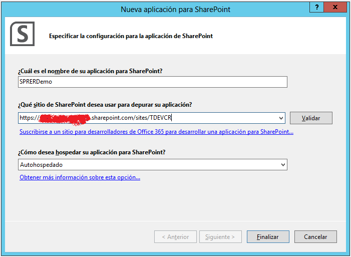
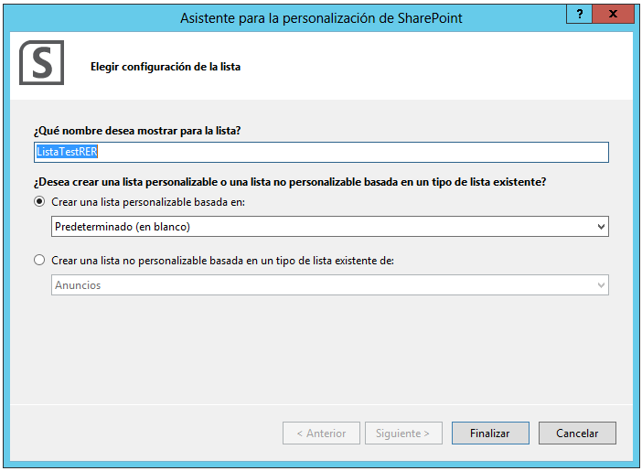
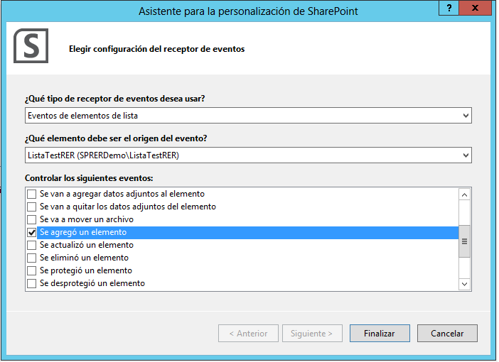
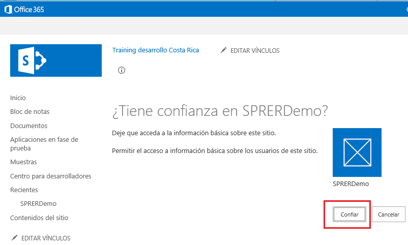
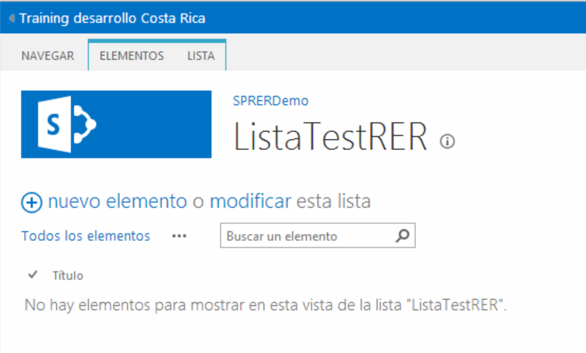
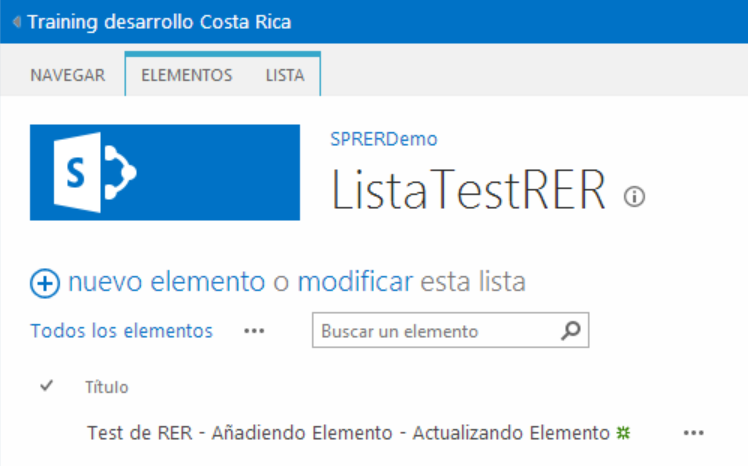

En este artículo vamos a ver cómo crear un manejador de eventos remoto que reaccione ante los cambios qué tengan lugar en una lista personalizada desplegada como parte de una aplicación del nuevo modelo de aplicaciones de SharePoint 2013.

**Creación del manejador de eventos remoto**

Para crear un manejador de eventos remoto que responda a eventos que suceden en los elementos de una lista personalizada, seguiremos los siguientes pasos:

- Iniciamos Visual Studio 2012 y creamos un proyecto de tipo "Aplicación para SharePoint 2013".

En el asistente de configuración especificamos el nombre de la aplicación, la Url que se va a utilizar para cuestiones de depuración y el tipo de aplicación. Como se aprecia en la Imagen 1, en este caso se están indicando una Url de un sitio de Office 365 y "Autohospedado" como tipo de aplicación.

- Una vez qué finaliza el asistente de configuración, el explorador de soluciones de Visual Studio 2012 muestra qué se ha creado una solución qué dispone de dos proyectos:
    - El proyecto de aplicación en sí mismo que permite genera un archivo ".app" qué posteriormente facilita la distribución de la aplicación.
    - Un proyecto de tipo web qué contiene la definición de la aplicación y en el que hay elementos como páginas, scripts JavaScript, hojas de estilo y clases auxiliares que facilitan la interactuación entre la aplicación y SharePoint.
- Creamos una lista de tipo personalizado en el contexto de la aplicación. Para ello, seleccionamos el proyecto de aplicación y añadimos un elemento de tipo "Lista". A continuación se inicia un nuevo asistente que nos guiará por el proceso de definición de la lista. Por simplicidad, creamos una lista de tipo personalizado (Imagen 2).

- Como resultado de la creación de la lista, por un lado se muestra el diseñador visual de listas de Visual Studio 2012. Por otro, en el proyecto de la aplicación se añade el correspondiente *SharePoint Project Item* (SPI) que contiene la definición de la lista y la correspondiente instancia.
- El siguiente elemento que vamos a añadir al proyecto de aplicación es manejador de eventos remoto utilizando la plantilla "Receptor de eventos remoto" disponible. Para configurar el manejador, se dispone de un asistente similar al ya conocido para manejadores de eventos "clásicos" qué permite configurar:
    - El tipo de receptor de eventos, siendo los valores posibles "Eventos web", "Eventos de lista" y "Eventos de elementos de lista".
    - Los eventos a controlar.

En nuestro caso, elegimos la opción "Eventos de lista" y marcamos como eventos a controlar los siguientes:

    - "Se va a agregar un elemento" y "Se va actualizar un elemento" (eventos síncronos).
    - "Se agregó un elemento" (evento asíncrono).

- Como resultado de la creación del manejador, por un lado se añade al proyecto web de la aplicación un servicio WCF en el que se tiene que implementar la lógica correspondiente. Por otro lado, en el proyecto de la aplicación se añade un SPI que contiene el archivo de manifiesto relativo al manejador. El Listado 1 muestra el contenido de dicho manifiesto. Como se puede apreciar, refleja los tipos de eventos a controlar y la Url dónde se registrará el servicio WCF qué contiene la lógica de procesado correspondiente en función del evento que se produzca en la lista.

&lt;?xml version="1.0" encoding="utf-8"?&gt;

&lt;Elements xmlns="http://schemas.microsoft.com/sharepoint/"&gt;

&lt;Receivers ListTemplateId="10000"&gt;

&lt;Receiver&gt;

&lt;Name&gt;CompartiMOSSRERItemAdding&lt;/Name&gt;

&lt;Type&gt;ItemAdding&lt;/Type&gt;

&lt;SequenceNumber&gt;10000&lt;/SequenceNumber&gt;

&lt;Url&gt;~remoteAppUrl/CompartiMOSSRER.svc&lt;/Url&gt;

&lt;/Receiver&gt;

&lt;Receiver&gt;

&lt;Name&gt;CompartiMOSSRERItemUpdating&lt;/Name&gt;

&lt;Type&gt;ItemUpdating&lt;/Type&gt;

&lt;SequenceNumber&gt;10000&lt;/SequenceNumber&gt;

&lt;Url&gt;~remoteAppUrl/CompartiMOSSRER.svc&lt;/Url&gt;

&lt;/Receiver&gt;

&lt;Receiver&gt;

&lt;Name&gt;CompartiMOSSRERItemAdded&lt;/Name&gt;

&lt;Type&gt;ItemAdded&lt;/Type&gt;

&lt;SequenceNumber&gt;10000&lt;/SequenceNumber&gt;

&lt;Url&gt;~remoteAppUrl/CompartiMOSSRER.svc&lt;/Url&gt;

&lt;/Receiver&gt;

&lt;/Receivers&gt;

&lt;/Elements&gt;

**Programación del manejador**

Una vez qué tenemos creados todos los elementos necesarios para evaluar el funcionamiento de los manejadores de eventos remotos, sólo resta codificar los métodos correspondientes en el servicio WCF:

- El servicio WCF consta de una clase que hereda de la interfaz **IRemoteEventService**. Esta interfaz define dos métodos decorados con el atributo **OperationContact** que son **ProcessEvent()** y **ProcesOneWayEvent()**. El primero de los eventos permite qué el servicio reaccione a eventos de tipo síncrono ("ing") ocurridos en el sitio. El segundo, garantiza respuesta por parte del manejador a eventos de naturaleza asíncrona ("ed").
- Por ejemplo, podemos codificar el método **ProcessEvent()** de acuerdo al Listado 2.

public SPRemoteEventResult ProcessEvent(SPRemoteEventProperties properties)

{

SPRemoteEventResult result = new SPRemoteEventResult();

switch (properties.EventType)

{

case SPRemoteEventType.ItemAdding:

result.ChangedItemProperties.Add(

"Title",

properties.ItemEventProperties.AfterProperties["Title"] +=

" - Añadiendo Elemento");

break;

case SPRemoteEventType.ItemUpdating:

result.ChangedItemProperties.Add(

"Title",

properties.ItemEventProperties.AfterProperties["Title"] +=

" - Actualizando Elemento");

break;

default:

break;

}

return result;

}

Como se puede apreciar, por una parte el objeto **properties** (de tipo **SPRemoteEventProperties**) contiene la información relativa al evento qué ha ocurrido (propiedad **EventType**). Por otra parte, para cada tipo de evento síncrono simplemente se accede a la columna **Title**(cuyo valor a cambiado) del elemento de la lista y se actualiza su valor concatenando una cadena de texto. Esto es posible gracias al objeto **result** que es de tipo **SPRemoteEventResult** lo que permite acceder a la(s) columna(s) cuyo valor ha(n) cambiado en el elemento y modificarlas a posteriori y antes de que se guarde el elemento en la lista.

- El Listado 3 muestra un ejemplo de codificación para el método **PorccessOneWayEvent()**:

public void ProcessOneWayEvent(SPRemoteEventProperties properties)

{

if (properties.EventType == SPRemoteEventType.ItemAdded)

{

using (ClientContext ctx = new ClientContext(

properties.ItemEventProperties.WebUrl))

{

List lList =

ctx.Web.Lists.GetByTitle(

properties.ItemEventProperties.ListTitle);

ctx.Load(lList);

ListItem liItem =

lList.GetItemById(

properties.ItemEventProperties.ListItemId);

ctx.Load(liItem);

ctx.ExecuteQuery();

liItem["Title"] +=

" - Elemento Añadido";

liItem.Update();

ctx.ExecuteQuery();

}

}

}

En este caso como se trata de procesar un evento síncrono, si queremos hacer algún tipo de operación con el elemento de la lista tendremos que acceder al mismo una vez añadido (para el caso de ejemplo). Como el acceso se realiza de forma remota desde un servicio WCF, tenemos que recurrir al modelo de objetos en cliente para poder recuperar el elemento y realizar el procesado requerido. De nuevo, el objeto **properties** nos da toda la información necesaria (a través de la propiedad **ItemEventProperties**) para poder crear instancias de objetos **ClientContext**, **List** y **ListItem**. Cada vez que necesitemos información del sitio de SharePoint, es necesario definir la operación a realizar y posteriormente llamar al método **ExecuteQuery** del objeto **ClientContext**creado.

**Despliegue y prueba del manejador**

El despliegue y prueba del manejador de eventos remotos para una aplicación de tipo "Autohosted" es realmente sencillo:

- En Visual Studio 2012, seleccionamos el nombre del proyecto de la aplicación, hacemos clic con el botón derecho del ratón y presionamos la opción "Implementar" de forma que se inicia el proceso de despliegue de la aplicación en el sitio de Office 365 configurado inicialmente. El proceso concluye ejecutando el explorador web donde tendremos que introducir las credenciales de acceso a Office 365.
- Una vez introducidas, se muestra la página de la Imagen 4 en la que se nos solicita confirmación para que la aplicación desplegada pueda acceder a información del sitio.

- Pulsamos el botón "Confiar", de manera que accedemos a la página principal de la aplicación. A partir de aquí, podemos comprobar por un lado qué el servicio WCF qué implementa la lógica del manejador se ha publicado de forma correcta y por otro que la lista de ejemplo está disponible para probar el manejador.
- Para verificar que el servicio se ha publicado correctamente, simplemente en la Url de la aplicación eliminamos todo el contenido innecesario y lo reemplazamos por el nombre del servicio WCF:

--Url de la aplicación

https://defe8b3e-8dbf-4afe-9ca2-274728027618.o365apps.net/Pages/Default.aspx?SPHostUrl=https%3A%2F%&lt;DominioOffice365&gt; %2Esharepoint%2Ecom%2Fsites%2FTDEVCR&SPLanguage=es%2DES&SPClientTag=0&SPProductNumber=15%2E0%2E4454%2E1011&SPAppWebUrl=https%3A%2F%2F&lt;DominioOffice365&gt;%2Dfe7f0e9d237f43%2Esharepoint%2Ecom%2Fsites%2FTDEVCR%2FSPRERDemo

--Url del servicio

https://defe8b3e-8dbf-4afe-9ca2-274728027618.o365apps.net/CompartimossRER.svc

- Para visualizar la lista (Imagen 5) y probar el manejador, modificamos la Url del sitio de Office 365 en el que se ha agregado la aplicación de la siguiente forma:

https://&lt;URL\_Sitio\_Office365&gt;/&lt;NombreAplicacion&gt;/Lists/&lt;NombreLista&gt;

Al introducir esta Url en el navegador, automáticamente se realiza una redirección a una Url de la forma:

https://&lt;DominioOffice365&gt;-fe7f0e9d237f43.sharepoint.com/sites/TDEVCR/SPRERDemo/Lists/ListaTestRER/AllItems.aspx

Como se puede deducir, el proceso de despliegue de la aplicación implica en este caso la creación de un subsitio en el qué se va a crea la instancia lista en base a la definición incluida en el proyecto. Adicionalmente, este sitio se encuentra en un dominio completamente aislado del sitio en el que agrego originalmente la aplicación.

​

- Finalmente, probamos que el manejador de eventos remotos está cumpliendo con su cometido.

**Nota:**

Como se puede apreciar en la Imagen 6, el manejador de eventos remoto está respondiendo de forma correcta a eventos de naturaleza síncrona, pero no a eventos de naturaleza asíncrona.  Como en la fecha de realización de este artículo (febrero de 2012) Microsoft se encuentra actualizando el servicio de SharePoint Online en Office 365, este puede ser el motivo de qué el manejador no esté respondiendo de forma correcta a eventos de naturaleza asíncrona. Adicionalmente, la versión de las herramientas de desarrollo para SharePoint y Office de Visual Studio 2012 sigue siendo la Preview 2.

**Conclusiones**

Los manejadores de eventos remotos vienen a cubrir una capacidad muy demandada por los desarrolladores de SharePoint desde hace años: poder reaccionar a eventos que ocurren en el sistema desde aplicaciones de negocio externas.  Estos manejadores se implementan en la forma de servicios WCF que reaccionan ante eventos que se produzcan en los ámbitos de sitio web, lista y elemento de lista. Adicionalmente, las listas externas y los tipos de contenido externos soportan manejadores de eventos aunque su tratamiento se sale del ámbito de este artículo.

**Juan Carlos González Martín**
 MVP de SharePoint Server, Arquitecto de soluciones en el CIIN
 [jgonzalez@gruposodercan.es](mailto&#58;jgonzalez@gruposodercan.es) 
 @jcgm1978 
 [http://geeks.ms/blogs/ciin](http&#58;//geeks.ms/blogs/ciin)

