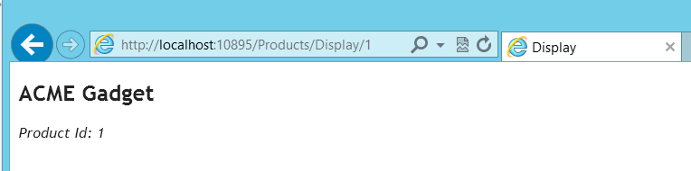

Los programadores SharePoint estamos tan acostumbrados a programar con ASP.NET Web Forms que no nos solemos preocupar por aprender otras tecnologías de programación ya que no se pueden aplicar directamente a SharePoint. Sin embargo, desde la versión 2010 de SharePoint, con el modelo de objetos de cliente (CSOM) podemos acceder a SharePoint desde cualquier aplicación .NET, incluyendo también el framework ASP.NET MVC, que vamos a introducir en este artículo.

**Lo básico de MVC**

En el mundo de ASP.NET Web Forms la base de todo es la página (instancia de clase Page). La página está mapeada físicamente a un fichero con extensión ASPX y dispara una serie de eventos (Init, Load, PreRender, Render etc) según vamos progresando de la petición HTTP a la respuesta HTML al cliente. Podemos decir que en cierto modo Web Forms implementa el patrón "Page Controller"[\[i\]](https&#58;//d.docs.live.net/77af67c35753916e/CompartiMOSS/web/15/Edin%20Kapic/CompartiMOSS%20-%20MVC%20para%20SharePointeros%20I.docx#_edn1).

En el mundo MVC esto ya no es así. La responsabilidad de servir la respuesta a una petición está dividida entre tres componentes que dan nombre al patrón de diseño MVC: modelo, vista y controlador.[\[ii\]](https&#58;//d.docs.live.net/77af67c35753916e/CompartiMOSS/web/15/Edin%20Kapic/CompartiMOSS%20-%20MVC%20para%20SharePointeros%20I.docx#_edn2)

El modelo son nuestras clases de negocio junto con su lógica de negocio. La vista es la renderización HTML de la respuesta al cliente mientras que el controlador es la lógica de la aplicación web que procesa el modelo y actualiza la vista. En el mundo Web Forms, la página hacía de vista y de controlador a la vez. Ahora estas dos cosas están bien separadas.

**Las peticiones, rutas, acciones y otras cosas de nombre extraño**

Vamos a ver como procesa ASP.NET MVC una petición y lo vamos a comparar con Web Forms para ver las diferencias. Supongamos que queremos ver un producto cuyo ID es 5. En Web Forms haríamos una página DisplayProduct.aspx y recogeríamos un parámetro desde Request.QueryString con el nombre ID. Es decir, la URL de la petición sería DisplayProduct.aspx?ID=5.

En MVC, la URL de la petición no apuntará a ningún fichero físico sino que nos indicara el controlador (de todos los controladores que hay), la acción (dentro de ese controlador) y posiblemente algún parámetro de esa acción. Una URL probable sería /Products/Display/5, indicando el controlador Products, acción Display con el parámetro 5.

Seguro que ahora os estáis preguntando como sabe MVC a que controlador tiene que enviar la petición y que vista se tiene que mostrar. Resulta que MVC por defecto interpreta la URL en el formato "controlador/acción/parámetro" y de esta manera la URL /Products/Display/5 equivale al invocar ProductsController.Display(5). ¿Y la vista? MVC la busca dentro de la subcarpeta Products de las vistas y buscará la que tiene como nombre Display. Como podéis ver, se favorece el uso de convenciones comunes de nombres para ahorrar código innecesario de infraestructura.

Una acción en el controlador será un método que devuelve un resultado, que casi siempre será una vista. La acción puede recibir parámetros (sencillos o incluso complejos) y puede pasarle los parámetros a la vista. Lo más habitual es que la acción realice alguna comprobación de validez de los parámetros y que use otras clases y servicios para llamar a la lógica puramente de negocio. Se suele utilizar inyección de dependencias para desacoplar aún más los controladores (lógica de la capa web de presentación) de la funcionalidad de negocio (capa de dominio o de negocio).

Las vistas en ASP.NET MVC se pueden hacer en Web Forms (ficheros ASPX) o con la nueva tecnología llamada Razor. Se recomienda Razor por ser mucho más sencillo y rápido. Razor tiene una sintaxis más minimalista y cuesta un cierto tiempo acostumbrarse a él. En contraprestación, se corresponde más al HTML final.

@model MvcHelloWorld.Models.Product

@{

ViewBag.Title = "Display";

}

&lt;h2&gt;Display&lt;/h2&gt;

&lt;p&gt;@Model.Name &lt;em&gt;(@Model.ProductId)&lt;/em&gt;&lt;/p&gt;

Fijaos que Razor usa el prefijo @ para introducir su marcado de servidor. En este ejemplo le estamos diciendo a la vista que va a usar un tipo de datos como modelo (la clase MvcHelloWorld.Models.Product) y luego en el contenido de la página se usan las propiedades de ese modelo mediante la sintaxis @Model.

**Hello, world en MVC**

Para acabar de sentar el concepto de una aplicación MVC, vamos a hacer un ejemplo sencillo: una aplicación que permite ver la lista de productos y el detalle del producto. Para simplificar esta primera toma de contacto con MVC, vamos a usar la lista de productos fija implementada en la clase DBHelper. Más adelante usaremos la API de SharePoint para obtener la lista desde un sitio de SharePoint.

public class DBHelper

{

public static Product GetProduct(int productId)

{

var product = GetProducts().Where(x =&gt; x.ProductId == productId).FirstOrDefault();

return product;

}

public static IEnumerable&lt;Product&gt; GetProducts()

{

List&lt;Product&gt; result = new List&lt;Product&gt;();

result.Add(new Product() { Name = "ACME Gadget", ProductId = 1 });

result.Add(new Product() { Name = "XYZ Widget", ProductId = 2 });

result.Add( new Product() { Name = "Product ABC", ProductId = 4 });

result.Add( new Product() { Name = "Foo DEF", ProductId = 5 });

return result;

}

}

Abrimos Visual Studio y creamos una aplicación web MVC 3 con la plantilla "*Empty Application*". Dejamos las opciones por defecto y nos encontramos con la siguiente estructura de un proyecto MVC.

Las carpetas más importantes son:

- **Content**: contenido estático (HTML, ficheros auxiliares, documentos, etc).
- **Controllers**: aquí irán nuestros controladores.
- **Models**: las clases que componen el modelo de la aplicación irán aquí. En nuestro caso allí tendremos la clase Product y la clase DBHelper que simula una llamada a base de datos.
- **Scripts**: los ficheros de JavaScript para nuestra aplicación. De serie ya tenemos jQuery y Modernizr.
- **Views**: aquí van las vistas, en carpetas que se corresponden con el nombre del controlador.

Ahora vamos a agregar el controlador. Clicamos con el botón derecho en la carpeta *Controllers* y elegimos *Add / Add Controller*. En el cuadro de diálogo, escribimos en nombre del controlador (ProductsController) y elegimos la plantilla "Empty Controller". Obtenemos el código siguiente:

public class ProductsController : Controller

{

public ActionResult Index()

{

return View();

}

}

La acción por defecto que se va a ejecutar si no especificamos ninguna es la acción Index(). En esta acción vamos a mostrar la lista de los productos, con el enlace a ver el detalle de cada uno de ellos. Para ello hay que cambiar el código ligeramente y también vamos a aprovechar para crear una acción nueva llamada Display:

public ActionResult Index()

{

var products = DBHelper.GetProducts();

return View(products);

}

public ActionResult Display(int id)

{

var product = DBHelper.GetProduct(id);

return View(product);

}

Todas las acciones devuelven un ActionResult que indica el resultado de una acción. En la cláusula return devolvemos el resultado de una vista, pasándole un objeto (la lista de productos o un solo producto). Pero, ¿cómo sabe MVC que vista tiene que devolver? Otra vez, lo hace siguiendo la nomenclatura de los nombres de métodos y controladores. Ahora no hay ninguna vista asociada pero lo vamos a corregir añadiendo una vista. Para ello, clicamos por el botón derecho sobre el nombre de la acción y elegimos "Add View". En el diálogo que nos sale elegimos la opción que vincula a una clase del modelo ("Generate strong-typed view").

Vamos a modificar la vista para que genere una lista de productos:

@model IEnumerable&lt;MvcHelloWorld.Models.Product&gt;

@{

ViewBag.Title = "Index";

}

&lt;h2&gt;Index&lt;/h2&gt;

&lt;ul&gt;

@foreach (var p in Model) {

&lt;li&gt;

@Html.ActionLink(p.Name,
"Display", new { id=p.ProductId })

&lt;/li&gt;

}

&lt;/ul&gt;

Como podéis ver, ahora la vista está ligada a un IEnumerable de productos (que es lo que le pasamos desde el controller). Además, creamos una lista de elementos que se generan usando una sintaxis de MVC llamada @Html. El método ActionLink nos genera en enlace a una acción, pasándole el nombre a mostrar, el nombre de la acción y un objeto con los parámetros de la acción (en nuestro caso sólo el ID del producto).

Nos falta crear la vista de la acción Display(), que generamos igual que la de Index() y le ponemos el código siguiente:

@model MvcHelloWorld.Models.Product

@{

ViewBag.Title = "Display";

}

&lt;h2&gt;@Model.Name&lt;/h2&gt;

&lt;p&gt;

&lt;em&gt;Product Id: @Model.ProductId&lt;/em&gt;

&lt;/p&gt;

Antes de ejecutar el ejemplo, tenemos que decirle a MVC cuál es el controlador por defecto y para ello editamos el método RegisterRoutes() en el fichero Global.asax para apuntar a nuestro ProductsController en vez al controlador Home que tiene la plantilla de MVC.

routes.MapRoute(

"Default", // Route name

"{controller}/{action}/{id}", // URL with parameters

new { controller = "Products", action = "Index", id = UrlParameter.Optional }

);

¡Ya estamos listos! Nuestra primera aplicación MVC está sólo a un F5 de distancia:

**Hello, world en MVC y SharePoint**

En este momento tenemos la aplicación web en MVC pero no usa SharePoint para nada. Para convertirla en aplicación de SharePoint vamos a agregar las referencias a la librería cliente de SharePoint para .NET (Microsoft.SharePoint.Client.dll y Microsoft.SharePoint.Client.Runtime.dll).

Tenemos un sitio de SharePoint que tiene la lista de productos. En mi ejemplo la lista está en un Office 365 pero podría estar perfectamente en cualquier SharePoint 2010 o 2013.

Ahora vamos a cambiar el método GetProducts() del DBHelper para que use SharePoint. Usaremos el modelo de objetos cliente de .NET para SharePoint. Para autenticarnos contra el servidor de SharePoint, tenemos que especificar la propiedad Credentials del ClientContext. Si usamos Office 365 con SharePoint 2013 tenemos unas credenciales específicas encapsuladas en la clase  SharePointOnlineCredentials. Si es un SharePoint on-premise, usamos la clase NetworkCredential como siempre. Si tenemos la mala suerte de usar un SharePoint 2010 Online, podemos aprovechar la aportación de Chris Johnson para autenticarnos[\[iii\]](https&#58;//d.docs.live.net/77af67c35753916e/CompartiMOSS/web/15/Edin%20Kapic/CompartiMOSS%20-%20MVC%20para%20SharePointeros%20I.docx#_edn1).

public static IEnumerable&lt;Product&gt; GetProducts()

{

ClientContext clientContext = new ClientContext("http://misharepoint.com");

SecureString password = new SecureString();

foreach (char c in "miPassword".ToCharArray())

{

password.AppendChar(c);

}

clientContext.Credentials = new NetworkCredential("miUsername", password, "miDominio");

List list = clientContext.Web.Lists.GetByTitle("Products");

clientContext.Load(list);

CamlQuery camlQuery = new CamlQuery();

camlQuery.ViewXml = "&lt;View/&gt;";

ListItemCollection listItems = list.GetItems(camlQuery);

clientContext.Load(listItems, items =&gt; items.Include( item=&gt;item["Title"], item =&gt; item.Id));

clientContext.ExecuteQuery();

List&lt;Product&gt; result = new List&lt;Product&gt;();

foreach (ListItem listItem in listItems)

{

var product = new Product() { ProductId = listItem.Id, Name = listItem["Title"].ToString() };

result.Add(product);

}

return result;
}
Como podéis ver, la consulta a SharePoint es directa: obtenemos los datos de la lista Products y mapeamos los objetos ListItem a instancias de la clase Product, usando las propiedades Id y Title de SharePoint como las correspondientes a ProductId y Name de nuestro modelo.

Podemos ver que con este pequeño ejemplo ya tenemos nuestra aplicación MVC conectada a SharePoint, pulsando F5 para ejecutarla.

El código fuente de esta aplicación de ejemplo está disponible en la dirección [http://sdrv.ms/XRmW0O](http&#58;//sdrv.ms/XRmW0O).

**¿Y ahora qué?**

Espero que esta pequeña introducción sirva para que los desarrolladores de SharePoint exploren el mundo de ASP.NET MVC y pierdan el miedo a una plataforma a la que no están tan acostumbrados. En las próximas entregas veremos más detalles sobre las aplicaciones MVC aplicadas a SharePoint como por ejemplo como guardar datos, hacer validaciones y usar inyección de dependencia para desacoplar nuestra aplicación y poder realizar pruebas unitarias. ¡Nos vemos en el próximo número!

**Edin Kapić**
 Arquitecto SharePoint
 [ekapic@pasiona.com](mailto&#58;ekapic@pasiona.com)
 @ekapic
 [http://www.pasiona.com](http&#58;//www.pasiona.com/)

[\[i\]](https&#58;//d.docs.live.net/77af67c35753916e/CompartiMOSS/web/15/Edin%20Kapic/CompartiMOSS%20-%20MVC%20para%20SharePointeros%20I.docx#_ednref1) [http://msdn.microsoft.com/en-us/library/ff649595.aspx](http&#58;//msdn.microsoft.com/en-us/library/ff649595.aspx)

[\[ii\]](https&#58;//d.docs.live.net/77af67c35753916e/CompartiMOSS/web/15/Edin%20Kapic/CompartiMOSS%20-%20MVC%20para%20SharePointeros%20I.docx#_ednref2) [http://msdn.microsoft.com/en-us/library/ff649643.aspx](http&#58;//msdn.microsoft.com/en-us/library/ff649643.aspx)
[\[iii\]](https&#58;//d.docs.live.net/77af67c35753916e/CompartiMOSS/web/15/Edin%20Kapic/CompartiMOSS%20-%20MVC%20para%20SharePointeros%20I.docx#_ednref1) [http://blogs.msdn.com/b/cjohnson/archive/2011/05/03/authentication-with-sharepoint-online-and-the-client-side-object-model.aspx](http&#58;//blogs.msdn.com/b/cjohnson/archive/2011/05/03/authentication-with-sharepoint-online-and-the-client-side-object-model.aspx)

