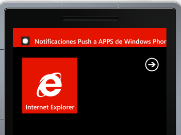

Este artículo es la continuación del artículo del número pasado en el explicábamos como enviar notificaciones PUSH desde SharePoint. En este número vamos a explicar cómo tenemos que desarrollar una APP de Windows Phone 7.5 y 8 para poder recibir las notificaciones desde SharePoint tanto en su versión 2010 como en la nueva versión 2013.

**Requisitos Previos**

Descargar el SDK Client SharePoint para Windows Phone 7.1 que facilita la comunicación de la aplicación móvil con SharePoint

**Desarrollo de la APP de Windows Phone**

La APP que vamos a desarrollar solamente incluye dos partes. Por un lado vamos a explicar cómo habilitar nuestra aplicación para poder recibir notificaciones PUSH y por otro lado como podemos leer los datos de las Listas que hay en SharePoint. Dados estos requerimientos podemos realizar una aplicación que funcione tanto para Windows Phone 7.5 y Windows Phone 8; primero tenemos que saber que tendremos que hacer dos aplicaciones distintas, pero no hace falta que dupliquemos todo el código. La cuestión es utilizar los elementos comunes que tienen ambas versiones y de esta forma hacer una aplicación que nos cueste mucho menos de mantener, sea escalable y de esta forma llegue a un número mayor de usuarios.

Para hacer que el código que realicemos sea compatible en ambas versiones lo que vamos a realizar en primer lugar es crearnos un proyectos de Bibliotecas portables en el que vamos a poner los elementos comunes que van a tener ambas APP. Que va a ser todo a excepción de las Vistas ya que no es lo mismo diseñar para una APP que tiene distinto tamaño de pantalla; el resto del código fuente va a ser igual.

Seleccionamos el tipo de SO que vamos a utilizar para crear la aplicación eligiendo la versión 7.1. Lo hacemos así porque en la versión 8 incluye todo lo que había antes y además las nuevas mejoras que conlleva.

A este proyecto le tenemos que añadir las siguientes referencias (Microsoft.Phone, Microsoft.Phone.Interop y Microsoft.SharePoint.Client.Phone)

​

En primer lugar lo que vamos a implementar es una clase "Notification" que tendrá una variable de tipo HttpNotificationChannel que es la que se encargara de comunicarse con el MPNS. En primer lugar nos crearemos un método OpenNotificationChannel cuya función es buscar si el canal de comunicación esta creado. En caso de que no esté creado se debe crear. Hay que saber que una aplicación de WP solo puede tener un único canal de comunicaciones abierto y este no se puede comunicar con el resto de aplicaciones que hay en el teléfono.   Además se le añadirán manejadores a los siguientes eventos:

- **ChannelUriUpdate** que se lanzará si el MPNS cambia la dirección URI de notificaciones.
- **ErrorOcurred**se lanzará si ocurre un error en la aplicación.
- **httpChannel\_ShellToastNotificationReceived** se lanzará en el momento que recibamos una notificación TOAST.


La primera vez que ejecutamos el canal no tenemos aún la dirección URI y solo tendremos una dirección URI valida en el momento que se lance el evento ChannelUriUpdate, por lo que hasta que no tengamos esta dirección valida no podremos registrar nuestro dispositivo en la aplicación.

```
public static void OpenNotificationChannel( bool isInitialRegistration)
 
{
 
try   {
 
// Buscamos si el canal ya esta creado
 
httpChannel = HttpNotificationChannel .Find(ChannelName);
 
// Si no se encuentra el canal creamos uno
 
if (httpChannel == null )
 
{
 
httpChannel = new HttpNotificationChannel (ChannelName);
 
//Añadimos los eventos asociados al HttpNotificationChannel
 
// Hasta que no salte el evento ChannelUriUpdate como no tenemos URI
 
// no podemos subscribir el dispositivo Sharepoint
 
AddChannelEventHandlers();
 
httpChannel.Open();
 
}
 
else
 
{
 
//En caso de que el canal ya exista asociamos los eventos al HttpNotificationChannal
 
AddChannelEventHandlers();
 
// En caso de que sea la primera vez que se ejecute suscribiremos al Servicio
 
if (isInitialRegistration)
 
{
 
SubscribeToService();
 
}
 
}
 
}
 
catch ( Exception ex)
 
{
 
MessageBox .Show(ex.Message, "Error Abriendo el Canal" , MessageBoxButton .OK);
 
CloseChannel();
 
}

}
```

Una vez ya tenemos el canal abierto, el siguiente paso a realizar es implementar los manejadores:

**ChannelUriUpdate:**En este evento lo que vamos a realizar es que cada vez que se ejecute, subscribiremos este dispositivo. Pueden darse dos situaciones: la primera vez en la que registramos el dispositivo y para la que valdría el siguiente método. En la segunda, simplemente realizamos la subscripción.


```
/// &lt;summary&gt;
 
/// Suscribir el servicio en una lista de Sharepoint
 
/// &lt;/summary&gt;
 
private static void SubscribeToService()
 
{
 
Guid deviceAppInstanceId = GetSettingValue&lt; Guid &gt;(DeviceAppIdKey, false );
 
Context.Load(Context.Web, w =&gt; w.Title, w =&gt; w.Description);
 
PushNotificationSubscriber pushSubscriber =
 
Context.Web.RegisterPushNotificationSubscriber(deviceAppInstanceId, httpChannel.ChannelUri.AbsoluteUri);
 
Context.Load(pushSubscriber);
 
Context.ExecuteQueryAsync
 
(
 
( object sender, ClientRequestSucceededEventArgs args) =&gt;
 
{
 
SetRegistrationStatus( true );
 
if (!httpChannel.IsShellTileBound) {httpChannel.BindToShellTile();}
 
if (!httpChannel.IsShellToastBound) {httpChannel.BindToShellToast();}
 
ShowMessage( string .Format( "Subscripcion Correcta registrada: {0}" , pushSubscriber.User.LoginName), "Realizado" );
 
},
 
( object sender, ClientRequestFailedEventArgs args) =&gt;
 
{
 
ShowMessage(args.Exception.Message, "Error Subscribiendo" );
 
});
 
}
```

Pero el problema es que la dirección URI puede cambiar, ¿y entonces que hacemos cuando se modifica un dirección? Pues bien primero llamaremos a la siguiente función que lo que hace es actualizar la Dirección URI en SharePoint, en caso de que no exista no hace nada. Posteriormente, si procede, llamamos a la función de arriba.
 
```
/// &lt;summary&gt;
 
/// Actualizo el Canar Uri en el Servidor
 
/// &lt;/summary&gt;
 
private static void UpdateChannelUriOnServer()
 
{
 
Guid deviceAppInstanceId = GetSettingValue&lt; Guid &gt;(DeviceAppIdKey, false );
 
Context.Load(Context.Web, w =&gt; w.Title, w =&gt; w.Description);
 
PushNotificationSubscriber subscriber = Context.Web.GetPushNotificationSubscriber(deviceAppInstanceId);
 
Context.Load(subscriber);
 
Context.ExecuteQueryAsync(
 
( object sender1, ClientRequestSucceededEventArgs args1) =&gt;
 
{
 
subscriber.ServiceToken = httpChannel.ChannelUri.AbsolutePath;
 
subscriber.Update();
 
Context.ExecuteQueryAsync(
 
( object sender2, ClientRequestSucceededEventArgs args2) =&gt;
 
{
 
ShowMessage( "Channel URI updated on server." , "Success" );
 
},
 
( object sender2, ClientRequestFailedEventArgs args2
 
) =&gt;
 
{
 
ShowMessage(args2.Exception.Message, "Error Upating Channel URI" );
 
});
 
},
 
( object sender1, ClientRequestFailedEventArgs args1) =&gt;
 
{
 

 
});
 
}


 
/// &lt;summary&gt;
 
/// En el momento que recibimos una notificacion Toast
 
/// &lt;/summary&gt;
 
/// &lt;param name="sender"&gt;&lt;/param&gt;
 
/// &lt;param name="e"&gt;&lt;/param&gt;
 
static void httpChannel\_ShellToastNotificationReceived( object sender, NotificationEventArgs e)
 
{
 
if (e.Collection != null )
 
{
 
Dictionary &lt; string , string &gt; collection = ( Dictionary &lt; string , string &gt;)e.Collection;
 
ShellToast toast = new ShellToast ();
 
toast.Title = collection[ "wp:Text1" ];
 
toast.Content = collection[ "wp:Text2" ];
 

 
ShowMessage( string .Format( "Titulo: {0}\r\nAutor: {1}" , toast.Title, toast.Content), "Toast Notification" );
 
}
 
}

Para almacenar el GUID de la aplicación, y si hemos registrado o no la aplicación, hemos utilizado el almacenamiento local que nos ofrece Windows Phone ya que nos proporciona un grado de seguridad altísimo, puesto que ninguna otra aplicación puede acceder a zonas de memoria usadas por el sistema o por otras aplicaciones.

El siguiente paso que le añadiremos a esta biblioteca es crearnos el ViewModel que vamos a realizar en primer lugar nos creamos una clase ItemArticleViewModel que va a contener las propiedades que queremos mostrar en nuestro caso "Titulo" del articulo y "Autor" la clase quedaría de la siguiente forma (hay que añadirle la parte de notificación para que se modifiquen los valores en los bindings de la capa de vista); el resto es como si fuera una clase normal:
 
public class ItemArticleViewModel : INotifyPropertyChanged
 
{
 
public string Title { get ; set ; }
 
public string Author { get ; set ; }
 

 
public event PropertyChangedEventHandler PropertyChanged;
 
private void NotifyPropertyChanged( String propertyName)
 
{
 
PropertyChangedEventHandler handler = PropertyChanged;
 
if ( null != handler)
 
{
 
handler( this , new PropertyChangedEventArgs (propertyName));
 
}
 
}
 
}
```


Una vez creado la definición del modelo nos creamos la capa de donde se obtienen los datos y ahí es donde entra en juego SharePoint. Antes de empezar a ver cómo hacerlos. Hay que saber las opciones que tenemos para obtener los datos de un SharePoint:

1. A través del SDK de SharePoint para Windows Phone 7.5 (que es compatible también para la versión 8).
2. Utilizando el API REST de SharePoint.


En este ejemplo vamos a realizarlo a través la opción 1, entonces nos creamos una clase MainArticleViewModel que va a tener una esctructura como la siguiente:
 
```
public class MainArticleViewModel : INotifyPropertyChanged
 
{
 
public MainArticleViewModel()
 
{
 
this .Items = new ObservableCollection &lt; ItemArticleViewModel &gt;();
 
}
 

 
/// &lt;summary&gt;
 
/// Colección para objetos ItemViewModel.
 
/// &lt;/summary&gt;
 
public ObservableCollection &lt; ItemArticleViewModel &gt; Items { get ; private set ; }
 

 
public string SampleProperty
 
{
 
get ;
 
set ;
 
}
 

 
public bool IsDataLoaded
 
{
 
get ;
 
private set ;
 
}
 
public event PropertyChangedEventHandler PropertyChanged;
 
private void NotifyPropertyChanged( String propertyName)
 
{
 
PropertyChangedEventHandler handler = PropertyChanged;
 
if ( null != handler)
 
{
 
handler( this , new PropertyChangedEventArgs (propertyName));
 
}
 
}
 
Y para completar esta clase le falta la  función LoadData( ). En esta función es donde vamos a realizar la llamada a SharePoint, y se hace de una forma muy similar a la que se utiliza en las llamadas Cliente en 2010 y convertiremos los elementos de la lista en objetos de nuestro ViewModel. La función quedaría así:
 
public void LoadData()
 
{
 
ClientContext context = new ClientContext ( "http://compartimoos" );
 
context.Credentials =  new Authenticator();
 
List articlesList = context.Web.Lists.GetByTitle( "Articulos" );
 
CamlQuery query = new CamlQuery ();
 
query.ViewXml = @"&lt;Query&gt;&lt;Eq&gt;
 
&lt;FieldRef Name='Revista' /&gt;
 
&lt;Value Type='Text'&gt;'Numero13'&lt;/Value&gt;
 
&lt;/Eq&gt;
 
&lt;/Where&gt;&lt;/Query&gt;" ;
 
ListItemCollection itemsList = articlesList.GetItems(query);
 
context.Load(itemsList);
 
context.ExecuteQuery();
 
if (itemsList.Count &gt; 0)
 
{
 
foreach ( ListItem item in itemsList)
 
{
 
ItemArticleViewModel itemArticle= new ItemArticleViewModel ();
 
itemArticle.Author=item[ "Author" ].ToString();
 
itemArticle.Title=item[ "Title" ].ToString();
 
this .Items.Add(itemArticle);
 
}

}
```

**Creando las aplicaciones**

Una vez tenemos la clase con toda la funcionalidad disponible vamos a crear la aplicación de Windows Phone. Lo primero que tenemos que hacer es agregar la referencia a la librería que habíamos creado anteriormente.

A continuación nos vamos a la página MainPage.xaml y a la página le añadimos un objeto de tipo "Pivots " y en los "Bindings" tendremos que poner los nombres de los campos de nuestro modelo en nuestro caso Article y Phone

``` 
&lt;controls:Pivot Title="MI APLICACIÓN"&gt;
 
&lt;!--Elemento Pivot uno--&gt;
 
&lt;controls:PivotItem Header="primero"&gt;
 
&lt;!--Lista de líneas dobles con ajuste de texto--&gt;
 
&lt;ListBox x:Name="FirstListBox" Margin="0,0,-12,0" ItemsSource="{Binding Items}"&gt;
 
&lt;ListBox.ItemTemplate&gt;
 
&lt;DataTemplate&gt;
 
&lt;StackPanel Margin="0,0,0,17" Width="432" Height="78"&gt;
 
&lt;TextBlock Text="{Binding Article}" TextWrapping="Wrap" Style="{StaticResource PhoneTextExtraLargeStyle}"/&gt;
 
&lt;TextBlock Text="{Binding Author}" TextWrapping="Wrap" Margin="12,-6,12,0" Style="{StaticResource PhoneTextSubtleStyle}"/&gt;
 
&lt;/StackPanel&gt;
 
&lt;/DataTemplate&gt;
 
&lt;/ListBox.ItemTemplate&gt;
 
&lt;/ListBox&gt;
 
&lt;/controls:PivotItem&gt;
 
&lt;/controls:Pivot&gt;
```


El siguiente paso es irnos a al APP.CS y añadir este propiedad:

```
public static MainArticleViewModel ViewModel
 
{
 
get
 
{
 
// Retrasar la creación del modelo de vista hasta que sea necesario
 
if (viewModel == null )
 
viewModel = new MainArticleViewModel ();
 

 
return viewModel;
 
}
 
}
```


Y dentro del evento cuando se active añadir esta llamada:

```
if (! App .ViewModel.IsDataLoaded)
 
{
 
App .ViewModel.LoadData();
 
}
```


Ahora nos dirigimos a la MainPage.cs y aquí tendremos que establecer el contexto de esta pantalla que con el View Model quedaría de la siguiente forma:

```
// Constructor
 
public MainPage()
 
{
 
InitializeComponent();
 

 
// Establecer el contexto de datos del control ListBox control en los datos de ejemplo
 
DataContext = App .ViewModel;
 
this .Loaded += new RoutedEventHandler (MainPage\_Loaded);
 
}
 

 
// Cargar datos para los elementos ViewModel
 
private void MainPage\_Loaded( object sender, RoutedEventArgs e)
 
{
 
if (! App .ViewModel.IsDataLoaded)
 
{
 
App .ViewModel.LoadData();
 
}
 
}
```

Una vez realizado esto si ejecutamos nuestra aplicación se visualizará la siguiente pantalla:


Ahora lo que falta es añadir que esta aplicación pueda recibir notificaciones PUSH dentro de nuestra aplicación, para ello en el main llamamos al método OpenNotificacion de la clase Notificacion. Como hemos visto anteriormente, lo que hace es lo siguiente:

- Crear el Canal de comunicaciones.
- En el momento que tenemos una dirección URI valida subscribimos la aplicación a SharePoint.
- Cuando recibimos una notificación la mostramos en la aplicación (en caso de que tengamos la aplicación cerrada se visualizara la notificación en la parte superior de la pantalla como en las siguientes imágenes):




Esto solo es un ejemplo de como se pueden enviar notificaciones desde una lista de Sharepoint a aplicaciones Windows Phone. Para una aplicación "profesional" tendriamos que crear una pantalla de configuración de estas notificaciones para que el usuario tenga la potestad de elegir si quiere o no quiere recibir notificaciones. Tambien quedaria pendiente la forma en la que se deja de recibir notificiaciones (hay un metodo unsubscriber tambien) . Otra cosa a tener en cuenta es que con aplicaciones de Windows Phone, no hay notificación de eventos  cuando una aplicación se desinstala por lo que en tendremos que implementar alguna función que nos haga saber si todos los dispositivos móviles  que tenemos registrados estan "activos". Pero esto ya se deja a la intriga del lector.

**¿Cómo implementamos la aplicación si estamos trabajando con un SharePoint 2010?**

El desarrollo es al 90% igual para un sistema que para el otro, la unica diferencia es que en 2010 no tenemos el metodo de subscribir al dispositivo a una lista y por lo tanto lo tendremos que hacer de forma manual. Viendo la solución que habia planteado con anterioridad esta claro lo que tenemos que hacer. Hay que insertar un elemento en una lista de SharePoint y esto utilizando las librerias clientes de SharePoint es muy sencillo de hacer.

Lo que va a realizar la siguiente función es: en primer lugar consultamos  si tenemos este elemento en la lista y en caso que afirmativo actualizamos la dirección URI y sino existe insertamos el elemento en la lista.

```
private void SubscribeToService( string Guid, string ChannelUri)
 
{
 
ClientContext context = new ClientContext ( "http://compartimoos" );
 

 
if (!existGuid(Guid, context))
 
{
 
InsertData(Guid, ChannelUri, context);
 
}
 
else
 
{
 
UpadteData(Guid, ChannelUri, context);
 
}
 
}
 
private bool existGuid( string Guid, ClientContext context)
 
{
 
bool res = false ;
 

 
List mensajesList = context.Web.Lists.GetByTitle( "Subscriptores" );
 
CamlQuery query = new CamlQuery ();
 
query.ViewXml = string .Format( @"&lt;Query&gt;&lt;Eq&gt;
 
&lt;FieldRef Name='Guid' /&gt;
 
&lt;Value Type='Text'&gt;{0}&lt;/Value&gt;
 
&lt;/Eq&gt;
 
&lt;/Where&gt;&lt;/Query&gt;"
 
,Guid);
 
ListItemCollection itemsList = mensajesList.GetItems(query);
 
context.Load(itemsList);
 
context.ExecuteQuery();
 
if (itemsList.Count &gt; 0) { res = true ; }
 
return res;
 
}
 
private static void InsertData( string Guid, string ChannelUri, ClientContext context)
 
{
 
List mensajesList = context.Web.Lists.GetByTitle( "Subscriptores" );
 
ListItemCreationInformation itemCreateInfo = new ListItemCreationInformation ();
 
ListItem oListItem = mensajesList.AddItem(itemCreateInfo);
 
oListItem[ "Guid" ] = Guid;
 
oListItem[ "ChannelUri" ] = ChannelUri;
 
oListItem.Update();
 
context.ExecuteQuery();

}
```


**Conclusiones**

En este articulos hemos visto lo sencillo que es crear Apps para Windows Phone tanto en la versión 7.5 y versión 8 con el origen de datos almacenados en SharePoint tanto en la versión 2010 como en la 2013. Ademas se le puede añadir complementos para que la interacción APP con SharePoint este presente y de esta forma el usuario pueda estar al tanto de lo que se realiza. Con lo que es un muy buen punto para incluir dentro de nuestros desarrollos profesionales.

**Referencias**

- Windows Phone 7.5 Desarrollo de aplicaciones en Silverlight- Josué Yeray Julian.
- Notificaciones de empuje para el desarrollo de Windows Phone [http://blogs.ligasilverlight.com](http://blogs.ligasilverlight.com/)
- Push Notifications with SharePoint 2013-based Windows Phone apps [http://www.deviantpoint.com/post/2012/07/27/Push-Notifications-with-SharePoint-2013-based-Windows-Phone-apps.aspx](http://www.deviantpoint.com/post/2012/07/27/Push-Notifications-with-SharePoint-2013-based-Windows-Phone-apps.aspx)


**Adrián Díaz Cervera**

SharePoint Developer at Encamina

MCPD SharePoint 2010 MAP y MCC 2012

[http://blogs.encamina.com/desarrollandosobresharepoint](http://blogs.encamina.com/desarrollandosobresharepoint)

[adiaz@encamina.com](mailto:adiaz@encamina.com)

@AdrianDiaz81

 
 
import LayoutNumber from '../../../components/layout-article'
export default LayoutNumber
