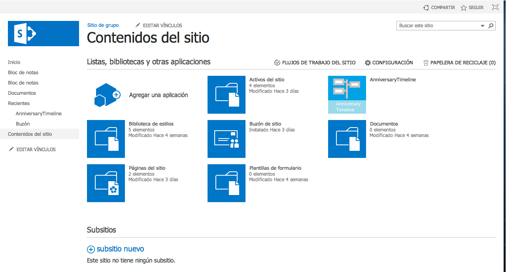
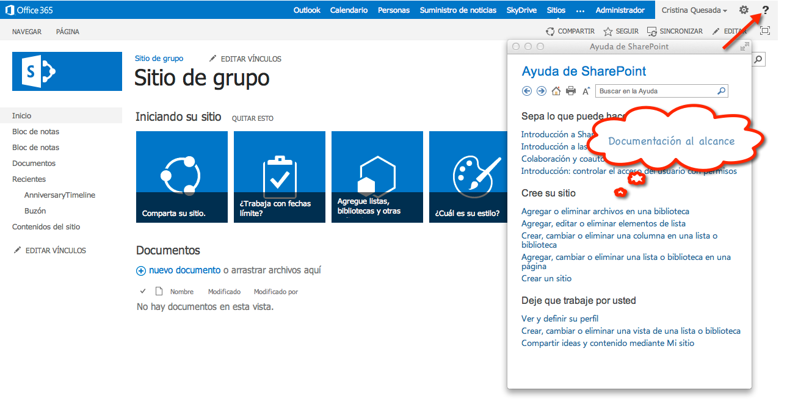
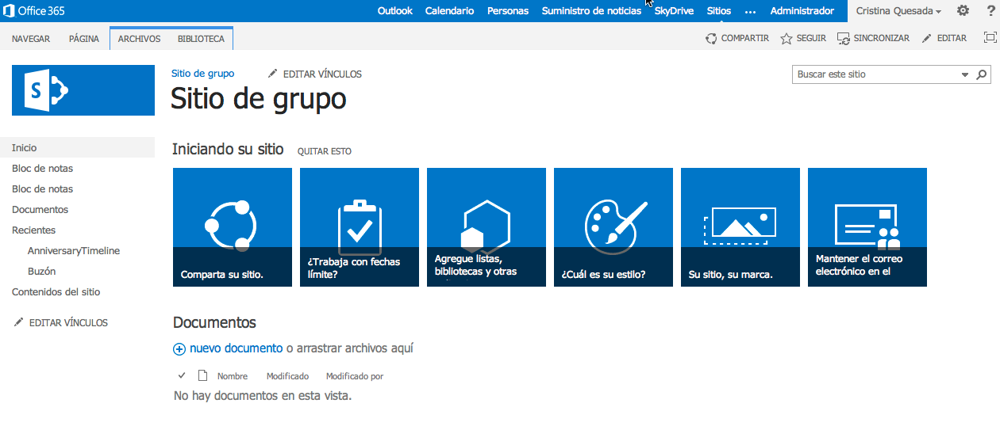
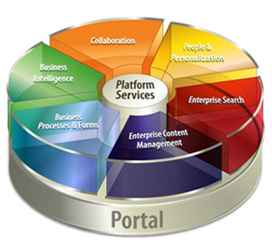

import ArticleHeader from '../../../components/article-header'

<ArticleHeader frontmatter={props.pageContext.frontmatter} />

Hoy en día los Sistemas Colaborativos son primordiales en la gestión de procesos de las organizaciones. Tiempo atrás estos sistemas eran asincrónicos, por ejemplo: los envíos de correos electrónicos, pero las compañías en este momento necesitan cierto dinamismo en su proceso de negocios para poder rendir ante el mundo tan competitivo al que nos enfrentamos.

La colaboración en estos tiempos se ha vuelto necesaria, y las herramientas como SharePoint vienen a facilitar nuestros procesos en todo momento, desde la construcción, pasando por la preparación (resistencia al cambio) y hasta en la utilización en el día a día.

Los Sistemas basados en Entornos Colaborativos, son ideales para grupos de personas dentro de distintas actividades en las que existen necesidades importantes de comunicación y colaboración.

En la actualidad, existen en el mercado diversas herramientas colaborativas, pero entre todas estas herramientas se opta por elegir Microsoft SharePoint por diversos motivos:

1. Los productos Microsoft Office que son altamente utilizados en las organizaciones. Por esto SharePoint es una herramienta atractiva, debido a que son productos conocidos y utilizados por los usuarios.
2. El integrar herramientas propias de la organización o de otros proveedores, al entorno de Microsoft SharePoint se realiza de manera fácil.
3. Microsoft SharePoint está orientada a la organización, no se necesita ser Ingeniero en Informática para poder manejar la herramienta, de modo que los usuarios van a poder abordar sus necesidades de forma autosuficiente y con menos "Resistencia al Cambio".
4. Es una tecnología adecuada para la colaboración, no solo colaboración documental sino en el más amplio significado de colaboración en una organización (tareas, eventos, reuniones, discusiones...).

> 5. a herramienta cuenta con bastante documentación por lo que el capacitarse para la utilización de SharePoint resulta una tarea fácil.

La herramienta colaborativa Microsoft SharePoint se basa en Microsoft SharePoint Server tanto la versión Standard Como la Enterprise y Microsoft SharePoint Foundation. SharePoint Server es un servidor de portales Web que va a permitir a los usuarios integrar diversas aplicaciones, personalizar el contenido, y hacer búsquedas avanzadas.

Microsoft SharePoint Foundation permite agregar, organizar y ofrecer sitios para facilitar el compartir documentos y la colaborar en proyectos y reuniones, crear y utilizar plantillas, y gestionar el control de versiones y publicaciones.

SharePoint conecta los sitios de trabajo y los distintos usuarios que conforman los equipos, proporcionando organizaciones más eficientes.
De manera natural al comenzar a utilizar cualquier herramienta informática se comienza por estudiar el manual de usuario de la misma. En el caso concreto de Microsoft SharePoint, el sistema debe ser adaptado a las necesidades de los usuarios cada vez que se implementa.

Microsoft SharePoint es una herramienta dirigida al usuario final, por lo que al utilizarla para potenciar los procesos de negocios la resistencia al cambio es mucho menor que cuando se utiliza alguna otra herramienta programada para este fin.

La buena y fácil capacitación al usuario hace que se trabaje de manera independiente.

**Recomendaciones a la hora de implementar un sistema de colaboración con SharePoint**

1. Saber que un sistema de colaboración no se desarrolla solamente con la experiencia de un conocedor de la herramienta o un técnico, sino lo principal es conocer bien el proceso de negocio a desarrollar, para esto necesitamos una toma de requerimientos bien robusta con la ayuda de múltiples áreas (mercadeo, recursos humanos, gerencia, etc.).
2. SharePoint por su naturaleza web, tiene la flexibilidad de conformar jerarquías de sitios, por lo cual hay que tener mucho cuidado con este aspecto, ya que se recomienda no navegar a más de tres niveles, debido a que el usuario busca encontrar la información en la menor cantidad de clics.
3. Saber traducir la necesidad tanto funcional como la administración de la información para un buen acople del trabajo en la organización.
4. Tener en cuenta la buena formación que debe tener el usuario final para el buen uso de la herramienta y la seguridad de que SharePoint como sistema de colaboración cumple las expectativas.

**Conclusiones**

SharePoint es una herramienta de colaboración orientada al usuario final. Al saber bien que procesos de negocios tenemos que potenciar en la organización se podrá sacar el máximo de provecho a la herramienta.

Se debe de tener presente todas las áreas involucradas en el proceso. No es cosa solo de una persona el poder diseñar e implementar un sistema colaborativo como SharePoint.

Se deben tener siempre presente las 3 C's:

- Comunicación: esta es la función más importante donde se establece el flujo de información.
- Coordinación: asegura que el equipo de trabajo es eficiente y se alcanza el objetivo de manera conjunta.

Colaboración: proporciona ventajas para resolver problemas a tiempo.

**Cristina Quesada Calderón**
 Consultora en tecnologías SharePoint

Profesora de Sistemas Colaborativos Universidad Latina de Costa Rica
 [cristi\_q@hotmail.com](mailto&#58;cristi_q@hotmail.com) 
 @cris\_quesada
 [http://cristina-quesada.blogspot.com/](http&#58;//cristina-quesada.blogspot.com/)

