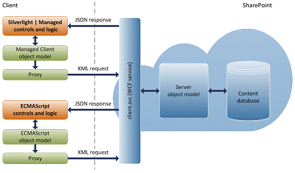

Un punto diferenciador de SharePoint, con respecto a otras plataformas de colaboración, es la capacidad de ofrecer una capa de abstracción en cliente, permitiendo el desarrollo de aplicaciones o integraciones externas. Desde el primer día, los servicios Web de SharePoint han permitido interactuar con la plataforma de una forma sencilla y universal, permitiendo, sin tener que desarrollar ninguna API de servidor, acceder a cualquier tipo de contenido en SharePoint.

Con SharePoint 2010, se incluyeron dos opciones nuevas, el Cliend-Side Objet Model (CSOM) y la interfaz REST, que complementaban a los servicios Web de la plataforma, ofreciendo más posibilidades de desarrollo. Mientras que en el último SharePoint, la versión 2013, se han añadido nuevas funcionalidades al CSOM, así como una nueva y más limpia interfaz REST.

Dentro de las múltiples versiones del modelo de objetos de cliente de SharePoint 2013, nos encontramos con un nuevo SDK para el desarrollo de aplicaciones móviles, el [Mobile Object  Model](http&#58;//msdn.microsoft.com/en-us/library/jj163797.aspx).

- Versión para Windows Phone 7: [http://www.microsoft.com/en-us/download/details.aspx?id=35475](http&#58;//www.microsoft.com/en-us/download/details.aspx?id=35475)
- Versión para Windows Phone 8: [http://www.microsoft.com/en-us/download/details.aspx?id=36818&WT.mc\_id=rss\_office\_allproducts](http&#58;//www.microsoft.com/en-us/download/details.aspx?id=36818&amp;WT.mc_id=rss_office_allproducts)
- Versión REST:  [http://msdn.microsoft.com/en-us/library/fp142385.aspx](http&#58;//msdn.microsoft.com/en-us/library/fp142385.aspx)
Desde el Mobile Object Model, podemos trabajar con listas, bibliotecas de documentos, las nuevas [notificaciones push](/revistas/numero-14/notificaciones-a-aplicaciones-windows-phone-desde-sharepoint-parte-i) (artículo de Adrián Díaz en CompartiMOSS) de SharePoint 2013, Perfiles de usuarios, Social, y casi todos los elementos que SharePoint expone en cliente.

Una nueva oportunidad para mejorar la movilidad de las empresas que usan SharePoint, ya que pueden extender sus procesos empresariales de forma universal a todos los usuarios, estén donde estén y tanto con un ordenador como con un móvil. Pensemos en aplicaciones que permitan aprobar flujos de trabajo en SharePoint, consultar datos de clientes en listas o almacenar fotos geo-localizadas en una biblioteca de documentos en SharePoint.

En este artículo, haremos una introducción a la versión de Windows Phone, dejando para el siguiente la versión REST, que nos permitiría hacer un cliente más universal para Windows 8, iPhone o Android.

El CSOM de Windows Phone usa el servicio WCF, *client.svc*, que es el encargado de analizar y ejecutar las consultas del cliente, usando el modelo de objetos de servidor, y devolver el resultado en JSON al cliente para que pueda trabajar con los objetos que necesite. Siguiendo el siguiente diagrama de arquitectura.



Si ya hemos trabajado con la implementación Silverlight del CSOM, trabajar con esta versión para Windows Phone es prácticamente lo mismo, básicamente hay que tener presente las llamadas asíncronas y que los objetos no se cargan hasta que ejecutemos la consulta en el servidor.

**Autenticación**

Hasta ahora, el principal problema que teníamos con Windows Phone y la integración con SharePoint es el de la autenticación del usuario frente a SharePoint. Para esto, tenemos una clase, [Authenticator](http&#58;//msdn.microsoft.com/en-us/library/microsoft.sharepoint.client.authenticator.aspx), que se encarga de realizar la autenticación por nosotros, aunque podemos realizarla manualmente.
 
var context = new ClientContext("https://xxx.sharepoint.com");
 
var authenticator = new Authenticator();
 
authenticator.CookieCachingEnabled = true;
 
context.Credentials = authenticator;

**Consultas a lista**

No tenemos cambios significativos cuando realizamos consultas a listas, básicamente obtenemos la lista, con o sin el CAML query, trabajando siempre desde el contexto de cliente y en el ExecuteQueryAsync obtenemos los elementos de esa lista o consulta.

```
     var lista = new ObservableCollection<Announcement>(); 
     var query = GetAnnouncementQuery(); 
     var items = Context.Web.Lists.GetByTitle("Announcements").GetItems(query); 
     Context.Load(items); 
     Context.Load(items, listItems => listItems.Include(item => item.FieldValuesAsText)); 
     Context.ExecuteQueryAsync(                 
         delegate(object sender, ClientRequestSucceededEventArgs args) 
         { 
             foreach (var item in items) 
             { 
                 var anuncio = new Announcement(); 
                 anuncio.ID = item.Id.ToString(); 
                 anuncio.Title = item.FieldValuesAsText["Title"]; 
                 anuncio.Body = item.FieldValuesAsText["Body"]; 
                 anuncio.Expires = item.FieldValuesAsText["Expires"]; 
                 anuncio.Created = item.FieldValuesAsText["Created"]; 
                 lista.Add(anuncio); 
             } 
         }, 
         delegate(object sender, ClientRequestFailedEventArgs args) 
         { 
             //Manejamos el error de la consulta 


     var query = GetAnnouncementQuery(); 


     var items = Context.Web.Lists.GetByTitle("Announcements").GetItems(query); 


     Context.Load(items); 


     Context.Load(items, listItems => listItems.Include(item => item.FieldValuesAsText)); 


 


     Context.ExecuteQueryAsync(                 


         delegate(object sender, ClientRequestSucceededEventArgs args) 


         { 


             foreach (var item in items) 


             { 


                 var anuncio = new Announcement(); 


                 anuncio.ID = item.Id.ToString(); 


                 anuncio.Title = item.FieldValuesAsText["Title"]; 


                 anuncio.Body = item.FieldValuesAsText["Body"]; 


                 anuncio.Expires = item.FieldValuesAsText["Expires"]; 


                 anuncio.Created = item.FieldValuesAsText["Created"]; 


 


                 lista.Add(anuncio); 


             } 


 


         }, 


         delegate(object sender, ClientRequestFailedEventArgs args) 


         { 


             //Manejamos el error de la consulta 


         }); 
```

**Crear elementos en lista**

Como siempre, nos creamos un objeto del tipo ListItemCreationInformation y lo envíanos al contexto.

```
     var subscriptionList = Context.Web.Lists.GetByTitle("HubSubscribers"); 
     Context.Load(subscriptionList); 
     deviceItem = subscriptionList.AddItem(new ListItemCreationInformation()); 
     deviceItem["Title"] = displayName; 
     deviceItem["UserAccount"] = acccountName; 
     deviceItem["ChannelUri"] = pushChannel; 
     deviceItem["ChannelUriDate"] = System.DateTime.Now; 
     deviceItem["DeviceId"] = deviceId; 
     deviceItem.Update(); 


     Context.Load(subscriptionList); 


     deviceItem = subscriptionList.AddItem(new ListItemCreationInformation()); 


     deviceItem["Title"] = displayName; 


     deviceItem["UserAccount"] = acccountName; 


     deviceItem["ChannelUri"] = pushChannel; 


     deviceItem["ChannelUriDate"] = System.DateTime.Now; 


     deviceItem["DeviceId"] = deviceId; 


     deviceItem.Update(); 


     Context.ExecuteQuery(); 
```

**Obtener un perfil de usuario**

En el CSOM de SharePoint 2013 tenemos acceso a los perfiles de usuario, y en Windows Phone también. Para esto, nos creamos un [PeopleManager](http&#58;//msdn.microsoft.com/en-us/library/microsoft.sharepoint.client.userprofiles.peoplemanager.aspx) y obtenemos las propiedades que necesitemos.

```
     var peopleManager = new PeopleManager(Context); 
     var personProperties = peopleManager.GetPropertiesFor(userAccount); 
     context.Load(personProperties, p => p.AccountName, p => p.DisplayName, p => p.Email, p => p.UserProfileProperties,  
                  p => p.DirectReports, p => p.Peers, p => p.PictureUrl); 
     context.ExecuteQueryAsync( 
         delegate(object sender1, ClientRequestSucceededEventArgs args) 
         { 
             var profile = new Profile(); 
             profile.AccountName = personProperties.AccountName; 
             profile.DirectReports = personProperties.DirectReports.ToList(); 
             profile.Peers = personProperties.Peers.ToList(); 
             profile.DisplayName = personProperties.DisplayName; 
             profile.PictureUrl = personProperties.PictureUrl; 
             profile.Email = personProperties.Email; 
             profile.Manager = personProperties.UserProfileProperties["Manager"]; 
             profile.Status = personProperties.UserProfileProperties["SPS-StatusNotes"]; 
             profile.WorkPhone = personProperties.UserProfileProperties["WorkPhone"]; 
             profile.Department = personProperties.UserProfileProperties["Department"]; 
             loadProfileCompletedCallback(new LoadProfileCompleteEventArgs { Profile = profile }); 
         }, 
         delegate(object sender1, ClientRequestFailedEventArgs args) 
         { 
             //Manejamos el error de la consulta 


     var personProperties = peopleManager.GetPropertiesFor(userAccount); 


 


     context.Load(personProperties, p => p.AccountName, p => p.DisplayName, p => p.Email, p => p.UserProfileProperties,  


                  p => p.DirectReports, p => p.Peers, p => p.PictureUrl); 


     context.ExecuteQueryAsync( 


         delegate(object sender1, ClientRequestSucceededEventArgs args) 


         { 


             var profile = new Profile(); 


             profile.AccountName = personProperties.AccountName; 


             profile.DirectReports = personProperties.DirectReports.ToList(); 


             profile.Peers = personProperties.Peers.ToList(); 


             profile.DisplayName = personProperties.DisplayName; 


             profile.PictureUrl = personProperties.PictureUrl; 


             profile.Email = personProperties.Email; 


             profile.Manager = personProperties.UserProfileProperties["Manager"]; 


             profile.Status = personProperties.UserProfileProperties["SPS-StatusNotes"]; 


             profile.WorkPhone = personProperties.UserProfileProperties["WorkPhone"]; 


             profile.Department = personProperties.UserProfileProperties["Department"]; 


 


             loadProfileCompletedCallback(new LoadProfileCompleteEventArgs { Profile = profile }); 


         }, 


         delegate(object sender1, ClientRequestFailedEventArgs args) 


         { 


             //Manejamos el error de la consulta 


         }); 
```

**Conclusiones**

¿A qué esperamos para desarrollar aplicaciones de negocio para Windows Phone? Personalmente, creo que nos puede abrir un nuevo abanico de posibilidades y de aplicaciones empresariales que no han terminado de llegar con SharePoint 2010. Por cierto, aunque no lo he probado al 100%, este modelo de objetos de cliente también funciona con SharePoint 2010, salvo las funcionalidades nuevas, como los perfiles, que no tenían soporte de cliente en SharePoint 2010.


**Alberto Diaz Martin** <br />
 MVP SharePoint <br />
 [adiazcan@hotmail.com](mailto&#58;adiazcan@hotmail.com) <br />
 @adiazcan <br />
 [http://geeks.ms/blogs/adiazmartin](http&#58;//geeks.ms/blogs/adiazmartin)
