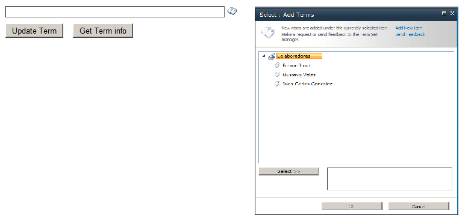
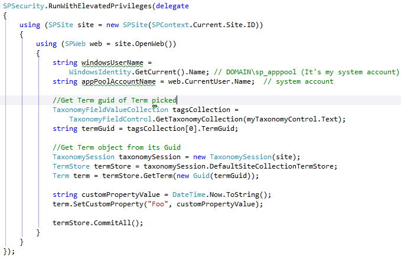
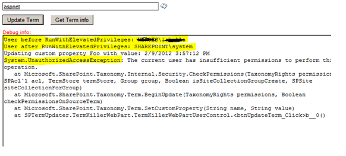
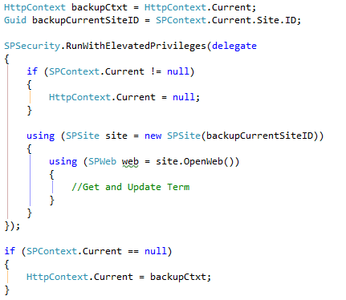

Partimos del siguiente escenario. Tenemos un conjunto de términos *TermSet* abierto, donde utilizando el control estándar de SharePoint, se han creado varios términos. Además, tenemos la necesidad desde código, de poder acceder a un término *Term*, y actualizar alguna de sus propiedades, por ejemplo para añadirle una propiedad personalizada, que podría indicarnos la última fecha/hora en la que se utilizó el término, o el número de veces que ese término se ha utilizado. Para acabar con la descripción del escenario, tenemos una última restricción, y es que el usuario del contexto, con el que se ejecutará nuestro código, no tiene permisos de administración sobre el conjunto de términos *TermSet*.

Para ilustrar mejor el escenario, observemos la Imagen 1, donde tenemos un control *TaxonomyWebTaggingControl* que está enlazado a un conjunto de términos. Además, tenemos un botón "*Update Term*", que intentará añadir una *Custom Property* al *Term* seleccionado.

Nota: En el número de Septiembre de 2012 de CompartiMOSS, tenemos un artículo que explica como configurar y enlazar el control *TaxonomyWebTaggingControl*.

Como en nuestro escenario, estamos logados con un usuario que no es administrador del Almacén de términos, si intentamos actualizar el Term, tendremos un error de permisos. Para que nuestro código se ejecute con los permisos suficientes, usaremos la función  SPSecurity.RunWithElevatedPrivileges

Como ya sabemos, al usar *RunWithElevatedPrivileges*, nuestro código se ejecutará con la cuenta del sistema de SharePoint. Debemos asegurarnos que la cuenta del sistema, sí es administrador del Almacén de términos (por lo general, lo será).

El Listado 1 contiene el código necesario para recuperar el término seleccionado, e intentar actualizar una propiedad, usando *RunWithElevatedPrivileges*.

Si lanzamos ese código (con algunas líneas más de debug), con un usuario que no es administrador del almacén de términos, obtendremos el resultado de la Imagen 2.

Si nos fijamos en las 2 primeras líneas de la caja de texto, vemos como en la primera, nos muestra el usuario logado, antes de ejecutar el *RunWithElevatedPrivileges*. En la siguiente línea, observamos el usuario logado, una vez dentro del *RunWithElevatedPrivileges*, que, como cabría de esperar, es el usuario de la cuenta del sistema.

Sin embargo, obtenemos la misma excepción de permisos insuficientes, al intentar actualizar el término. Esto es debido a un pequeño bug de SharePoint 2010 que hace que el nuevo contexto que se crea al usar *RunWithElevatedPrivileges*, no tenga correctamente actualizados los permisos relativos al almacén de términos.

Por suerte, tenemos un sencillo workaround, que forzará a que el nuevo contexto se genere refrescando también los permisos relativos al almacén de términos.

El concepto del workaround es sencillo, y se resume en estos 4 pasos:

1. Hacemos una copia del HttpContext actual.
2. Limpiamos el HttpContect actual, lo que limpiará también el SPContext.
3. Creamos el nuevo contexto, con el New del SPSite y el SPSite.OpenWeb. Este paso sería el código anterior del Listado 1.
4. Restauramos el contexto con el HTTPContext que hemos guardado en el paso 1.

El Listado 2 contiene el código completo, excepto parte del paso 3, que ya está en el listado 1.

**Luis Máñez**
MCPD SharePoint 2010 / Microsoft Active Professional 2012
 [http://geeks.ms/blogs/lmanez/](http&#58;//geeks.ms/blogs/lmanez/)
 [http://twitter.com/luismanez](http&#58;//twitter.com/luismanez)

