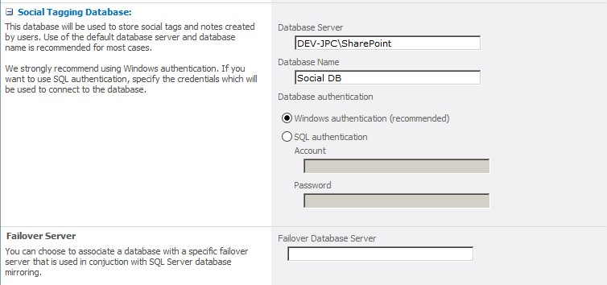

​Hace algún tiempo, trabajando en un portal de intranet en el cual se utilizó la plantilla de sito de publicación, me encontré con el siguiente requerimiento: *El cliente nos manifestó la necesidad de contar con un sub sitio de noticias organizacionales. Estas noticias deberían ser visualizadas en diferentes páginas de la intranet, como por ejemplo la home. Para esto se había desarrollado una WebPart que listaba todas las noticias con su imagen y una breve descripción, y al hacer clic en el título de una de ellas, se redirigía al detalle de la misma.*

Hasta este punto el requerimiento no era nada fuera de lo común, el problema surgió cuando se nos manifestó la necesidad de que cada noticia en su detalle, contara con un área en la cual los usuarios pudieran realizar comentarios.

Adicionalmente se sumó la necesidad de incorporar un control del texto ingresado por el usuario. El mismo debía ser evaluado con la intención de minimizar la aparición de palabras inapropiadas a la hora de mostrar al público el comentario.  A partir de esta definición, se nos solicitó contar con una lista que contenga todas aquellas palabras que la organización entendía inapropiadas, con el objetivo de poder administrar cada una de ellas.

Por lo tanto, el texto ingresado por un usuario sería analizado, verificando que ninguna de las palabras definidas como inapropiadas exista en el texto, en el caso de que se encontrara, el comentario se eliminaría automáticamente.

Luego de tener la definición completa del requerimiento, y de analizar cuál era la mejor alternativa para satisfacer el mismo, se presentó la opción de utilizar las capacidades sociales que SharePoint Server 2010 provee, muchas de ellas utilizan el servicio de sincronización de perfiles, puntualmente utilizan la base de datos Social Tagging, que se define a la hora de crear el servicio antes mencionado.



Luego de haber definido que íbamos a trabajar con las características sociales provistas por SharePoint, se buscó aprovechar el Web  Control SocialCommentControl que nos proveer la funcionalidad de comentarios.

A partir del mismo se pasó a definir cómo se iba a incorporar dicho Web Control en las páginas de noticias, así como también cómo se iba a trabajar para llevar a cabo el control del texto basado en la lista de palabras inapropiadas antes mencionada.

La solución que finalmente se implementó derivo en la creación de un Web Control que extendía la funcionalidad out of the box del control SocialCommentControl, con la intención de incorporar la capacidad de analizar y controlar el texto ingresado.

Cabe destacar que se debió referenciar una serie de dlls de modo de tener a disposición las características sociales de este.

En la siguiente imagen se muestran las referencias necesarias, para poder contar con las características sociales antes mencionadas:


Hasta este punto  se había construido un Web Control que extendía el SocialCommentControl y que permitía utilizar todas las funcionalidades out of the box que este provee. Por lo tanto, para lograr contar con el chequeo de palabras inapropiadas se sobrescribió el método RenderComment  el cual se encarga de "dibujar" el comentario en pantalla, de esta forma logramos interceptar el proceso de presentación de los comentarios, pudiendo efectuar el control del texto.

A continuación se presenta un extracto de código que presenta la idea general:

```
public class SocialCommentWebControl : SocialCommentControl
```

```
    {
```

```
        protected override void RenderComment(StringBuilder strBuilder,
```

```
                                Microsoft.Office.Server.SocialData.SocialComment comment,
```

```
                                int sequence, int page)
```

```
        {
```

```
            if (comment.Comment.Contains("Palabra a controlar"))
```

```
                comment.Delete();
```

```
            else
```

```
                base.RenderComment(strBuilder, comment, sequence, page);
```

```
        }
```

```
    }
```

```
 
```

Cabe destacar que el código es un ejemplo y que no está implementado el acceso a la lista de palabras inapropiadas.

Por último y como cierre, se construyó una WebPart con el objetivo de poder maximizar la reutilización del nuevo control. Pudiendo utilizar este, tanto en los layouts de noticias (como indicaba el requerimiento inicial del cliente), como también en cualquier WebPart Zone en la cual tuviéramos la necesidad de contar con comentarios.


**Juan Pablo Capdevila**
 [jcapdevila@pragmaconsultores.com](mailto:jcapdevila@pragmaconsultores.com) 
 [http://www.pragmaconsultores.com](http://www.pragmaconsultores.com/)

