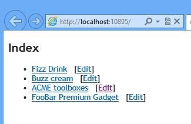
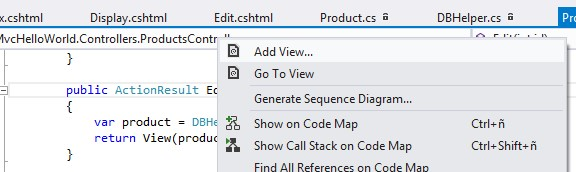
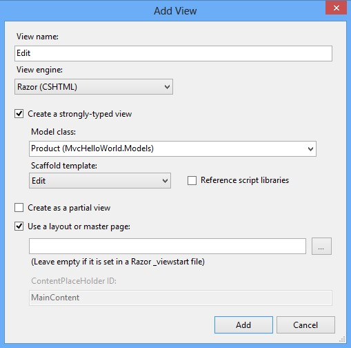
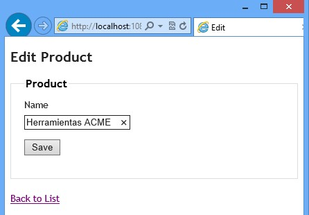
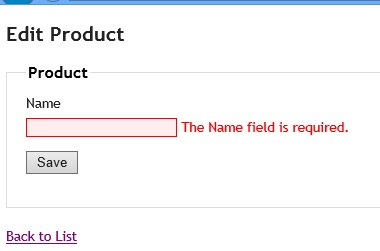
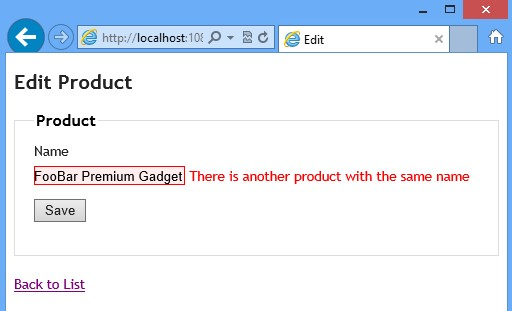

​En el artículo previo vimos las bases de la programación de aplicaciones web en ASP.NET MVC conectadas a SharePoint mediante el modelo de objetos de cliente. La aplicación que acabamos haciendo mostraba los detalles de una lista de productos alojada en SharePoint. Sin embargo, nuestra aplicación era de sólo lectura, sin posibilidad de modificar los productos o añadir productos nuevos.

**Edición en MVC**

La edición de entidades de negocio (el "modelo") en MVC suele ir dividida en dos acciones en el controlador (recordemos que el controlador es la clase donde está la lógica de las acciones de las diferentes páginas). Las dos acciones se llaman igual y la diferencia es que una se activa al realizar una petición GET y la otra una petición POST. La primera acción Edit (GET) sirve para "poner en edición", mostrando una vista con controles de edición como las cajas de texto, opciones u otros mientras la segunda acción Edit (POST) recoge los valores editados al hacer clic en el botón "Guardar".

Vayamos a nuestra aplicación de la entrega anterior, llamada MvcHelloWorld. La podéis descargar de [http://sdrv.ms/XRmW0O](http://sdrv.ms/XRmW0O).

Añadiremos dos acciones a la clase ProductsController.cs. La primera acción es la que activará la edición de un producto basándose en su identificador id. De hecho, esta acción es la misma que la de Display de la entrega anterior: va a la clase auxiliar DBHelper a buscar el producto en SharePoint y luego muestra la vista de ese producto.

```
 public ActionResult Edit(int id)
 {
     var product = DBHelper.GetProduct(id);
     return View(product);
 }
```

La segunda acción es la que recogerá los valores editados y actualizará el producto (invocando el método SaveProduct dentro de DBHelper). Todavía no tenemos este método pero lo vamos a hacer en seguida. Más adelante también veremos cómo MVC es capaz de pasarle una instancia de la clase Product a esta acción y nos ocuparemos de la misteriosa llamada RedirectToAction. Observad que decoramos esta acción con el atributo HttpPost, para indicar que sólo se tiene que activar al recibir una petición POST.

```
 [HttpPost]
 public ActionResult Edit(MvcHelloWorld.Models.Product product)
 {
     if (ModelState.IsValid)
     {
         DBHelper.SaveProduct(product);
         return RedirectToAction("Index");
     }
     return View(product);
 }
```

La edición de un elemento de lista en SharePoint mediante el modelo de objetos de cliente se realiza cargando ese elemento en una variable, con el método List.GetItemById(), cambiando las propiedades y luego llamando al ClientContext.ExecuteQuery(). Vamos a agregar el método que falta al DBHelper:

```
 public static void SaveProduct(Product p)
 {
     ClientContext clientContext = PrepareClientContext();
     List list = clientContext.Web.Lists.GetByTitle("Products");
     clientContext.Load(list);
     ListItem listItem = list.GetItemById(p.ProductId);
     clientContext.Load(listItem);
     listItem["Title"] = p.Name;
     listItem.Update();
     clientContext.ExecuteQuery();
 }
```

**Enlazar la vista de edición**

Hasta ahora, no tenemos la edición en marcha. Tenemos listo el controlador y la parte de SharePoint, pero nos faltan dos cosas más: la vista de edición propiamente dicha y como llamar a la acción Edit desde el listado de productos.

El segundo problema es el más fácil de resolver. En MVC las llamadas a acciones se renderizan con la sintaxis @Html.ActionLink de Razor. Si editamos la vista de la acción Index (Index.cshtml), veremos que estamos construyendo una lista no ordenada de elementos, y que cada elemento es un enlace a la acción Display pasándole el parámetro ID del elemento de la lista en cuestión.

```
<ul>
    @foreach (var p in Model) {
        <li>
            @Html.ActionLink(p.Name, "Display", new { id=p.ProductId })
        </li>
    }
</ul>
```

De la misma manera, usaremos ActionLink para generar el enlace de edición de un producto, al lado del enlace de la acción Display:

```
<ul>
    @foreach (var p in Model) {
        <li>
            @Html.ActionLink(p.Name, "Display", new { id=p.ProductId })
            &nbsp;
            [@Html.ActionLink("Edit", "Edit", new {id=p.ProductId})]
        </li>
    }
</ul>
```

Recordad que ActionLink tiene tres parámetros: el texto del enlace, el nombre de la acción y los parámetros de la acción. Además, en la sintaxis de Razor, todo lo que escribimos es HTML literal excepto lo que sigue a los marcadores @. Por eso ponemos los corchetes para que la acción Edit salga separada del enlace a los detalles del producto:



**"Scaffolding"**

Nos queda pendiente realizar la vista de edición. Podemos hacerla a mano, como en la entrega anterior, o bien usando "scaffolding". Se trata de una característica de MVC en Visual Studio que nos permite generar la vista de manera automática, ahorrando tiempo y minimizando la posibilidad de error.

Para crear la vista, igual que antes, haremos clic con el botón derecho encima de la acción del controlador y elegiremos "Add View":



En el diálogo que se nos presenta, marcaremos la vista como fuertemente tipada (para que podamos acceder a la clase Product desde la vista) y en el apartado “Scaffold template” elegiremos “Edit”. Desmarcaremos la opción de referencias los ficheros de script, ya que no hacemos nada con ellos.



La vista generada con scaffolding tiene la pinta siguiente:

```
@model MvcHelloWorld.Models.Product
@{
    ViewBag.Title = "Edit";
}
<h2>Edit</h2>
@using (Html.BeginForm()) {
    @Html.ValidationSummary(true)
    <fieldset>
        <legend>Product</legend>
        @Html.HiddenFor(model => model.ProductId)
        <div class="editor-label">
            @Html.LabelFor(model => model.Name)
        </div>
        <div class="editor-field">
            @Html.EditorFor(model => model.Name)
            @Html.ValidationMessageFor(model => model.Name)
        </div>
        <p>
            <input type="submit" value="Save" />
        </p>
    </fieldset>
}
<div>
    @Html.ActionLink("Back to List", "Index")
</div>
```

Como podéis ver, scaffolding nos genera un formulario HTML con un botón de Submit que lo que hará es realizar una petición POST de la acción Edit (por ello tenemos la segunda acción en el controlador, activada por POST). La llamada POST enviará al controlador el valor de todos los controles que hay en la vista, en nuestro caso ID y Name del producto. El formulario está encapsulado dentro de una instrucción using(Html.BeginForm()).

La "magia" de MVC convertirá estos valores en una instancia de clase Product en la segunda acción Edit. Esto se realiza a través de un componente llamado Model Binder, que veremos en otras entregas de esta serie de artículos. Por ahora, lo que nos interesa saber es que el Model Binder por defecto sabe cómo mapear la vista al modelo y viceversa.

Además, tenemos un control para mostrar el resumen de las validaciones (las veremos a continuación) y los controles para cada propiedad del modelo se hacen mediante llamadas a EditorFor, HiddenFor y LabelFor. Estos métodos auxiliares de @Html generan el control HTML adecuado para cada tipo de propiedad (cajas de texto para strings y números, checkboxes para booleanos, etc). Observad que el ID del producto se muestra oculto, pero se envía en la edición al servidor.

Si ahora ejecutamos la aplicación, veremos que podemos editar los nombres de los productos:



**Validaciones en MVC**

Para que nuestra aplicación de ejemplo sea más realista, vamos a añadir la validación del nombre del producto. Pondremos una longitud máxima para esta propiedad.

***Validación con DataAnnotations***

En MVC, podemos extender nuestro modelo con atributos llamados data annotations (espacio de nombres System.ComponentModel.DataAnnotations). Estos atributos indican que las propiedades de la clase tienen ciertas restricciones que se validarán al crear o editar las instancias de la clase.

Vamos a añadir dos atributos a la clase Product: Required y StringLength, para especificar que la propiedad no puede estar vacía y que su longitud máxima es de 50 caracteres:

```
using System.ComponentModel.DataAnnotations;
 [StringLength(50), Required]
 public string Name { get; set; }
```

Sólo con este pequeño cambio ya tenemos la validación activada. La acción Edit del controlador tiene una comprobación de la validez del modelo, usando la propiedad ModelState.IsValid, antes de proceder con el guardado del producto. Si la validación es correcta, invocamos la acción Index para ver el listado de los productos usando el método RedirectToAction. En el caso contrario, le devuelve la vista para que se muestre el mensaje de error:

```
  if (ModelState.IsValid)
  {
      DBHelper.SaveProduct(product);
      return RedirectToAction("Index");
  }
  return View(product);
```

Ejecutando la aplicación, comprobamos que la validación se está disparando correctamente. En este caso el mensaje de validación es automático y si lo queremos cambiar hay que agregar el parámetro ErrorMessage al atributo de validación dentro de la clase Product.



***Validación remota***

Algunas veces no podemos validar la edición de un objeto sin realizar alguna acción externa. Por ejemplo, para validar que no haya productos con el nombre duplicado tenemos que realizar una búsqueda de todos los productos. Para dar soporte a este tipo de validaciones, MVC nos permite realizar la validación remota.

La validación remota necesita tener referenciadas las librerías de JavaScript y lo que hace es realizar una llamada JSON a una acción de nuestra elección. Si la acción devuelve true, la validación es correcta. Si no, se muestra el mensaje de error.

En nuestro caso añadiremos un controlador nuevo para la validación, llamado ValidationController, con la acción NameAlreadyExists:

```
    [OutputCache(Location = OutputCacheLocation.None, NoStore = true)]
    public class ValidationController : Controller
    {
        public JsonResult NameAlreadyExists(string name)
        {
            var products = DBHelper.GetProducts();
            int howMany = products.Where(x => x.Name == name).Count();
            if (howMany == 0)
            {
                return Json(true, JsonRequestBehavior.AllowGet);
            }
            else
            {
                return Json("There is another product with the same name", JsonRequestBehavior.AllowGet);
            }
        }
    }
```

El código del controlador es muy sencillo y lo que hace es comprobar que no existan productos con el nombre que se le está intentando asignar al producto en edición. Notad también que le decimos a MVC que nunca almacene el resultado de la llamada en la caché y asegurar que siempre se llamará al servidor.

Ahora tenemos que añadir el atributo de validación Remote a la propiedad Name de la clase Product. Allí le especificamos que acción de que controlador vamos a ejecutar. El nombre y el tipo de la propiedad a validar tienen que coincidir con los de la acción validadora:

```
    public class Product
    {
        public int ProductId { get; set; }
        [StringLength(50), Required]
        [Remote("NameAlreadyExists", "Validation")]
        public string Name { get; set; }
    }
```

Por último, tenemos que agregar las referencias al JavaScript de validación antes de la instrucción @using en la vista Edit.cshtml:

```
<script src="@Url.Content("~/Scripts/jquery.validate.min.js")" type="text/javascript"></script>
<script src="@Url.Content("~/Scripts/jquery.validate.unobtrusive.min.js")" type="text/javascript"></script>
```

Ahora podemos comprobar que la edición de un producto no permite insertar nombres repetidos.



**Conclusión**

En este artículo hemos visto como editar las entidades de negocio en ASP.NET MVC y como agregar validaciones locales y remotas. En el próximo número veremos la inyección de dependencia y cómo podemos realizar pruebas unitarias con MVC. Hasta entonces, ¡feliz lectura!

El código completo de este artículo está disponible en [http://sdrv.ms/11j0cHC](http://sdrv.ms/11j0cHC).


**Edin Kapić**
 Arquitecto SharePoint
 [edin.kapic@spenta.es](mailto:edin.kapic@spenta.es)
 @ekapic
 [http://www.spenta.es](http://www.spenta.es/)

 
 
import LayoutNumber from '../../../components/layout-article'
export default LayoutNumber
