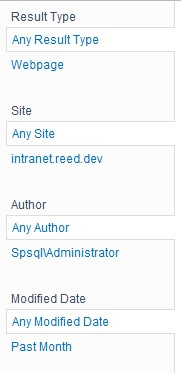
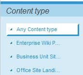
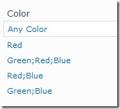
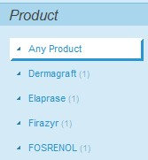

​La WebPart de Panel de Refinamiento es uno de las más utilizadas en SharePoint 2010 cuando se construyen Search Driven Applications. Esta WebPart nos permite realizar filtrados sobre los resultados de una búsqueda.



Como vemos en la Imagen 1, el panel de refinamiento trae algunos filtros por defecto: Autor, Tipo de resultado, etc. Un requisito muy común en aplicaciones de búsqueda, es poder añadir filtros de otras columnas de metadatos, para ello hay que configurar la propiedad "*Filter category definition*", dentro del apartado "*Refinement*". Dicha propiedad es una cadena de XML con un formato específico, que permitirá definir las categorías que queremos utilizar como filtros.

Para añadir nuestra categoría, primero hemos de asegurarnos que tenemos una propiedad administrada en la aplicación de servicio de búsqueda. El siguiente código muestra como añadir una categoría de filtro para la propiedad "*ContentType*"

```
<Category Title="Content type" 
          Description="Content type of the item" 
          Type="Microsoft.Office.Server.Search.WebControls.ManagedPropertyFilterGenerator" 
          MetadataThreshold="1" 
          NumberOfFiltersToDisplay="4" 
          MaxNumberOfFilters="20" 
          SortBy="Frequency" 
          SortByForMoreFilters="Name" 
          SortDirection="Descending" 
          SortDirectionForMoreFilters="Ascending" 
          ShowMoreLink="True" 
          MappedProperty="ContentType" 
          MoreLinkText="show more" 
          LessLinkText="show fewer" />
```

Y aquí podemos encontrarnos con el primer problema, y es que la propiedad administrada *ContentType*, tiene un comportamiento algo extraño. Si no conseguimos hacer funcionar el código anterior, la solución pasa por crear una nueva propiedad administrada, digamos "*ItemContentType*" y mapearla a las mismas propiedades rastreadas que tiene la propiedad "*ContentType*". Si hacemos esto, tendremos el tipo de contenido disponible para el filtrado.



Otro requisito muy común es que la categoría por la que filtrar, sea una columna de tipo Metadatos administrados. En este caso, un código como el anterior funcionará perfectamente, excepto en aquellos casos que la columna de metadatos admita múltiples valores, y tengamos catalogado algún documento o ítem con varios valores en dicha columna. La siguiente imagen muestra el resultado:




Como se observa en la imagen 3, aparecen varios valores en un mismo filtro, separados por ";", además, si se pincha sobre uno de estos filtros, no se devuelve ningún resultado.

Existen muchas referencias en internet sobre como añadir filtros al panel de refinamiento, y en algunos casos se comenta este tipo de comportamiento, sin embargo, no existen referencias sobre su solución, y en muchos casos se comenta que es un bug del producto, o que hay que desarrollar código para conseguir el efecto esperado.

Por suerte, SharePoint si tiene una solución OOB a este requerimiento. Para ello, tan solo debemos utilizar otro control generador de la categoría. Este control se define en el atributo *type* del XML. El control que necesitamos es:

```
Microsoft.Office.Server.Search.WebControls.TaxonomyFilterGenerator
```


Además de este control, hay otra consideración muy importante al respecto. Se trata de la propiedad a la que se mapea el control. Pero antes de ver como mapearlo, una aclaración sobre las propiedades administradas en columnas de metadatos.

Cuando se crea una columna de tipo metadato y se indexa en el buscador, SharePoint crea automáticamente 2 propiedades rastreadas, una, que podríamos llamar normal, ya que tiene el formato habitual de las propiedades rastreadas, y que sería:

ows\_NombreDeLaColumna

Y una segunda propiedad, con el siguiente formato:

ows\_taxId\_NombreDeLaColumna

No lo puedo asegurar a ciencia cierta, pero mi sensación es que la primera columna almacena el valor en texto del metadato, mientras que la segunda, almacena el Identificador del Término en el almacén de términos.

Además de estas dos propiedades rastreadas, SharePoint crea una propiedad administrada, mapeada a la segunda rastreada (ows\_taxId\_NombreDeLaColumna), con el formato:

owstaxIdNombreDeLaColumna

El control *TaxonomyFilterGenerator* necesita que el atributo *MappedProperty* del XML, tenga un valor fijo: "*ows\_MetadataFacetInfo*". Pero además, el atributo *Title*será el nombre de la propiedad administrada autogenerada por SharePoint, eliminando el prefijo *owstaxId*. Por ejemplo, si tenemos:


| ​ | Nombre | Mapeada a |
| --- | --- | --- |
| Columna de sitio | Product |   |
| --- | --- | --- |
| Propiedades rastreadas | ows\_Product |   |
| --- | --- | --- |
| ​ | ows\_taxId\_Product |   |
| --- | --- | --- |
| Propiedad administrada | owstaxIdProduct | ows\_taxId\_Product |
| --- | --- | --- |


El XML necesario para configurar correctamente nuestro filtro seria:

```
<Category   Title="Product"              
            Description="Use this filter to restrict results by a specific Product"              
            Type="Microsoft.Office.Server.Search.WebControls.TaxonomyFilterGenerator"              
            MetadataThreshold="3"              
            NumberOfFiltersToDisplay="6"
            MaxNumberOfFilters="20"              
            ShowMoreLink="True"             
            MappedProperty="ows_MetadataFacetInfo"    
            MoreLinkText="show more"           
            LessLinkText="show fewer"         
            ShowCounts="Count" />
```

Con esto resolvemos el problema, y obtenemos la funcionalidad deseada.



El siguiente enlace contiene algo de información al respecto de los controles que podemos utilizar para los filtros:

[http://msdn.microsoft.com/en-us/library/ff625183(v=office.14).aspx](http://msdn.microsoft.com/en-us/library/ff625183%28v=office.14%29.aspx)


**Luis Mañez**
 MCPD SharePoint 2010 and Microsoft Active Professional
 @luismanez
 [http://geeks.ms/blogs/lmanez](http://geeks.ms/blogs/lmanez)

 
 
import LayoutNumber from '../../../components/layout-article'
export default LayoutNumber
