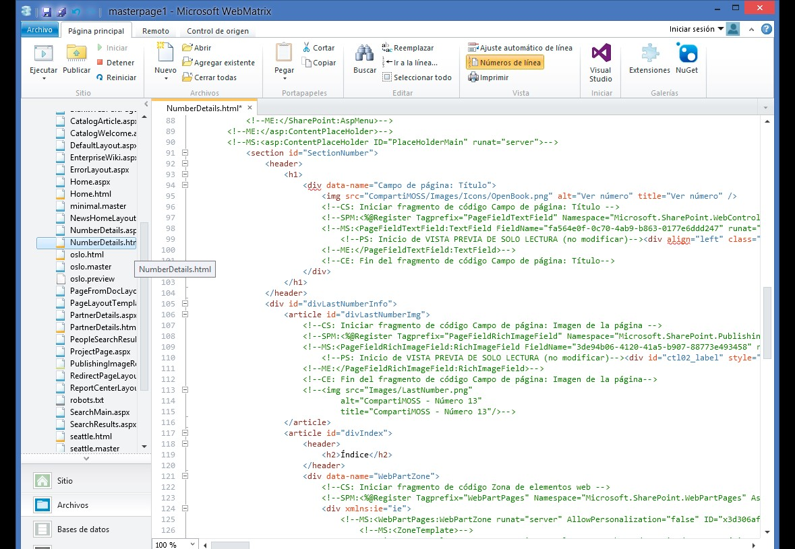
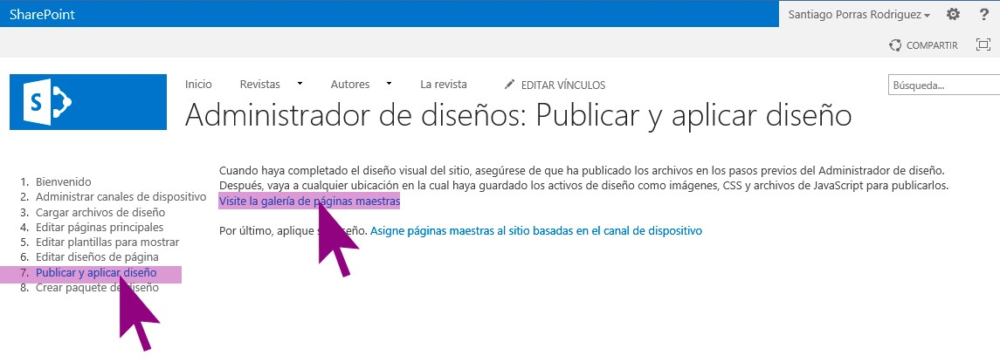

​En esta segunda entrega, veremos las secciones que nos quedaron pendientes para terminar un diseño de un sitio de publicación de SharePoint 2013, los diseños de página y las plantillas de elementos, y veremos que crear un diseño personalizado es ahora más fácil que nunca y, que con poco esfuerzo y bastante conocimiento de HTML y JavaScript, podremos tener terminado nuestro sitio, listo para que los editores de contenido comiencen a enriquecerlo.

**Crear Diseños de página**

Al igual que hacíamos en SharePoint 2010, **podremos personalizar nuestros diseños de página para crear plantillas que estructuren la información,** de una forma acorde con nuestro diseño. De esta forma, para CompartiMOSS hemos implementado las siguientes plantillas

- Home
- Plantilla para detalles de un Número
- Plantilla para detalles de un Artículo
- Plantilla para detalles de un Autor
- Plantilla para detalles de un Partner

Para crear un nuevo Diseño de página***,***hay que seleccionar la opción "*Editar diseños de página*" desde el "*Administrador de diseños*" y posteriormente seleccionar la acción "*Crear un diseño de página*" como se ilustra en la siguiente.

Una vez hayamos seleccionado la opción "*Crear un diseño de página*" se abrirá un cuadro de diálogo donde habrá que establecer un nombre para la plantilla y seleccionar una MasterPage y el tipo de contenido que se mostrará en las páginas con esta nueva plantilla.

Como podéis ver en la imagen 2, para CompartiMOSS hemos creado algunos tipos de contenido "Author", "MagazinePartner", "MagazineNumber" y "MagazineArticle" con sus correspondientes campos personalizados que nos ayudaran a relacionarlos entre sí y que nos permitirán mostrar la información necesaria para cada uno de ellos.

​Al aceptar y tras unos segundos, la nueva plantilla aparecerá en la lista como hemos visto en la imagen 3, y ya podremos empezar a editarla en nuestro editor de HTML preferido, en este caso, he usado WebMatrix 3 que va fenomenal para estas tareas.

**NOTA**: Tenemos que tener en cuenta varias opciones:

- Para editar un diseño de página debemos tenerlo desprotegido.
- Sólo es necesario que desprotejamos el archivo HTML.
- Para poder usarla la primera vez deberemos haberla protegido antes, si no aparecerá disponible para seleccionar.

En estos momentos, es posible editar la plantilla desde su HTML pero, ¿cómo podemos añadir nuevos campos, WebParts u otros elementos? Esta tarea es muy sencilla y se realiza de la misma forma que para insertar elementos en la Masterpage.

1. Seleccionar el diseño de página.
2. Seleccionar "Fragmentos de código" de la vista previa del diseño de página.
3. Seleccionar el elemento que se quiera insertar, configurar si es necesario.
4. Copiar código generado y pegar en la plantilla de página desde el editor de HTML en la ubicación donde se deba mostrar según el diseño que hayamos realizado.

Con esto ya hemos creado el diseño de página adecuado para mostrar nuestro contenido y, tras proteger y publicar el diseño de página podemos ver el resultado deseado.

**Definición de plantillas de elementos de contenido**

Esta es la parte más compleja quizás porque aquí interviene muchísimo el conocimiento que podamos tener de JavasScript y, para entenderlos, quería hacer una pequeña introducción previa.

Las plantillas de elementos de contenido vienen a sustituir, dentro del nuevo paradigma de SharePoint 2013, a los *ItemStyles* que usábamos en versiones anteriores para establecer cómo se deben mostrar los elementos de contenido de un Web Part. En este nuevo ámbito, aunque siguen existiendo los *ItemStyles* por compatibilidad con SharePoint 2010, deberemos afrontar estas plantillas con HTML y JavaScript, haciendo uso de un "pseudolenguaje" de sustitución de elementos dentro de las propias plantillas.

Una vez hecha esta introducción un poco abstracta, pasemos a ver cómo generar una nueva plantilla de elementos de contenido tomando como ejemplo, el diseño de página de un número de la revista NumberDetails que contiene una lista con los artículos pertenecientes a ese número en cuestión.

Para crear una nueva plantilla, lo más sencillo es ir al editor de HTML que estemos usando y crear un nuevo documento HTML bajo la carpeta "*Display Templates*à *Content Web Parts*" como se ilustra en la imagen 7.

Para el ejemplo de CompartiMOSS, esta plantilla se corresponderá con los artículos que contiene un número de la revista, por lo que llamaré CompartiMOSS\_Article.html al documento que la contiene, tal y como se puede ver en la imagen siguiente.

Una vez creado el archivo, si guardamos y refrescamos esta carpeta desde el editor de HTML que estemos usando, podremos comprobar cómo se crea un archivo con extensión *.js* de forma automática, con el mismo nombre del documento HTML que acabamos de crear para guardar la plantilla de artículo tal y como se muestra en la imagen 9. Este archivo contendrá el código que finalmente ejecutará SharePoint, pero ¡ojo! No debemos tocar este archivo.

**NOTA**: Tenemos que tener en cuenta varias opciones:

- Para editar una plantilla debemos tenerla desprotegida.
- Sólo es necesario que desprotejamos el archivo HTML.
- Para poder usarla la primera vez deberemos haberla protegido antes, si no aparecerá disponible para seleccionar.

El archivo HTML con la plantilla debe contener, entre otras cosas, **l**a estructura completa de una página HTML con su sección "*head*" y su sección "*body*" donde iremos insertando nuestro código para maquetar los elementos que queremos mostrar mediante esta plantilla pero, como ya indiqué al principio, es MUY especial ya que se trata de HTML con JavaScript y un "pseudocódigo" de etiquetas que SharePoint reemplazará por el código JavaScript final y que ensamblará en el archivo con extensión .js que generó automáticamente.

En la sección "*head*" de la página, debe estar la definición de la plantilla junto a los parámetros que va a recibir tal y como se muestra en la imagen 10.

En la sección "*body*", debemos añadir la estructura HTML de los elementos que queramos mostrar mediante esta plantilla y, además, las etiquetas correspondientes a los campos como se puede apreciar en la imagen 11.

A priori puede parecer muy complicado este nuevo formato de plantillas, pero rápidamente podréis comprobar que al final resulta muy sencillo generar nuevas plantillas en las que se puede controlar completamente el código HTML generado y que, además, pueden contener JavaScript para realizar operaciones, animaciones, etc.

**NOTA**: Una buena forma de comenzar a entender cómo funcionan estas plantillas es revisar cómo están estructuradas algunas de las que vienen por defecto y comprobar en qué se traduce el código en el archivo con extensión .js. Además, para empezar la primera plantilla se puede optar por copiar el código de una de las existentes y modificarlo a nuestro antojo.

Podemos ver las nuevas plantillas creadas en la lista desde el Administrador de diseños seleccionando la opción "*Editar plantillas para mostrar*" tal y como podemos ver en la siguiente imagen.

El resultado podemos verlo en la página de un número de la revista, donde se incluye un listado con los artículos que contiene mediante el uso de un WebPart de Búsqueda de contenido que hace uso de esta plantilla para sus elementos.

**Publicar y aplicar diseño**

Finalmente sólo nos queda publicar nuestro diseño y aplicarlo al sitio. Esto lo podemos realizar mediante el enlace hacia la lista de "*Páginas maestras*" y que se encuentra disponible tanto desde el Administrador de diseños usando para ello la opción mostrada en la imagen 14 o, también desde la "*Configuración del sitio*".

Una vez en el listado de elementos de diseño, compuesto por los diseños de página, las páginas maestras, plantillas de elementos, … sólo tenemos que proteger y publicar una versión superior de los ficheros que hayamos tocado, sólo los .html, ya que los generados por SharePoint se protegen automáticamente.

**Santiago J. Porras Rodríguez**
Nokia Developer Champion 
UX Developer 
[http://geeks.ms/blogs/santypr](http://geeks.ms/blogs/santypr) 
@saintwukong

