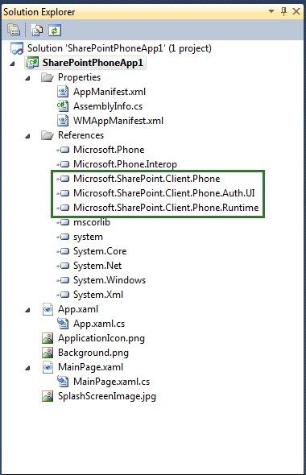
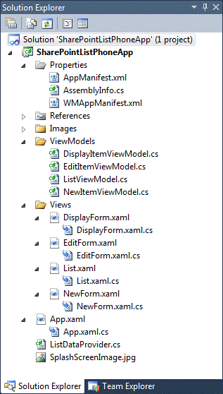

Cada vez es más importante la movilidad en nuestro día a día. Los dispositivos móviles se están convirtiendo en herramientas casi imprescindibles en nuestro trabajo. El mundo de las aplicaciones móviles permite a los usuarios empresariales poder acceder a sus sistemas, documentos e información estén donde estén.

Los usuarios de SharePoint tienen un gran aliado en Windows Phone ya que permite, de manera nativa, acceder a librerías documentales de SharePoint desde el hub de Office. Además, gracias a las aplicaciones de Word, Excel, PowerPoint y OneNote, es posible leer y editar estos documentos ubicados en SharePoint.

Pero hay numerosas ocasiones en las que no nos basta con poder consultar los documentos de SharePoint. Nuestras intranets están cargadas de otra serie de datos, páginas y listas que puede ser necesario consumir desde nuestro teléfono. Y es en ese punto en el que surge la necesidad de desarrollar una aplicación que obtenga información de SharePoint.

Es posible que un desarrollador de SharePoint no tenga una habilidad muy avanzada desarrollando en plataformas móviles. Afortunadamente, Microsoft ha creado unas plantillas de Visual Studio que nos ayudarán, mediante una serie de asistentes, a desarrollar aplicaciones que permitan trabajar con datos de SharePoint 2013, las Windows Phone SharePoint Application Templates.

Estas plantillas permiten crear en cuestión de minutos una aplicación de Windows Phone que permita trabajar (lectura, edición, creación y borrado) con los datos de una lista. Por ejemplo, se puede desarrollar en menos de 5 minutos (y con pocos conocimientos sobre Windows Phone) una aplicación para trabajar con una lista de tareas de SharePoint.

**Preparando el entorno de desarrollo**

Para preparar el entorno es necesario el siguiente software:

- Si vas a trabajar con el SDK de Windows Phone 8:
    - Microsoft Visual Studio 2012.
    - Windows Phone SDK 8.0:
        - [http://www.microsoft.com/en-us/download/details.aspx?id=35471](http&#58;//www.microsoft.com/en-us/download/details.aspx?id=35471)
    - Microsoft SharePoint SDK for Windows Phone 8:
        - [http://www.microsoft.com/en-us/download/details.aspx?id=36818](http&#58;//www.microsoft.com/en-us/download/details.aspx?id=36818)
- Si vas a trabajar con el SDK de Windows Phone 7
    - Microsoft Visual Studio 2010 (no están soportadas en VS 2012).
    - Windows Phone SDK 7.1:
        - [http://www.microsoft.com/en-us/download/details.aspx?id=27570](http&#58;//www.microsoft.com/en-us/download/details.aspx?id=27570)
    - Microsoft SharePoint SDK for Windows Phone 7.1:
        - [http://www.microsoft.com/en-us/download/details.aspx?id=35475](http&#58;//www.microsoft.com/en-us/download/details.aspx?id=35475)

Una vez que hayamos instalado el SDK de Windows Phone y el SDK de SharePoint para Windows Phone, aparecerán dos nuevas plantillas en Visual Studio:

- Windows Phone Empty SharePoint Application.
- Windows Phone SharePoint List Application.

Si no dispones de Visual Studio, el SDK instalará un Visual Studio Express for Windows Phone. Actualmente, estas plantillas están diseñadas para trabajar únicamente con C#. No están disponibles en Visual Basic.NET. Las plantillas para el SDK de Windows Phone 7 funcionan únicamente con Visual Studio 2010 y Visual Studio 2010 Express for Windows Phone.

Más información sobre la preparación del entorno puede ser encontrada en este enlace:

[http://msdn.microsoft.com/en-us/library/jj163943.aspx](http&#58;//msdn.microsoft.com/en-us/library/jj163943.aspx)

**APIs para trabajar en desarrollo móvil para SharePoint 2013**

Lo primero es hacer un breve repaso a las distintas API que tenemos disponibles en **SharePoint 2013** y que nos permiten trabajar con sus datos en cualquier plataforma (no sólo web). Es posible desarrollar soluciones externas al servidor SharePoint usando el modelo de objetos cliente .NET, el modelo de objetos JavaScript y la API REST.

- Client-side object model (CSOM):
    - Para aplicaciones que usen C#.
    - Para aplicaciones Silverlight y Windows Phone.

- Javascript object model (JSOM):
    - Muy sencillo para aplicaciones web y javascript de Windows 8.
    - Útil para desarrollar apps de SharePoint para el Marketplace.
- REST:
    - API independiente de la plataforma basada en estándares como OAuth y OData.

En este artículo, usaremos el modelo de objetos cliente (CSOM) de .NET para desarrollar aplicaciones para Windows Phone. De todas maneras, no estamos limitados sólo al desarrollo móvil en Windows Phone. Gracias a las API de JavaScript y de REST de SharePoint 2013, es posible crear aplicaciones para otra serie de terminales (Android, iOS, BlackBerry…), interactuar con los sitios de SharePoint ejecutando scripts en otras aplicaciones web, o integrar con otros sistemas que soporten capacidades REST. Más información puede encontrarse en este enlace: [http://msdn.microsoft.com/en-us/library/jj163228.aspx](http&#58;//msdn.microsoft.com/en-us/library/jj163228.aspx)

**Proyecto de Visual Studio basado en la Windows Phone Empty SharePoint Application template**

Si creamos un proyecto basado con la Windows Phone Empty SharePoint Application template, la estructura será muy similar a otros proyectos de Windows Phone, con la diferencia que se añaden referencias a las DLL instaladas por el Windows Phone SharePoint SDK:

- Microsoft.SharePoint.Client.Phone.dll
- Microsoft.SharePoint.Client.Phone.Auth.UI.dll
- Microsoft.SharePoint.Client.Phone.Runtime.dll

Los archivos de un proyecto basado en la plantilla Windows Phone Empty SharePoint Application son los archivos estándar de una aplicación de Silverlight de Windows Phone. El archivo MainPage.xaml contiene las declaraciones de XAML que constituyen la interfaz de usuario (UI) de la aplicación. El archivo MainPage.xaml.cs contiene el código para implementar lógica para soportar operaciones y eventos en la interfaz de usuario. El archivo App.xaml representa a la aplicación. El archivo App.xaml.cs, incluye código para controlar los eventos de ciclo de vida de la aplicación.

**Proyecto de Visual Studio basado en la Windows Phone SharePoint List Application template**

La **Windows Phone SharePoint List Application template** es la más potente de ambas aplicaciones. Esta aplicación está preparada para desarrollar de una forma rápida una aplicación que permita consultar, editar, crear y eliminar datos de una lista en concreto de SharePoint. Al crear un proyecto con esta plantilla, un asistente nos ayudará a configurar correctamente la aplicación para dejarla ligada a una lista de SharePoint y comenzar a trabajar. El asistente preparará el código necesario para poder lanzar directamente la aplicación y que funcione correctamente **sin tener que escribir ni una línea de código**.

Los archivos generados por este proyecto son los que se muestran en la Imagen 3.

Los archivos importantes de esta solución son:

- **App.xaml**: representa a la aplicación de Windows Phone. Incluye declaraciones de elementos relacionados con la aplicación, así como eventos de ciclo de vida de la aplicación como Application\_Deactivated y Application\_Closing.
- **App.xaml.cs**: archivo de code-behind de app.xaml. Podemos escribir código en este archivo para administrar el almacenamiento offline (local) de datos.
- **ListDataProvider.cs**: contiene el código para obtener acceso a datos de SharePoint y proporciona acceso a la sintaxis de consulta en el que se basan las distintas vistas de lista de la aplicación.
- **List.xaml**: formulario que muestra los distintos ítems de la lista, análogo a la vista All Items de SharePoint. Se renderizan los elementos mediante un control Pivot.
- **List.xaml.cs**: archivo code-behind de list.xaml. Contiene el código de métodos y eventos para los botones del formulario, como el botón Nuevo y el botón Actualizar.
- **DisplayForm.xaml**: formulario que muestra un elemento, análogo al formulario de display de SharePoint. Muestra el elemento con un StackPanel.
- **DisplayForm.xaml.cs**: archivo de code-behind de DisplayForm.xaml. Contiene el código de métodos y eventos para los botones del formulario, como el botón Nuevo y Actualizar.
- **EditForm.xaml**: formulario que edita un elemento, análogo al formulario de edición de SharePoint. Muestra el elemento con un StackPanel.
- **EditForm.xaml.cs**: archivo de code-behind de EditForm.xaml. Contiene el código de métodos y eventos para los botones del formulario, como el botón Guardar y Cancelar.
- **NewForm.xaml**: formulario que crea un elemento, análogo al formulario de nuevo elemento de SharePoint. Muestra el elemento con un StackPanel.
- **NewForm.xaml.cs**: archivo de code-behind de NewForm.xaml. Contiene el código de métodos y eventos para los botones del formulario, como el botón Guardar y Cancelar.
- **ListViewModel.cs**: origen de datos para el archivo List.xaml.
- **DisplayItemViewModel.cs**: origen de datos para el archivo DisplayForm.xaml.
- **EditItemViewModel.cs**: origen de datos para el archivo EditForm.xaml. Se puede escribir código en este archivo para validar los datos introducidos por el usuario al editar un elemento.
- **NewItemViewModel.cs**: origen de datos para el archivo NewForm.xaml. Se puede escribir código en este archivo para validar los datos introducidos por el usuario al crear un elemento.

**El patrón de diseño MVVM**

Las plantillas Windows Phone SharePoint List Application template, al igual que otras plantillas de Windows Phone, generan un proyecto que sigue el patrón de diseño Model-View-ViewModel (MVVM). Este patrón de diseño es una forma de organizar el código en un proyecto en capas, que pueden ser desarrolladas, probadas y modificadas de forma independiente. Es particularmente efectiva en el diseño de aplicaciones de Windows Presentation Foundation (WPF) y Silverlight.

En el presente artículo, supondremos que se tiene al menos un mínimo conocimiento de este patrón. Si no es así, puede consultarse el siguiente enlace, en el que se explica el funcionamiento completo de este patrón de diseño adaptado a las plantillas de SharePoint: [http://msdn.microsoft.com/en-us/library/jj163209.aspx](http&#58;//msdn.microsoft.com/en-us/library/jj163209.aspx)

Básicamente, los tres componentes o capas principales del patrón MVVM son la Vista, el Modelo y el Modelo de Vista. En los proyectos basados en la plantilla Windows Phone SharePoint List Application template, estos componentes son implementados por los distintos archivos que hemos repasado anteriormente, la Imagen 4 muestra la distribución.

**Creando una aplicación para trabajar con una lista de tareas en diez minutos**

El último punto que veremos en la creación de una aplicación de Windows Phone para trabajar con una lista de tareas de SharePoint. Aunque parezca sorprendente, se tarda 10 minutos y no es necesario tener conocimiento previo sobre el desarrollo en Windows Phone.

Para ello, crearemos un proyecto desde Visual Studio con la plantilla Windows Phone SharePoint List Application (Imagen 5).

Cuando pulsemos el botón de creación, saltará el asistente. En el primer paso, escribiremos la URL del sitio de SharePoint (online u on-premises). Aparecerán las listas del sitio. Seleccionamos la lista de tareas que queramos (Imagen 6) y pulsamos Next:

En el siguiente paso debemos seleccionar las vistas de la lista que queremos que se muestren en la aplicación. Si hemos creado vistas personalizadas se podrán seleccionar también. Seleccionamos las vistas que queramos (Imagen 7) y hacemos clic en Next:

En el siguiente paso, hay que seleccionar las operaciones que queremos realizar, en este caso seleccionaremos todas (Imagen 8) y pulsamos Next.

Y por último, debemos seleccionar qué columnas de la lista queremos mostrar en los formularios del paso anterior (Imagen 9) y hacer clic en Next y Finish.

Una vez hayamos acabado y finalizado el asistente, Visual Studio creará el proyecto de Windows Phone con todos los datos que hemos pasado. El proyecto ya está preparado para acceder a SharePoint y contiene todo el código, consultas y formularios necesarios:

Si lanzamos el proyecto, veremos que la app está lista para usar. Lo primero que nos pedirá es el login (en este caso en Office 365), como se puede ver en la Imagen 11.

A continuación se muestran las distintas vistas en varios pivot. Podemos movernos de unos a otros, tal y como se muestra en la Imagen 12.

Si pulsamos en un elemento, se mostrará el formulario para visualizarlo. Si en este formulario pulsamos el botón eliminar lo borraremos. Si pulsamos el botón editar, se abre el formulario de edición. Si en una de las vistas pulsamos el botón de nuevo se mostrará el formulario de creación. Los distintos formularios se visualizarán como los que vemos en la imagen 13.

Como se ve en el ejemplo, en tan sólo 10 minutos se puede generar una aplicación totalmente funcional sin escribir ni una línea de código. Una vez que se tenga, hay aspectos que seguro que nos interesa cambiar (selectores de fechas, mostrar coordenadas en mapas, añadir más formularios, validaciones de datos….), para los que habrá que tocar el código y los formularios. Varios de estos aspectos los veremos en el próximo número.

Si no puedes esperar, quieres investigar estas funcionalidades y quieres ampliar más conocimientos que los que trataremos en el siguiente artículo, hay guías excelentes en MSDN. Si estas guías no habría sido posible escribir el presente artículo:

- [Build mobile apps for SharePoint 2013](http&#58;//msdn.microsoft.com/en-us/library/jj163228.aspx) (http://msdn.microsoft.com/en-us/library/jj163228.aspx)
- [How to: Set up an environment for developing mobile apps for SharePoint](http&#58;//msdn.microsoft.com/en-us/library/jj163943.aspx)  (http://msdn.microsoft.com/en-us/library/jj163943.aspx)
- [Overview of Windows Phone SharePoint 2013 application templates in Visual Studio](http&#58;//msdn.microsoft.com/en-us/library/jj163786.aspx) (http://msdn.microsoft.com/en-us/library/jj163786.aspx)
- [Architecture of the Windows Phone SharePoint List Application template](http&#58;//msdn.microsoft.com/en-us/library/jj163209.aspx) (http://msdn.microsoft.com/en-us/library/jj163209.aspx)
- [How to: Create a Windows Phone SharePoint 2013 list app](http&#58;//msdn.microsoft.com/en-us/library/jj163259.aspx) (http://msdn.microsoft.com/en-us/library/jj163259.aspx)
- [How to: Store and retrieve SharePoint list items on a Windows Phone](http&#58;//msdn.microsoft.com/en-us/library/jj163143.aspx) (http://msdn.microsoft.com/en-us/library/jj163143.aspx)
- [How to: Implement business logic and data validation in SharePoint 2013 app for Windows Phone](http&#58;//msdn.microsoft.com/en-us/library/jj164107.aspx) (http://msdn.microsoft.com/en-us/library/jj164107.aspx)
- [How to: Support and convert SharePoint 2013 field types for Windows Phone apps](http&#58;//msdn.microsoft.com/en-us/library/jj163213.aspx) (http://msdn.microsoft.com/en-us/library/jj163213.aspx)
- [How to: Customize list item queries and filter data for Windows Phone apps](http&#58;//msdn.microsoft.com/en-us/library/jj163224.aspx) (http://msdn.microsoft.com/en-us/library/jj163224.aspx)
- [How to: Customize the user interface of a SharePoint 2013 list app for Windows Phone](http&#58;//msdn.microsoft.com/en-us/library/jj163113.aspx) (http://msdn.microsoft.com/en-us/library/jj163113.aspx)
- [How to: Use multiple SharePoint 2013 lists in a Windows Phone app](http&#58;//msdn.microsoft.com/en-us/library/jj163289.aspx) (http://msdn.microsoft.com/en-us/library/jj163289.aspx)
- [How to: Configure and use push notifications in SharePoint 2013 apps for Windows Phone](http&#58;//msdn.microsoft.com/en-us/library/jj163784.aspx) (http://msdn.microsoft.com/en-us/library/jj163784.aspx)
- [Integrating location and map functionality in SharePoint 2013](http&#58;//msdn.microsoft.com/en-us/library/jj163135.aspx) (http://msdn.microsoft.com/en-us/library/jj163135.aspx)
- [How to: Create a mobile app in SharePoint 2013 that contains data from an external data source](http&#58;//msdn.microsoft.com/en-us/library/jj164046.aspx) (http://msdn.microsoft.com/en-us/library/jj164046.aspx)
- [How to: Integrate maps with Windows Phone apps and SharePoint 2013 lists](http&#58;//msdn.microsoft.com/en-us/library/jj163813.aspx) (http://msdn.microsoft.com/en-us/library/jj163813.aspx)
- [How to: Build search-driven mobile apps with the Navigation and Event Logging REST interfaces](http&#58;//msdn.microsoft.com/en-us/library/jj163303.aspx) (http://msdn.microsoft.com/en-us/library/jj163303.aspx)

Nos vemos en el próximo número.

**Miguel Tabera Pacheco**
 SharePoint Architect 
Microsoft Active Professional
 [miguel.tabera@outlook.com](mailto&#58;miguel.tabera@outlook.com) 
@migueltabera
 [http://www.sinsharepointnohayparaiso.com](http&#58;//www.sinsharepointnohayparaiso.com/)

