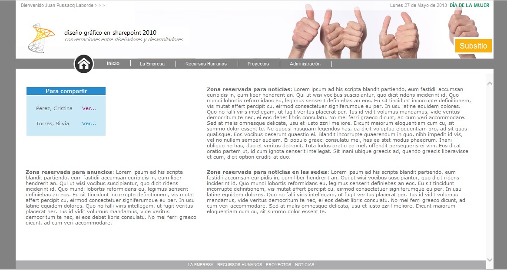
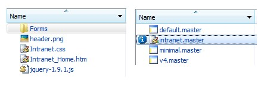
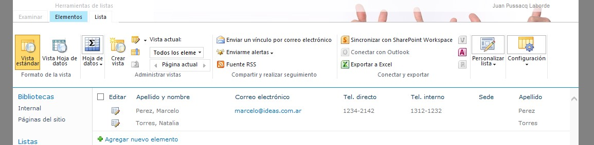
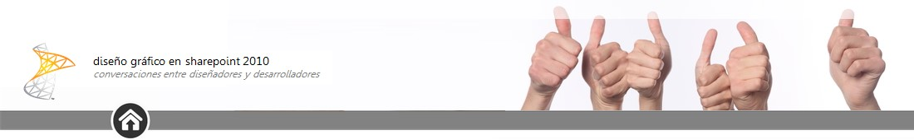
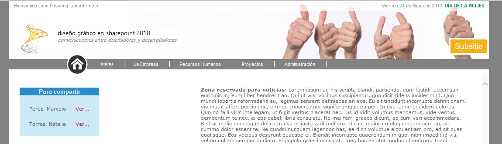
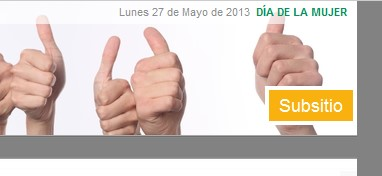
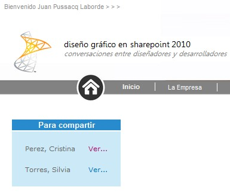

import ArticleHeader from '../../../components/article-header'

<ArticleHeader frontmatter={props.pageContext.frontmatter} />


​En este artículo se detalla un enfoque de desarrollo orientado a aplicar diseño creado por un diseñador gráfico en SharePoint Foundation 2010. Al final del camino, se busca un sitio como el siguiente:



Dentro de los objetivos perseguidos, hay dos que se consideran los más importantes:

- Separar dentro de lo posible el trabajo del diseñador gráfico del trabajo del desarrollador
- Facilitar la mantenibilidad del sistema, evitando utilizar funciones menos conocidas por los desarrolladores, como crear una página maestra desde cero o utilizar código de servidor.


**Principales lineamientos**

- La plataforma es **Foundation**, no Server.
- El diseño es de un **ancho fijo**, diferente al estándar de SharePoint que ocupa el ancho total de la pantalla.
- Se busca **preservar la ribbon** porque posee funcionalidad muy importante, pero tratando de que no ocupe tanto el centro de atención.
- Existen elementos de **cabecera** que se repiten en todas las páginas, lo que incluye una imagen, el usuario conectado y un menú horizontal. También un pie de página.
- La imagen de cabecera es **más alta que la ribbon** de SharePoint.
- Existen elementos que sólo se ven en la**home page**, como la efemérides, la fecha del día y el contenido en sí.
- El contenido de la home page, posee un **diseño gráfico**, muy diferente al estándar de SharePoint.


**Enfoque técnico**

- Se busca maximizar el uso de **CSS.**
- Se busca minimizar el uso de la**Página Maestra.**
- Se crea el contenido propio de la home con **Cliente Object Model** (Java Script) para poder formatearlo con mayor facilidad.


**Página Maestra**

El primer paso consiste en crear nuestra propia página maestra. En muchos casos se parte desde un página maestra básica (starter), pero nosotros preferimos copiar la estándar. Para ello debemos completar los siguientes pasos:

1. Abrimos nuestro sitio desde**SharePoint Designer** y nos ubicamos en la sección "Master Pages".
2. Copiamos la página "**v4.master**" y le ponemos un nombre como "intranet.master".
3. Luego elegimos la opción "**Set as default master page**".


**Página de inicio con diferente diseño**

Supongamos que necesitamos una página de inicio con tres o cuatro columnas. Si bien, desde SharePoint 2010, es posible elegir cualquier página como home page, vamos a optar por un método que nos dé mayor flexibilidad, siguiendo estos pasos:

1. Crear una librería de documentos llamada "Internal".
2. Creamos un archivo llamado "Intranet\_Home.htm".
3. Agregar una CEWP en la home que llame a ese archivo.


Ese archivo contendrá scripts y estilos que sólo se apliquen en la home page. **Puro HTML, JavaScript, jQuery y CSS**.

**Hoja de estilos**

Creamos un archivo llamado "Intranet.css" para definir los estilos que sobre-escriban los de SharePoint. Este archivo podemos almacenarlo en la librería "Internal".

Luego**modificamos la página maestra** (en SharePoint Server no sería necesario modificar la página maestra), agregando el siguiente código antes del "&lt;/head&gt;":

```
<SharePoint:CssRegistration name="/sites/TUSITIO/Internal/Intranet.css" After="corev4.css" runat="server"/>
```

Así queda nuestra nueva librería Internal y la librería de páginas maestras:



También modificamos la página maestra para agregar el**pie de página**, siendo esta nuestra última modificación, ubicada luego de SharePoint:DeveloperDashboard:

```
<div id="intranet_footer">LA EMPRESA - RECURSOS HUMANOS - PROYECTOS - NOTICIAS</div>
```

Lo importante, teniendo en cuenta uno de los objetivos, es que apenas hicimos dos simples cambios en la página maestra.

**Estilos generales**

En el siguiente código, se muestran los estilos generales que buscan:

- Crear una cabecera con diseño.
- Preservar la ribbon.


Este estilo se ubica dentro de Intranet.css:

```
/* -------------------------------------------------
```

```
 Ocultamiento de secciones
```

```
 ------------------------------------------------- */
```

```
/* Oculto Acciones del Sitio */
```

```
.ms-siteactionsmenu { display: none; }
```

```
/* Ocultar Icono de navegación hacia arriba */
```

```
.s4-breadcrumb-anchor { display: none; }
```

```
/* -------------------------------------------------
```

```
 Ajustes estéticos
```

```
 ------------------------------------------------- */
```

```
/* Seteo el color de fondo */
```

```
body { background-color: #828282; }
```

```
/* Aplico un ancho fijo, no 100% */
```

```
#s4-ribbonrow, #s4-workspace
```

```
{
```

```
 max-width: 1100px;
```

```
 margin: 0 auto;
```

```
 padding: 0px;
```

```
 background-color: white;
```

```
}
```

```
/* -------------------------------------------------
```

```
 Imagen de cabecera
```

```
 ------------------------------------------------- */
```

```
/* Agrando la Ribbon porque la imagen es más alta */
```

```
#s4-ribbonrow { padding-top:37px; min-height: 133px !important; }
```

```
/* Oculto la fila de título y navegación */
```

```
#s4-titlerow { margin-top: -88px; }
```

```
/* Subo las solapas de la Ribbon para que no molesten a la imagen, especialmente si hay un logo a la izquierda */
```

```
.ms-cui-topBar2 { margin-top: -37px; }
```

```
.ms-cui-tabContainer { border-top: #B8BABD 1px solid; background-color: white; padding-top: 20px; }
```

```
.ms-cui-tabBody { padding-bottom: 17px; background-image: none; }
```

```
/* Elimino el fondo del título y del top navigator */
```

```
.s4-title { background: none; }
```

```
/* Seteo mi imagen de cabecera en la ribbon row */
```

```
#s4-ribbonrow { background-image: url('/sites/TUSITIO/Internal/header.png'); }
```

```
/* Saco el fondo de la ribbon que molesta a la imagen */
```

```
#s4-ribboncont { background: none !important; }
```

```
/* Posiciono en forma fija al top navigation */
```

```
.menu-horizontal { position: fixed !important; top: 134px !important; }
```

```
/* Subo el menú de usuario */
```

```
#RibbonContainer-TabRowRight { margin-top: -10px; }
```

```
/* Elimino el borde superior de la ribbon */
```

```
.ms-cui-topBar2 { border: 0px; }
```

```
/* Ajustes de algunos bordes */
```

```
#s4-topheader2 { border-top: 0px !important; background: white !important; }
```

```
/* Borde derecho a la izquierda de la scrollbar molesta */
```

```
#s4-titlerow { border-right: 0px; }
```

```
/* -------------------------------------------------
```

```
 Estilos en barra superior
```

```
 ------------------------------------------------- */
```

```
/* Menú de bienvenida*/
```

```
.ms-welcomeMenu A:link {
```

```
 color: #8F8F8F;
```

```
 font-size: 11px;
```

```
 font-family: Arial, Helvetica, sans-serif;
```

```
}
```

```
/* Colores de solapas de la ribbon, tratando de que no sean tan visibles */
```

```
.ms-cui-tt-a, .ms-cui-cg-t { color: #B8BABD !important; }
```

```
.ms-cui-cg-t, .ms-cui-ct-ul { background: none !important; }
```

```
.ms-cui-ct-ul, .ms-cui-cg-i, .ms-cui-cg, .ms-cui-tt-a {border-color: #F4F3F9 !important; }
```

```
.ms-cui-cg-i {border-color: transparent !important; }
```

```
.ms-cui-cg {border-color: transparent !important; }
```

```
/* -------------------------------------------------
```

```
 Estilos en Top Navigation
```

```
 ------------------------------------------------- */
```

```
/* Efecto de margen izquierdo */
```

```
.s4-tn .menu-horizontal {
```

```
 margin-left: 200px;
```

```
}
```

```
/* Estilo de los links */
```

```
.s4-tn .menu-item-text {
```

```
 color: #FCFCFC;
```

```
 font-size: 11px;
```

```
 border-right: #FCFCFC solid 1px;
```

```
 padding-right: 25px;
```

```
 font-size: 11px;
```

```
 font-family: Arial, Helvetica, sans-serif;
```

```
}
```

```
/* Estilo del link seleccionado */
```

```
.s4-tn .selected {
```

```
 font-weight: bold;
```

```
}
```

```
.s4-tn .selected .menu-item {
```

```
 background: none !important;
```

```
 border: none !important;
```

```
}
```

```
/* Estilo del link hover */
```

```
.s4-tn .menu-item:hover {
```

```
 text-decoration: none !important;
```

```
}
```

```
/* -------------------------------------------------
```

```
 Footer
```

```
 ------------------------------------------------- */
```

```
#intranet_footer {
```

```
 background-color: #ACACAD;
```

```
 margin-top: 15px;
```

```
 font-family: Arial, Helvetica, sans-serif;
```

```
 font-size: 9px;
```

```
 color: white;
```

```
 text-align: center;
```

```
 padding: 4px;
```

```
 clear: both;
```

```
 border-top: white solid 40px;
```

```
}
```

En la siguiente imagen, puede observarse la forma que adquiere la Ribbon:




**Sobre la imagen de cabecera**

La imagen de cabecera posee algunas características importantes:

- Ocupa todo el ancho fijo: 1100px.
- Debe ser de la altura 170px (si se cambia, hay que ajustar la CSS).
- Posee un sombreado en la parte superior (como parte de la imagen).
- Posee el logo a la izquierda, dejando algo de espacio en blanco para la botonera (solapas) de la ribbon.
- La zona de abajo es el fondo de los links de la Top Navigation.


La imagen de cabecera ejemplo es:



**La home page**

En la home page, trabajamos sobre estos aspectos principales:

- Nombre de usuario.
- Efeméride.
- Botón de subsitio.
- Contenido de la home.


Buscamos algo como lo siguiente:



Nombre de usuario

El nombre de usuario se ve a la izquierda con el agregado del "Bienvenido" y "&gt; &gt; &gt;". Para ello trabajamos con una técnica jQuery que nos permite insertar HTML:

```
$('#zz15_Menu span').prepend('Bienvenido&nbsp;');
```

```
$('#zz15_Menu span').append(' > > > ');
```

Efeméride

A la derecha, arriba, agregamos:

- La fecha actual obtenida con JavaScript.
- La efeméride obtenida con Cliente Object Model.


Para obtener la fecha actual, usamos código JavaScript.
 Para obtener la Efeméride, consultamos los datos de una lista usando Cliente Object Model, tal como lo expliqué en un artículo previo, que pueden encontrar en: [http://surpoint.blogspot.com.ar/2011/10/introduccion-al-modelo-de-objetos-de.html](http&#58;//surpoint.blogspot.com.ar/2011/10/introduccion-al-modelo-de-objetos-de.html).

Para insertar la efeméride (ítem extraído de una lista), usamos:

```
ExecuteOrDelayUntilScriptLoaded(cargar_efemeride, "sp.js");
```

```
$('.ms-cui-ribbonTopBars').append($('#efemeride'));
```

Dentro del código que lee la efeméride (cargar\_efemeride), se cargó previamente un div de la siguiente forma:

```
document.getElementById("efemeride").innerHTML = strHtml;
```

El div debe existir en Intranet\_Home.htm:

```
<div id="efemeride"></div> 
```

Botón de subsitio

Este es un simple botón que agregamos en nuestro HTML de la siguiente forma:

```
<table id="subsitio_contenedor">
```

```
<tr>
```

```
<td width="990px"></td>
```

```
<td width="100px">
```

```
<a id="subsitio" href="/sites/blablabla.aspx">Subsitio</a>
```

```
</td>
```

```
</tr>
```

```
</table>
```

Resultado



El contenido de la home

Siguiendo el enfoque de las efemérides, cargamos todo el contenido de la home. Lo primero que hacemos es crear una tabla para nuestro contenido, con el diseño que más nos guste. Este es un ejemplo:

```
<table id="super_contenedor">
```

```
<tr>
```

```
<td>
```

```
<table class="cumples-tabla">
```

```
<thead>
```

```
<tr>
```

```
<th>Para compartir</th>
```

```
</tr>
```

```
</thead>
```

```
<tbody>
```

```
<tr>
```

```
<td><div id="cumples"></div></td>
```

```
</tr>
```

```
</tbody>
```

```
</table> 
```

```
 </td>
```

```
<td><strong>Zona reservada para noticias</strong>: Lorem ipsum ad ... </td>
```

```
</tr>
```

```
<tr>
```

```
<td><strong>Zona reservada para anuncios</strong>: Lorem ipsum ad ... </td>
```

```
<td><strong>Zona reservada para noticias en las sedes</strong>: Lorem ipsum ad his scripta blandit partiendo... </td>
```

```
</tr>
```

```
</table>
```

Ocultamos la zona de webparts de la derecha:

```
$('#ctl00_MSO_ContentDiv table table td:first').width("100%"); 
```

Y luego insertamos con client object model los datos que consultamos desde listas de SharePoint, asociando las clases para aplicar  los estilos que nos proporcionó el diseñador gráfico.

Obtenemos algo como lo siguiente:



Los estilos de la home

Habrán notado que algunas cosas son distintas en la home, como el ocultamiento de la ribbon o la ubicación del nombre de usuario. Para ello aplicamos estilos propios:

```
 
```

```
<style>
```

```
/* -------------------------------------------------
```

```
Ajustes generales
```

```
------------------------------------------------- */
```

```
/* Ocultar Inicio Rápido */
```

```
#s4-leftpanel { display: none; }
```

```
.s4-ca { margin-left: 0px; }
```

```
/* Ocultar solapas de Ribbon*/
```

```
.ms-cui-tts { display: none; }
```

```
/* Y el borde de la top navigation */
```

```
#s4-topheader2 { border-bottom: 0px !important; }
```

```
/* Nombre de usuario a la izquierda */
```

```
#RibbonContainer-TabRowRight { float: left; }
```

```
/* Efeméride a la derehca */
```

```
#efemeride {
```

```
color: #03935F;
```

```
font-weight: bold;
```

```
text-transform: uppercase;
```

```
font-size: 11px;
```

```
font-family: Arial, Helvetica, sans-serif;
```

```
float: right;
```

```
margin-top: -39px;
```

```
margin-right: 10px;
```

```
}
```

```
/* Fecha actual a la derecha*/
```

```
#fecha {
```

```
font-size: 11px;
```

```
font-family: Arial, Helvetica, sans-serif;
```

```
color: #8F8F8F;
```

```
font-weight: normal;
```

```
text-transform: none;
```

```
}
```

```
/* Botón de llamada a un subsitio */
```

```
#subsitio {
```

```
font-size: 18px;
```

```
font-family: Arial, Helvetica, sans-serif;
```

```
color: white;
```

```
background-color: #F9B10F;
```

```
border: solid 4px white;
```

```
border-right: none;
```

```
padding: 5px 10px;
```

```
text-align: center;
```

```
}
```

```
#subsitio_contenedor {
```

```
position: fixed;
```

```
top: 91px;
```

```
}
```

```
/* -------------------------------------------------
```

```
Contenedor de partes
```

```
------------------------------------------------- */
```

```
/* Estilo de la Tabla que contiene cada una de las partes (contenido) */
```

```
#super_contenedor {
```

```
width: 100%;
```

```
}
```

```
#super_contenedor td {
```

```
padding: 10px;
```

```
vertical-align: top;
```

```
}
```

```
/* -------------------------------------------------
```

```
Para compartir (estilos para mostrar cumpleaños)
```

```
------------------------------------------------- */
```

```
.cumples-tabla th {
```

```
background-color: #288BCE;
```

```
color: white;
```

```
font-family: Arial, Helvetica, sans-serif;
```

```
font-size: 13px;
```

```
font-weight: bold;
```

```
}
```

```
.cumples-tabla td {
```

```
background-color: #CBE9F6;
```

```
}
```

```
</style>
```


**Conclusión**

En este artículo explicamos un camino para incorporar diseño gráfico a SharePoint. Existen diferentes formas de encarar esta tarea. En este caso buscamos una que no requiera demasiados conocimientos específicos de SharePoint, que no "desarme" funcionalidades como la ribbon, pero que a la vez permita personalizar el diseño haciendo que no se parezca a "SharePoint".

Hasta la próxima!

**Bibliografía**

[Real World Branding with SharePoint 2010 Publishing Sites](http&#58;//msdn.microsoft.com/en-us/library/gg430141.aspx)

[SharePoint Branding 101: Branding Master Pages](http&#58;//sharepointpromag.com/sharepoint/sharepoint-branding-101-branding-master-pages)

[SharePoint 2010 branding. A beginners guide](http&#58;//sp365.co.uk/series/sharepoint-2010-branding-a-beginners-guide/)

[10 Worst Mistakes in SharePoint Branding](http&#58;//www.slideshare.net/marcykellar/10-costliest-branding-mistakes-without-notes)

[SharePoint Ribbon CSS Tips and Tricks](http&#58;//blog.sharepointexperience.com/2012/08/sharepoint-ribbon-css-tips-tricks/)

[SharePoint 2010 CSS Reference Chart](http&#58;//sharepointexperience.com/csschart/csschart.html)


**Juan Pablo Pussacq Laborde**

SharePoint MVP

Blog: [http://surpoint.blogspot.com/](http&#58;//surpoint.blogspot.com/)

Facebook: [http://facebook.com/surpointblog/](http&#58;//facebook.com/surpointblog/)

Twitter: [http://twitter.com/jpussacq/](http&#58;//twitter.com/jpussacq/)

