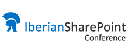

​Los Grupos de usuarios de SharePoint de la Península Ibérica (SUGES, SUG.CAT, MadPoint y LevaPoint) organizan la 1ª Conferencia Ibérica de SharePoint qué tendrá lugar el 10 de octubre de este año en Madrid. Será el primer evento dedicado exclusivamente a SharePoint desde distintas perspectivas en el que participen los principales expertos nacionales e internacionales en la plataforma (MVPs y líderes de la comunidad como Gustavo Vélez, Alberto Díaz, Juan Carlos González, Edin Kapic, Mario Cortes, Fabián Imaz, Joel Oleson entre otros), y en el que los asistentes tendrán la oportunidad no solo de formarse, sino también de conocer distintas soluciones construidas sobre la plataforma.

**Conferencistas**

Como en toda gran conferencia, estarán presentes los mayores especialistas de SharePoint y tecnologías afines de España y Latinoamérica, así como una selección de destacados referentes internacionales. Entre estos, podemos destacar a:

- Gustavo Vélez.
- Alberto Diaz.
- Fabián Imaz.
- Mario Cortés.
- Ricardo Muñoz.
- David Martos.
- Christian Buckley.
- Juan Carlos González.
- Joel Oleson.
- Daniel Seara.
- Andre Lage.
- Luis Ruiz Pavón.
- Jethro Seghers.
- Edin Kapic.

Gracias a ellos, y a su desinteresada participación, tendremos tres tracks en paralelo, con la temática de IT, Desarrollo y Negocio.

**Agenda**

Por el momento no se ha conformado oficialmente la agenda, pero si os podemos contar que tenemos preparadas más de 40 sesiones, con temas tan interesantes como:

- ALM en SharePoint.
- Aplicaciones, un nuevo modelo para personalizaciones en SharePoint 2013.
- Como crear una solución ECM (cero papel) en SharePoint 2013.
- Lync comunicaciones y conectividad sin límites.
- Office 365: ¿Debo dar el salto a la nube?
- 10 Best Productivity features in SP2013 you need to know about.
- Automating SharePoint 2013 deployment: tips, tricks and scripts.
- SharePoint 2013: Mobile strategy and design.
- y muchos más que podéis consultar en la web de la conferencia.

La conferencia se ha diseñado y concebido como un punto de encuentro natural para los mayores expertos de SharePoint de la Península Ibérica y Latinoamérica, grandes referentes internacionales en la plataforma, empresas nacionales e internacionales cuya actividad principal gira en torno al producto estrella de Microsoft y por supuesto todos los profesionales vinculados de forma directa en su día a día con la plataforma: decisores de negocio, responsables de departamentos de desarrollo e IT, arquitectos de soluciones, desarrolladores, diseñadores y profesionales de IT Pro. Todo aquel que trabaje con SharePoint tiene cabida en esta conferencia que supone una gran oportunidad para conocer no sólo a los ponentes de nivel que participarán en la misma, sino también a las empresas más importantes que trabajan en su día a día con SharePoint.

**WorkShops**

Complementando la conferencia, hemos preparado dos WorkShops especializados para el área de IT y Desarrollo. Estos WorkShops, basados en el training de Ignite de SharePoint 2013 creado por Microsoft, serán impartidos por MVPs de SharePoint Server. Una gran oportunidad para recibir formación de calidad de la mano de los mejores expertos en SharePoint.

**Patrocinio**

Para que la conferencia sea un éxito, necesitamos patrocinadores, empresas que aporten su granito de arena y colaboren con la primera de las muchas conferencias de SharePoint que seguirán en España. Si estás interesado, no dudes en contactarnos y si piensas que tu empresa puede ayudar, no dudes en trasladarle la información a la persona que se encarga del marketing porque estar en la conferencia es un *MUST* y se podrán abrir muchas oportunidades de negocio en la zona de patrocinadores. Tenemos varios niveles de patrocinio que se adaptan a todo tipo de empresas colaboradoras.  Hemos dispuesto dos formas de contacto para tratar cuestiones relativas a patrocinio de la conferencia:

- Cuenta de Twitter: @IberianSPConf
- Correo electrónico: [suges@hotmail.es](mailto&#58;suges@hotmail.es)

**Pre-Registro**

Sin duda, se trata del primer evento técnico y de negocio de esta naturaleza que se realice en España  y en el que se traten todas las novedades sobre SharePoint, así como otras plataformas y tecnologías relacionadas
¿Qué esperas para pre-registrarte? ¿Sabías que las plazas son limitadas y que por acceder al pre-registro tendrás un descuento preferente en el precio del evento?[!\[\](../../../images/Numero16/ispcreserva.png)](http&#58;//iberianspc2013-iscpage.eventbrite.com/)
**Información clave sobre la conferencia**

- Fecha: 10 de octubre de 2013.
- Lugar: Madrid, ubicación pendiente de confirmar.
- Sitio Web de la conferencia: [www.iberiansharepointconference.com](http&#58;//www.iberiansharepointconference.com/)
- Enlace de registro: [http://iberianspc2013-iscpage.eventbrite.com/](http&#58;//iberianspc2013-iscpage.eventbrite.com/)
- Twitter de la conferencia: @IberianSPConf

