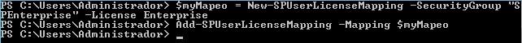
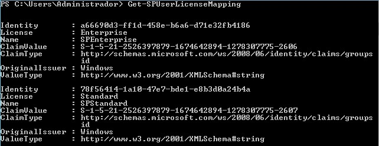
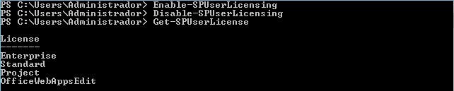
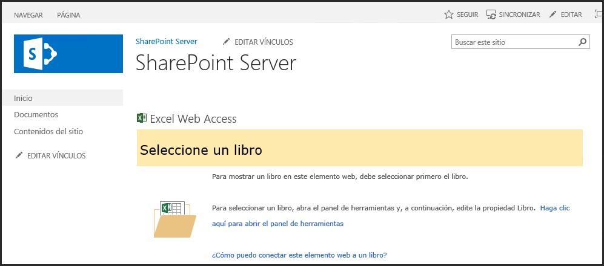
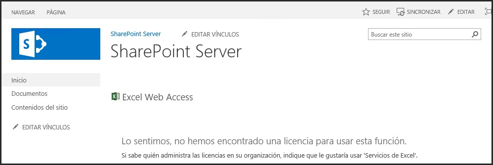

​Desde la introducción de la versión 2003 de SharePoint, el Portal siempre ha contado principalmente con dos versiones: una que provee toda la funcionalidad básica, que siempre ha sido gratis para usar (llamada "Foundation" en SharePoint 2010 y 2013), y una versión de pago ("Server") que contiene varias capas extras que le agregan valor a la parte básica, haciéndolo más interesante para su aplicación en empresas. También tradicionalmente, esta versión "avanzada" de SharePoint ha contado con dos versiones diferentes ("Standard" y "Enterprise" en SharePoint 2010 y 2013), principalmente por razones de licenciamiento: la versión con la funcionalidad más compleja es (bastante) más costosa que la versión con funcionalidad empresarial básica.

En cuanto a licenciamiento, en SharePoint 2003, 2007 y 2010 era solamente posible crear un sistema empresarial, basado en SharePoint Server (o MOSS para 2003 y 2007) para darle acceso a todos los usuarios del Portal: Si se deseaba que algunos usuarios solamente tuvieran acceso a una de las versiones, y otros a la otra, era necesario crear dos granjas separadas, con las desventajas inherentes de costos en hardware, mantenimiento y dificultades técnicas para compartir la información.

SharePoint 2013 continúa teniendo el mismo esquema tradicional de versiones, es decir, SharePoint Foundation que es gratis y SharePoint Server con dos versiones de pago, Standard y Enterprise. Pero rompiendo con la tradición impuesta desde 2003, ahora es posible tener instaladas las dos versiones empresariales en una sola granja y darle derechos individuales a cada usuario para que accedan a una versión o a la otra. Teniendo en cuenta que una CAL (Client Access License) para la versión Enterprise cuesta aproximadamente el doble de una CAL para la versión Standard, es recomendable que cada usuario consuma solamente las licencias necesarias para poder realizar su trabajo.

Note que las CAL de SharePoint son aditivas: para que un usuario pueda utilizar una CAL Enterprise, necesita tener obligatoriamente una CAL Standard también. Teniendo en cuenta que las dos mayores áreas de diferenciación entre Standard y Enterprise se pueden resumir en dos puntos:

- Soporte para soluciones de negocios, incluyendo servicios de Access e InfoPath
- Soporte a Inteligencia de Negocios, incluyendo servicios de Excel, PerformancePoint, Power View y Visio


Es claro que solamente una parte reducida de toda una compañía puede necesitar acceso a la versión Enterprise, mientras que la gran mayoría de los usuarios tienen suficiente con la funcionalidad ofrecida por la versión Standard lo que, como consecuencia, reduce considerablemente los costos de licenciamiento.

### Asignación de licencias en SharePoint Server 2013

La asignación de licencias a usuarios individuales en SharePoint server 2013 está basado en grupos de seguridad del Directorio Activo (AD) de Windows y una serie de comandos de PowerShell para configurar el servidor. Hay cinco categorías básicas que se pueden asignar: Standard, Enterprise, Project Server, Duet (para SAP) y WAC (para Office Web Apps). Un usuario puede pertenecer a diferentes grupos, permitiendo que, por ejemplo, tenga acceso a SharePoint Enterprise y Project Server, pero no a Office Web Apps. Usuarios que no pertenecen a ningún grupo no tienen acceso a ninguno de las categorías. Una nota importante es que el licenciamiento solamente funciona si la Aplicación Web utiliza autorización de Claims.

La infraestructura de licenciamiento no está activada por defecto cuando se instala SharePoint Server (Standard o Enterprise), por lo que hay que hacerlo expresamente utilizando los comandos de PowerShell que se explican más adelante. Cuando el licenciamiento no está activado, todos los usuarios tienen acceso a la versión instalada: por ejemplo, si en la granja se ha instalado SharePoint Enterprise, todos los usuarios tienen acceso a la funcionalidad de Enterprise y, consecuentemente, tienen que tener las licencias CAL correspondientes. Importante para tener en cuenta es que si el licenciamiento está activado, un usuario que no esté configurado con algún tipo de licencia no tendrá acceso a ninguna de las funciones de SharePoint.

En SharePoint, el licenciamiento tiene efecto sobre cuatro tipos de elementos principalmente: WebParts, la Galería de WebParts, plantillas para crear Colecciones de Sitios y Sitios y en Bibliotecas de Documentos (especialmente en combinación con las posibilidades que ofrece Office Web Apps).

### Activando y utilizando el marco de trabajo de Licenciamiento

SharePoint dispone de ocho cmdlets de PowerShell para trabajar con el Licenciamiento. Ni el Modelo de Objetos de Servidor ni el de Cliente disponen de la posibilidad para interactuar programáticamente con licencias (todo el trabajo tiene que realizarse utilizando estos comandos de PowerShell).

Activación del sistema de licenciamiento:

Tres cmdlets permiten activar, desactivar y dar información sobre el sistema de licenciamiento:

**Enable-SPUserLicensing** - Permite activar el modelo de licenciamiento en SharePoint Server 2013

Enable-SPUserLicensing [-Confirm [&lt;SwitchParameter&gt;]]

- -Confirm: detiene el proceso para que el administrador confirme la operación. No es obligatorio


**Disable-SPUserLicensing** - Permite desactivar el modelo de licenciamiento en SharePoint Server 2013

Disable-SPUserLicensing [-Confirm [&lt;SwitchParameter&gt;]]

- -Confirm: detiene el proceso para que el administrador confirme la operación. No es obligatorio


**Get-SPUserLicensing** - Devuelve información sobre el uso de licenciamiento en la granja

Get-SPUserLicensing


Asignación de licencias:

Cinco cmdlets permiten trabajar con la asignación de licencias. La asignación puede ser creada antes o después de activar el sistema (utilizando los cmdlets indicados anteriormente). De igual forma, la configuración de asignaciones permanece intacta después de desactivar el sistema. Para utilizar estos cmdlets es necesario tener los grupos de seguridad correctamente creados en AD (aunque no necesitan tener usuarios u otros grupos para poderlos utilizar, es decir, pueden estar vacíos).

**Add-SPUserLicenseMapping** - Añade un mapeo entre un grupo de seguridad de AD y un tipo de licencia especifico

Add-SPUserLicenseMapping -Mapping &lt;List&gt; [-Confirm [&lt;SwitchParameter&gt;]]

- -Mapping: objeto (Lista Genérica) con el mapeo. Es posible mapear más de un grupo AD en una sola operación. Obligatorio
- -Confirm: detiene el proceso para que el administrador confirme la operación. No es obligatorio


Ejemplos de uso:

```
$myMapeo = New-SPUserLicenseMapping -SecurityGroup "SPEnterprise" –License Enterprise
```

```
Add-SPUserLicenseMapping –Mapping $myMapeo
```

En el parámetro "-License" se pueden utilizar los valores dados por Get-SPUserLicense: Enterprise, Standard, Project y OfficeWebAppsEdit.



**New-SPUserLicenseMapping** - Crea un objeto para un mapeo nuevo. Para ser utilizado en conjunción con el cmdlet Add-SPUserLicenseMapping. El cmdlet puede ser utilizado con cuatro diferentes tipos de parámetros:

New-SPUserLicenseMapping -License &lt;String&gt; -SecurityGroup &lt;String&gt; [-Confirm [&lt;SwitchParameter&gt;]] [-WebApplication &lt;SPWebApplicationPipeBind&gt;]

New-SPUserLicenseMapping -License &lt;String&gt; -Role &lt;String&gt; -RoleProviderName &lt;String&gt; [-Confirm [&lt;SwitchParameter&gt;]] [-WebApplication &lt;SPWebApplicationPipeBind&gt;]

New-SPUserLicenseMapping -ClaimType &lt;String&gt; -License &lt;String&gt; -OriginalIssuer &lt;String&gt; -Value &lt;String&gt; [-Confirm [&lt;SwitchParameter&gt;]] [-ValueType &lt;String&gt;] [-WebApplication &lt;SPWebApplicationPipeBind&gt;]

New-SPUserLicenseMapping -Claim &lt;SPClaim&gt; -License &lt;String&gt; [-Confirm [&lt;SwitchParameter&gt;]] [-WebApplication &lt;SPWebApplicationPipeBind&gt;]

- -Confirm: detiene el proceso para que el administrador confirme la operación. No es obligatorio
- -License: Tipo de licencia, según la enumeración dada por Get-SPUserLicense. No es obligatorio
- -SecurityGroup: El grupo de AD al que se mapea la licencia. No es obligatorio
- -WebApplication: El URL, GUID, nombre de la Aplicación Web o instancia del objeto Aplicación Web sobre el que se aplica la licencia. No es obligatorio
- -ClaimType: Tipo de Claim a utilizar. No es obligatorio


**Remove-SPUserLicenseMapping** - Permite eliminar un mapeo creado anteriormente

Remove-SPUserLicenseMapping -Identity &lt;List&gt; [-Confirm [&lt;SwitchParameter&gt;]]

- -Identity: Identificador (Lista Genérica) del mapeo. Es posible eliminar más de un mapeo en una sola operación. Obligatorio
- -Confirm: detiene el proceso para que el administrador confirme la operación. No es obligatorio


Ejemplo de uso:

```
Remove-SPUserLicenseMapping –Identity abcdef12-abcd-1234-abcd-abcdef123456
```

**Get-SPUserLicenseMapping** - Devuelve información sobre el mapeo

Get-SPUserLicenseMapping [-WebApplication &lt;SPWebApplicationPipeBind&gt;]

- -WebApplication: la Aplicación Web de la que se quiere recobrar la información. No es obligatorio




**Get-SPUserLicense** - Devuelve una lista con los tipos de licenciamiento aceptados (para utilizar como parámetro en el cmdlet Add-SPUserLicenseMapping)

Get-SPUserLicense



### Verificación del licenciamiento

SharePoint mismo se encarga de mostrar un mensaje a los usuarios que intentan utilizar alguna funcionalidad para la que no tienen licencias apropiadas. Por ejemplo, en la página de SharePoint que se muestra en la imagen No. 5, se ha instalado una WebPart del tipo "Excel Web Access", que solo puede ser utilizada por usuarios con una licencia Enterprise de SharePoint 2013:



Un usuario sin la licencia Enterprise ve solamente un mensaje de SharePoint:



### Conclusiones

Poder combinar usuarios con licencias Enterprise y Standard de SharePoint Server en una sola granja ha sido no solamente un deseo, sino una necesidad urgente desde SharePoint 2003, cuando el servidor comenzó su carrera como aplicación critica en las empresas modernas. Aunque el aspecto financiero de esta nueva funcionalidad es muy importante pues permite, potencialmente, ahorrar enormes cantidades de dinero para las empresas que utilizan SharePoint, no hay que perder de vista un factor paralelo: ya no es necesario tomar decisiones de diseño indeseables en el sistema, como por ejemplo crear granjas separadas para cada tipo de licencia e intentar reutilizar la información entre ellas. Otro aspecto importante es la flexibilidad que permite el nuevo marco de trabajo de licenciamiento, ya que se utiliza la infraestructura por defecto (AD) para manejar las licencias de SharePoint 2013.


**Gustavo Velez**
 MVP SharePoint
 [gustavo@](mailto:gustavo@gavd.net)gavd.net 
 http://www.gavd.net

 
 
import LayoutNumber from '../../../components/layout-article'
export default LayoutNumber
