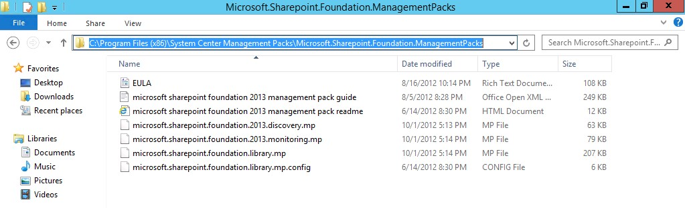
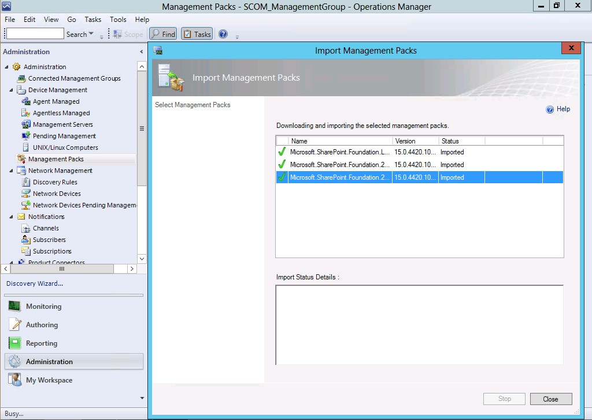
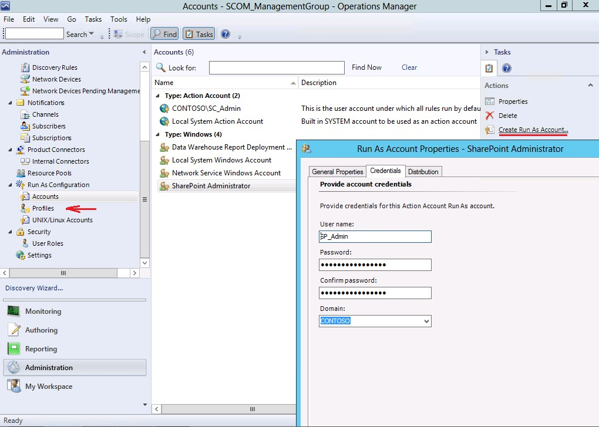

import ArticleHeader from '../../../components/article-header'

<ArticleHeader frontmatter={props.pageContext.frontmatter} />

​En muchas de las organizaciones que con el paso del tiempo han construido una intranet solida basada en SharePoint, se ha convertido para muchos de los usuarios en una de las principales herramientas de trabajo del día a día, por esta razón, como parte de las responsabilidades de un administrador de la plataforma de SharePoint está el brindar alta disponibilidad a la plataforma, dar un mantenimiento adecuado, realizar tareas básicas de recuperación ante fallas como ejecución de respaldos, tanto de bases de datos como de SharePoint, replicación de servicios, entre otras tareas.

Con el fin de facilitar muchas de estas tareas SharePoint cuenta con un servicio que conocemos como el 'Health Analyzer' el cual mediante reglas de ejecución nos da a conocer recomendaciones, alertas sobre posibles errores, configuraciones erróneas, problemas que pueden afectar el rendimiento y a su vez, este servicio ofrece para algunos de los problemas corrección automatizada o posibles soluciones a errores o alertas de detección, también podemos encontrar generación de reportes y creación de reglas personalizadas para extender un poco más su funcionalidad.

Sin embargo, hay que tener presente que el Health Analyzer sigue siendo un servicio dentro de la plataforma de SharePoint, por lo que hay que ser consiente que si por alguna razón este servicio se viera afectado, nuestro monitoreo y reglas de ejecución también dejarían de funcionar.

Microsoft nos brinda dentro de la suite de System Center, una plataforma llamada Operations Manager para poder llevar a cabo monitoreo en una escala mayor, con más alcance, complementando la administración de la plataforma al brindar los estados de salud con más detalle según las reglas de monitoreo establecidas.

Para llevar a cabo el monitoreo, System Center ofrece paquetes de administración los cuales definen de qué manera Operations Manager va a monitorear las plataformas. Sin estos paquetes SCOM puede monitorear los elementos básicos de Windows, como memoria RAM, espacio en disco, CPU, entre otros.

Cada producto Microsoft es lanzado con el MP (paquete de administración) para SCOM, como por ejemplo Hyper-V, SQL Server, NLB, entre otros. Por supuesto, SharePoint no es la excepción, en los siguientes links podemos encontrar los paquetes para las diferentes versiones de SharePoint:

- System Center 2012 Monitoring Pack for SharePoint 2010:
    - [http://www.microsoft.com/en-us/download/details.aspx?id=34697](http&#58;//www.microsoft.com/en-us/download/details.aspx?id=34697)
- System Center Management Pack for SharePoint Foundation 2013:
    - [http://www.microsoft.com/en-us/download/details.aspx?id=35591](http&#58;//www.microsoft.com/en-us/download/details.aspx?id=35591)
- System Center Management Pack for SharePoint Server 2013:
    - [http://www.microsoft.com/en-us/download/details.aspx?id=35590](http&#58;//www.microsoft.com/en-us/download/details.aspx?id=35590)

El proceso de instalación de los paquetes se explica a continuación, como ejemplo, tome el paquete para SharePoint Foundation 2013, debido a que es requerido antes de instalar el paquete para SharePoint Server 2013. Lo primero que debemos realizar es descargar el paquete con la extensión MSI e instalarlo en el servidor de SCOM, luego de proceder con la instalación debemos asegurarnos que los archivos se encuentran en el directorio C:\Program Files\System Center Management Packs.

​

Posteriormente debemos importar estos paquetes a SCOM, para esto utilizaremos la consola de operaciones y debemos seleccionar el menú de Administración, posteriormente Management Packs y luego la opción de Importar, debemos elegir la dirección donde se instalaron los paquetes de administración e importarlos, como se muestra a continuación:

Posteriormente debemos crear las credenciales de ejecución para el perfil de los monitores de SharePoint, esto lo podemos realizar en el mismo menú de administración, en la opción de cuentas, donde luego debemos establecer cuál va a ser la cuenta de dominio y la contraseña para luego asignarla al perfil, como se muestra a continuación:

En la segunda parte de este artículo exploraremos con mayor detalle las funcionalidades de los monitores y reglas para servicios, eventos, rendimiento, entre otros, además de los procesos de notificación.

**David Sánchez Aguilar**

MCITP en SharePoint Server

[davidsanchezaguilar@hotmail.com](mailto&#58;davidsanchezaguilar@hotmail.com)

[http://davidsanchezaguilar.wordpress.com](http&#58;//davidsanchezaguilar.wordpress.com/)

