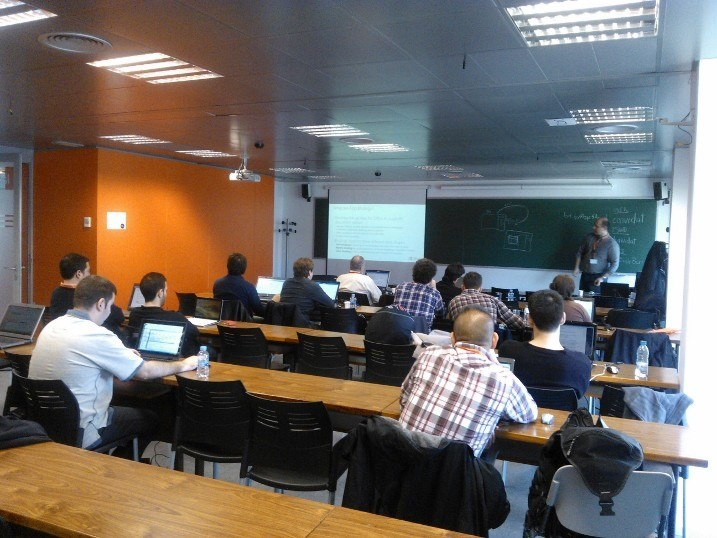
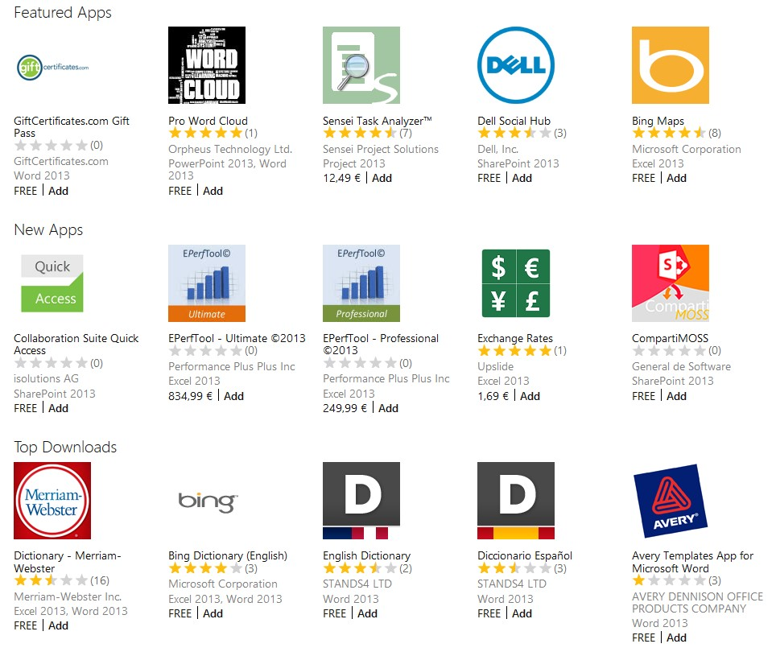
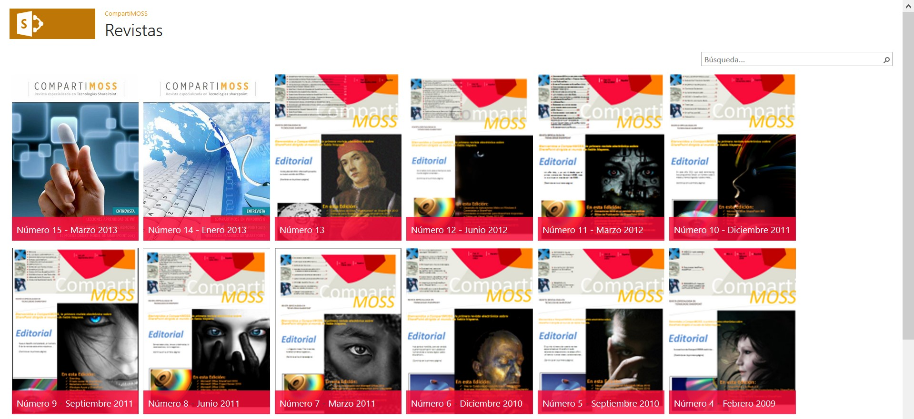

​Los grupos de usuarios de SharePoint de España ([SUGES](http://www.suges.es/), SUG.CAT, MadPoint y LevaPoint) organizaron los días 26 y 27 de abril el primer Office & SharePoint 2013 Application Challenge. La iniciativa, impulsada desde Microsoft Corporation con el apoyo a nivel organizativo de los Centros de Innovación de Microsoft de España ([CIIN](http://www.ciin.es/) y [CIP](http://www.micproductivity.com/es/Paginas/default.aspx)) y de Microsoft Ibérica, se tradujo en la realización simultánea de 3 hackatons de desarrollo de aplicaciones en las ciudades de Madrid, Barcelona y Valencia.

Cuando se planteó desde Microsoft Corporation, y en concreto desde el área de DPE, la realización del primer App Challenge, desde los Centros de Innovación de España y los grupos de usuarios de SharePoint nos marcamos varios objetivos para trasladas el nuevo modelo de aplicaciones de Office & SharePoint a las empresas y profesionales TIC:

- Por un lado, y de forma bastante intensiva, formar a los participantes de los eventos de cada ciudad en aspectos relativos a cómo crear aplicaciones, las APIs y herramientas de desarrollo disponible, como ganar dinero llevando las aplicaciones a la nueva Office Store de Microsoft, etc.
- Por otro lado, servir como fuente generadora de ideas de aplicaciones orientadas tanto a la productividad del usuario doméstico como la del usuario más empresarial.
- Contar con referentes y expertos de la comunidad (incluidos MVPs) en el desarrollo para SharePoint y Office:
    - Alberto Díaz, Jose Quinto y Adrian Díaz en Valencia.
    - Mario Cortés y Miguel Tabera en Madrid.
    - Edin Kapic, David Martos y Juan Carlos González en Barcelona.
- Finalmente, poner en práctica los conocimientos adquiridos durante la formación para implementar las ideas de aplicaciones y posteriormente publicarlas en el [Office Store](http://office.microsoft.com/en-us/store-FX102759646.aspx).

Una vez pasado el evento, se puede concluir que el primer challenge ha sido todo un éxito en cuanto a número de asistentes (más de 70 participantes entre las tres ciudades), las ideas de aplicaciones presentadas (3-4 por ciudad) y el trabajo realizado por los mentores y organizadores del evento en cada ciudad encargados de impartir las sesiones de formación y de ejercer como mentores de los distintos equipos qué estuvieron trabajando en sus ideas de aplicaciones.

**¿Por qué crear aplicaciones para Office y SharePoint?**

Aunque el nuevo modelo de aplicaciones para Office y SharePoint es novedoso, desde el punto de vista conceptual no lo es tanto sobre todo pensando en los Marketplace de aplicaciones que Microsoft ya tiene disponibles para otras plataformas: Windows 8, Windows Azure y Windows Phone. Frente a estos, el Office Store se puede ver como un modelo de Marketplace mixto en el que publicar aplicaciones orientadas al usuario doméstico, al usuario profesional y organizaciones empresariales de distinto tamaño. Como comenta Alberto Díaz, MVP de SharePoint Server, en [este artículo de su blog](http://geeks.ms/blogs/adiazmartin/archive/2013/04/30/office-store-191-una-tienda-de-futuro.aspx) (http://geeks.ms/blogs/adiazmartin/archive/2013/04/30/office-store-191-una-tienda-de-futuro.aspx), en el Office Store tienen cabida aplicaciones de naturaleza y propósito múltiple como por ejemplo:

- Aplicaciones empresariales que buscan mejorar la plataforma SharePoint (On-Premise y Online en Office 365) proveyendo funcionalidades y capacidades no disponibles por defecto. Por ejemplo, en esta categoría entrarían aplicaciones generalistas necesarias en el día a día como un CRM, utilidades de contabilidad y facturación, un ERP completo o bien aplicaciones más específicas como una pequeña gestión de proyectos, una agenda de contactos. Etc.
- Aplicaciones para SharePoint de tipo gadget qué muestren información cambiante como puede ser información meteorológica, de bolsa, etc.
- Aplicaciones de productividad para la suite de Office (tanto las versiones de escritorio como las web) pensadas para facilitar el acceso y uso de información externa a usuarios domésticos y empresariales: búsqueda de noticias, búsqueda de imágenes, uso de diccionarios en línea, etc.
- Utilidades para Office qué permitan analizar e interactuar con información existente así como facilitar la toma de decisiones. Por ejemplo, las típicas aplicaciones de posicionamiento de información en mapas forman parte de esta categoría.
- Y un largo etcétera.

Sin duda, el Office Store es una buena fuente de oportunidad qué puede aportar ventajas interesantes tanto a empresas desarrolladoras como a profesionales. Sólo por citar algunas, se pueden destacar las siguientes:

- Visibilidad, ya que el Office Store es un Marketplace global de manera qué permitirá qué las aplicaciones puedan estar disponibles en distintos países y en distintos idiomas.
- Un nuevo modelo de negocio basado en aplicaciones para Office & SharePoint apoyado en la flexibilidad a nivel de modelos de licenciamiento ya qué es posible publicar aplicaciones qué sean gratuitas, qué tengan versiones trial o bien qué tenga un coste por usuario o por número de asientos (para organizaciones).
- Permite qué desarrolladores con experiencia en tecnologías plataformas Microsoft y no Microsoft puedan crear aplicaciones y publicarlas en el Office Store.

Finalmente, como muestra del potencial del Office Store y como ejemplo práctico de aplicación, os presentamos [la aplicación de CompartiMOSS](http://office.microsoft.com/en-us/store/compartimoss-WA104059493.aspx?redir=0&amp;fromAR=1) (http://office.microsoft.com/en-us/store/compartimoss-WA104059493.aspx?redir=0&fromAR=1). Se trata de una aplicación de SharePoint qué permite visualizar los distintos números de la revista publicados hasta ahora y acceder a los mismos:

**Aplicaciones e ideas presentadas**

En cada ciudad, la 2ª jornada del Office & SharePoint App Challenge estuvo enfocada a la presentación de ideas de aplicaciones y al desarrollo inicial de las mismas para generar una primera versión de aplicación. Las aplicaciones qué se presentaron en cada ciudad son las siguientes:

- Madrid, aplicaciones e ideas presentadas:
    - **Beezy Profiles**, creada por un equipo de personas de Spenta, se trata de una aplicación social que permite qué los usuarios de SharePoint puedan integrar los datos de su perfil social con datos procedentes de otras redes sociales como por ejemplos LinkedIn.
    - **Business Apps Framework**, se trata de una idea de aplicación expuesta por integrantes de Online TIC. Se trata de una aplicación qué de forma dinámica es capaz de generar distintos elementos (formularios, listas, botones de acción, etc) para un cierto escenario de negocio como por ejemplo la gestión de oportunidades empresariales.
    - **SharePoint Health Dashboard**, aplicación creada por un equipo de Raona. Se trata de un panel que permite de manera rápida y en tiempo real tener una idea general de varios indicadores del servidor (usuarios, ancho de banda, ocupación de listas, etc.). Se trata de una aplicación de tipo SharePoint-Hosted y experiencia de usuario de tipo Inmersive.
- Barcelona, aplicaciones e ideas presentadas:
    - **Localizador de direcciones para Word,** idea presentada por un grupo de estudiantes de ingeniería informática. Se trata de una sencilla aplicación de tipo "Panel de tareas" para Word qué permita recoger datos de direcciones en documentos Word, ubicarlas en un mapa y mostrar información de detalle de la dirección. Además, en el caso de encontrar varias coincidencias para una dirección, la aplicación muestra información de las mismas en un listado y permite que el usuario pueda elegir la opción qué sea más adecuada en función de la dirección recogida del documento Word.
    - **Aplicación de Excel para cuadrar balances**.  Se trata de una aplicación de tipo "Panel de tareas" para Excel qué permite recoger información de un balance económico para, mediante las correspondientes operaciones de cálculo, permitir que el usuario pueda cuadrar las cuentas de forma automatizada.
    - **Comparador de configuración de seguridad entre diferentes sitios de SharePoint**. La idea de esta aplicación, de SharePoint, es ofrecer un comparador/clonador de seguridad entre colecciones de sitios.
    - **Player de videos HTML5 para SharePoint**, idea de aplicación presentada por un equipo de Raona. Se trata de crear una aplicación qué permite visualizar en un player HTML los videos subidos a una biblioteca desplegada a nivel de aplicación. Al mismo tiempo, desde la aplicación se pueden cargar videos.
- Valencia, aplicaciones e ideas presentadas:
    - **Aplicación de gestión de capacidades de lista**, para conocer los datos relativos a las capacidades de las listas desde el punto de vista de un DBA. En este caso, se trata de una idea de aplicación con un gran potencial de uso, y también con una alta complejidad en cuanto a desarrollo.
    - **Visor de cámaras de seguridad**. Se trata de una aplicación qué muestra un panel de cámaras IP recogiendo para ello la información almacenada en una lista. Esta aplicación se encargaría de enviar notificaciones PUSH a dispositivos móviles. La aplicación, presentada por un equipo de Encamina, está compuesta por un módulo de visualización de cámaras IP en internet (Publicas, proporcionando URL de conexión, o privadas especificando modelo, usuario y contraseña).
    - **Aplicación para formularios de Contacto**, presentada por un equipo de SolidQ. Se trata de una aplicación que permite crear formularios de contacto dinámico en base a propiedades de configuración. Los formularios se crean a partir de los datos de configuración aportados en una App Part.
    - **Aplicación de integración entre Project Server y SharePoint Server** para generar y mostrar Dashboards.

En total, en el App Challenge se expusieron en torno a 12 ideas de aplicaciones algunas de las cuáles están siendo desarrolladas en estos momentos para ser publicadas en el Office Store.

**Nota:** Si tienes una idea de aplicación para Office & SharePoint, estás a tiempo de poder acceder a una serie de incentivos que Microsoft Corporation tiene para aplicaciones de calidad destinadas al Office Store. Si estás interesado en acceder a los mismos o tienes dudas sobre cómo poner en práctica una idea de aplicación, puedes contactarme por medio de Twitter (@jcgm1978) o correo electrónico ([jgonzalez@gruposodercan.es](mailto:jgonzalez@gruposodercan.es)).

**Ganadores por cada ciudad y a nivel nacional**

En cada ciudad, los mentores y organizadores eligieron una aplicación ganadora qué permitió a los creadores de la misma llevarse [los premios disponibles](http://www.suges.es/Paginas/Premios-Office-App-Challenge.aspx) (http://www.suges.es/Paginas/Premios-Office-App-Challenge.aspx).

- Ganador global y también ganador en Madrid: **Beezy Profiles**. Esta aplicación será presentada en la [1ª Iberian SharePoint Conference](http://www.iberiansharepointconference.com/es) (http://www.iberiansharepointconference.com/es) qué se celebrará en Madrid el próximo 10 de octubre.
- Ganador en Valencia: **Aplicación para conocer los datos relativos a las capacidades de las listas desde el punto de vista de un DBA****.**
- En cuanto a Barcelona, el jurado optó por no elegir un ganador ya qué el tiempo destinado a desarrollar aplicaciones se dedicó fundamentalmente a resolver dudas, ver ideas de aplicaciones y cómo enfocar el desarrollo de las mismas, etc.

**Agradecimientos**

El éxito de una iniciativa como el Office & SharePoint App Challenge depende del trabajo y colaboración de muchas personas. En este sentido, el éxito de este primer evento (en el futuro habrá más) ha sido posible gracias a todos los participantes, colaboradores, patrocinadores y organizadores del App Challenge:

- Microsoft y los Centros de Innovación Microsoft de España como organizadores e impulsores de la iniciativa.
- Los grupos de usuarios de SharePoint de España presentes en el challenge a través de los mentores y organizadores de cada ciudad.
- Las empresas patrocinadoras y colaboradoras en el challenge, que han hecho posible disponer de premios y regalos para los asistentes: Microsoft**,**Encamina, SolidQ, General de Software, Beezy, Campus MVP, Ediciones Eni, AvePoint, Pasiona, Plain Concepts.
- Y por supuesto, no pueden quedar en el olvido los más de 70 participantes en el App Challenge que además de poner a prueba a los mentores en la formación han sido capaces de generar 3-4 ideas de aplicaciones en cada ciudad, algunas de las cuáles se convertirán en aplicaciones que serán publicadas en el Office Store.

**Conclusiones**

La primera edición del Office & SharePoint App Challenge celebrada en Madrid, Barcelona y Valencia ha permitido acercar a profesionales y empresas desarrolladoras el nuevo modelo de creación de aplicaciones para la suite de productos de productividad de Microsoft. El evento ha permitido formar a los más de 70 participantes en cuestiones diversas sobre la creación y publicación de aplicaciones así como la generación de ideas y la implementación de las primeras aplicaciones.

**Juan Carlos González Martín**
 MVP de SharePoint Server |Arquitecto de Soluciones en el CIIN
 @jcgm1978
 [http://geeks.ms/blogs/ciin](http://geeks.ms/blogs/ciin) | [www.ciin.es](http://www.ciin.es/)

