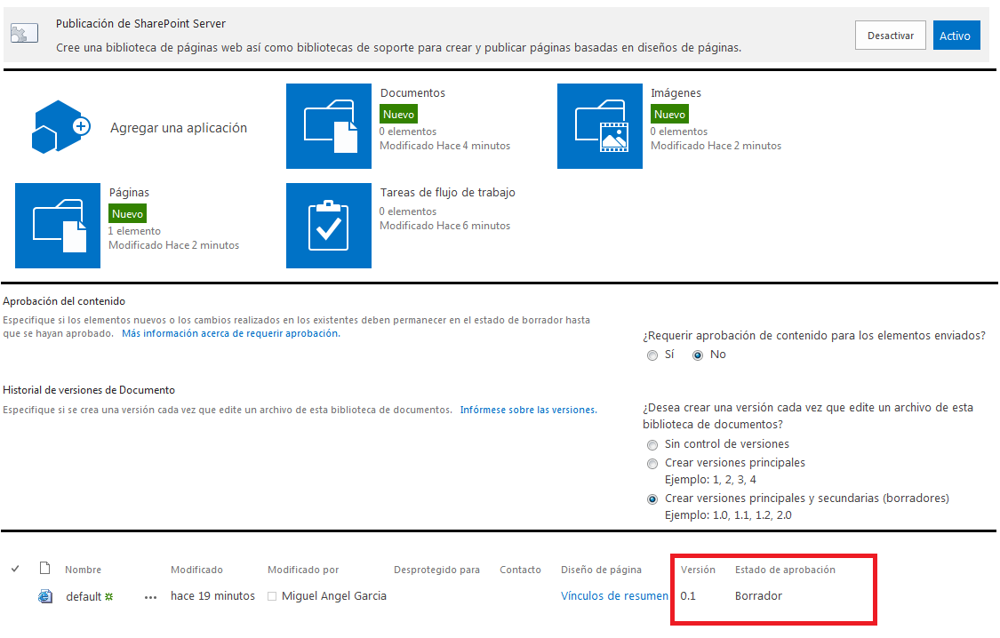
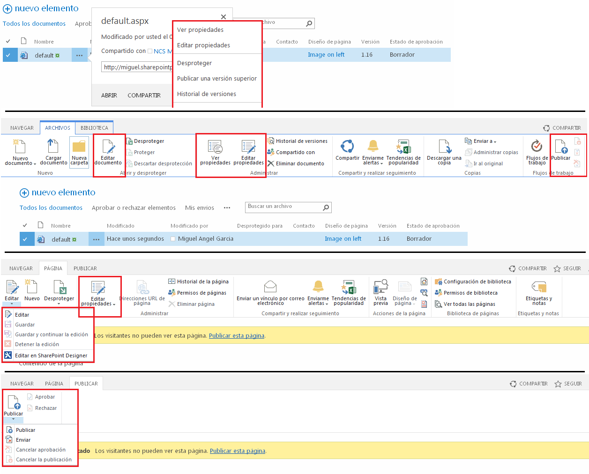
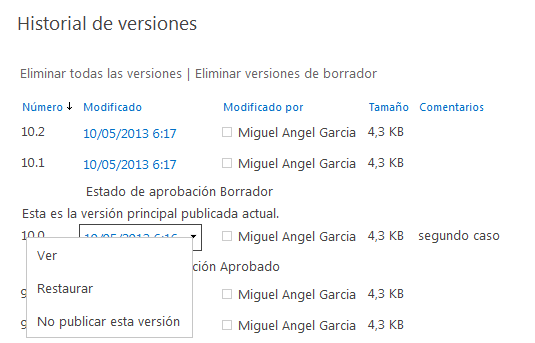
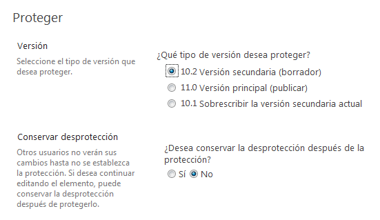
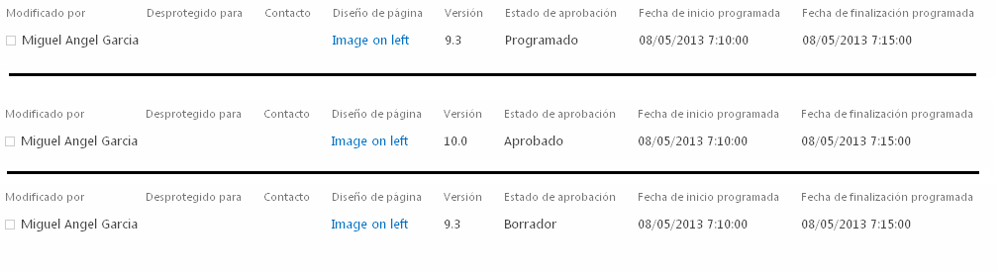
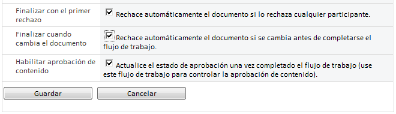

​Este artículo pretende analizar funcionalmente la relación existente entre el historial de versiones de las Páginas de Publicación, el estado de la aprobación de contenido y los diferentes métodos y características que propone SharePoint para la publicación de páginas.

Aunque las imágenes ilustrativas corresponden a la versión 2013 no existen diferencias significativas con la versiones 2007 y 2010.

**La característica**

Cuando creamos un sitio de publicación en SharePoint se activa la característica Publicación de SharePoint Server automáticamente y se crea una biblioteca de Páginas. Una de las características más importantes de dicha biblioteca es la configuración de versiones, donde podremos:

- Requerir aprobación de contenido: Los documentos o páginas permanecerán en estado borrador hasta ser aprobados.
- Crear versiones siempre que se modifique un documento o página.
- Especificar qué usuarios verán los borradores o versiones secundarias.
- Obligar a desproteger los documentos antes de ser modificados.

Cuando se activa la Aprobación de contenido, se agrega una columna llamada "Estado de aprobación" que indica el estado en el que se encuentra la página.  Esta columna puede tener uno de los siguientes valores:

- Borrador.
- En espera.
- Rechazado.
- Aprobado.
- Programado.

Cuando se activa el historial de versiones se agrega una columna adicional llamada "Versión".

**Publicar páginas**

La modificación del contenido de la página debe diferenciarse de la modificación de las propiedades aunque en ambos casos afectan al estado de aprobación. Existen diferentes métodos para modificar primero y publicar después las páginas:

- Menú ECB: Dependiendo del estado de la página, las acciones disponibles son diferentes.
- Pestaña "Archivos" de la Cinta: Una vez seleccionada(s) la(s) página(s) aparecen las acciones disponibles.

- Si desplegamos la página existen tres pestañas en la Cinta:
    - Navegar.
    - Página.
    - Publicar.

Estas tablas resumen los "Estados de aprobación" por los que pasa una página utilizando los diferentes métodos arriba señalados.

|  Estado de Aprobación: Borrador - Versión: X.Y | ​ | ​ | ​ |
| --- | --- | --- | --- |
| Desde | Método | Estado Final | Versiones |
| Pestaña Navegar | Publicar esta página / este borrador | Aprobado | Versión principal X+1.0 |
| Pestaña Página   | Editar – Guardar  Editar – Guardar y continuar la edición  Editar – Detener la edición – Guardar los cambios  Editar Propiedades – Editar propiedades de SEO | Borrador | Versión borrador X.Y+1 |
| ​ | Editar – Detener la edición – Sin guardar los cambios | Borrador | Sin cambios |
| Pestaña Publicar | Publicar - Publicar | Aprobado | Versión principal X+1.0 |
| ​ | Publicar - Enviar | En espera | Sin cambios |
| Menú ECB  Pestaña Archivos | Publicar una versión superior  Publicar | En espera | Sin cambios |
| Menú ECB  Pestaña Página  Pestaña Archivos | Editar Propiedades - Aceptar  | Borrador | Versión borrador X.Y+1 |
| ​ | Ver propiedades - Aprobar Rechazar - Borrador | Borrador | Sin cambios |
| ​ | Ver propiedades - Aprobar Rechazar - Pendiente | En espera | Sin cambios |

| Estado de Aprobación: En Espera – Versión: X.Y | ​ | ​ | ​ |
| --- | --- | --- | --- |
| Desde | Método | Estado Final | Versiones |
| Pestaña Navegar | Aprobar la página / los cambios | Aprobado | Versión principal X+1.0 |
| Pestaña Página | Editar – Guardar  Editar – Guardar y continuar la edición  Editar – Detener la edición – Guardar los cambios  Editar Propiedades – Editar propiedades de SEO | Borrador | Sin cambios |
|   | Editar – Detener la edición – Sin guardar los cambios | En Espera | Sin cambios |
| Pestaña Publicar | Cancelar Aprobación | Borrador | Sin cambios |
| ​ | Aprobar | Aprobado | Versión principal X+1.0 |
| ​ | Rechazar | Rechazado | Sin cambios |
| Menú ECB  Pestaña Archivos | Cancelar Aprobación | Borrador | Sin cambios |
| ​ | Aprobar Rechazar – Aprobado | Aprobado | Versión principal X+1.0 |
| ​ | Aprobar Rechazar – Rechazado | Rechazado | Sin cambios |
| ​ | Aprobar Rechazar – Pendiente | En espera | Sin cambios |
| Menú ECB  Pestaña Página  Pestaña Archivos    | Editar Propiedades | Borrador | Versión borrador X.Y+1 |
| ​ | Ver propiedades - Aprobar o Rechazar - Aprobado | Aprobado | Versión principal X+1.0 |
| ​ | Ver propiedades - Aprobar o Rechazar - Rechazado | Rechazado | Sin cambios |
| ​ | Ver propiedades - Aprobar o Rechazar - Pendiente | En espera | Sin cambios |

| Estado de Aprobación: Rechazado – Versión : X.Y | ​ | ​ | ​ |
| --- | --- | --- | --- |
| Desde | Método | Estado Final | Versiones |
| Pestaña Página | Editar – Guardar  Editar – Guardar y continuar la edición  Editar – Detener la edición – Guardar los cambios  Editar Propiedades – Editar propiedades de SEO | Borrador | Versión borrador X.Y+1 |
| ​ | Editar – Detener la edición – Sin guardar los cambios | Rechazado | Sin cambios |
| Pestaña Publicar | Publicar - Publicar | Aprobado | Versión principal X+1.0 |
|   | Publicar - Enviar | En espera | Sin cambios |
| Menú ECB  Pestaña Archivos | Publicar una versión superior  Publicar | En espera | Sin cambios |
| Menú ECB  Pestaña Página  Pestaña Archivos | Editar Propiedades | Borrador | Versión borrador X.Y+1 |
| ​ | Ver propiedades - Aprobar o Rechazar - Aprobado | Aprobado | Versión principal X+1.0 |
| ​ | Ver propiedades - Aprobar o Rechazar - Rechazado | Rechazado | Sin cambios |
| ​ | Ver propiedades - Aprobar o Rechazar - Pendiente | En espera | Sin cambios |

| Estado de Aprobación: Aprobado – Versión: X.0 | ​ | ​ | ​ |
| --- | --- | --- | --- |
| Desde | Método | Estado Final | Versiones |
| Pestaña Página | Editar – Guardar  Editar – Guardar y continuar la edición  Editar – Detener la edición – Guardar los cambios  Editar Propiedades – Editar propiedades de SEO | Borrador | Versión borrador X.1 |
| ​ | Editar – Detener la edición – Sin guardar los cambios | Aprobado | Sin cambios |
| Pestaña Publicar | Cancelar Publicación | Borrador | Versión previa X-1.Y+1 |
| Menú ECB  Pestaña Archivos | No publicar esta versión  Cancelar Publicación | Borrador | Versión previa X-1.Y+1 |
| Menú ECB  Pestaña Página  Pestaña Archivos | Editar Propiedades | Borrador | Versión borrador X.1 |
| ​ | Ver propiedades - Aprobar Rechazar - Aprobado | Aprobado | Sin cambios |
| ​ | Ver propiedades - Aprobar Rechazar - Pendiente | En espera | Versión previa X-1.Y+1 |
| ​ | Ver propiedades - Aprobar Rechazar - Rechazado | Rechazado | Versión previa X-1.Y+1 |

**Historial de versiones**

La característica del control de versiones, permite Ver, Eliminar y Restaurar cualquiera de las versiones principales y secundarias  de las páginas guardadas en el historial de versiones. Restaurar una versión anterior principal o secundaria de una página, cambia el "Estado de aprobación" a "Borrador" e incrementa la versión borrador X.Y+1.

En el caso de las versiones principales publicadas existe la opción adicional "No publicar esta versión". Cuando se utiliza la opción, el "Estado de Aprobación" cambia a "Borrador". Si no existe una versión secundaria superior a la versión principal,  se incrementa la versión previa X-1.Y+1, por el contrario, si existe una versión secundaria superior a la versión principal pasará a ser la nueva versión.

**Desprotección de documentos**

Cuando se configuran las versiones de una biblioteca se puede especificar que para modificar las páginas, necesariamente deben estar desprotegidas. Independientemente de esta configuración, un usuario que tenga los permisos necesarios puede desproteger o proteger una página. Cuando una página se desprotege inmediatamente su "Estado de aprobación" cambia a "Borrador" y se incrementa la versión borrador X.Y+1.  Cuando una página está desprotegida las modificaciones no generan nuevas versiones borrador. Es posible, no obstante, generar versiones borrador conservando la página desprotegida.

Cuando una página está desprotegida se aplica esta tabla:

| Acción | Estado final | Protección | Versiones |
| --- | --- | --- | --- |
| Antes de desproteger: Borrador, En Espera o Rechazado Versión X.Y  Después de desproteger: Borrador – Desprotegido Versión X.Y+1 | ​ | ​ | ​ |
| Descartar Desprotección | Antes de desproteger  | Protegido | Versión previa X.Y |
| Proteger - Versión secundaria (borrador) – NO conserva desprotección | Borrador | Protegido | Mantiene la versión X.Y+1 |
| Proteger - Versión secundaria (borrador) – SI conserva desprotección | Borrador | Desprotegido | Versión siguiente X.Y+2 |
| Proteger - Versión principal (publicar) | En espera | Protegido | Mantiene la versión X.Y+1 |
| Proteger - Sobrescribir la versión secundaria actual – NO conserva desprotección | Borrador | Protegido | Sobrescribe la versión X.Y |
| Proteger - Sobrescribir la versión secundaria actual – SI conserva desprotección | Borrador | Desprotegido | Sobrescribe la versión X.Y y se mantiene la versión X.Y+1 |
| Antes de desproteger: Aprobado – Versión X.0  Después de desproteger: Borrador – Desprotegido Versión X.1 | ​ | ​ | ​ |
| Descartar Desprotección | Aprobado | Protegido | Versión previa X.0 |
| Proteger - Versión secundaria (borrador) – NO conserva desprotección | Borrador | Protegido | Mantiene la versión X.1 |
| Proteger - Versión secundaria (borrador) – SI conserva desprotección | Borrador | Desprotegido | Versión siguiente X.2 |
| Proteger - Versión principal (publicar) | En Espera | Protegido | Mantiene la versión X.1 |

**Programar la publicación de páginas**

La programación de publicación de páginas está disponible en SharePoint en las Bibliotecas de documentos aunque no en las listas. Simplemente se trata de activar una de las características de la Biblioteca de documentos: "Administrar la programación de documentos". Esta configuración requiere que la configuración de versiones principales y secundarias (borradores) esté activada y la aprobación de contenido.

Una vez activada esta característica en la biblioteca se agregan dos columnas que nos ayudan a verificar el estado de los documentos: Fecha de inicio programada, Fecha de finalización programada.

SharePoint no se basa en la Fecha de inicio programada (o Fecha de publicación) ni en la Fecha de finalización programada (o Fecha de caducidad) para verificar si un documento o página se debe mostrar o no a los usuarios autorizados. De hecho, se basa en la columna "Estado de aprobación". Al habilitar la programación de elemento en una biblioteca de documentos, SharePoint hace uso de eventos y temporizadores para cambiar el Estado de aprobación en forma automática en base a la fecha de inicio programada y a la fecha de finalización programada.

Esto es lo que sucede con las columnas "Estado de aprobación" y "Versión" si se utilizan las fechas de inicio y finalización:

1. Si un usuario aprueba una página (con cualquiera de las diferentes opciones disponibles que hemos visto) en una fecha anterior a la que figura en "Fecha de inicio programada" el "Estado de aprobación" cambia a "Programado" y la versión no se modifica.
2. En la fecha y hora de la programación de inicio: si el estado de aprobación es "Programado", cambia a "Aprobado", el número de versión principal se incrementa X+1.0. No se producen cambios si el estado de aprobación fuese "Borrador", "En espera" o "Rechazado".
3. En la fecha y hora de programación de finalización: si el estado de aprobación es "Aprobado", cambia a "Borrador" y el número de versión vuelve a la anterior X-1.Y.

**Flujos de trabajo de aprobación**

Adicionalmente podemos configurar un flujo de trabajo de aprobación sobre la biblioteca de páginas que modificará la columna "Estado de aprobación". Este flujo distribuye una página para su aprobación. Los aprobadores pueden aprobar o rechazar a la página, reasignar la tarea de aprobación a otros usuarios o solicitar cambios en la página.

Al crear el flujo de trabajo, en la sección "Opciones de inicio" es necesario marcar la opción "Iniciar este flujo de trabajo para aprobar la publicación de una versión principal de un elemento." Esta configuración disparará el flujo de trabajo cuando un usuario intente publicar una versión superior con cualquiera de los métodos arriba indicados.

En la página que configura propiamente el flujo de trabajo es importante marcar las opciones que actualizarán la página según las acciones realizadas en el flujo:

- Finalizar con el primer rechazo.
- Finalizar cuando cambia el documento.
- Habilitar aprobación de contenido.

La columna "Estado de aprobación" permanecerá  "En espera" hasta que el flujo de trabajo de aprobación finalice. La acción de aprobar por parte de los aprobadores, cambiará el "Estado de aprobación" de la página a "Aprobado", incrementando la versión principal X+1.0. Si se rechaza o cambia el documento, el "Estado de aprobación" de la página cambiará a "Rechazado" manteniéndose la misma versión.

**Miguel Ángel García Rodríguez**
 Analista SharePoint
 [miganggarrod@hotmail.com](mailto:miganggarrod@hotmail.com)

 
 
import LayoutNumber from '../../../components/layout-article'
export default LayoutNumber
