​Por un lado, SharePoint Designer brinda a usuarios especializados la posibilidad de crear soluciones sin código que contengan una variedad de casos comunes, para ser trabajados en sitios colaborativos y/o Páginas Web. A través de esta herramienta se pueden brindar soluciones de inteligencia empresarial y flujos de trabajo en un entorno fácil de usar.

Por otro lado, los programadores pueden usar SharePoint Designer 2013 para lograr un inicio rápido en proyectos de desarrollo de SharePoint.

Con la llegada de SharePoint Designer 2013  se ha diversificado la manera de crear y editar flujos de trabajo. Es aquí donde encontramos la mayoría de las características nuevas.

Algunas de estas nuevas características son:

- Capacidad para crear flujos de trabajo basados en la nueva infraestructura de flujos de trabajo de .NET Framework 4.X Permitiendo a la vez que se sigan creando y editando los flujos de trabajo antiguos de SharePoint 2010
- Integración ajustada con etapas:
    - Ya no es necesario que los flujos de trabajo estén en serie.
    - Ahora todos los flujos de trabajo de 2013 están basados en estado, y es posible hacer que un flujo de trabajo salte a cualquier etapa deseada, incluso a una etapa anterior.
- El nuevo diseñador visual:
    - Una superficie de diseño completamente nueva que integra el lienzo de Visio directamente dentro de SharePoint Designer.
    - Permite crear flujos de trabajo con la acción de hacer clic y arrastrar.
    - Incluso es posible establecer las propiedades de cada acción directamente dentro del diseñador visual. No es necesario pasar de nuevo al diseñador basado en texto si no deseamos hacerlo.
- Copiar y pegar:
    - Ahora es posible copiar, cortar y pegar dentro del diseñador basado en texto.
- Bucles:
    - Ahora los bucles son una acción plenamente integrada que se puede utilizar dentro de todos los flujos de trabajo de 2013
- Llamar a la acción de servicios web:
    - Ahora se puede llamar a los servicios web REST/HTTP directamente desde dentro de los flujos de trabajo de SharePoint 2013.
- Iniciar acciones de flujo de trabajo:
    - Ahora tenemos una acción que permite generar flujos de trabajo antiguos de 2010 directamente desde dentro de un flujo de trabajo de 2013.
    - Se puede utilizar esta acción para aprovechar cualquier funcionalidad de flujo de trabajo de 2010 (por ejemplo, las acciones personalizadas antiguas).
- Empaquetado:
    - Ahora se pueden empaquetar flujos de trabajo individuales directamente desde dentro de SPD
- Variables de tipo de idioma:
    - Ahora se pueden crear variables que pueden contener una diversidad de valores
    - La combinación de esto con la nueva acción de bucle abre todo un espectro de nuevos escenarios.

Antes de comenzar a trabajar con SharePoint Designer y comenzar a realizar un ejemplo es importante conocer y tener en cuenta algunos conceptos como los siguientes:

- **Paso:** cada una de las secuencias que compone un workflow, puede haber varios pasos en un mismo flujo, y podemos elegir que se ejecuten en serie (los pasos se ejecutan uno detrás de otro) o en paralelo (todos los pasos se ejecutan a la misma vez, por ejemplo, si queremos esperar a que varias personas aprueben un documento).
- **Condición:** parte de una condición opcional que pregunta si el paso se realiza o no.
- **Acciones:** las tareas que se ejecutarán si la condición de un paso es cierta, pueden ser varias encadenadas.
- **Variables de inicio:** unas variables que el workflow pedirá al iniciarse. Pueden ser texto, fecha/hora, número o enumeraciones.
- **Variables:** otras que definimos en el procesamiento del workflow para nuestras necesidades.

**Ejemplo de un flujo en SharePoint**

**Objetivo**

Automatizar un aviso cada vez que una "Fecha de vencimiento" vaya a ocurrir. Este aviso se debe enviar a los 7 meses antes del vencimiento, luego a los 6 meses, a los 5 meses antes de vencer y así sucesivamente hasta que envíe el aviso 1 mes antes y el propio día que vence. En una lista de SharePoint, vamos a tener todos los registros, que básicamente constan de los siguientes campos:

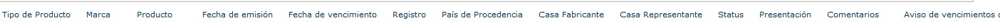

A esta lista, asociamos el workflow.

Nuestro workflow hará lo siguiente:

- Se llenará el registro en la lista, primordial que nuestro registro llene correctamente la "Fecha de vencimiento".
- Se tomará la fecha de vencimiento para poder calcular los meses que faltan para su vencimiento.
- Se registrará la fecha de envío de la notificación en el historial del flujo (este paso es realizado más que todo para verificar que se calcula la fecha correcta).
- Se detiene el flujo hasta la fecha de envío de la notificación (este flujo se detiene para los 7 meses, 6 meses, 5 meses, etc.).
- Al llegar la fecha se envía un correo con la notificación del tiempo en que esta por vencer.
- Se registra en el historial del flujo un mensaje de cuando fue enviada la notificación.

**Inicio**

Se crean las variables para cada fecha de vencimiento de tipo "Fecha y Hora":

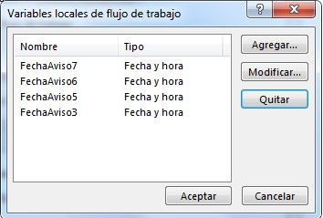

Una vez que tenemos las variables locales creadas, comenzamos a crear los pasos para cada una de las fechas de vencimiento, en este caso, se hizo un paso "General" que contiene todos los siguientes pasos de las fechas de aviso.

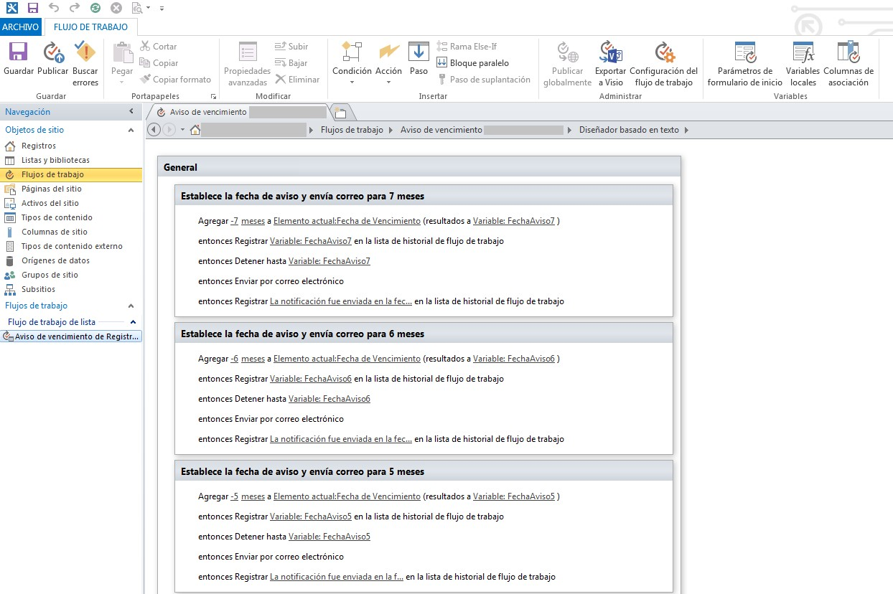

Para cada paso de las fechas de aviso se hizo lo siguiente:

- Se utilizó la acción de "Agregar hora  a la fecha"

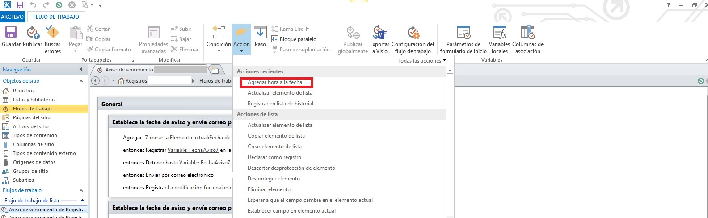

En esta acción se le restó 7 meses (para poder hacer la resta de los meses a una fecha de debe poner -7 meses) a la "Fecha de Vencimiento" colocada en la lista de registro y se asignó a la variable "FechaAviso7" la fecha calculada.

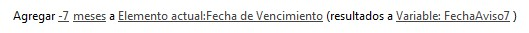

- La siguiente acción es registrar en el historial del flujo la fecha que se calculó:

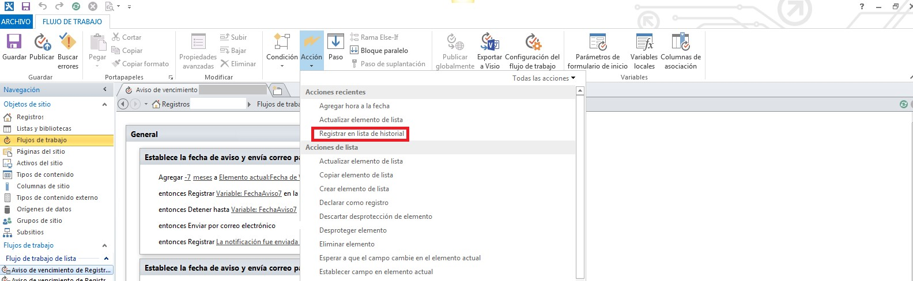

Esta acción lo que hace es que cuando arranca el flujo se calcula la fecha en que se enviará la notificación y la coloca a manera de registro en el historial (esta acción la coloqué para verificar que la fecha que se está calculando sea la indicada).

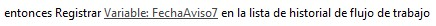

- Luego la siguiente acción se encarga de "Detener el flujo" hasta la fecha en que se envía la notificación (en este caso la variable "FechaAviso7" tiene la fecha calculada para el envío del correo)

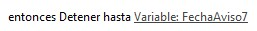

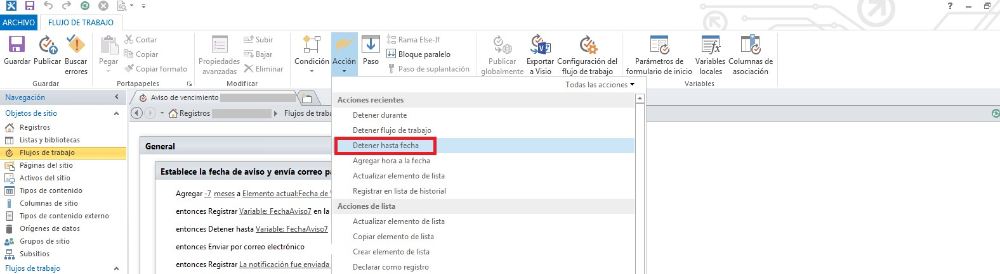

- Una vez que llegue la fecha de envío de correo, el flujo se reactiva y envía un correo personalizado, notificando el tiempo que le queda al registro por vencer.

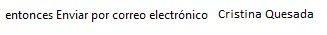

Este correo electrónico se puede enviar a algún responsable previamente cargado en la lista y se coloca el campo de la lista para que se lo envíe a "x" persona, si no sabemos de anticipado a quien se le enviará a la hora de configurar el flujo. El correo electrónico que se envía es el siguiente:

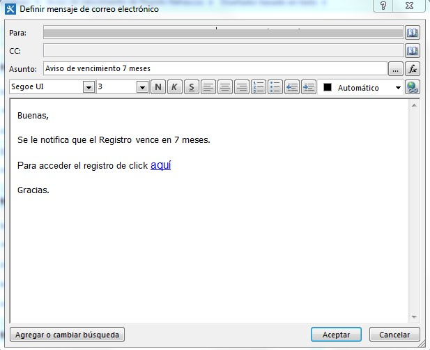

Se le indica al responsable cuantos meses tiene por vencer el registro y además se le pone un acceso para que ingrese directamente en el Registro.

- Y finalmente al enviar el correo electrónico se registra un mensaje en el historial del flujo indicando en qué fecha se envió la notificación de vencimiento.

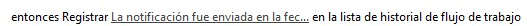

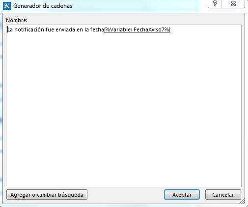

Para los pasos siguientes de 6 meses, 5 meses, etc., se replican las mismas acciones.

**Cristina Quesada Calderón**
 Consultora en Tecnologías SharePoint en Grupo CMA
 [cristi\_q@hotmail.com](mailto&#58;cristi_q@hotmail.com) 
 @cris\_quesada
 [http://cristina-quesada.blogspot.com/](http&#58;//cristina-quesada.blogspot.com/)

