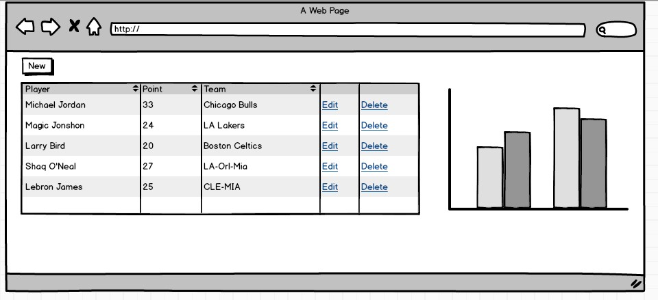
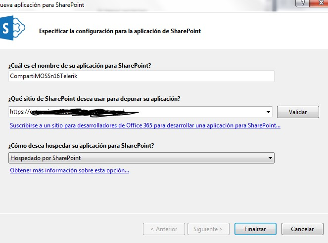
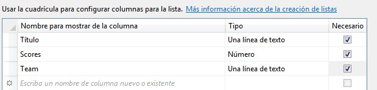
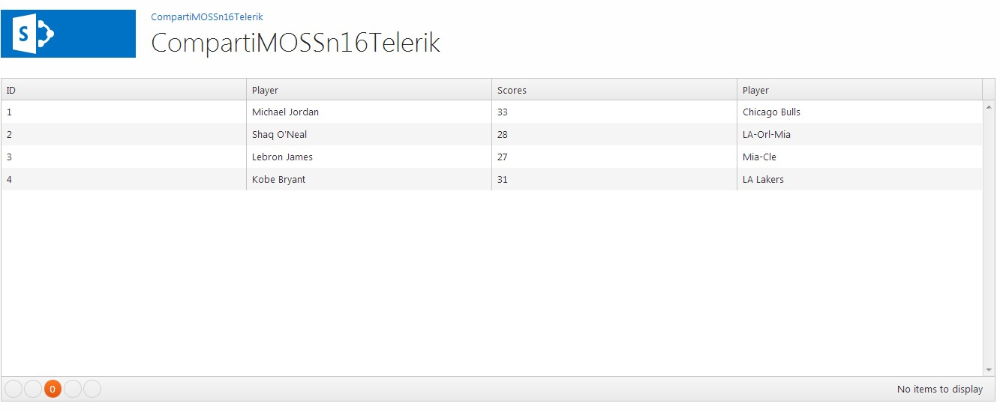
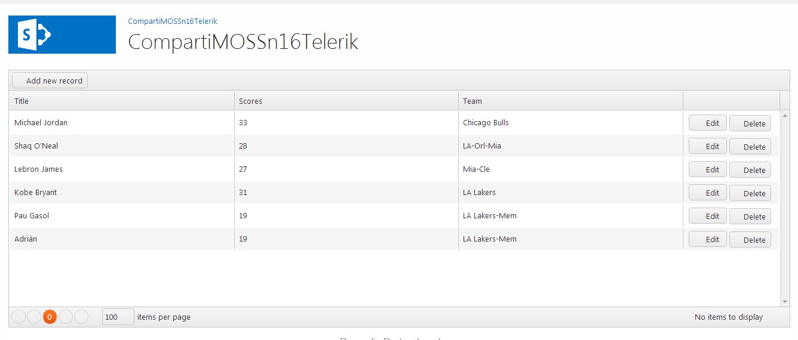
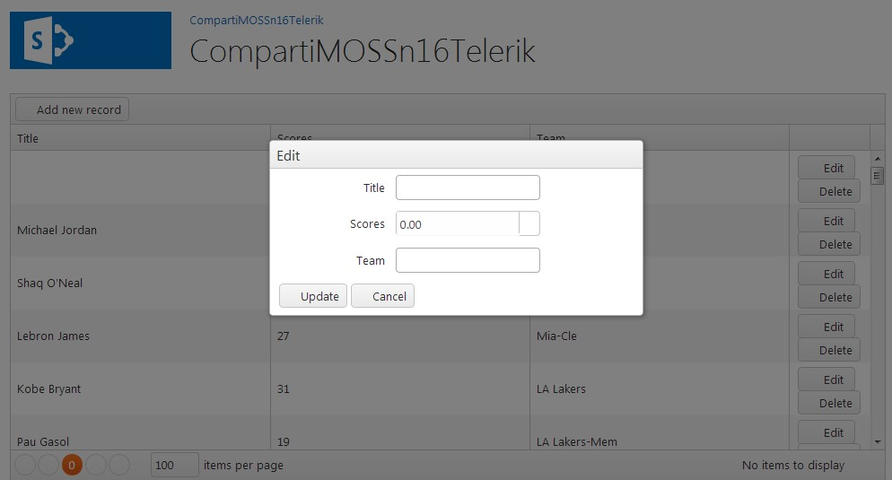
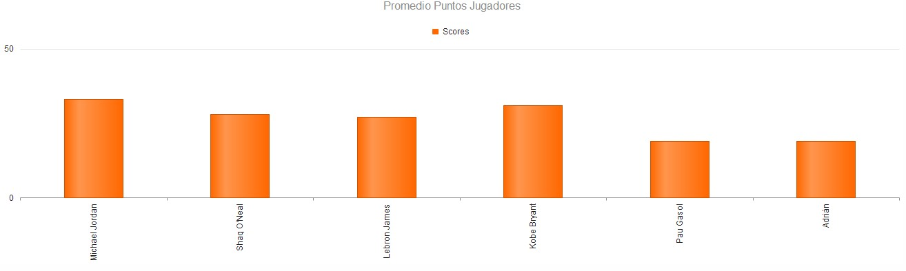

import ArticleHeader from '../../../components/article-header'

<ArticleHeader frontmatter={props.pageContext.frontmatter} />


​La llegada de la nueva versión de SharePoint obliga en cierto modo a que los desarrolladores de anteriores versiones tengan que adaptarse a los cambios del desarrollo en la Web y a familiarizarse con un lenguaje de programación que no levanta las simpatías de la comunidad .NET. Este lenguaje como se deduce es JavaScript. En este artículo se va a introducir el framework JavaScript Kendo UI de Telerik y en un artículo posterior ExtJS de Sencha para facilitar nuestro trabajo en los desarrollos a realizar y sobre todo otorgarles una mayor calidad.

**¿Qué es un Framework?**

Según la Wikipedia es una estructura conceptual y tecnológica de soporte definido, normalmente con artefactos o módulos de software concretos, que puede servir de base para la organización y desarrollo de software. Típicamente, puede incluir soporte de programas, bibliotecas, y un lenguaje interpretado, entre otras herramientas, para así ayudar a desarrollar y unir los diferentes componentes de un proyecto. Representa una arquitectura de software que modela las relaciones generales de las entidades del dominio, y provee una estructura y una especial metodología de trabajo, la cual extiende o utiliza las aplicaciones del dominio.

**¿Por qué utilizar un Framework JavaScript?**

Si analizamos el uso que anteriormente hacíamos de JavaScript en nuestros desarrollos casi siempre se basaban en utilizar alguna librería bien para dotarnos de un efecto que nos gustaba (ejemplo del típico banner slider que está en muchísimas web), bien hacer uso del patrón MVVM haciendo uso de la librería KnockoutJS como introdujo Edin Kapic en números anteriores de la revista. O bien hacer uso de JQuery para añadir una funcionalidad especifica (validar campos, ocultar los mismos, refrescar datos, etc...).

El utilizar JavaScript sin entender realmente lo que estamos desarrollando hace que nuestros desarrollos tengan falta de calidad y bugs relativos a este uso. Es decir vamos concatenando funcionalidades JavaScript a nuestros desarrollos sin saber bien que acciones estamos realizando dentro de nuestro desarrollo. Esto hace que mezclemos diferentes versiones de las librerías que estamos utilizando y da lugar a que se produzcan muchos fallos en nuestros desarrollos. Estos errores son debidos al desconocimiento sobre JavaScript como lenguaje de programación. Y lo que dentro de un desarrollo en .NET ni siquiera nos lo planteamos, en JavaScript dado que es un lenguaje muy vivo y permisivo (en tiempo de desarrollo) no dudamos  en realizarlo. El uso de un Framework JavaScript aporta como valor añadido que nos olvidemos de estos problemas a la vez que introduce una serie de patrones para otorgarle más calidad a nuestro software. Eso sí, esto no implica que no tengamos que conocer JavaScript como lenguaje de programación.  Nos proporciona una abstracción de código común que provee funcionalidades genéricas que pueden ser utilizadas para desarrollar aplicaciones de manera rápida, fácil, modular y sencilla, ahorrando tiempo y esfuerzo. Estas funcionalidades se traducen en la forma de diversos tipos de Grid, Combos, Formularios, efectos en las imágenes y distintos gráficos de barras. Aunque este tipo de componentes también los tenemos disponibles en desarrollos en .NET, la gran ventaja del uso de estos Frameworks es que están basadas en los estándares web y que son compatibles con todos los dispositivos móviles/tabletas (IOS, Android, Windows Phone, Surface) y todos los navegadores modernos (IE8 o superior, Chrome, Mozilla). Además aportan unos patrones para realizar nuestros desarrollos lo que repercute directamente en la calidad del software.

Otra gran ventaja es que generan una interfaz de usuario muy intuitiva y con gran variedad de gráficos de barras, gauges, y diversos indicadores muy interesantes para incluir en nuestros desarrollos

**Manos a la obra**

A continuación, nos centraremos en introducir estos frameworks dentro de nuestros desarrollos utilizándolos en una aplicación de SharePoint. A modo de ejemplo, crearemos un típico mantenimiento de datos maestros que permite mostrar aspectos muy útiles de estas herramientas. El resultado sería el siguiente mockup:



En concreto, la aplicación permite mostrar en un Grid el contenido de una lista de SharePoint que contiene los máximos anotadores de la NBA, y con la posibilidad de añadir, editar y eliminar cualquiera de estos registros y a la vez visualizamos una gráfica en la que se realiza una comparación de los mismos.

**Utilizando el Framework Kendo UI Telerik**

Kendo es un framework JavaScript creado por Telerik (cuyos componentes dentro del mundo .NET son muy populares) con menos de un año de vida. Su funcionamiento consiste extender de forma sencilla las capacidades que están disponibles en jQuery. Desde Kendo se puede bien usar el modelo de objetos de cliente (CSOM) JavaScript de SharePoint o bien consumir directamente la API REST. En este ejemplo vamos a utilizar la API REST por dos motivos:

- En primer lugar, poner en práctica el uso de estándares web en aplicaciones.
- En segundo lugar, demostrar que la API REST de SharePoint tiene la misma potencia que el modelo de objetos de Cliente con la gran ventaja de qué se pude usar desde plataformas Microsoft (W8, WP8) y no Microsoft (IOS, Android).


**Empezando el desarrollo**

Este desarrollo se va a implementar por medio de una APP de tipo SharePoint-Hosted, (aunque se podría portar sin ningún problema en WebParts clásicos):

- Abrimos Visual Studio 2012, y seleccionamos un proyecto de este tipo:




- En primer lugar, agregamos al proyecto una lista llamada Players en la que añadiremos los datos que queremos mostrar en el grid. Esta lista contendrá los siguientes campos:




- Dentro de la lista le añadiremos unos datos por defecto para que una vez que carguemos el grid podamos ver algunos resultados. Para añadir los datos basta con editar el archivo "elements.xml" que se encuentra ubicado dentro de la Instancia de la lista y añadir los datos.
- La siguiente acción a realizar consiste en importar las librerías JavaScript y los CSS de Kendo (vamos a aprovechar el estilo que viene de serie y dejamos para los diseñadores la edición de estos CSS) por lo que añadimos los siguientes ficheros al proyecto: "kendo.all.min.js", "kendo.common.min.css" y "kendo.default.min.css" (estos ficheros se encuentran disponibles dentro de la descarga del propio framework).
- En la página default.aspx añadimos referencias a las librerías JavaScript y archivos .CSS de la siguiente forma:


```
    <link rel="Stylesheet" type="text/css" href="../Content/App.css" />
    <link href="../Content/kendo.common.min.css" rel="stylesheet" />
    <link href="../Content/kendo.default.min.css" rel="stylesheet" />    
    <script type="text/javascript" src="../Scripts/kendo.all.min.js"></script>    
    <script type="text/javascript" src="../Scripts/App.js"></script>
```

- Una vez ya tenemos las referencias a las librerías que vamos a utilizar, comenzamos con el desarrollo. Para ello, todo el código que vamos a necesitar lo incluiremos dentro de la página default.aspx y dentro del archivo App.js. En primer lugar haremos uso de un componente DataSource, qué es una abstracción para el uso de datos locales (arrays de objetos) o remotos (XML, JSON, JSONP).  Este componente es totalmente compatible con operaciones de tipo CRUD (Create, Read, Update, Destroy) y proporciona apoyo tanto en el lado cliente como del lado del servidor para la ordenación, la paginación, el filtrado, agrupación y agregados.
- Abriremos el fichero App.js y definimos este componente de forma que apunte a la lista de SharePoint creada.  En la definición, configuraremos el modelo que vamos a usar y personalizaremos algunas características. A continuación, se muestra la definición, configuración y uso del componente:


```
    dataSource = new kendo.data.DataSource({
        type: "odata",
        transport: {
            read: {
                url: listUrl,
                type: "GET",
                dataType: "json",
                contentType: "application/json;odata=verbose",
                headers: {
                    "accept": "application/json;odata=verbose"
                }
            }
        },
        pageSize: 5,
        schema: {
            data: "d.results",
            model: {
                id: "ID",
                fields: {
                    ID: { editable: false, nullable: false },
                    Title: { validation: { required: true } },
                    Scores: { type: "number" },
                    Team: { type: "string" }
                }
            }
        }
    });
```


- Como se pude apreciar, únicamente hemos realizado la configuración "read" para el origen de datos. Conforme definamos el resto de operaciones CRUD, iremos añadiendo más configuración. Del reto de configuraciones, lo que resulta más interesante es que por un lado el número de elementos que estamos paginando en nuestro caso es 5 y por otro lado estamos realizando la definición de un esquema con un modelo de datos, en los que podemos ir añadiendo diversas características interesantes como son los campos requeridos, si permitimos editarlos, etc.
- A continuación vamos a crearnos un Grid, para ello en primer lugar nos vamos a la página "Default.aspx" y añadimos el div donde lo posicionaremos de la siguiente forma:


```
<div id="grid"></div>
```

- Dentro del fichero App.js, a continuación de la definición del DataSource, introduciremos el siguiente código:


```
$("#grid").kendoGrid({
        dataSource: dataSource,
        pageable: true,
        height: 430,      
        columns: [
            { field: "ID", title: "ID" },
            { field: "Title", title: "Player" },
            { field: "Scores", title: "Scores" },
            { field: "Team", title: "Team" }]
    });
```

A este tipo de grid se les puede otorgar mucho más complejidad, como agrupar por equipos, mostrar totales, etc, y solo añadiendo unas pocas de opciones, para ello consultar la propia documentación de Kendo y podéis obtener todas las posibilidades que nos blinda la herramienta. Si ejecutamos y desplegamos la APP, obtendremos el siguiente resultado:



- Una vez tenemos este primer resultado, el siguiente paso es introducir a ambos componentes la posibilidad de poder añadir, editar y eliminar elementos. En primer lugar iremos al fichero App.js y reemplazaremos la definición del DataSource, por la siguiente definición:


```
dataSource = new kendo.data.DataSource({
        type: "odata",
        transport: {
            read: {
                url: listUrl,
                type: "GET",
               dataType: "json",
                contentType: "application/json;odata=verbose",
                headers: {
                    "accept": "application/json;odata=verbose"
                }
            },
           create: {
                    url: listUrl,
                    type: "POST",
                    dataType: "json",
                    contentType: "application/json;odata=verbose",
                   headers: {
                        "accept": "application/json;odata=verbose",
                        "X-RequestDigest": $("#__REQUESTDIGEST").val(),
                    }
            },
            update: {
                    url: function (data) {
                        return listUrl + "(" + data.ID + ")";
                    },
                    beforeSend: function (jqXhr, options) {
                        var data = JSON.parse(options.data);
                        jqXhr.setRequestHeader("If-Match", data.__metadata.etag);
                    },
                    type: "POST",
                    dataType: "json",
                   contentType: "application/json;odata=verbose",
                    headers: {
                        "accept": "application/json;odata=verbose",
                        "X-RequestDigest": $("#__REQUESTDIGEST").val(),
                        "X-HTTP-Method": "MERGE"
                   },
                },
            destroy: {
                    url: function (data) {
                        return listUrl + "(" + data.ID + ")";
                    },
                    type: "DELETE",
                    dataType: "json",
                    contentType: "application/json;odata=verbose",
                    headers: {
                        "accept": "application/json;odata=verbose",
                        "X-RequestDigest": $("#__REQUESTDIGEST").val(),
                        "X-HTTP-Method": "MERGE",
                        "If-Match": "*"
                    }
            },
            parameterMap: function (data, type) {
         if (type === "update" && data["__deferred"]){
            delete data["__deferred"];
        }
        return kendo.stringify(data);
    }
        },
        pageSize: 100,
        schema: {
            data: "d.results",
            model: {
                Id:"ID",
                fields: {      
                    Title: { type: "string"  },
                    Scores: { type: "number" },
                    Team: { type: "string" }
                }
            }
        }
    });    });
```

De esta forma, estamos consiguiendo añadirle a nuestro origen de datos que permita realizar operaciones CRUD. Para ellos hemos añadido la opción "créate","update", "destroy" y "parameterMap". Esta última sirve para indicar que parámetros queremos enviar o no a SharePoint utilizando la API REST. Debido a que si enviamos los datos tal y como lo genera Kendo da un error indicando que hay un valor "\_\_deferred" que no es admitido. Por este motivo lo que hacemos antes de enviar los datos es eliminar este valor para evitar cualquier fallo al enviar los datos.

- Una vez tenemos preparado el DataSource, con añadir una serie de opciones en el grid dispondremos de un formulario para dar de alta los jugadores, la posibilidad de editar y eliminar los mismos datos. Para ello realizamos las siguientes modificaciones en el componente Grid que habíamos implementado anteriormente:


```
$("#grid").kendoGrid({
        dataSource: dataSource,
        pageable: {
            refresh: true,
            pageSizes: true
        },
        height: 430,    
        toolbar: ["create"],
        columns: [
               { field: "Title"},
               { field: "Scores" },
               { field: "Team" },
            { command: ["edit","destroy"], title: "&nbsp;", width: "45px" }],
         editable: "popup"
    });
```

Como se deduce, hemos modificado las columnas del grid para añadir una nueva columna command en la que podremos editar y eliminar el registro automáticamente. Adicionalmente, en la parte superior hemos creado un botón para añadir nuevos registros. Este botón puede tener dos funcionalidades bien añadir el registro directamente en el grid, o bien mostrar una ventana modal en la que en la que introducir el nuevo registros. En este caso se ha optado por la segunda opción.  Una de las grandes ventajas que tiene es que cuando realizamos cualquier opción de edición de los registros estos formularios son inteligentes, en el sentido que ya incorporan la propia validación de los campos obligatorios y del formato de los mismos.

El resultado se muestra a continuación:



Cuando pulsamos sobre el botón de “Add new record” vemos como se muestra la pantalla modal:



Una vez realizado las operaciones básicas vamos a mostrar como con el mismo datasource se pude visualizar una gráfica relativamente simple y muy sencilla de implementar. Para ello tenemos que hacer uso del Widget “Bar Char”. Antes de ponernos con el JavaScript retocamos un poco el HTML para ello añadimos las siguientes líneas de código dentro de la página default.aspx:

```
<div class="chart-wrapper" style="margin: auto;">
      <div id="chart">   </div>
 </div>
```

A continuación, modificamos el archive App.js de la siguiente forma:

```
$("#chart").kendoChart({
        dataSource: dataSource,
        title: {
            text: "Promedio Puntos Jugadores"
        },
        legend: {
            position: "top"
        },
        seriesDefaults: {
            type: "column"
        },
        series:
        [{
            field: "Scores",
            name: "Scores"
        }],
        categoryAxis: {
            field: "Title",
            labels: {
                rotation: -90
            },
            majorGridLines: {
                visible: false
            }
        },
        valueAxis: {
            labels: {
                format: "N0"
            },
            majorUnit: 10000,
            line: {
                visible: false
            }
        },
        tooltip: {
            visible: true,
            format: "N0"
        }
    });
```

Una vez añadido estas modificaciones ya tenemos el grafico listo en nuestra aplicación como mostramos en la siguiente pantalla:



**Conclusiones**

Todo esto es una pequeña parte de la que contiene este Framework  que es muy completo y merece la pena cuanto menos probar su utilidad. También tiene incluido la funcionalidad KnockoutJS para incluir patrones Model View View Model, incluye muchas más utilidades sencillas de utilizar y que da un salto de calidad a nuestros desarrollos y con menor esfuerzo.

Existen multitud de frameworks JavaScript, cada desarrollador puede tener preferencia por uno u por otro. Mi opinión personal es que no podría indicar cuál es el mejor framework JavaScript que hay en el mercado, cada desarrollador tiene su preferido. Pero al final lo que tenemos que tener claro es que hay que realizar el software con la mayor calidad posible y para ello el uso de cualquiera de estos frameworks es prácticamente una obligación.

**Referencias:**

- [http://demos.kendoui.com/](http&#58;//demos.kendoui.com/)
- [http://stackoverflow.com/questions/16439721/specifying-the-fields-to-send-on-an-update-command-using-the-kendo-ui-framewor](http&#58;//stackoverflow.com/questions/16439721/specifying-the-fields-to-send-on-an-update-command-using-the-kendo-ui-framewor)
- [SharePoint 2013: Perform basic data access operations by using REST in apps](http&#58;//code.msdn.microsoft.com/officeapps/SharePoint-2013-Perform-335d925b)
- SharePoint 2013 de principio a fin. Editorial Krasis Press, Febrero de 2013.


**Adrián Diaz Cervera**
 Sharepoint Architect at Encamina
 MCPD SharePoint 2010 MAP y MCC 2012 
[http://blogs.encamina.com/desarrollandosobresharepoint](http&#58;//blogs.encamina.com/desarrollandosobresharepoint)
 [adiaz@encamina.com](mailto&#58;adiaz@encamina.com)
 @AdrianDiaz81

