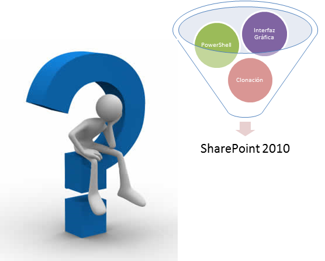
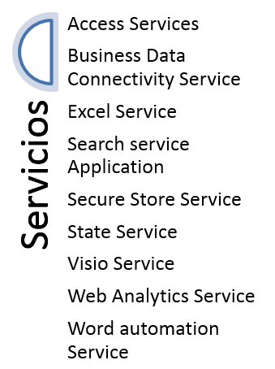

A la hora de instalar SharePoint disponemos de varias opciones,  pero: ¿cuál de ellas es la más apropiada?  La instalación a través de la interfaz gráfica puede parecer sencilla y rápida aunque en ciertos escenarios puede ser poco eficiente. Revisemos que opciones tenemos y cómo podemos rentabilizar nuestro tiempo y esfuerzo.

Podríamos distinguir las siguientes modalidades a la hora de realizar una instalación:

- Instalación clásica (interfaz gráfica).
- Por medio programación (scripting PowerShell).
- Utilizando clonación.




¿Qué factores podemos distinguir a la hora de seleccionar un modo u otro? Dependiendo de qué situación, el criterio de selección puede basarse en uno u otro aspecto de la instalación. Intentemos recoger los aspectos más notorios de cada proceso:


| **Método** | **Ventajas** | **Desventajas** |
| --- | --- | --- |
| **Instalación clásica (interfaz gráfica)** | Intuitivo, sencillo | Mucho tiempo de instalación, ejecución de cada paquete por servidor.<br /><br />Genera largos GUIDs en las Bases de datos.<br /><br />El tiempo de instalación no mejora con el número de instalaciones |
| **Por programación (scripting PowerShell)** | Personalización completa en la definición de nombres de bases de datos | Control total del script<br /><br />El tempo de instalación mejora sensiblemente entre la primera instalación y el resto. |
| **Clonación** | Perfecto para entornos virtuales donde podemos jugar con Snapshots. | Solo aplicable para instalaciones "todo en uno" o standalone.<br /><br />Muchos pasos, proceso detallado y ejecución minuciosa de cambios. Buena planificación y coordinación entre equipos. |


Además de estos criterios nuestra experiencia marcará decisivamente en muchas ocasiones el método de instalación y aquí es donde animo a probar los 3 métodos de instalación propuestos en esta guía, pues nunca se sabe cuándo puedes precisarlos y cuan ventajosos pueden ser en según qué situación.

En esta ocasión abordare el método de clonación, los otros son mucho más conocidos y en el caso de la instalación clásica muy intuitivo y quizás uno de los más utilizados, ¿os suena el "next next next"?

**Comenzamos: Clonación de una instalación de SharePoint Server 2010 Enterprise**

Os voy a proponer un escenario para que se vean claramente las opciones, por su puesto las variables son infinitas, como tu imaginación.


**Escenario de arranque**

El escenario de partida cuenta con los siguientes componentes y elementos:

- Virtualización bajo el sistema Hyper-V.
- Máquina virtual creada con el sistema operativo Windows 2008 R2.
- Instalación en la máquina virtual de SQL 2008 R2 (instancia por defecto), una instalación limpia de SharePoint 2010 + SP1 + 2 paquetes de idioma + software extra como Visual Studio, Office, SharePoint Designer, etc.
- Todos los paquetes de seguridad aplicados.


Y las siguientes aplicaciones de servicio de SharePoint creadas y configuradas:



Ya tenemos todos los ingredientes para comenzar nuestra aventura. A esta máquina vamos a llamarla la maquina master. La guardamos y utilizándola como plantilla creamos tantas maquinas como necesitemos. Si aplicas las direcciones IP correspondientes, una por servidor, y apagas el servidor master, te ahorraras confusiones. Aquí empieza nuestro trabajo como administradores de SharePoint!

Vamos a dividir las tareas en 2 fases de configuración y una tercera de validación.

1. Antes de cambiar el nombre del servidor.
2. Después de cambiar el nombre del servidor.
3. Validación de los nuevos servidores.


Mostraré los pasos de forma muy estructurada para evitar confusión. Ahora necesitarás:

- La cuenta de la granja y la contraseña.
- El servicio "SecurityToken Service"; la frase de paso en caso de que se haya configurado alguna clave (ejemplo para Visio, Excel, etc.).


**A.**      **Antes de cambiar el nombre del servidor**

Los pasos a seguir serán:

1.       Añadir una nueva entrada en el Alternate Access Mapping (AAM) con el nuevo nombre de servidor.

2.       Añade este nombre de servidor en la lista de backconnectionhostname en el registro (así evitaras el 401 de loopback check).

3.       Cambia el nombre de la base de datos de configuración. Abre una consola PowerShell y ejecuta:
```
"Stsadm -o renameserver -newservername {YourNewServerName} -oldservername {YourOldServerName}"
```

4.      Ahora toca cambiar el nombre del servidor (Para Windows Server en el idioma inglés: Start-&gt;Administrative Tools-&gt;Server Manager.  From the Server Summary section, select "Change System Properties."  Click the "Change" button from the "Computer Name). Esto requerirá un reinicio de máquina.

5.       Ejecución del Sysprep.

**B.**      **Después de cambiar el nombre del servidor**

Accede a la máquina virtual e intenta abrir la Administración Central. Si recibes un error del tipo "503 service unavailable" tendrás que cambiar la cuenta que utiliza la pool de aplicación de la central a "localserver". Aplica los cambios, recicla la pool y pon la cuenta original (granja). Ahora debería de poder acceder.

Deberás aplicar el mismo procedimiento para la cuenta que utiliza la pool del servicio Security Token ("SecurityTokenServiceApplicationPool").

Ahora ya deberías de poder acceder. Los siguientes pasos serian:

1.       Eliminar la entrada antigua del Alternate Access Mapping (AAM).

2.       Verifica que el servidor de la base de datos de configuración aparece en "servers in farm".

3.       Arranca el servicio Windows "Claims to windows Token Service". Esto es debido al error de evento ID 8306.

4.       Configuración SQL; asegura que has cambiado tanto el nombre como la IP en la configuración SQL. En segundo caso solo afectara para conexiones externas, pero nunca se sabe. (SQL server configuration manager &gt; SQL server Network configuration: protocols: TCP/IP: Ip addresses). Recuerda que los cambios no se aplicaran a menos que reinicies la instancia.

5.       Alias SQL: desde el cliconfg.exe (existen las 2 opciones en los servidores 64bits) aplica el nuevo nombre del servidor.

6.       Los certificados del servicio "Security Token Service". Son 3 y tendrás que exportarlos de la maquinas master e importarlos en el resto.

7.       Aprovisionamiento de la configuración general de las aplicaciones web. Desde una consola de SharePoint 2010 Management Shell ejecuta los siguientes comandos, tardarán un poco:
```
$shc = Get-SPServiceHostconfig

$shc.Provision()
```
8.       Aprovisiona todos los servicios:
```
$services = Get-SPServiceApplication

foreach ($service in $services) { $service.provision();

write-host $service.name
```
9.       Reinicio el Internet Information services:
```
IIsreset /noforce
```
**C.**      **Validación de los nuevos servidores**

Son muchas particularidades a tener en cuenta cuando duplicamos un servidor SharePoint, es fácil dejarse algo olvidado, por ello es importante revisar algunas herramientas que nos permitirán conocer  el estado general de la instalación. Disponemos del log de eventos propio del servidor, el Health Analyzer de SharePoint, además probaremos las aplicaciones de servicio y la creación de una nueva aplicación web con una colección de sitios. Así aseguramos que todo responda de forma correcta.

Son muchos pasos pero ha sido divertido lograrlo, ¿te atreves a probarlo?

**Conclusión**

SharePoint es una plataforma multifuncional, un producto con una variedad de usos muy interesante y a la hora de instalarlo también disponemos de distintas opciones, es interesante conocerlas y atreverse con ellas, anímate.


**Verónica Toranzo**
MCITP SharePoint 
[correoveronica@gmail.com](mailto:correoveronica@gmail.com)

 
 
import LayoutNumber from '../../../components/layout-article'
export default LayoutNumber
