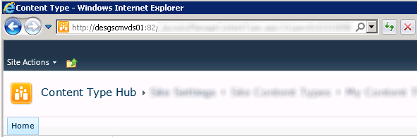
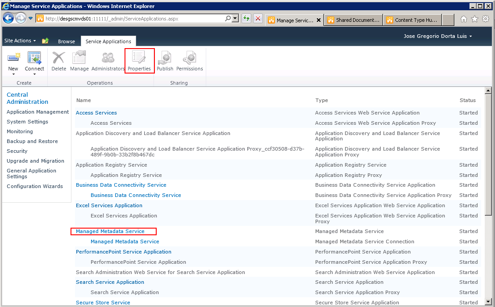
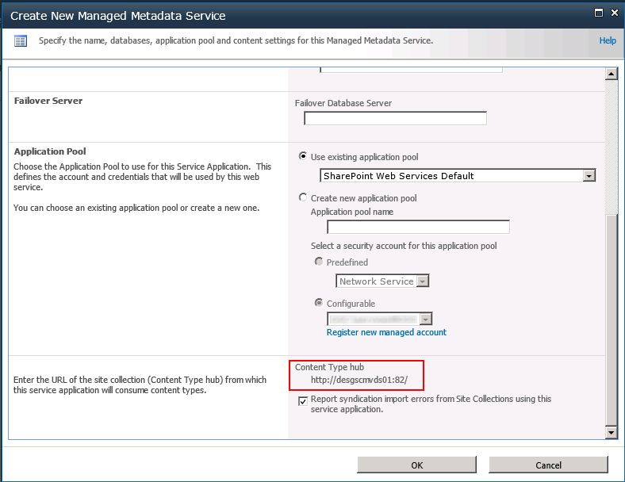
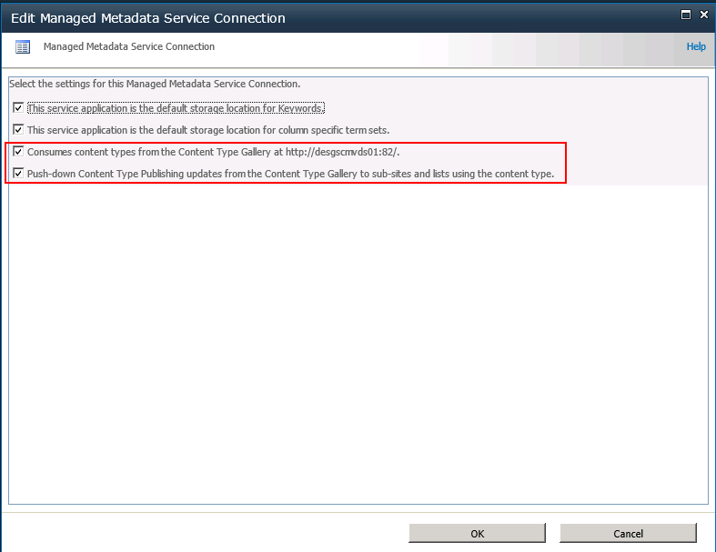
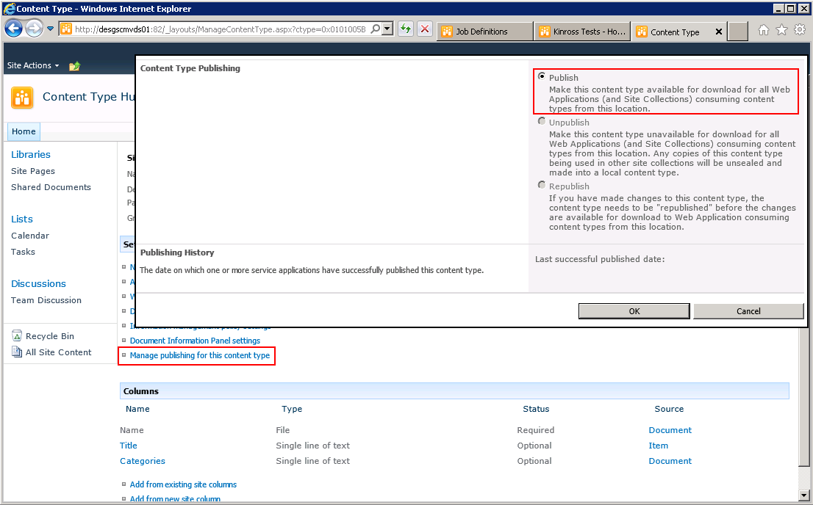
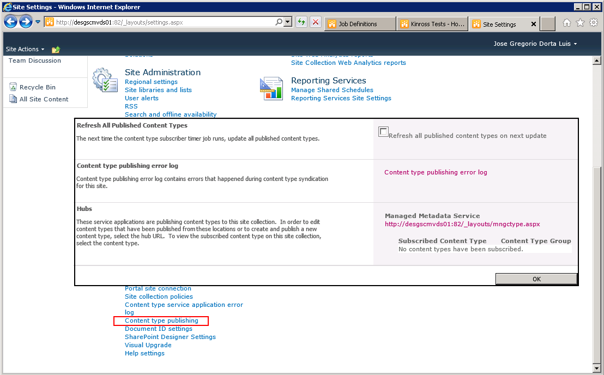
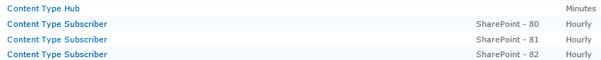
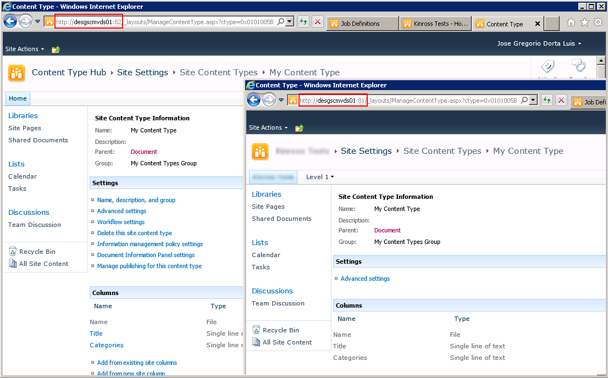

import ArticleHeader from '../../../components/article-header'

<ArticleHeader frontmatter={props.pageContext.frontmatter} />

​En la mayoría de las organizaciones en las que se implanta SharePoint, en especial en las grandes organizaciones, lo normal es que se tenga la necesidad de definir más de una colección de sitios para cubrir los requerimientos de la organización. En estos casos será necesario que los tipos de contenidos definidos sean accesibles desde todas las colecciones de sitios existentes.

Hasta SharePoint 2007 no era posible hacer lo descrito anteriormente de una manera cómoda por lo que se hacía necesario definir todos los tipos de contenidos en todas las colecciones de sitios, bien a través de la interfaz de usuario o bien realizando un desarrollo que permitiera duplicar los tipos de contenidos en todas las colecciones de sitios a partir de las definiciones hechas en algunos de ellos. En ambos casos se tendrán problemas derivados de la complejidad del mantenimiento. En el caso del desarrollo, además, la complejidad es inherente al mismo.

**Content Type Hub**

A partir de SharePoint 2010 se incluye "Out Of The Box" una característica denominada Content Type Hub que, haciendo uso del servicio de metadatos administrados, permite definir una localización en la que se centralizan las definiciones generales de las columnas de sitio y de los tipos de contenidos y gestionar la réplica de los mismos en las colecciones de sitios de la granja.

En el presente artículo se verán las características generales de ésta y cómo se realiza la configuración básica de la misma en una granja con múltiples colecciones de sitios. Para ello, se ha de suponer que previamente se ha configurado correctamente el servicio de metadatos administrados ya que, aunque necesario, no entra dentro del objetivo del presente artículo.

**Definición del Content Type Hub**

Lo primero que se debe hacer es crear una nueva aplicación web sobre la que se creará posteriormente la colección de sitios que representará el "Content Type Hub". Se podría utilizar cualquier colección de sitios existente para definir el "Content Type Hub" pero de cara a una mejor estructuración, configuración y mantenimiento de los tipos de contenidos se recomienda que la colección de sitios esté aislada y sea utilizada exclusivamente para contener la definición de este.

Una vez creada la aplicación web, se creará sobre ella la nueva colección de sitios que, como se dijo anteriormente, contendrá la definición del Content Type Hub. Se propone poner como nombre del sitio raíz de la colección "Content Type Hub" o "Concentrador de Tipos de Contenidos", si se prefiere utilizar un símil en castellano, de forma que sea fácilmente identificable. Para el sitio principal de la colección de sitios se recomienda utilizar al menos la plantilla de Team Site o Sitio de Grupo.

Este requerimiento es debido a que es necesario que se activen una serie de características relacionadas con el servicio de metadatos administrado y que, por ejemplo, si se selecciona una plantilla en blanco no se activan dichas características. Debe hacerse hincapié en que las características mencionadas no se lista en las características de sitio ni de colección de sitio y, por tanto, de ahí la necesidad de escoger al menos la plantilla indicada. Sin embargo, esta situación es reversible ya que es posible activar desde PowerShell las características implicadas por medio de su GUID en caso de que se haya seleccionado una plantilla errónea accidentalmente. En concreto se refiere a la característica TaxonomyFieldAdded

Ahora que ya se ha creado la colección de sitios, se debe acceder a la administración central de SharePoint 2010 para configurar los parámetros que indiquen que la nueva colección de sitios es el Content Type Hub. Para realizar esto es necesario acceder a la sección de administración de aplicaciones de servicio y editar las propiedades de la aplicación de servicios de metadatos administrados.

En este punto aparecerá un formulario en el que se deberá indicar la URL de la colección de sitio que definirá el Content Type Hub en el apartado indicado para ello. Una vez configurado, si se editan las propiedades, se verá como en la siguiente figura.

Posteriormente se deberán editar las propiedades del proxy de conexión de la aplicación de servicio de metadatos administrados para indicar que se requiere que los tipos de contenido sean accesibles desde la galería de tipos de contenidos existente en la colección de sitios indicada para el Content Type Hub y que se permita la publicación de los mismos y sus actualizaciones desde esa galería en todos los sitios y subsitios existentes en el resto de colecciones de sitios.

**Publicación de tipos de contenidos**

Una vez se han realizado los pasos anteriores se está en disposición de acceder al sitio raíz de la colección de sitios del Content Type Hub y comenzar a definir las columnas de sitio y los tipos de contenidos que se hayan considerado en la organización. En la configuración de cada tipo de contenido definido se encontrará una opción que permite publicar, o republicar si ya fue publicado con anterioridad, dicho tipo de contenido en el resto de colecciones de sitios existentes.

Posteriormente se deberá ir a la configuración del sitio y, una vez ahí, ir a la sección de administración de la colección de sitios. En ella se encontrará una opción denominada “Publicación de los tipos de contenidos” en la que se deberá indicar que se quiere que se refresquen todos los tipos de contenidos en la siguiente actualización.

En esta misma pantalla se podrá comprobar lo errores producidos a la hora de la publicación de los tipos de contenidos estando dicha opción disponible en todas las colecciones de sitio, independientemente de que se trate del Content Type Hub. Además, en el caso de las colecciones de sitios que se suscriben al Content Type Hub mostrará los tipos de contenidos que han sido publicados en dichas colecciones de sitios como se puede comprobar en la figura anterior.

**Trabajos del temporizador (Timer Jobs)**

Para que se lleve a cabo la publicación de los tipos de contenidos en las diferentes colecciones de sitios, el Content Type Hub se apoya en dos trabajos del temporizador o Timer Jobs:

- Content Type Hub.
- Content Type Suscriber.

Se encargan de la gestión de la publicación y mantenimiento de los tipos de contenidos entre las distintas colecciones de sitios existentes. En el caso del Content Type Suscriber existirá uno por cada aplicación web existente en la granja de SharePoint de la organización.

Por lo tanto, si se desea que los tipos de contenidos publicados estén accesibles de forma inmediata en alguna de las colecciones de sitios se deberán ejecutar estos trabajos de forma manual, sin esperar a la planificación establecida en el temporizador. Si no se ejecutan por primera vez, es suficiente con ejecutar el Content Type Suscriber de la aplicación web en el que se encuentre la colección de sitios en la que se quieren publicar los tipos de contenidos.

De esta forma se está en disposición de acceder a una de las colecciones de sitios  y comprobar que se ha publicado el tipo de contenido. Este se publica originalmente siempre en modo de sólo lectura. Este modo puede ser alterado si se necesita que el tipo de contenido en esa colección de  sitios deba tener alguna característica diferenciada del resto.

Habrá que tener en cuenta que estas personalizaciones sólo se verán en la colección de sitios en la que se realizó y no se trasladan al Content Type Hub y que es posible que, una vez realizadas modificaciones concretas, las actualizaciones del tipo de contenido en el Content Type Hub no se publiquen correctamente.

En el caso de que se elimine un tipo de contenido o se finalice la publicación en el Content Type Hub serán los trabajos del temporizador los encargados de liberar las copias del mismo publicados en el resto de colecciones de sitios. Esto implica cambiar su estado de solo lectura a escritura y establecer la definición del tipo como local a la colección de sitios.

**José Gregorio Dorta Luis**
Desarrollador de SharePoint
General de Software
@grydl

