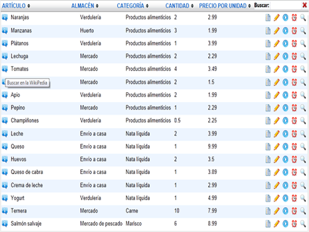

import ArticleHeader from '../../../components/article-header'

<ArticleHeader frontmatter={props.pageContext.frontmatter} />

​Los elementos del Framework de OnlineTic cubren diferentes escenarios de soluciones de aplicaciones y webs para la plataforma de SharePoint. Hemos definido numerosos elementos genéricos de forma que nos permita en el menor tiempo posible personalizar las necesidades de nuestros clientes lo que nos**permite reducir hasta un 40% los costes para desarrollar aplicaciones bajo tecnología SharePoint.**

Con la salida de la versión 2013 de SharePoint y con el nuevo modelo de Aplicaciones decidimos migrar una parte del FrameWork con dos principales objetivos:

- Aprender la nueva metodología de desarrollo, con vistas a dar mejor servicio a nuestros clientes.
- Estudiar la viabilidad de realizar productos para venderlos a nivel mundial dentro de la Store de Microsoft como nueva línea de negocio.

**OTic- Visor de Lista** es una WebPart de visualización de listas que permite al usuario final su personalización y configuración para proveerla de botones de acción sobre cada uno de los registros, funcionalidad no contenida en las listas de SharePoint por defecto.

Lo primero que hicimos fue migrar lo que nosotros denominamos el "OTic- Visor de Lista", que resumido en pocas palabras lo que hace es pintar un listado proveniente de la combinación "lista-vista" con el añadido de poder incluir botones de acción sobre cada registro. Esto nos es útil por ejemplo para ir a una página de detalle del elemento, lanzar procesos, realizar llamadas a "Web Services", ir a aplicaciones dentro o fuera de SharePoint mandando los parámetros oportunos. Además quisimos ofrecer filtros y la posibilidad de ordenar los registros para darle una mayor funcionalidad:

Una de las primeras decisiones a tomar fue qué tipo de Aplicación implementar:

Para ello hay que tener en cuenta los requisitos de la aplicación, si se va a desarrollar en SharePoint o en otra plataforma, donde vamos a almacenar la información, etc. En nuestro caso concreto, descartamos la posibilidad de implementar una Aplicación de tipo "Hospedada en el proveedor" puesto que no queríamos tener servidores dedicados y dado que la información requerida por la APP son las listas y vistas incluidas en los sitios de SharePoint del cliente.

Para decidir entre Aplicaciones "Autohospedadas" y "Hospedadas en SharePoint", nos decantamos por las de tipo "Hospedadas en SharePoint", por una sencilla razón y es que las Aplicaciones "Autohospedadas" llevarán en el futuro un cargo adicional al cliente por utilizar los servicios de Azure. A cambio, todo el desarrollo tuvo que realizarse en código cliente por lo que el tiempo de desarrollo se vería incrementado frente a una Aplicación "Autohospedada".

Al decidirnos por una Aplicación  "Hospedada en SharePoint" también teníamos resuelto el problema de dónde almacenar los datos de la Aplicación y es que al ser una Aplicación "Hospedada en SharePoint" automáticamente se crea un subsitio para la Aplicaicón, por lo que utilizaríamos este subsitio para crear las listas necesarias.

Básicamente lo que necesitamos almacenar es la configuración de cada instancia de la Aplicación, para ello, cada vez que la Aplicación se introduce en una página es necesario indicarle la lista y vista de la que se alimentará:

Podemos configurar también el formato de algunos campos, como por ejemplo los de tipo fecha decirle si queremos ver la fecha y hora o sólo la fecha, o los campos de tipo búsqueda si queremos ver el texto o el ID del campo al que referencia además de la posibilidad de incluir un hipervínculo al elemento enlazado.

Y finalmente indicarle las acciones disponibles, donde podremos seleccionar alguna de las acciones predeterminadas como pueden ser "Ver elemento", "Editar elemento", "Flujos de trabajo", etc; o indicarle una acción personalizada.

Para el caso de una acción personalizada podremos seleccionar una imagen de las mostradas en el pantallazo anterior o indicar la URL de la imagen que deseemos mostrar. El texto de la acción, la URL a la que irá la acción (podemos componer la URL a partir de las columnas de la lista, en el siguiente ejemplo lo que hará la acción es ir a una página de la Wikipedia donde la palabra buscada sea el campo "LinkTitle" del elemento en cuestión). Además podremos indicar opciones adicionales como pueden ser si queremos abrir la acción en una nueva ventana, en la misma ventana, si queremos ver la acción a la izquierda o a la derecha de la tabla, mostrar un mensaje de confirmación antes de ejecutar la acción, etc.

Toda esta configuración se almacena en una lista dentro del subsitio de la Aplicación, donde la configuración de cada App Part es un elemento de la lista.

***Se acabó el mundo feliz, ahora empiezan los problemas******L******y sus Soluciones claro******J***

Uno de los primeros problemas que nos encontramos fue el de cómo **identificar cada una de las instancias de la Aplicación** puesto que cada instancia tiene su propia configuración. Para ello miramos en los Tokens de la página oficial de Microsoft ([http://msdn.microsoft.com/es-es/library/jj163816.aspx](http&#58;//msdn.microsoft.com/es-es/library/jj163816.aspx)) pero no encontramos ninguno que nos sirviera como identificador. Por lo que en una primera aproximación usamos la URL de la página en la que se encontraba la instancia de la Aplicación como identificador. Como consecuencia de esto **no podíamos tener más de una instancia de nuestra Aplicación en una misma página pues cogería la misma configuración**. Más adelante y después de mucho investigar, **descubrimos que hay Tokens adicionales que no aparecen en la página de Microsoft y que también nos son de mucha utilidad como por ejemplo el del ID de la App Part (WPID)**. Usando este ID solventamos el problema y por tanto podíamos tener más de una App Part en una misma página y cada una con su configuración.

***Más problemas…***

**Otro problema era el de la seguridad** y es que **no queríamos que cualquier usuario pudiera modificar la configuración de la App Part, sólo un usuario con permisos de edición** sobre la página debía poder hacer modificaciones. Para este punto lo que hicimos es que las pantallas de configuración de la Aplicación mostradas anteriormente sólo estarían disponibles cuando la Aplicación se encuentra en estado de "edición" o lo que es lo mismo, cuando el Iframe donde está contenida tiene un token denominado editMode=1, esto se consigue cuando pulsamos sobre el enlace de "Editar elemento Web" de la "WebPart":

Al pulsar sobre "Editar elemento web" la Aplicación automáticamente recibe un token editMode=1 (en la URL del Iframe), por lo que a la hora de hacer el desarrollo lo que hicimos es que si recibe este token muestra los parámetros de configuración y si no lo recibe directamente muestra la tabla pertinente de la "lista-vista" seleccionada.

El resultado final es una Aplicación Multiidioma (actualmente en Español e Inglés, próximamente será traducida a más de 5 idiomas) que se puede vender globalmente dentro de la Store de Microsoft.

Enlace a la aplicación: [**OTic- Visor de Lista**](http&#58;//office.microsoft.com/es-es/store/otic-visor-de-lista-WA104090122.aspx)

Manual: [http://www.onlinetic.com/app/Oticvisor/manuales/Manual.pdf](http&#58;//www.onlinetic.com/app/Oticvisor/manuales/Manual.pdf)

Video: [http://www.onlinetic.com/app/Oticvisor/videos/OticVisor.swf](http&#58;//www.onlinetic.com/app/Oticvisor/videos/OticVisor.swf)

***Seguimos trabajando…***

Actualmente estamos trabajando en otros módulos del Framework, convirtiéndolos en **Apps de OTic**y que ya están en proceso de pruebas. Próximamente estarán en la Store!!

**José Antonio Fraga Sánchez**
 Arquitecto SharePoint en OnlineTic
 [josefraga@onlinetic.es](mailto&#58;josefraga@onlinetic.es)
 [Linkedin](http&#58;//www.linkedin.com/in/josefraga)
 [http://www.onlinetic.es](http&#58;//www.onlinetic.es/)

