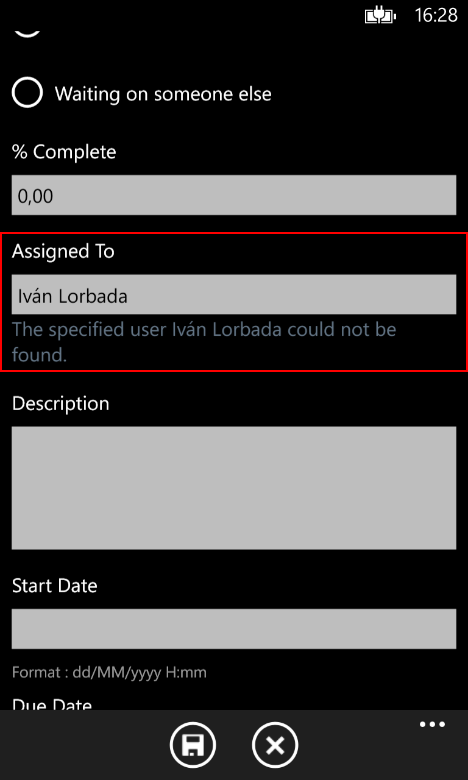
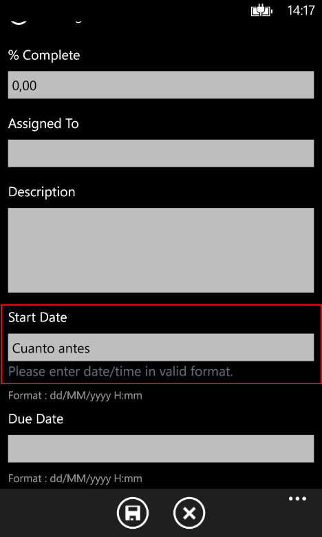
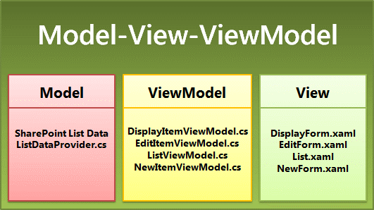
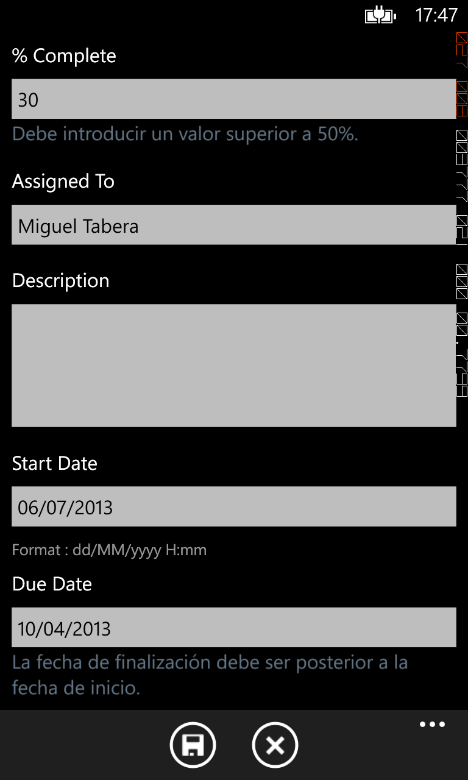
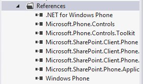
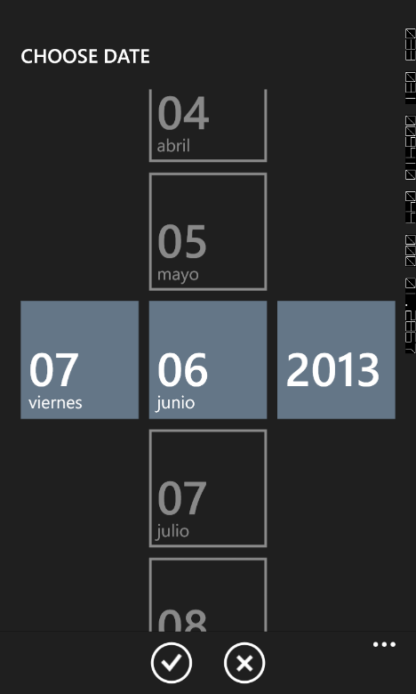
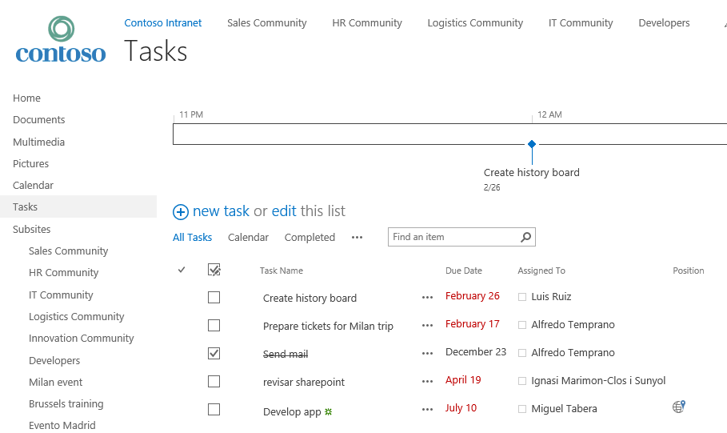
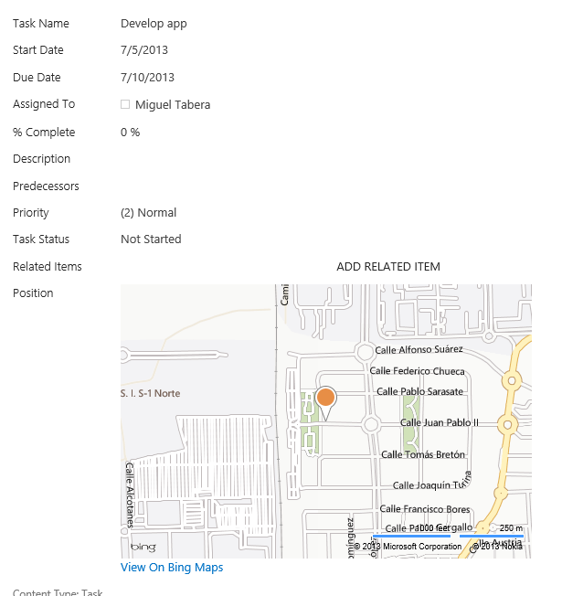
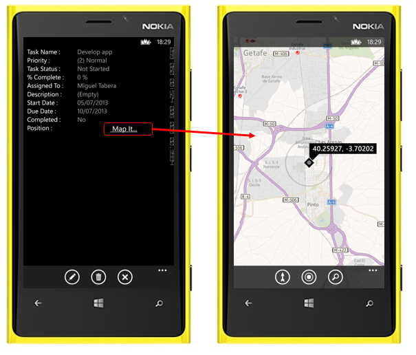

En el anterior [número de CompartiMOSS (nº 16)](/revistas/numero-16/crear-apps-de-windows-phone-con-contenido-de-sharepoint-parte-i) utilizamos las plantillas de Visual Studio Windows Phone SharePoint Application Templates para crear una aplicación de Windows Phone que trabajase con una lista de tareas para SharePoint.

Mediante el uso del asistente de creación, pudimos hacer una App perfectamente funcional que permitía crear, editar y eliminar tareas de la lista de SharePoint. En este artículo vamos a trabajar para ampliarla y dotarle de nuevas funcionalidades para dejarla más presentable. Añadiremos a la App validaciones de datos, selectores de fecha, y mapas de Bing, etc.

Es imprescindible seguir los pasos de la primera parte del artículo para crear la App, ya que los siguientes apartados la utilizan.

**Preparando el entorno de desarrollo**

Como recordatorio, para preparar el entorno es necesario el siguiente software:

- Si vas a trabajar con el SDK de Windows Phone 8:
    - Microsoft Visual Studio 2012.
    - Windows Phone SDK 8.0.
        - [http://www.microsoft.com/en-us/download/details.aspx?id=35471](http&#58;//www.microsoft.com/en-us/download/details.aspx?id=35471).
    - Microsoft SharePoint SDK for Windows Phone 8:
        - [http://www.microsoft.com/en-us/download/details.aspx?id=36818](http&#58;//www.microsoft.com/en-us/download/details.aspx?id=36818).
- Si vas a trabajar con el SDK de Windows Phone 7:
    - Microsoft Visual Studio 2010 (no están soportadas en VS 2012).
    - Windows Phone SDK 7.1:
        - [http://www.microsoft.com/en-us/download/details.aspx?id=27570](http&#58;//www.microsoft.com/en-us/download/details.aspx?id=27570).
    - Microsoft SharePoint SDK for Windows Phone 7.1:
        - [http://www.microsoft.com/en-us/download/details.aspx?id=35475](http&#58;//www.microsoft.com/en-us/download/details.aspx?id=35475).


Una vez que hayamos instalado el SDK de Windows Phone y el SDK de SharePoint para Windows Phone, aparecerán dos nuevas plantillas en Visual Studio:

- Windows Phone Empty SharePoint Application.
- Windows Phone SharePoint List Application.


Si no dispones de Visual Studio, el SDK instalará un Visual Studio Express for Windows Phone. Actualmente, estas plantillas están diseñadas para trabajar únicamente con C#. No están disponibles en Visual Basic.NET. Las plantillas para el SDK de Windows Phone 7 funcionan únicamente con Visual Studio 2010 y Visual Studio 2010 Express for Windows Phone.

Más información sobre la preparación del entorno puede ser encontrada en este enlace:

[http://msdn.microsoft.com/en-us/library/jj163943.aspx](http&#58;//msdn.microsoft.com/en-us/library/jj163943.aspx)

**Validación de datos**

Cuando se crea una aplicación de SharePoint para Windows Phone, los formularios de edición (EditForm.xaml) y creación (NewForm.xaml) tienen algunos campos sobre los que se realiza una comprobación de tipo de datos, como los selectores de usuario (Imagen 1).



También son validados campos numéricos y de fecha. En la Imagen 2 se intenta escribir un texto en la fecha y salta una validación. Esto es debido a una propiedad ValidatesOnNotifyDataErrors del objeto Binding que hay en la propiedad Text del control TextBox en el que se escribe la fecha.



Si esta propiedad se establece en True se realiza la comprobación al sacar el foco del campo de texto. Si es False, el usuario no tendrá constancia de que los datos no son válidos hasta que intente salvar los datos, momento en el que la clase base de la que deriva EditViewModel hace la validación de los valores.

La propiedad, que se puede encontrar en el NewForm.xaml y el EditForm.xaml es la subrayada a continuación:

```
<StackPanel Margin="0,5,0,5" Grid.Row="10">
    <TextBlock TextWrapping="Wrap"
        Style="{StaticResource PhoneTextNormalStyle}">Start Date</TextBlock>
    <TextBox Height="Auto" 
        Style="{StaticResource TextValidationTemplate}" FontSize="{StaticResource PhoneFontSizeNormal}"
        Name="txtStartDate" Text="{Binding [StartDate],
        Mode=TwoWay, ValidatesOnNotifyDataErrors=True,
        NotifyOnValidationError=True}" TextWrapping="Wrap" />
    <TextBlock FontSize="16" TextWrapping="Wrap"
        Style="{StaticResource PhoneTextSubtleStyle}"
        Text="{Binding DateTimeFormat}" />
</StackPanel>
```

Pero hay una serie de validaciones propias de la lógica de negocio de cada empresa que pueden ser añadidas en el formulario de SharePoint pero que el asistente de creación de la App no es capaz de reproducir. Por ejemplo, imaginemos que la política de la empresa no permite poner un porcentaje completado menor al 50%. Habría que implementar una validación en la App para que el usuario no pudiera guardar una tarea con este porcentaje a menos de 50.

En las aplicaciones diseñadas según el modelo MVVM (Imagen 3), la validación de datos se suele administrar en la capa de datos (es decir, en el componente Model). En los proyectos creados a partir de la plantilla de aplicación de lista de SharePoint para Windows Phone, el mecanismo extensible para la validación de datos se ha subido una capa y se ha implementado en el componente ViewModel, a fin de que los desarrolladores puedan administrar la validación de datos con mayor facilidad.



Por lo tanto, en los proyectos basados en la plantilla que estamos usando, el lugar más apropiado para el código personalizado que valida los datos introducidos por el usuario es en las clases ViewModel. En cuanto a la validación de datos, las clases EditItemViewModel y NewItemViewModel (las clases asociadas a los formularios en los que se suelen modificar y actualizar datos de listas) proporcionan una implementación abierta de un método de validación (denominado Validate), que invalida el método de validación base de la clase de la que derivan estas dos:

```
        /// <summary>
        /// Code to Validate values for a field with given name
        /// </summary>
        /// <param name="fieldName">Name of the list Field</param>
        /// <param name="value">Value of the list field</param>
        public override void Validate(string fieldName, object value)
        {
            base.Validate(fieldName, value);
        }
```

Este método ofrece a los desarrolladores un mecanismo práctico para agregar una lógica de validación personalizada dirigida a campos individuales. El enfoque general es comprobar el valor del argumento fieldName transferido al método Validate para identificar el campo que desea asociar al código de validación personalizado. Podemos, por ejemplo, usar una instrucción switch en la implementación de este método para proporcionar una lógica de validación específica de varios campos en el formulario de edición (EditForm.xaml).

Para ello, hacemos doble clic en el archivo EditItemViewModel.cs y añadimos estas directivas:

```
using System.Globalization;
using System.Text.RegularExpressions;
```

Vamos a hacer un validador que compruebe que no se rellena el campo "% complete" con menos de 50% y que la fecha "Due Date" sea superior a la fecha "Start Date". Para ello, hay que sobrescribir el método Validate con lo siguiente:
```
public override void Validate(string fieldName, object value)
{
    string fieldValue = value.ToString();
    if (!string.IsNullOrEmpty(fieldValue)) //Permitiendo los campos en blanco
    {
        bool isProperValue = false;
        switch (fieldName)
        {
            case "PercentComplete":
                // Nos aseguramos que el dato es superior a 50.
                int percent;
                isProperValue = Int32.TryParse(fieldValue, out percent);
                if (isProperValue)
                {
                    if (percent < 50) // Si menos de 50% lanzamos error de validación.
                    {
                        AddError("Item[PercentComplete]", 
                            "Debe introducir un valor superior a 50%.");
                    }
                    else
                    {
                        // La restricción no aplica si es mayor que 50%.
                        RemoveAllErrors("Item[PercentComplete]");
                    }
                }
                break;
            case "DueDate":
                // Nos aseguramos que Due Date es posterior a Start Date.
                DateTime dueDate;
                isProperValue = DateTime.TryParse(fieldValue, 
                                  CultureInfo.CurrentCulture,
                                  DateTimeStyles.AssumeLocal, out dueDate);
                if (isProperValue)
                {
                    DateTime startDate;
                    isProperValue = DateTime.TryParse((string)this["StartDate"],
                                         CultureInfo.CurrentCulture, 
                                        DateTimeStyles.AssumeLocal, 
                                    out startDate);
                    if (dueDate.CompareTo(startDate) > 0)
                    {
                        RemoveAllErrors("Item[DueDate]");
                    }
                    else
                    {
                        AddError("Item[DueDate]",
                                "La fecha de finalización debe ser posterior a la fecha de inicio.");
                    }
                }
                break;
            default:
                // No hay que añadir más validaciones.
                break;
        }
    }
    // Y procedemos a la validación por defecto de la clase base.
    base.Validate(fieldName, value);
}
```

Como podemos ver, AddError recibe el nombre de una propiedad y el mensaje de error a pintar en caso de que hayamos considerado que la información introducida en un campo no es válida. RemoveAllErrors quitará todos los posibles errores de validación del campo, en caso de que el usuario haya corregido el valor introducido. La Imagen 4 muestra estos errores.



**Añadir selectores de fecha**

En los formularios de edición (EditForm.xaml) y creación (NewForm.xaml) los campos de fecha son campos de texto plano. Es incómodo rellenar fechas en este formato y estamos sujetos a tener errores. Vamos a sustituir estos controles TextBox por controles DatePicker de Windows Phone.

Para realizar esta tarea, es necesario el Windows Phone Toolkit, un proyecto de Codeplex que proporciona controles muy útiles para trabajar con Windows Phone. Puedes consultar información del proyecto en [http://phone.codeplex.com](http&#58;//phone.codeplex.com/) El proyecto debe ser instalado en el proyecto de Visual Studio vía NuGet utilizando el siguiente enlace: [https://nuget.org/packages/WPtoolkit](https&#58;//nuget.org/packages/WPtoolkit)

Una vez lo hayamos añadido al proyecto, aparecerán nuevas referencias a Microsoft.Phone.Controls y Microsoft.Phone.Controls.Toolkit (Imagen 5)



Ahora, en el explorador de la solución, hacemos doble clic a EditForm.xaml. En el tag &lt;pone:PhoneApplicationPage&gt; añadimos el namespace que distinguirá los controles del ensamblado del toolkit. Quedará de la siguiente forma (subrayado el nuevo cambio):

```
<phone:PhoneApplicationPage
    x:Class="TareasSharePointOnline.EditForm"
    xmlns="http://schemas.microsoft.com/winfx/2006/xaml/presentation"
    xmlns:x="http://schemas.microsoft.com/winfx/2006/xaml"
    xmlns:phone="clr-namespace:Microsoft.Phone.Controls;assembly=Microsoft.Phone"
    xmlns:toolkit="clr-namespace:Microsoft.Phone.Controls;assembly=Microsoft.Phone.Controls.Toolkit"
    xmlns:shell="clr-namespace:Microsoft.Phone.Shell;assembly=Microsoft.Phone"
    xmlns:d="http://schemas.microsoft.com/expression/blend/2008"
    xmlns:mc="http://schemas.openxmlformats.org/markup-compatibility/2006"
    mc:Ignorable="d" d:DesignWidth="480" d:DesignHeight="696"
    FontFamily="{StaticResource PhoneFontFamilyNormal}"
    FontSize="{StaticResource PhoneFontSizeNormal}"
    Foreground="{StaticResource PhoneForegroundBrush}"
    SupportedOrientations="PortraitOrLandscape" Orientation="Portrait"
    shell:SystemTray.IsVisible="True" x:Name = "EditPage">
```

A continuación hay que localizar los StackPanel que contienen las fechas StartDate y DueDate. En este proyecto están seguidas. El código es el siguiente (Puede haber alguna diferencia en los márgenes y colocación si usas el SDK de WP7 o el de WP8):

```
<!--StartDate-->
<StackPanel Margin="0,5,0,5" Grid.Row="10">
    <TextBlock TextWrapping="Wrap"
        Style="{StaticResource PhoneTextNormalStyle}">Start Date</TextBlock>
    <TextBox Height="Auto" 
        Style="{StaticResource TextValidationTemplate}" FontSize="{StaticResource PhoneFontSizeNormal}"
        Name="txtStartDate" Text="{Binding [StartDate],
        Mode=TwoWay, ValidatesOnNotifyDataErrors=True,
        NotifyOnValidationError=True}" TextWrapping="Wrap" />
    <TextBlock FontSize="16" TextWrapping="Wrap"
        Style="{StaticResource PhoneTextSubtleStyle}"
        Text="{Binding DateTimeFormat}" />
</StackPanel>
<!--DueDate-->
<StackPanel Margin="0,5,0,5" Grid.Row="11">
    <TextBlock TextWrapping="Wrap"
        Style="{StaticResource PhoneTextNormalStyle}">Due Date</TextBlock>
    <TextBox Height="Auto"
        Style="{StaticResource TextValidationTemplate}" FontSize="{StaticResource PhoneFontSizeNormal}"
        Name="txtDueDate" Text="{Binding [DueDate],
        Mode=TwoWay, ValidatesOnNotifyDataErrors=True, NotifyOnValidationError=True}" TextWrapping="Wrap" />
    <TextBlock FontSize="16" TextWrapping="Wrap"
        Style="{StaticResource PhoneTextSubtleStyle}"
        Text="{Binding DateTimeFormat}" />
</StackPanel>
```
Debemos reemplazar todo este código por lo siguiente:
```
<!--StartDate-->
<StackPanel Margin="0,5,0,5" Grid.Row="10">
    <toolkit:DatePicker Header="Start Date" 
        Value="{Binding [StartDate], Mode=TwoWay}">
    </toolkit:DatePicker>
</StackPanel>
<!--DueDate-->
<StackPanel Margin="0,5,0,5" Grid.Row="11">
    <toolkit:DatePicker Header="Due Date"
        Value="{Binding [DueDate], Mode=TwoWay}">
    </toolkit:DatePicker>
</StackPanel>
```

Si ejecutamos la aplicación y editamos un elemento, veremos que ya aparece el selector de fecha (Imagen 6).



Estos pasos deben repetirse en el formulario NewForm.xaml, para tener también los selectores de fecha cuando creemos elementos.

**Mapas y geo localización**

Una gran y poco conocida característica de SharePoint 2013 y de SharePoint Online son las columnas de geo localización. Son columnas que almacenan coordenadas y se renderizan en un mapa de Bing dentro de SharePoint. Son poco conocidas porque están desactivadas por defecto y deben activarse en una lista vía PowerShell o vía modelo de objetos cliente.

Las App de SharePoint creadas con la plantilla "Windows Phone SharePoint List Application" permiten visualizar en el servicio de mapas del teléfono la información de estas columnas. Vamos a ver un rápido ejemplo de cómo lo hacen.

Lo primero de todo es habilitar una columna de tipo geo localización en un sitio. Microsoft lo explica paso a paso en la siguiente guía:

[http://msdn.microsoft.com/en-us/library/jj163135.aspx](http&#58;//msdn.microsoft.com/en-us/library/jj163135.aspx)

Pero hay soluciones más inmediatas para hacerlo. Yo suelo utilizar una solución de Borislav Grgić, que ha escrito un código que, una vez introducido en una "script editor webpart", muestra un formulario en la página para crear rápidamente una columna de geo localización en una lista. Lo bueno es que, al ser código cliente, funciona a la perfección tanto en Office 365 como en SharePoint Server 2013:

[http://mysharepointinsight.blogspot.com.es/2013/05/adding-geolocation-field-to-sharepoint.html](http&#58;//mysharepointinsight.blogspot.com.es/2013/05/adding-geolocation-field-to-sharepoint.html)

Para cualquiera de las dos soluciones, necesitamos generar una clave de Bing Maps. En el siguiente artículo se explica cómo hacerlo:

[http://msdn.microsoft.com/en-us/library/ff428642.aspx](http&#58;//msdn.microsoft.com/en-us/library/ff428642.aspx)

Para este ejemplo, he creado una columna de geo localización llamada "Position" en la lista de tareas que estamos usando (Imagen 7). Si visualizamos la tarea (Imagen 8), veremos que SharePoint muestra el mapa.





Siguiendo los pasos indicados en la primera parte del artículo (CompartiMOSS nº 16) debemos crear una nueva App, teniendo en cuenta que hay que marcar la nueva columna "Position" en el asistente. Una vez finalicemos, podemos lanzar la App en el emulador y veremos que, si abrimos el ítem, se muestra un botón para visualizar en el mapa:



**Enlaces útiles**

Como recordatorio, MSDN tiene unas excelentes guías que son muy útiles para desarrollar Apps de SharePoint para Windows Phone usando las plantillas "Windows Phone SharePoint 2013 application templates" de Visual Studio. Si estas guías no habría sido posible escribir el presente artículo. Pueden consultarse todas ellas en el siguiente enlace: [Build mobile apps for SharePoint 2013](http&#58;//msdn.microsoft.com/en-us/library/jj163228.aspx)


**Miguel Tabera Pacheco**
 SharePoint Architect 
Microsoft Active Professional
 [miguel.tabera@outlook.com](mailto&#58;miguel.tabera@outlook.com) 
@migueltabera
 [http://www.sinsharepointnohayparaiso.com](http&#58;//www.sinsharepointnohayparaiso.com/)

