Nos pasa a menudo escuchar hablar de threshold, boundaries y supported limits, pero la realidad es que como programadores o configuradores raras veces nos encontramos con situaciones límites, por un lado sólo por el hecho de trabajar con máquinas virtuales locales o hosteadas donde realizamos las personalizaciones, desplegamos, testeamos, por el otro lado raras veces nos toca trabajar con listas o bibliotecas con tantos elementos como para alcanzar estos valores establecidos.

Entonces nos llega un requerimiento del Cliente donde el elemento web out-of-the-box Relevant Documents presenta el error siguiente:

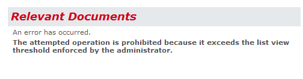

Entonces hacemos memoria, buscamos información y empezamos a tomar conciencia de lo que está sucediendo.

En este artículo vamos a hacer un breve repaso sobre qué son las limitaciones y por qué existen y cómo podemos sortear este problema desde el punto de vista de configuraciones o desde un elemento web custom.

**Repasemos algunos conceptos.**

- **Límites máximos - "boundaries:**límites absolutos que no se pueden exceder por diseño Es importante entender estos límites para no hacer suposiciones incorrectas al diseñar una granja de servidores.


- **Umbrales - "threshold"**: Los umbrales son límites que tienen un valor predeterminado que no se puede exceder a menos que se modifique el valor. En ciertos casos, los umbrales se pueden exceder para dar cabida a desviaciones en el diseño de la granja de servidores, pero es importante entender que al hacerlo se puede ver afectado el rendimiento de la granja además del valor efectivo de otros límites.
- **Límites admitidos – "Supported Limits":** límites configurables que se han establecido en un valor probado de manera predeterminada. Los límites máximos son límites absolutos que no se pueden exceder por diseño. Es importante entender estos límites para no hacer suposiciones incorrectas al diseñar una granja de servidores.


Cuando vemos estos conceptos nos surgen preguntas como*: ¿qué pasa si mi lista supera la cantidad máxima de 5000 elementos? ¿Dejará de funcionar? ¿Por qué me han limitado? ¿Es posible cambiar el límite? ¿De dónde surge el valor 5000?*

Intentaré responder a estas preguntas en los siguientes párrafos para lograr entender o, mejor dicho, comprender qué es lo que está sucediendo con mi SharePoint.

En SharePoint Server 2010, hay ciertos límites que son de diseño y que no se pueden exceder y otros límites que se establecen en valores predeterminados que el Administrador de la granja de servidores puede modificar.

El umbral y los límites admitidos se establecieron a través del testing y la observación del comportamiento de la granja mediante el aumento de la carga hasta el punto donde los servicios y las operaciones de dicha granja alcanzan un límite eficaz operacionalmente. Algunos servicios y componentes pueden tolerar una carga más alta que otros que en algunos casos se debe asignar un límite basado en el promedio de varios factores.

Vamos a ver algunos de estos límites como ejemplo, en el sitio de Microsoft se puede obtener el listado completo.

Tabla 1.- Algunos Límites para Listas y elementos


| **Límite** | **Valor Máximo** | **Tipo de Límite** | **Notas** |
| --- | --- | --- | --- |
| **Elementos** | 30,000,000 por lista | Admitido | Se puede crear listas muy grandes usando vistas estándar, jerarquías de sitio y navegación de metadatos. Este valor puede variar según el número de columnas de la lista y el uso de la lista. |
| **Umbral de la vista de lista** | 5,000 | Umbral | Especifica la cantidad máxima de elementos de lista o biblioteca que puede procesar simultáneamente una operación de base de datos, como una consulta, fuera del intervalo diario de horas que establece el administrador y durante el cual las consultas no tienen restricciones. |
| **Umbral de la vista de lista para auditores y administradores** | 20,000 | Umbral | Especifica la cantidad máxima de elementos de lista o biblioteca que puede procesar simultáneamente una operación de base de datos, como una consulta, cuando un auditor o administrador con los permisos apropiados realiza la operación. Esta configuración funciona junto con Permitir invalidación de modelos de objetos. |


Resumiendo el cuadro anterior, las listas y bibliotecas de SharePoint 2010 pueden contener un número máximo de 30.000.000 de elementos. En un sitio SharePoint el umbral de vista de la lista es de 5000 elementos para los usuarios y de 20.000 para auditores y administradores.

SharePoint 2010 introdujo la funcionalidad de Límites de Lista (List Throttling)  a raíz del mecanismo de bloqueo de SQL Server.

Cuando se consulta una lista que tiene más de 5.000 elementos el SQL Server aumenta el nivel de bloqueo de nivel de fila a nivel de bloqueo de tabla. Esto significa que cualquier consulta posterior será bloqueada por lo que la concurrencia de consultas no es posible. Lo que nos lleva a la conclusión que si las consultas (de elementos en listas o bibliotecas) concurrentes quedaron bloqueadas entonces no podrá existir la "colaboración".

Veamos qué es lo que pasa en segundo plano:

1. Los datos de lista o biblioteca de una colección de sitios se almacenan en una tabla de base de datos de SQL Server, que usa consultas, índices y bloqueos para mantener globalmente el rendimiento, el uso compartido y la precisión.
2. Las vistas filtradas con índices de columna (y otras operaciones) crean consultas de base de datos identifican un subconjunto de columnas y filas y devuelven este subconjunto al equipo.
3. Los umbrales y los límites ayudan a limitar las operaciones y equilibrar los recursos para varios usuarios simultáneos.
4. Desarrolladores con privilegios pueden utilizar el modelo de objetos y modificar  aumentando temporalmente los umbrales y límites en una aplicación custom.
5. Los administradores del conjunto de servidores pueden especificar ventanas de tiempo dedicadas para que todos los usuarios puedan realizar operaciones ilimitadas durante las horas de menor actividad.


Los profesionales de la información pueden usar vistas, estilos y límites de página adecuados para mostrar los datos en la página más rápidamente.

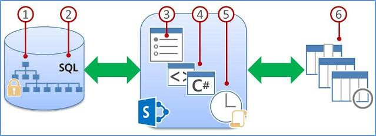

Para ayudar a mejorar el rendimiento de una biblioteca o lista grande, pueden indizar hasta 20 columnas. En general, el índice de una columna permite encontrar más rápido las filas que se desean en función de los valores de esa columna, incluso cuando se está trabajando con millones de elementos. Cuando se combinan índices con vistas filtradas, se puede obtener más rápido los elementos que se necesiten.

Es importante tener en cuenta que al crear y usar columnas indizadas, cada índice de columna adicional consume recursos extras de la base de datos y agrega alguna sobrecarga a cada operación para mantener el índice. Por lo tanto, debemos agregar índices únicamente a las columnas que se usarán activamente para filtrar en vistas de la lista o biblioteca.

Resumiendo, esta funcionalidad (List Throttling) protege al servidor de sobrecargas no intencionales limitando el número de elementos devueltos en la consulta. Si la vista es mayor al límite del umbral, entonces los usuarios obtienen el mensaje que los datos no pueden ser devueltos como se mostraba en la imagen del elemento web Relevant Documents.

Hasta aquí se han respondido la mayoría de las dudas que generalmente tenemos, ¿qué pasa si mi lista supera la cantidad máxima de 5000 elementos? Nada, deberemos tener en cuenta tener las distintas vistas de la lista con filtros apropiados para no devolver "todos los elementos" ¿Dejará de funcionar? No, si excede la cantidad de elementos devolverá un mensaje al usuario  ¿Por qué me han limitado? Para evitar el bloqueo del SQL Server a nivel de tabla. ¿Es posible cambiar el límite? Sí, porque es del tipo umbral. ¿De dónde surge el valor 5000?, de testeos y pruebas hasta llegar a un valor ideal.

Ahora que tengo todas mis respuestas… ¿cómo hago para resolver el problema del elemento web Relevant Documents cuando en mi sitio existen bibliotecas que superan ampliamente el valor del umbral?

**Solución 1: Modificar los valores de estos umbrales a nivel de Web Application**

Cuando dentro de la empresa no hay una política establecida sobre las modificaciones a estos valores, o bien se encuentren en un ambiente más permisivo en cuanto a la modificación de estos parámetros, podemos modificar estos límites a nivel de Web Application.

La funcionalidad de Limitación de Recursos que incorpora SharePoint 2010 se configura a nivel de Web Application. Esta configuración se aplica a todos los Site Collections y Sitios bajo dicha Web Application.

De forma predeterminada, la comprobación de recursos está activa, por lo que un timer job se ejecutará cada 5 segundos. Este job revisa el estado de los recursos del servidor contra los indicadores de performance. Si la revisión devuelve un fallo 3 veces seguidas, se activa un estado de throttling. El servidor permanecerá en ese estado hasta que el chequeo devuelva un estado exitoso. Los usuarios podrán ver el error 503 Servidor ocupado y deberán refrescar la página hasta ver si la solicitud se ha completado. Los recursos que este timer job revisa predeterminadamente son CPU del Servidor, memoria, Solicitudes en Cola y Tiempo de Espera de Solicitudes.

**A través del SharePoint Central Administration:**

1. Abrir el SharePoint 2010 Central Administration.
2. Hacer clic en Application Management.
3. En la sección Application Management , hacer clic en Manage Web Applications.
4. Seleccione una aplicación web (se activará el menú ribbon).
5. Hacer clic en el menú desplegable de Configuración General.
6. Hacer clic en la opción de Limitación de Recursos (Resouce Throttling).


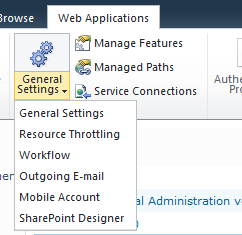

Entre las configuraciones de esta opción se podrán modificar por ejemplo, los siguientes valores de umbrales:

- Umbral de la vista de lista: por defecto es 5000.
- Umbral de vista lista para administradores y auditores: por defecto a 20000.
- Ventana de Tiempo diaria para consultas grandes.


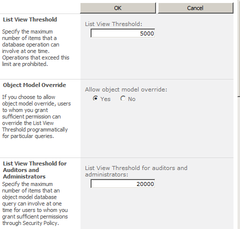

Ventana de Tiempo diaria para consultas grandes. Esta opción permite crear una ventana de tiempo durante el día, el ideal cuando el uso es bajo, donde las consultas podrán ejecutarse sin estas limitaciones.

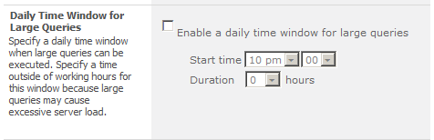

**A través de PowerShell**

```
$site = SPSite http://[url del site collection]
```

Umbral de la vista de lista: especificar el número máximo de elementos que una operación de base de datos puede devolver por vez. Las operaciones que excedan este límite están prohibidas.

```
$site.WebApplication.MaxItemsPerThrottledOperation
```

Umbral de la vista de lista para Auditores y Administradores: especificar el número máximo de elementos que una consulta sobre la base de datos puede devolver a la vez para usuarios a quienes se les otorgó suficientes permisos según una Política de Seguridad.

```
$site.WebApplication.MaxItemsPerThrottledOperationOverride
```

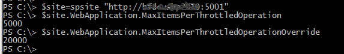

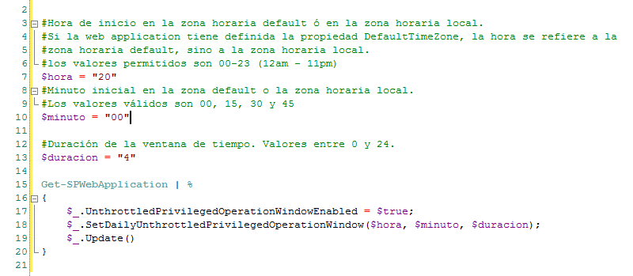

**Solución 2: a través de un elemento web custom**

Podemos aplicarla cuando por política de la empresa nos encontramos que la solución anterior no es viable y sin embargo es necesario ejecutar una consulta a una lista con una vista que devuelve más de 5000 elementos.

Para este caso en especial lo que se hizo fue programar un elemento web similar al out-of-the-box Relevant Documents.

Más allá de la presentación gráfica, lo interesante aquí es cómo ejecutar una consulta en todas las bibliotecas de documentos del Site Collection para traer aquellos documentos que tienen como autor al usuario logado, o bien el usuario logado es quien los ha modificado o es quien los ha desprotegido para realizar algún cambio, dentro de un período dado de tiempo.

Lo primero que definimos son las columnas que vamos a utilizar en la consulta CAML

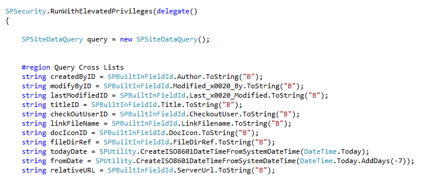

Luego, tenemos que definir la consulta CAML, en el caso de documentos relevantes, debemos armar la cláusula Where de acuerdo a la lógica que ya se mencionó.

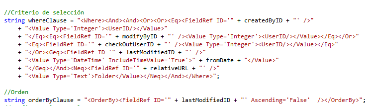

Si ejecutamos el query sin definir  cómo se comportará con respecto a los límites establecidos, lo más probable es que nos encontremos con una SPQueryThrottledException con un mensaje avisándonos que se ha superado el valor máximo de elementos configurado por el administrador.

Para ello debemos cambiar la propiedad QueryThrottleMode del SPSiteDataQuery.

La enumeración SPQueryThrottleOption tiene tres valores: Default, Override y Strict.

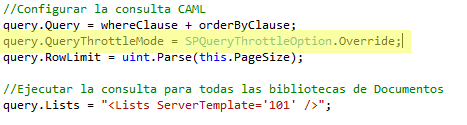

Si se utiliza el valor predeterminado, el umbral de la vista de lista estándar se aplica a todos los usuarios excepto los administradores del servidor local, que no están obligados a ese umbral. Si establece el modo de Override de consulta, los usuarios que tengan los permisos necesarios en la política de usuario de aplicación web pueden realizar la consulta en el umbral superior "administradores y auditores". Finalmente, si se establece el modo de consulta a Strict, esto hace que el umbral de la vista de lista estándar se aplica a todos los usuarios.

La siguiente tabla muestra cuales umbrales se aplican de acuerdo al usuario para cada valor de la enumeración SPQueryThrottleOption:

Tabla 2.- Usuarios y Umbrales-


| **Tipo de Usuario** | **Default** | **Override** | **Strict** |
| --- | --- | --- | --- |
| **Miembro del Sitio** | Standard | Standard | Standard |
| **Propietario del Sitio** | Standard | Standard | Standard |
| **Administrador del Site Collection** | Standard | Standard | Standard |
| **Web app policy: site collection admin** | Standard | Más alto | Standard |
| **Web app policy: site collection auditor** | Standard | Más alto | Standard |
| **Administrador de la Farm** | Standard | Standard | Standard |
| **Local server admin** | Ilimitado | Ilimitado | Standard |


Si vemos la tabla anterior observamos que el Administrador del Site Collection no accede al umbral más alto, pero sí en caso de estar definido dentro de la política de la Web  Application. Esto se define a nivel de Web Application dentro del Central Administration.

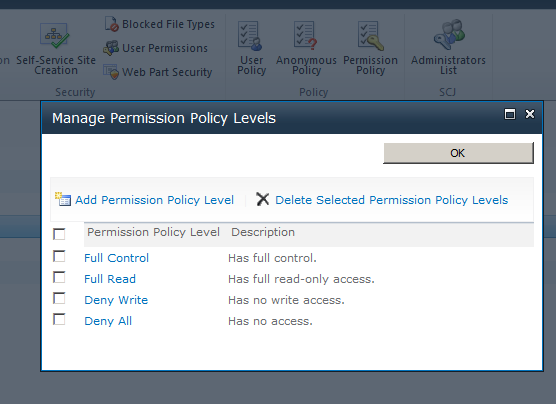

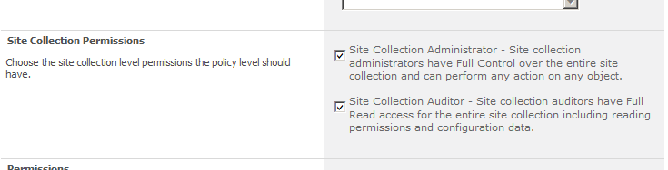

Para terminar el armado del query, nos resta definir las columnas que devolverá el mismo, el scope del *SPSiteDataQuery* y ejecutar la consulta.

Una vez que se obtienen los datos podrán visualizarse de acuerdo a los requerimientos de diseño elegidos.

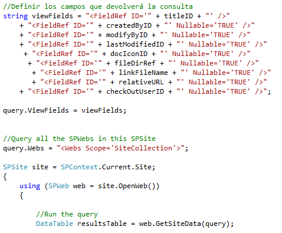

**SharePoint 2013**

Para cerrar, en SharePoint 2013 mantiene este tipo de funcionalidad de límites y para este tipo de umbrales los mismos valores que en 2010 de forma predeterminada. Desde la administración central podrán cambiarse a nivel de Web Application, o bien a través del modelo de objetos programáticamente.

**Bibliografía**

1. SharePoint Server 2010 capacity management: Software boundaries and limits. *Technet.*[Online] http://technet.microsoft.com/en-us/library/cc262787(v=office.14).aspx.

2. Designing large lists and maximizing list performance (SharePoint Server 2010). *Technet.*[Online] http://technet.microsoft.com/en-us/library/cc262813(v=office.14).aspx.

3. Software boundaries and limits for SharePoint 2013. *Technet.*[Online] http://technet.microsoft.com/en-us/library/cc262787.aspx.

4. Query Throttling in SharePoint 2013. *Andy Burns' SharePoint Blog.*[Online] http://www.novolocus.com/2013/04/26/query-throttling-in-sharepoint-2013/.

5. Manage lists and libraries with many items. *Office.*[Online] http://office.microsoft.com/en-us/sharepoint-server-help/manage-lists-and-libraries-with-many-items-HA102771361.aspx?CTT=1.


| **Silvina Andrea Pizzarulli**<br />SharePoint Technical Leader en Baufest<br />[http://silvinapizzarulli.blogspot.com](http://silvinapizzarulli.blogspot.com/) |
| --- |

