​En anteriores versiones de SharePoint, para modificar la vista de los elementos de los WebParts, tanto diseñadores como desarrolladores debían tener conocimientos de XSL y XSLT para poder modificar sus “plantillas” y así poder conseguir el resultado visual que buscaban. SharePoint 2013, dentro de su cambio de orientación hacia las nuevas tendencias web, HTML5, introduce un nuevo modelo de plantillas de elementos que han llamado “Display templates” y que vamos a analizar en este artículo.

SharePoint 2013 viene con muchos cambios orientados para una mejor integración con las nuevas tendencias web y, uno de estos cambios, muy evidente para los diseñadores, es la introducción de las plantillas de elementos de contenido que hacen uso de HTML y JavaScript y que vienen a sustituir a las antiguas plantillas XSL que obligaban a diseñadores y/o desarrolladores a tener que saber manejar XSLT para generar plantillas.

De esta forma, los nuevos WebParts que entran en juego con SharePoint 2013 hacen uso de estas nuevas plantillas, como por ejemplo el WebPart de Búsqueda de contenido que se hará indispensable para cualquier sitio de SharePoint 2013, dada su potencia y que complementa al antiguo Content Query WebPart en este nuevo paradigma. En la Imagen 1 vemos una ilustración del uso de plantillas para elementos de contenido en un WebPart de Búsqueda de Contenido (Content Search WebPart).

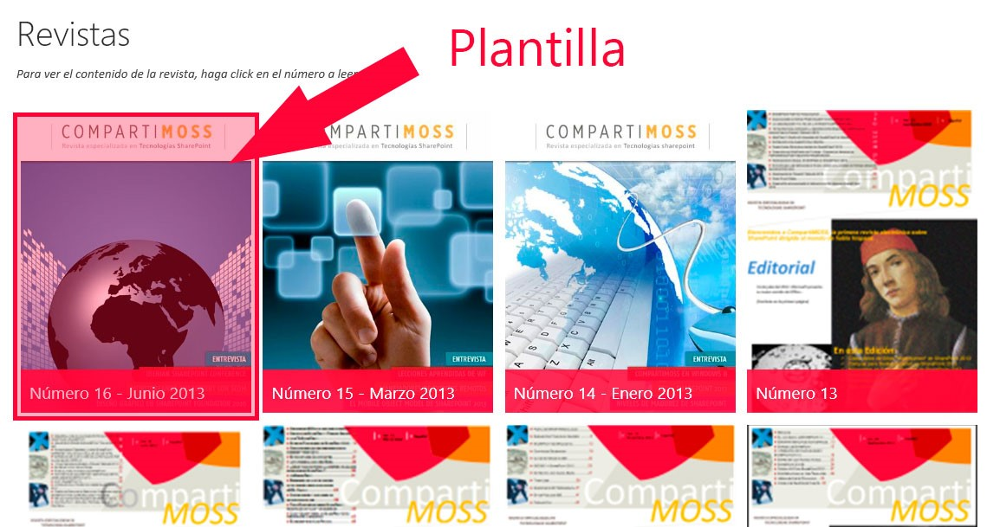

**Ventajas de las plantillas de elementos de contenido**

Las plantillas de elementos de contenido tienen muchísimas ventajas pero me centraré en las que considero más importantes:

- **Uso de HTML y JavaScript**: Es la primera gran ventaja que podemos observar y con la que nos quitaremos de encima las complicadas y tediosas plantillas XSL además de permitirnos generar plantillas potentes para mejorar la experiencia de los usuarios.
- **Plantillas a nivel de Sitios o Colección de Sitios** que nos permitirá disponer de estilos reutilizables para los WebParts de contenido y búsqueda y así mantener un aspecto común entre los elementos listados en nuestros sitios de SharePoint 2013 sin necesidad de un gran esfuerzo.
- **Posibilidad de generar plantillas para todo tipo de contenidos**, ya sean refinadores, resultados de búsqueda, etc.
- **Posibilidad de añadir propiedades administradas** en las plantillas.
- **Posibilidad usar la función "OnPostRender()"** para realizar acciones JavaScript tras la carga de los elementos.
- …


**Dónde se encuentran las plantillas de elementos de contenido**

Disponemos de dos formas de acceder a ellas dependiendo de lo que deseemos hacer:

- **Para consultas y/o edición de propiedades**. En este caso tendremos que acceder al "Administrador de diseños" y posteriormente seleccionar la opción "5. Editar plantillas para mostrar" tal y como se muestra en la Imagen 2, lo que nos llevará a un listado de plantillas como el de la Imagen 3 donde podremos ver todas las plantillas que hay disponibles o incluso editar algunas propiedades importantes como podemos observar en la Imagen 4.


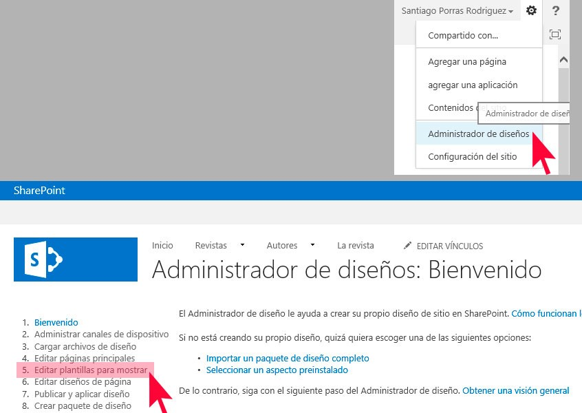

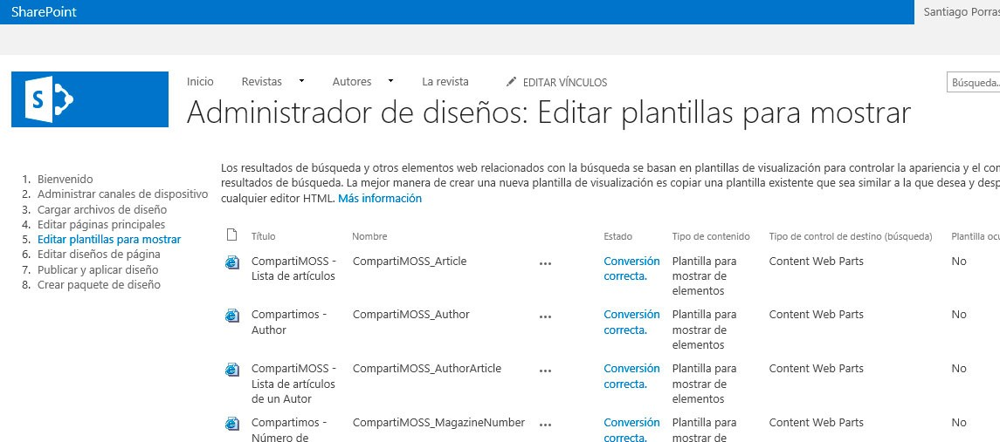

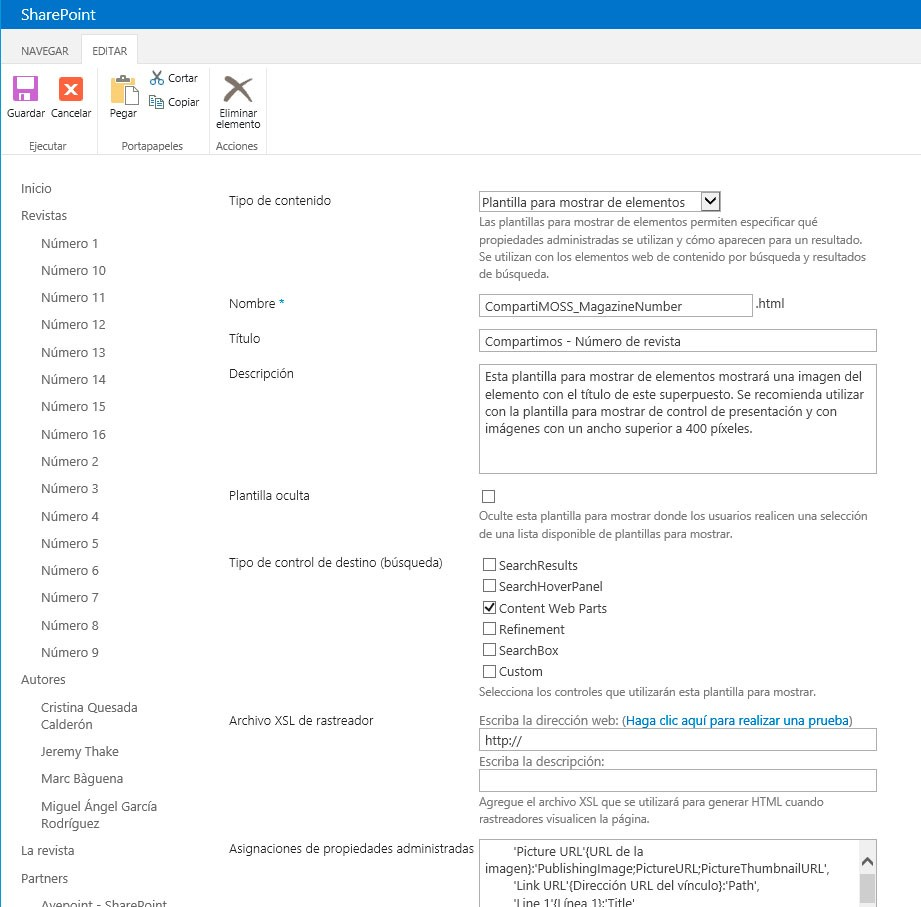

- **Para creación y/o edición de código**. **Con cualquier programa de edición**, WebMatrix, Dreamweaver o SharePoint Designer, por ejemplo, debemos acceder a la ruta que nos permite acceder a los archivos de diseño y que se muestra en la Imagen 5.


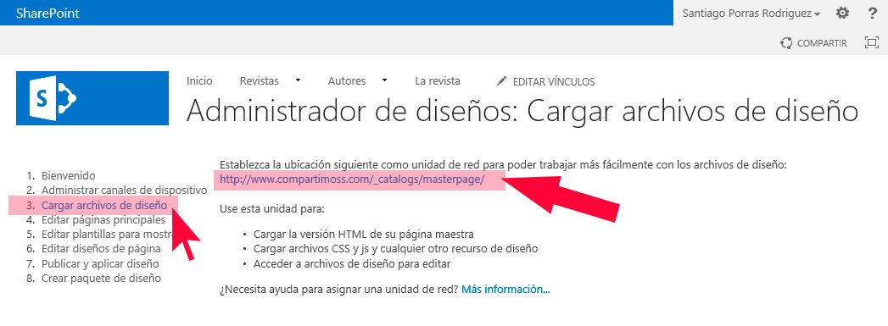

Una vez hayamos accedido a esa ruta con nuestro programa de diseño – *para el ejemplo he hecho uso de WebMatrix* – podremos ir a la carpeta Display Templates donde encontraremos, separados en diferentes carpetas, los archivos que se corresponden a las plantillas de elementos de contenido, tal y como se puede ver en la Imagen 6.

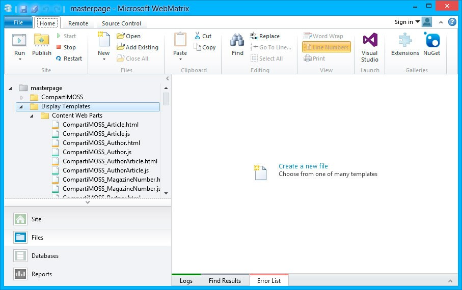

**¿De qué se componen las plantillas de elementos de contenido?**

Tal y como podremos comprobar desde nuestro programa de edición, para cada plantilla existen dos archivos, uno con la extensión .html y otro con la extensión .js pero, ¿hemos de tocar los dos? La respuesta es no. Veamos para qué es cada archivo.

- **Archivo .html**. Es el archivo que generamos nosotros para la plantilla y con el que debemos tratar en todo momento. En él iremos codificando y diseñando cómo queremos que se vean los elementos usando HTML y JavaScript mediante una forma de escribir el código (o pseudo-código) que permite a SharePoint realizar sustituciones dentro del mismo identificando una serie de etiquetas que debemos usar.
- **Aschivo .js**. Este archivo lo genera SharePoint automáticamente a partir de nuestro archivo .html sustituyendo las etiquetas especiales que hayamos usado al crear la plantilla, por su propio código. Esta generación se produce cada vez que realicemos una modificación en el archivo .html y guardemos los cambios, con lo que siempre dispondremos de la última versión. De igual manera, al proteger/desproteger los cambios del archivo .html, SharePoint automáticamente realizará la misma acción sobre este archivo .js.


**NOTA**: Nunca debemos tocar el archivo .js directamente porque podemos romper la plantilla o, simplemente porque si en algún momento editamos el .html, perderemos los cambios que hubiéramos realizado en el archivo .js.

**Crear una nueva plantilla de elementos de contenido**

El proceso,  es bastante sencillo y sólo tenemos que tener en cuenta una serie de "normas" para su correcto funcionamiento.

La primera opción es cargar un archivo .html que hayamos creado con código de ejemplo para la plantilla y, para ello, accederemos a "Configuración de sitio à Páginas maestras y diseños de página à Display Templates" y accedemos a la carpeta correspondiente, en este caso, "Content Web Parts" tal y como se muestra en la Imagen 7.

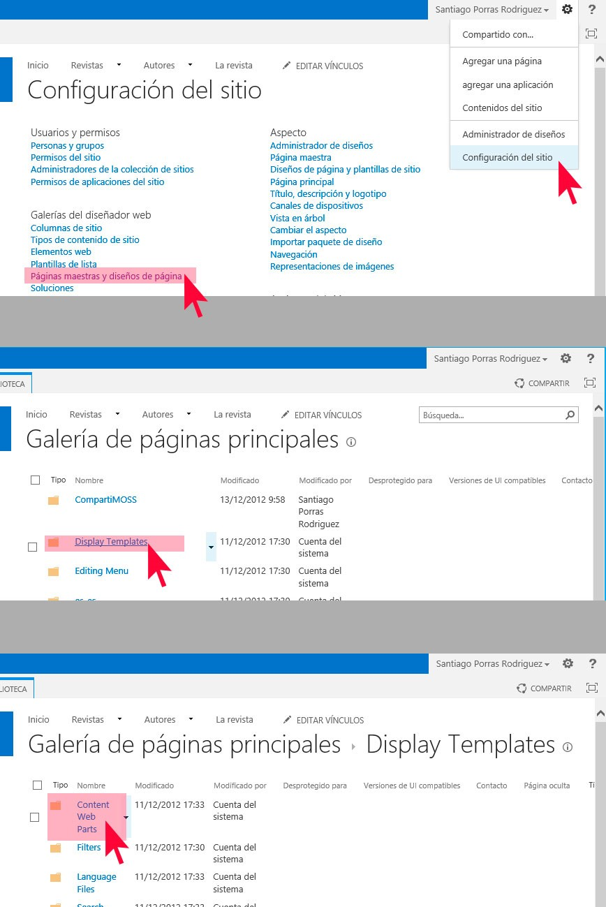

Ahora procederemos a crear la plantilla que será del tipo "Plantilla para mostrar de elementos" será de tipo "WebParts de contenido" y que se llama CompartiMOSS\_MagazineNumber.html como vemos en la Imagen 8.

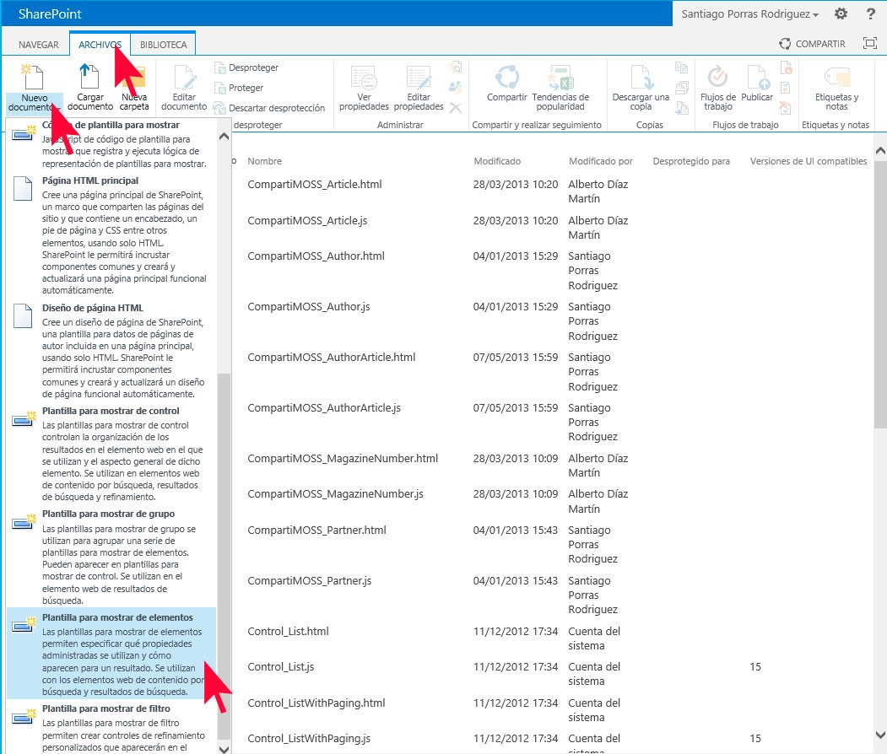

Esto nos permitirá cargar un archivo .html que hayamos creado (aunque esté vacío) con nuestro editor de HTML tal y como se puede ver en la siguiente imagen.

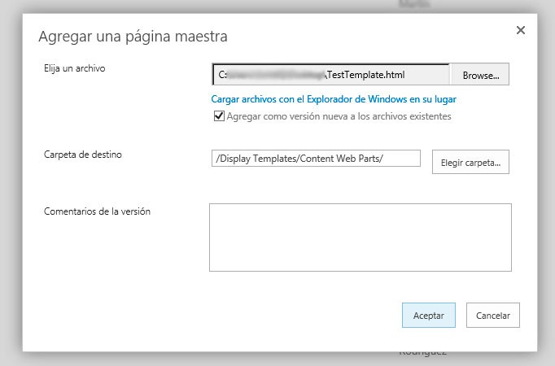

Una vez cargado el archivo, aparecerá la ventana de propiedades en la que tendremos que establecer, como mínimo, el tipo de contenido (si no lo establecimos en el paso de la Imagen 9), el nombre de la plantilla, su título, el tipo de control con el valor "Content WebParts" y marcar que tiene un archivo asociado, tal y como se muestra en la Imagen 10.

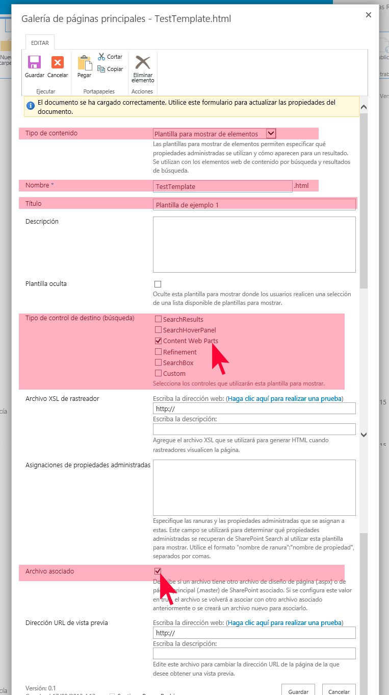

En el momento en que guardemos esta plantilla, podremos ver cómo de forma automática, SharePoint 2013 creará un archivo .js asociado con el mismo nombre que le hayamos puesto a la plantilla, que contendrá el código que realmente se usará para mostrar la plantilla y que es resultado de la sustitución de elementos que realiza el sistema.

**NOTA**: Para esta tarea, podemos aprovecharnos de la gran herramienta usada por los developers, Copy&Paste, y usarla para copiar desde nuestro editor de código o incluso desde el explorador de archivos, alguna plantilla (archivo .html) ya generada y cambiarle el nombre pero prestad mucha atención al siguiente punto.

**Cómo editar las plantillas de elementos de contenido**

Hemos llegado al punto crítico ya que entraremos en materia de código, así que para ilustrarlo mejor, veamos el usado para generar la plantilla de los elementos mostrados en la 
Imagen 1.

```
<html xmlns:mso="urn:schemas-microsoft-com:office:office"xmlns:msdt="uuid:C2F41010-65B3-11d1-A29F-00AA00C14882">
<head>
    <title>Compartimos - Número de revista</title>
    <!--[ifgte mso 9]><xml>
    <mso:CustomDocumentProperties>
    <mso:TemplateHidden msdt:dt="string">0</mso:TemplateHidden>
    <mso:ManagedPropertyMapping msdt:dt="string">
        &#39;Picture URL&#39;{URL de la imagen}:&#39;PublishingImage;PictureURL;PictureThumbnailURL&#39;,
        &#39;Link URL&#39;{Dirección URL del vínculo}:&#39;Path&#39;,
        &#39;Line 1&#39;{Línea 1}:&#39;Title&#39;,
        &#39;Line 2&#39;{Línea 2}:&#39;PublishingPageContentOWSHTML&#39;,
        &#39;SecondaryFileExtension&#39;,
        &#39;ContentTypeId&#39;
    </mso:ManagedPropertyMapping><mso:MasterPageDescription msdt:dt="string">Esta plantilla para mostrar de elementos mostrará una imagen del elemento con el título de este superpuesto. Se recomienda utilizar con la plantilla para mostrar de control de presentación y con imágenes con un ancho superior a 400 píxeles.</mso:MasterPageDescription><mso:ContentTypeId msdt:dt="string">0x0101002039C03B61C64EC4A04F5361F385106603</mso:ContentTypeId><mso:TargetControlType msdt:dt="string">;#Content Web Parts;#</mso:TargetControlType><mso:HtmlDesignAssociated msdt:dt="string">1</mso:HtmlDesignAssociated><mso:HtmlDesignConversionSucceeded msdt:dt="string">True</mso:HtmlDesignConversionSucceeded><mso:HtmlDesignStatusAndPreview msdt:dt="string">http://www.compartimoss.com/_catalogs/masterpage/Display%20Templates/Content%20Web%20Parts/CompartiMOSS_MagazineNumber.html, Conversión correcta.</mso:HtmlDesignStatusAndPreview></mso:CustomDocumentProperties></xml><![endif]-->
</head>
<body>
    <!--
            Warning: Do nottryto add HTML tothissection. Only the contents of the first <div>
            inside the <body> tag will be usedwhileexecuting Display Template code. Any HTML that
            you add tothissection will NOT become part of your Display Template.
    -->
    <script>
        $includeLanguageScript(this.url,"~sitecollection/_catalogs/masterpage/Display Templates/Language Files/{Locale}/CustomStrings.js");
    </script>
    <!--
        Use the div below to author your Display Template. Here are some things to keepinmind:
        * Surround any JavaScript logic as shown below using a"pound underscore"(#_ ... _#) token
        inside a comment.
        * Use the values assigned to your variables using an"underscore pound equals"
        (_#= ... =#_) token.
    -->
    <div id="Item_LargePicture">
<!--#_
    varencodedId = $htmlEncode(ctx.ClientControl.get_nextUniqueId() +"_largePicture_");
    varlinkURL = $getItemValue(ctx,"Link URL");
    linkURL.overrideValueRenderer($urlHtmlEncode);
    varline1 = $getItemValue(ctx,"Line 1");
    //Override site name on Title
    vartitle = line1.value.replace("CompartiMOSS\r\n            \r\n            \r\n            ","")
    varline2 = $getItemValue(ctx,"Line 2");
    varpictureURL = $getItemValue(ctx,"Picture URL");
    varpictureId = encodedId +"picture";
    varpictureMarkup = Srch.ContentBySearch.getPictureMarkup(pictureURL, 228, 300, ctx.CurrentItem,"cbs-largePictureImg", line1, pictureId);
    varcontainerId = encodedId +"container";
    varpictureLinkId = encodedId +"pictureLink";
    varpictureContainerId = encodedId +"pictureContainer";
    vardataContainerId = encodedId +"dataContainer";
    vardataContainerOverlayId = encodedId +"dataContainerOverlay";
    varline1LinkId = encodedId +"line1Link";
    varline1Id = encodedId +"line1";
    varline2Id = encodedId +"line2";
    AddPostRenderCallback(ctx,function()
    {              
        $("#"+containerId).hover(
            function(){
                $('.divOverlay',this).css('top','0');
            },
            function(){
                $('.divOverlay',this).css('top','300px');
            });
    });
 _#-->
        <div class="divCompartiMOSSMagazineNumber"id="_#= containerId =#_">
            <div class="divPicture"id="_#= pictureContainerId =#_">
                <a href="_#= linkURL =#_"title="_#= $htmlEncode(title) =#_"id="_#= pictureLinkId =#_">
                    _#= pictureMarkup =#_
                </a>
            </div>
            <div class="divOverlay"id="_#= dataContainerId =#_">
                <a class="linkOverlay"href="_#= linkURL =#_"title="_#= $htmlEncode(title) =#_"id="_#= line1LinkId =#_">
                    <h2 class="ms-noWrap"id="_#= line1Id =#_"> _#= title =#_</h2>
                    <div title="_#= $htmlEncode(line2) =#_"id="_#= line2Id =#_"> _#= line2 =#_</div>
                </a>
            </div>
        </div>
    </div>
</body>
</html>

Analicemos el código

- La cabecera contiene un bloque con las propiedades que mapea la plantilla correspondiéndose con el tipo de contenido seleccionado en las propiedades.
- Tal y como se indica en el primer comentario dentro del &lt;body&gt;, sólo se mostrará el contenido que se encuentre dentro del primer &lt;div&gt; dentro del &lt;body&gt;.
- Para obtener los valores de las propiedades mapeadas tendremos que hacer uso de la sentencia de javascript que sigue:

**var line1 = $getItemValue(ctx, "Line 1");**

- Para usar los valores de las variables de JavaScript dentro del HTML que escribamos, debemos hacer uso de las siguientes marcas que SharePoint sustituirá por su valor correspondiente.

**\_#= Nombre\_variable\_JavaScript =#\_**

Con estas normas, podremos empezar a diseñar nuestras plantillas de elementos de contenido y así poder enriquecer nuestros sitios de SharePoint pero, aún nos queda asignársela a algún WebPart, así que, en el siguiente punto veremos cómo usarlas en un WebPart de Búsqueda de Contenido.

**Usar las plantillas de elementos de contenido**

Para usar esta nueva plantilla, tan sólo tendremos que ir al WebPart deseado, en este caso un WebPart de Búsqueda de Contenido, editarlo mediante el menú contextual y seleccionando "Editar elemento web" tal y como se muestra en la siguiente imagen.

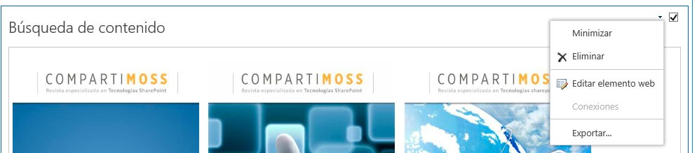

Cuando aparezcan las propiedades de edición del Web Part, en el desplegable "Elemento", podremos seleccionar nuestras nuevas plantillas, en este caso, CompartiMOSS – Número de revista tal y como se puede ver en la Imagen 13.

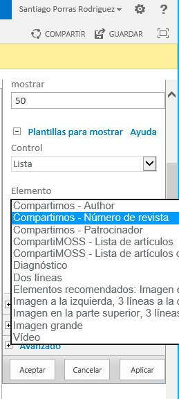

Aceptamos, guardamos la página y… ¡todo hecho! Acabamos de crear, editar y usar nuestra primera plantilla de elementos de contenido. Espero que os haya servido para descartar el uso de las antiguas plantillas XSLT y comenzar a aprovechar las bondades del uso de HTML + JavaScript para estas tareas.


**Santiago J. Porras Rodríguez**
Nokia Developer Champion
UX Developer
[http://geeks.ms/blogs/santypr](http://geeks.ms/blogs/santypr) 
@saintwukong
