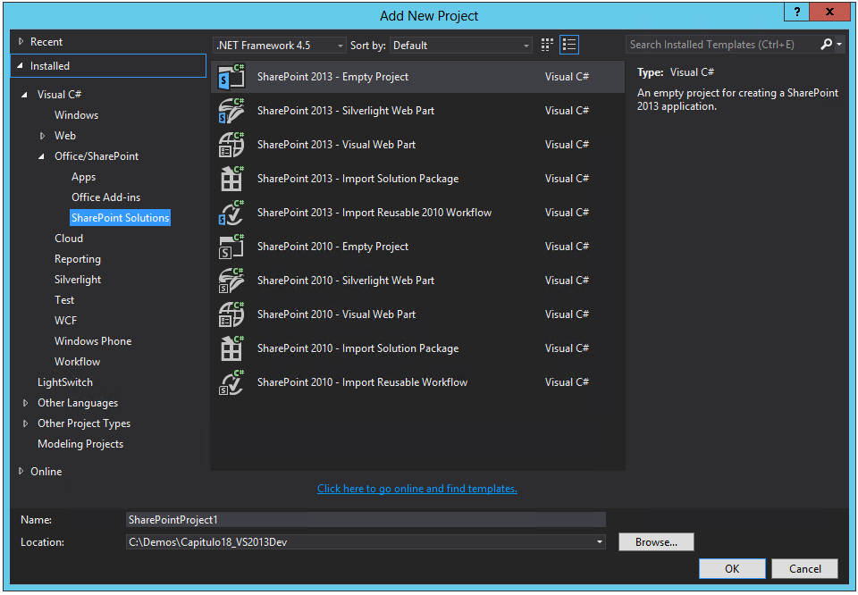
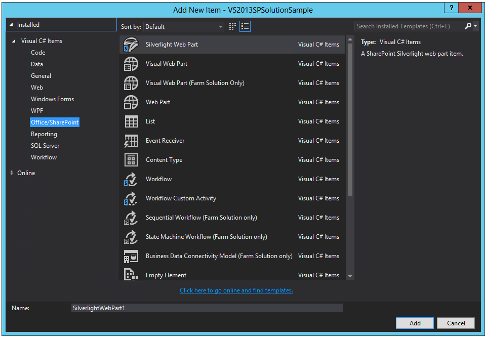
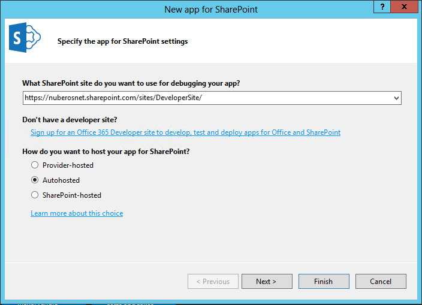
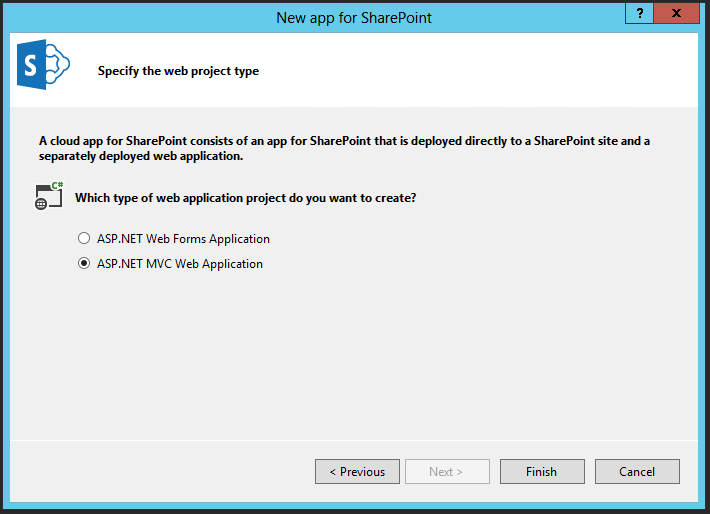
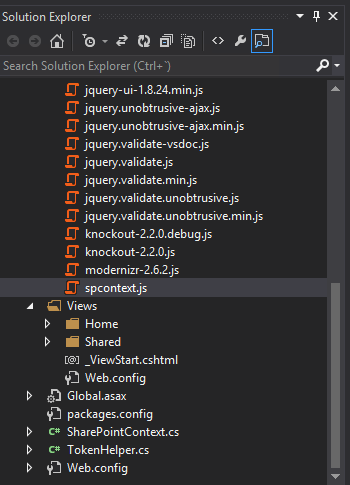
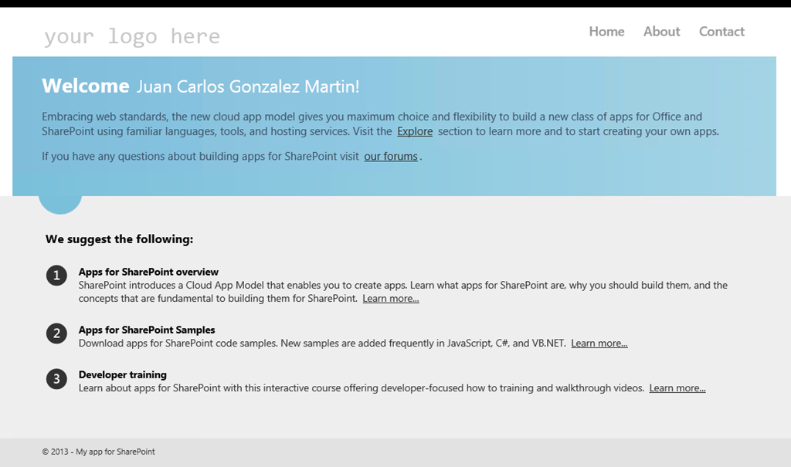
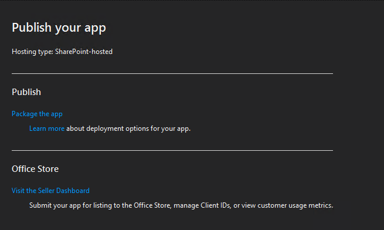
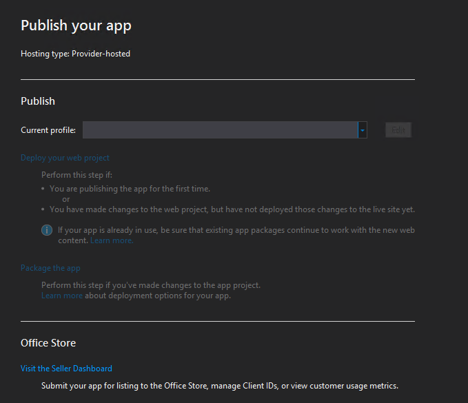

import ArticleHeader from '../../../components/article-header'

<ArticleHeader frontmatter={props.pageContext.frontmatter} />


​Como<br />parte de VS 2013 Preview, los desarrolladores disponen de serie de una nueva<br />versión de las Office Tools para Visual Studio de manera que sin necesidad de<br />instalar componentes adicionales se puede comenzar a crear tanto soluciones<br />como aplicaciones tanto para SharePoint 2013 On-Premise como para SharePoint<br />Online en Office 365. Para crear soluciones de SharePoint, se dispone (Imagen<br />1) de las mismas plantillas de proyecto existentes en Visual Studio 2012 (VS 2012).



Lo mismo se puede decir para las plantillas de elemento de proyecto que se puede agregar en un proyecto de solución de SharePoint 2013. La Imagen 2 muestra los artefactos disponibles para agregar al proyecto.



**Novedades en la creación de aplicaciones para SharePoint 2013**

Si la creación de soluciones para SharePoint no presenta novedades, la creación de aplicaciones para SharePoint 2013 si incorpora algunos cambios interesantes en VS 2013 Preview:

- Iniciamos VS 2013 Preview y creamos un proyecto de aplicación para SharePoint 2013: "Office/SharePoint -&gt; Apps -&gt; Apps for SharePoint 2013". En este punto, aparece la primera novedad en el proceso de creación de aplicaciones ya que el asistente para crear el proyecto difiere ligeramente del conocido para VS 2012. Simplemente tenemos que especificar la Url del sitio de SharePoint que vamos a usar para depurar y luego el tipo de hosting de la aplicación que se indica mediante un control de tipo "Radio Button" en lugar de una lista desplegable. Adicionalmente, disponemos de un par de enlaces para facilitar estas configuraciones.




- Para continuar con el asistente, hacemos clic en el botón  "Next" de forma que se presenta la segunda novedad en el desarrollo de aplicaciones para SharePoint: para aplicaciones de tipo "Autohospedadas" u "Hospedadas por el proveedor" es posible seleccionar el tipo de aplicación web que se va a crear. Como se aprecia en la Imagen 4, se puede elegir entre aplicación web de formularios ASP.NET o bien aplicación web ASP.NET MVC :-). Por lo tanto, las herramientas de desarrollo de Office para VS 2013 Preview incorporan de serie soporte directo para añadir aplicaciones web ASP.NET MVC en Aplicaciones de SharePoint. Elegimos este tipo y pulsamos "Next".




- Cuando el proyecto se ha creado, podemos ver que tenemos en la solución de VS 2013 Preview dos proyectos: el de aplicación de SharePoint y el proyecto ASP.NET MVC. Si inspeccionamos el proyecto de ASP.NET MVC veremos que incorpora dos novedades en cuanto a artefactos se refiere. Por un lado, disponemos de una pequeña librería JavaScript "spcontext.js" que facilita el trabajo de lectura de parámetros de la Url de la aplicación. Por otro, disponemos de un nuevo helper "SharePointContex.cs" que proporciona clases y métodos para facilitar el trabajo con tokens de contexto entre peticiones de página de la aplicación.




Si revisamos el nuevo helper "sharepointcontext.cs" veremos que contiene dos clases abstractas: "SharePointContext" y "SharePointContextProvider". La primera de las clases facilita la administración y uso de los tokens de contexto entre peticiones de página de la Aplicación. La segunda se encarga de proporcionar instancias de "SharePointContext". Este helper está disponible de forma general para aplicaciones de tipo Autohospedado y Hospedadas por el proveedor. En cambio, la librería "spcontext.js" es específica de proyectos web de tipo ASP.NET MVC.

Para evaluar cómo utilizar las nuevas clases incluidas en el nuevo helper, podemos inspeccionar el archivo "HomeControler.cs" de la aplicación que muestra cómo utilizarlas para obtener el contexto del sitio actual y crear una instancia de "ClientContext" que permita utilizar el Modelo de Objetos en Cliente (CSOM) para interactuar con el sitio host de la Aplicación:

```
            User spUser = null;
```

```
            var spContext = 
```

```
                SharePointContextProvider.Current.GetSharePointContext(HttpContext);
```

```
 
```

```
            using (var clientContext = 
```

```
                spContext.CreateUserClientContextForSPHost())
```

```
            {
```

```
                if (clientContext != null)
```

```
                {
```

```
                    spUser = clientContext.Web.CurrentUser;
```

```
 
```

```
                    clientContext.Load(spUser, user => user.Title);
```

```
 
```

```
                    clientContext.ExecuteQuery();
```

```
 
```

```
                    ViewBag.UserName = spUser.Title;
```

```
                }
```

```
            }
```

Como vemos, el código define un objeto de tipo "SharePointContext" que se utilizada a continuación para definir un contexto de cliente. A partir del contexto de cliente, se accede a información relativa al usuario qué está haciendo uso de la aplicación utilizando CSOM.

- Finalmente, ya estamos listos para probar la aplicación sin más que pulsar F5 de forma que tendremos una primera Aplicación de SharePoint que hace uso de ASP.NET MVC.




**Novedades en la publicación de aplicaciones**

La publicación de aplicaciones para SharePoint 2013 con VS 2013 Preview incorpora el "Administrador de publicación" qué facilita el empaquetado de los distintos componentes que la conforman de manera qué esté lista para ser publicada. Esta utilidad contiene enlaces diversos a recursos que se pueden necesitar durante la publicación de la aplicación. La Imagen 7 muestra el aspecto del Administrador de publicación para aplicaciones de SharePoint de tipo "Hospedadas por SharePoint" y "Autohospedadas". Como se puede apreciar, se dispone de un enlace "Package app" qué permite generar el archivo ".app" de la aplicación. El enlace "View the Seller Dashboard" es un acceso directo al panel del vendedor.



En cambio, para aplicaciones de SharePoint de tipo "Hospedadas por el proveedor" se disponen de los siguientes elementos de configuración/información adicionales:

- *Current profile*, Permite indicar perfil de publicación de la aplicación web de la aplicación. Puede ser un nuevo perfil de Windows Azure Web Sites o uno existente.
- *Visit the Seller Dashboard*, enlace directo al panel del vendedor para publicar aplicaciones en el Office Store.




**Conclusiones**

La versión preview de Visual Studio 2013 incorpora algunas novedades para la creación de aplicaciones para SharePoint 2013 On-Premise y Online en Office 365. Así, se incluye soporte directo a la creación de aplicaciones web ASP.NET MVC en aplicaciones de tipo "Autohospedado" y "Hospedadas por el proveedor". Adicionalmente, se incorpora la utilidad "Administrador de publicación" para facilitar la publicación de aplicaciones en el catálogo corporativo o en el Office Store.


**Juan Carlos González Martín**
 MVP de SharePoint Server |Arquitecto de Soluciones 
@jcgm1978
 [http://geeks.ms/blogs/jcgonzalez](http&#58;//geeks.ms/blogs/jcgonzalez)

