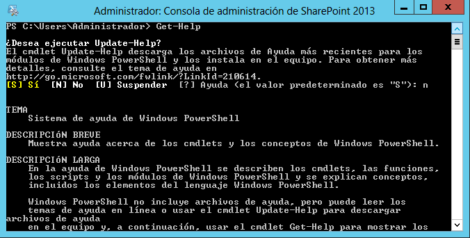
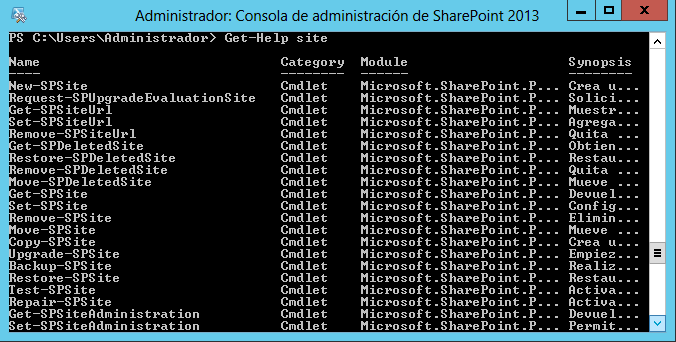
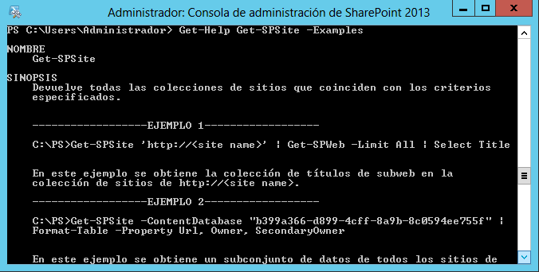
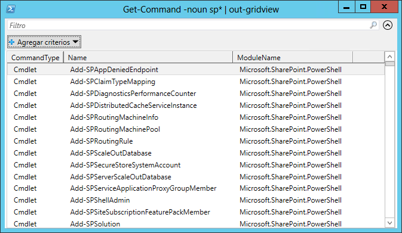
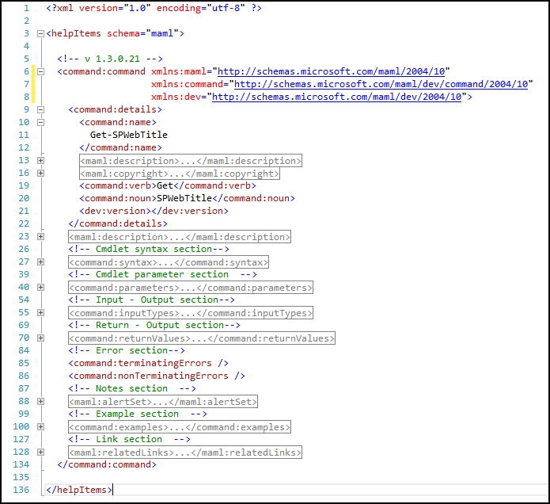
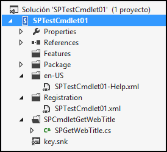
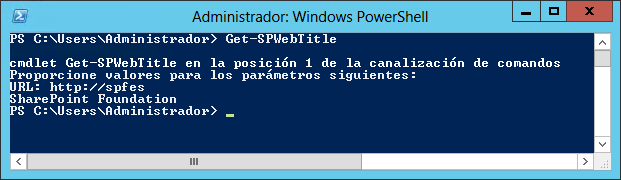
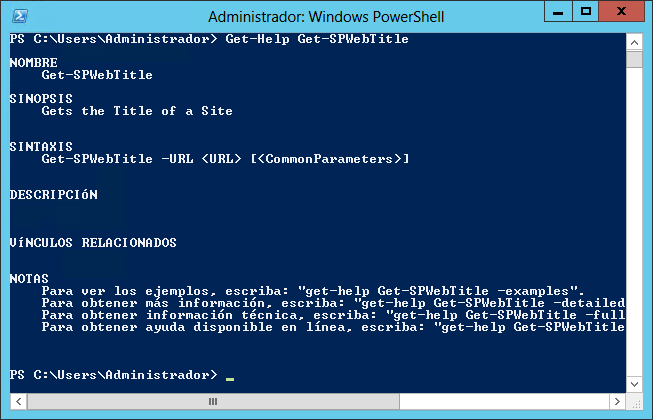
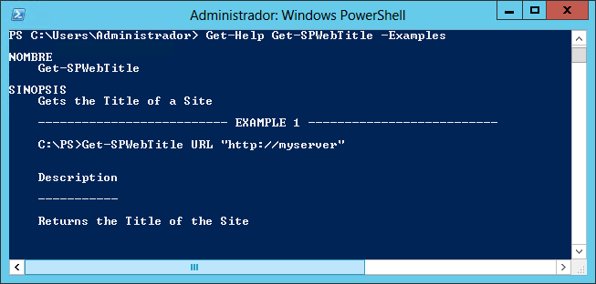

import ArticleHeader from '../../../components/article-header'

<ArticleHeader frontmatter={props.pageContext.frontmatter} />

​PowerShell es el Framework para automatización de tareas de Microsoft, consistente de un programa para ejecutar comandos y un lenguaje para ejecutar scripts basado en .NET. PowerShell ofrece acceso a todos los objetos de Windows y prácticamente todos sus servidores, incluyendo a SharePoint.

Aunque desde la versión 2007 de SharePoint fue posible utilizar PowerShell como herramienta de administración, apenas en la versión 2010 obtuvo un conjunto de comandos suficientemente sólido para poder trabajar cómodamente con el Portal. SharePoint 2013 sigue por el camino trazado, aumentando el soporte con nuevos comandos y erradicando totalmente la herramienta original de administración, stsadm.

SharePoint instala por defecto cientos de comandos que permiten realizar tareas administrativas, yendo desde la creación básica de Listas y Sitios, hasta la configuración de subsistemas completos como el Motor de Búsqueda o todos sus Servicios. A pesar de que la Interfaz de Usuario de Administración (la "Administración Central", junto con las páginas de Administración de Colecciones de Sitios, Sitios y Listas) de SharePoint ofrece una forma fácil para configurar los aspectos más comunes y triviales del servidor, hay muchas regiones que no están disponibles de esta forma, y que solo se pueden manejar utilizando a PowerShell. El ejemplo más claro es el Motor de Búsqueda, el que debe ser configurado utilizando los comandos disponibles de PowerShell y no dispone de Interfaz de Usuario para hacerlo.

Otra faceta importante de PowerShell es la rapidez con la que se puede crear funcionalidad específica, orientada a la Administración, sin necesidad de crear programas "reales" con Visual Studio. Por poseer PowerShell su propio lenguaje de programación que no necesita ser compilado, es posible "ensamblar" comandos de tal forma que formen un conjunto funcional, y hacerlos ejecutar con un solo clic.

Pero, aunque SharePoint ofrece multitud de comandos para PowerShell, ellos son de uso general. Cuando se necesita crear comandos especializados para facilitar alguna tarea en SharePoint, es posible programarlos utilizando Visual Studio, la herramienta de programación por defecto de Microsoft. Esto abre la posibilidad de automatizar el Portal de forma prácticamente ilimitada, facilitando y haciendo más eficiente la labor de los Administradores.

**Una pequeña introducción al uso de PowerShell**

Cuando se instala SharePoint, se instala al mismo tiempo una consola de PowerShell especializada para trabajar con los comandos del Servidor. Esto facilita el uso de la herramienta, pero también es posible utilizar la consola de Windows PowerShell mismo registrando el conjunto de comandos (llamados "Cmdlets") de SharePoint por medio del comando "Add-PSSnapin Microsoft.SharePoint.PowerShell".

El uso de PowerShell puede resultar extraño en el principio para administradores que lo utilizan por primera vez, pero Microsoft ha introducido suficientes posibilidades dentro de la herramienta misma para hacer su aprendizaje relativamente fácil. Por ejemplo, dispone de una función de "Ayuda" que describe la sintaxis y uso de cada uno de los comandos existentes. Para ver su funcionamiento, inicie una consola de PowerShell de SharePoint y ejecute el comando "Get-Help". PowerShell dispone de un mecanismo para descargar los archivos más recientes de ayuda, así que inicialmente PowerShell pregunta si se desea hacer un update de la información, lo que descarga la última información disponible desde los servidores de Microsoft.

El comando "Get-Help" solo muestra información sobre el uso del comando mismo. Cuando se combina con otro Cmdlet, muestra la sintaxis del comando a investigar. Por ejemplo, "Get-Help Get-SPSite" da toda la información necesaria para la utilización del Cmdlet "Get-SPSite".

El problema con el anterior script es que es necesario conocer el nombre del Cmdlet  ("Get-SPSite" en el ejemplo) antes de poder buscar su información de ayuda. Afortunadamente PowerShell puede utilizar información parcial para encontrar el Cmdlet apropiado. Por ejemplo, se sabe que es necesario utilizar el Cmdlet que obtiene el objeto relativo a una Colección de Sitios, pero solo se sabe que el comando tiene algo con "site" en su nombre. Si se utiliza "Get-Help site", PowerShell muestra todos los Cmdlets con "site" en su nombre:

Esta manera de filtrar también incluye caracteres comodines. Por ejemplo, para encontrar todos los Cmdlets que terminan en "site", como "Get-SPSite" y "Repair-SPSite", pero no "Get-SPSiteUrl", se puede utilizar "Get-Help \*site".

Una segunda forma de encontrar información sobre el uso de un Cmdlet es utilizar el parámetro "-Examples". Por ejemplo, para ver ejemplos de utilización de "Get-SPSite" se puede usar "Get-Help Get-SPSite -Examples":

Los Cmdlets consisten de dos partes: un "verbo" ("Verb") y un "substantivo" ("Noun") separados por un guion. Una forma alternativa para encontrar el mismo resultado mostrado anteriormente es la utilización del Cmdlet "Get-Command" en lugar de "Get-help". En este caso el Cmdlet está formado por el verbo "Dar" ("Get") y el substantivo "Comando" ("Command"). Este último Cmdlet también permite filtrar por el verbo o por el substantivo. Así, si se necesita encontrar todos los Cmdlets para "remover", se puede utilizar "Get-Command -Verb Remove", y para encontrar todos los Cmdlets relacionados con SharePoint se puede usar "Get-Command -Noun sp\*"

Finalmente, PowerShell permite encadenar comandos por medio de un "tubo" ("pipe" en inglés, utilizando el carácter "|") y redirigirlos (usando el carácter "&gt;") a un tipo de salida de pantalla diferente. Por ejemplo, para mostrar todos los Cmdlets de SharePoint en una ventana que permite trabajar más cómodamente con ellos se puede encadenar el comando hacia una ventana con un grid mediante "Get-Command -Noun sp\* | Out-GridView", como muestra la Imagen 4. Y para hacer que la salida no sea por pantalla sino hacia un archivo local se puede utilizar "Get-Command -Noun sp\* &gt; c:\com.txt", lo que crea un archivo "c:\com.txt" con la salida que de otra forma se vería en la pantalla de PowerShell.

**Creación de Cmdlets para SharePoint**

El SDK de SharePoint ofrece extensa información sobre todos los Cmdlets disponibles para el sistema en la página [http://technet.microsoft.com/en-us/library/ee890108.aspx](http&#58;//technet.microsoft.com/en-us/library/ee890108.aspx). Como ya se ha indicado, aunque los Cmdlets por defecto cubren prácticamente todos los aspectos de administración de SharePoint, eventualmente es necesario crear comandos personalizados que hagan alguna tarea especializada, de tal forma que estén integrados entre los Cmdlets de SharePoint por defecto y se puedan utilizar desde la consola de PowerShell de SharePoint sin necesidad de registrarlos específicamente.

Para crear Cmdlets para SharePoint se puede utilizar Visual Studio y sus plantillas para trabajar con el Portal. El siguiente ejemplo muestra cómo crear un Cmdlet básico (para mostrar el título de un Sitio) para SharePoint 2013 utilizando Visual Studio 2012, pero los pasos son exactamente los mismos si se desea utilizar SharePoint 2010 y Visual Studio 2010.

Inicie Visual Studio y seleccione "Nuevo proyecto à SharePoint 2013 - Proyecto vacío" desde la plantilla de "Visual C# à Office/SharePoint à Soluciones de SharePoint". Defina un nombre para el proyecto ("SPTestCmdlet01" en el ejemplo) y su ubicación. En la ventana de selección de tipo de proyecto, elija "Implementar como solución de granja de servidores".

Agregue referencias en el proyecto a "Microsoft.SharePoint.Powershell" (que se puede encontrar en "C:\Windows\Microsoft.NET\assembly\GAC\_MSIL\Microsoft.SharePoint.PowerShell\v4.0\_15.0.0.0\_\_71e9bce111e9429c\Microsoft.SharePoint.Powershell.dll") y a "System.Management.Automation" (desde "C:\Program Files (x86)\Reference Assemblies\Microsoft\WindowsPowerShell\3.0\System.Management.Automation.dll").

Cree un nuevo folder en el proyecto (llamado "SPCmdletGetWebTitle" en el ejemplo), y dentro del folder agregue una nueva clase (menú contextual del folder à Agregar à Clase) llamada "SPGetWebTitle.cs". Reemplace el código original por el siguiente:

| `using` `Microsoft.SharePoint;` |
| --- |

| `using` `Microsoft.SharePoint.PowerShell;` |
| --- |

| `using` `System;` |
| --- |

| `using` `System.Collections.Generic;` |
| --- |

| `using` `System.Management.Automation;` |
| --- |

| ` ` |
| --- |

| `namespace` `SPTestCmdlet01.SPCmdletGetWebTitle` |
| --- |

| `{` |
| --- |

| `    ``[Cmdlet(VerbsCommon.Get,``"SPWebTitle"``)]` |
| --- |

| `    ``class` `SPGetWebTitle : SPGetCmdletBase<``string``>` |
| --- |

| `    ``{` |
| --- |

| `        ``[Parameter(Position = 0, Mandatory =``true``)]` |
| --- |

| `        ``public` `string` `URL =``string``.Empty;` |
| --- |

| ` ` |
| --- |

| `        ``protected` `override` `IEnumerable<``string``> RetrieveDataObjects()` |
| --- |

| `        ``{` |
| --- |

| `            ``try` |
| --- |

| `            ``{` |
| --- |

| `                ``using` `(SPSite mySite =``new` `SPSite(URL))` |
| --- |

| `                ``{` |
| --- |

| `                    ``using` `(SPWeb myWeb = mySite.OpenWeb())` |
| --- |

| `                    ``{` |
| --- |

| `                        ``return` `new` `string``[] { myWeb.Title };` |
| --- |

| `                    ``}` |
| --- |

| `                ``}` |
| --- |

| `            ``}` |
| --- |

| `            ``catch` `(Exception ex)` |
| --- |

| `            ``{` |
| --- |

| `                ``WriteError(ex, ErrorCategory.NotSpecified,``null``);` |
| --- |

| `                ``return` `null``;` |
| --- |

| `            ``}` |
| --- |

| `        ``}` |
| --- |

| `    ``}` |
| --- |

| `}` |
| --- |

Inicialmente se necesitan referencias using a "Microsoft.SharePoint", "Microsoft.SharePoint.PowerShell" y "System.Management.Automation". El primer punto importante es definir qué tipo de verbo va a utilizar el Cmdlet en la decoración de la clase. Para el ejemplo, que es un Cmdlet del tipo "Dar", se debe utilizar "VerbsCommon.Get". PowerShell solamente acepta un número de verbos predefinidos en la enumeración "System.Management.Automation.VerbsCommon", no es posible crear verbos nuevos. La decoración de la Clase requiere también la cadena que se va a utilizar como substantivo, "SPWebTitle" para el ejemplo.

La Clase debe ser "public" y heredar de la clase base "SPGetCmdletBase" para el ejemplo pues se está utilizando el verbo "Get". Hay cuatro herencias disponibles para trabajar con objetos persistentes, es decir, objetos que deben poder mantener la información contenida para pasarla a otra operación: SPRemoveCmdletBase, SPNewCmdletBase, SPSetCmdletBase y SPGetCmdletBase. Para todos los otros tipos de verbos que son utilizados en objetos no persistentes, se debe utilizar SPCmdlet como clase base para heredar. Los objetos no persistentes ejecutan tareas que no requieren mantener información, por ejemplo un Cmdlet para iniciar una configuración o para detener un Servicio.

Los cmdlets aceptan parámetros, que son definidos por una variable pública, como indican las dos líneas de código enseguida de la declaración de la Clase. En el caso del ejemplo se necesita conocer el URL del Sitio, por lo que se declara una variable de tipo cadena llamada "URL" que, en este caso, se inicializa sin contenido ("string.Empty") aunque se le puede dar un valor por defecto. La propiedad se debe decorar con un atributo "Parameter" que define tanto su posición entre todos los parámetros a utilizar como si es obligatorio o no.

Finalmente se sobrescribe la rutina "RetrieveDataObjects()" que es la que realiza el trabajo dentro de SharePoint. En este caso solamente se instancian dos objetos conteniendo la Colección de Sitios (SPSite MySite) y el Sitio de nivel superior de la Colección (SPWeb myWeb) para devolver el título del Sitio. Es de crucial importancia manejar siempre una buena estrategia de captura de errores para evitar que si ocurre algún problema, PowerShell deje de trabajar sorpresivamente.

Para implementar la función de Ayuda del Cmdlet es necesario crear primero un folder en el proyecto para la carpeta asignada de SharePoint que contiene los archivos xml respectivos ("C:\Program Files\Common Files\microsoft shared\Web Server Extensions\15\CONFIG\PowerShell\Help"). Seleccione el proyecto en el Explorador de Soluciones de Visual Studio y utilizando el menú contextual seleccione "Agregar à Carpeta asignada de SharePoint". Navegue a "CONFIG à PowerShell à Help à en-US" y acepte los cambios. Esto crea un folder "en-US" en el proyecto de Visual Studio. Dentro de la carpeta cree un archivo xml (llamado "SPTestCmdlet01-Help.xml" en el ejemplo).

El archivo está dividido en varias secciones que permiten agregar información sobre la sintaxis, los parámetros, el tipo de entrada y salida de datos, ejemplos, etc. Este archivo puede ser bastante largo, por lo que probablemente la mejor idea es copiar uno de los ya existentes y modificar su contenido de acuerdo al Cmdlet que se esté programando. Microsoft proporciona también información detallada sobre las secciones que se pueden crear en el archivo en el sitio [http://blogs.msdn.com/b/powershell/archive/2006/09/14/draft-creating-cmdlet-help.aspx](http&#58;//blogs.msdn.com/b/powershell/archive/2006/09/14/draft-creating-cmdlet-help.aspx).

No es obligatorio definir archivos de ayuda para Cmdlets, aunque si es recomendable hacerlo para auto-documentar el comando. Para el ejemplo se ha creado el archivo de ayuda localizado para ingles en la carpeta en-US. Es posible crear archivo localizados para cualquier otro idioma en su propia carpeta ("es-ES" por ejemplo para castellano), aunque si se definen archivos de ayuda, es necesario tener siempre un archivo en el directorio "en-US" que es el que PowerShell usa por defecto si no hay información de localización disponible.

Finalmente es necesario registrar el Cmdlet para que se integre con los otros comandos por defecto de SharePoint. Cree una nueva carpeta compartida de SharePoint que apunte a "CONFIG à PowerShell à Registration" de la misma forma a como se creó la carpeta para ayuda. Agréguele un archivo xml que puede tener cualquier nombre, aunque es recomendable utilizar uno que esté relacionado al Cmdlet que se está programando ("SPTestCmdlet01.xml" en el ejemplo). Reemplace el código original del archivo con el siguiente:

| `<?xml version=``"1.0"` `encoding=``"utf-8"` `?>` |
| --- |

| `<ps:Config xmlns:ps=``"urn:Microsoft.SharePoint.PowerShell"` |
| --- |

| `                     ``xmlns:xsi=``"http://www.w3.org/2001/XMLSchema-instance"` |
| --- |

| `                     ``xsi:schemaLocation=``"urn:Microsoft.SharePoint.PowerShell  SPCmdletSchema.xsd"``>` |
| --- |

| ` ` |
| --- |

| `  ``<ps:Assembly Name=``"$SharePoint.Project.AssemblyFullName$"``>` |
| --- |

| `    ``<ps:Cmdlet>` |
| --- |

| `      ``<ps:VerbName>Get-SPWebTitle</ps:VerbName>` |
| --- |

| `      ``<ps:ClassName>SPTestCmdlet01.SPCmdletGetWebTitle.SPGetWebTitle</ps:ClassName>` |
| --- |

| `      ``<ps:HelpFile>SPTestCmdlet01-Help.xml</ps:HelpFile>` |
| --- |

| `    ``</ps:Cmdlet>` |
| --- |

| `  ``</ps:Assembly>` |
| --- |

| `</ps:Config>` |
| --- |

El archivo define el ensamblado a usar por medio de un macro ("$SharePoint.Project.AssemblyFullName$"), lo mismo que el nombre del Cmdlet que se va a utilizar cuando se llame desde PowerShell ("Get-SPWebTitle"). Es también necesario especificar el nombre de la Clase que define el Cmdlet y el nombre de su archivo de ayuda. Si no se utiliza un archivo de ayuda, es obligatorio de todas formas poner algunos caracteres en la etiqueta "ps:HelpFile" aunque no tengan significado alguno.

La Imagen 6 muestra la estructura final del proyecto en Visual Studio.

El nuevo Cmdlet está finalizado y listo para funcionar utilizando sus archivos de código, de ayuda y de configuración. Para poder depurar fácilmente desde Visual Studio es necesario acoplar el proyecto al ejecutable de PowerShell registrando los módulos de SharePoint. Para hacer esto, seleccione el proyecto en el Explorador de Soluciones de Visual Studio y utilizando su menú contextual seleccione "Propiedades". En la pantalla de propiedades, seleccione la pestaña de "Depurar" y en "Acción de inicio" utilice en la opción "Programa externo de inicio" el valor:

C:\Windows\System32\WindowsPowerShell\v1.0\PowerShell.exe

En la sección "Opciones de inicio", en "Argumentos de la línea de comandos" utilice:

-NoExit  " & 'C:\Program Files\Common Files\microsoft shared\Web Server Extensions\15\CONFIG\PowerShell\Registration\SharePoint.ps1'"

Después de configurar a Visual Studio de esta forma, es posible colocar puntos de interrupción en cualquier línea de código, depurar (F5) y seguir el funcionamiento del Cmdlet de la misma forma que cualquier otro programa desarrollado con VS.

Compruebe también que la Ayuda del Cmdlet funciona correctamente:

Lo mismo que los ejemplos configurados en la Ayuda:

Finalmente, para distribuir e instalar el Cmdlet, empaque el proyecto de Visual Studio como una Solución de SharePoint (archivo .wsp): en Visual Studio seleccione el proyecto, usando su menú contextual seleccione "Publicar" y en la ventana de configuración utilice "Publicar en el sistema de archivos" indicando la ubicación de destino. El archivo de Solución de SharePoint generado se puede instalar en cualquier servidor o granja de SharePoint de la misma forma que cualquier otra Solución con personalizaciones para el Portal.

**Conclusión**

PowerShell es la herramienta por excelencia para administrar a SharePoint. PowerShell no solamente dispone de cientos de comandos para realizar su trabajo con SharePoint, sino que debido a su extensibilidad es posible crear nuevos Cmdlets personalizados con Visual Studio que se integran totalmente con los comandos por defecto suministrados por SharePoint.

**Gustavo Velez**
 MVP de SharePoint Server
[gustavo@gavd.net](mailto&#58;gustavo@gavd.net)   
 http://www.gavd.net

