import ArticleHeader from '../../../components/article-header'

<ArticleHeader frontmatter={props.pageContext.frontmatter} />

​Una de las características que nos ofrece SharePoint es la capacidad de implementar un ECM (Enterprise Content Management), y no sólo desde un punto de vista de gestión documental natural de control de versiones, tipos de contenido y plantilla, sino también desde un punto de vista de gestión de las políticas de negocio o legales que obligan a las empresas a mantener seguros sus documentos.
En este artículo nos adentraremos en la Gestión de Registros que SharePoint nos ofrece como parte del ciclo de vida de un ECM.

Un Record o Registro es una entidad física o digital, con importancia organizacional y que requiere de unas políticas de retención. Por motivos legales o de negocio, las empresas necesitan aplicar estas políticas de retención, bloquear registros para que puedan ser editados, disponer de ellos cuando sea necesario, manteniendo unas políticas de administración y gestión que permita mantener la información de la empresa cumpliendo con esas leyes o con el propio negocio.

**¿Qué es Records Management?**

Records Management o Gestión de Registros (no tengo claro que la traducción exista en Español) es la práctica de identificar, clasificar, archivar, preservar y destruir los registros de acuerdo a una serie de reglas o estándares predefinidos.

Bajo la definición de un Plan de Archivo, debemos de asegurar la información afectada y cumplir con estas políticas definidas, y, para los registros digitales, SharePoint tiene una solución. Entre todas las funcionalidades de ECM (Enterprise Content Management) de SharePoint, estás son las que se aplican a la gestión de registros:

- **Identificador de Documentos.** Todo registro debe de tener un identificador único en la empresa, y para eso desde SharePoint 2010 tenemos el servicio de Id de Documentos.
- **Metadatos empresariales.** El servicio de metadatos mejora el uso de la terminología en toda la empresa y permite clasificar el contenido a nivel empresarial. Este servicio permite tener los conjuntos de términos para todos nuestros sitios de SharePoint, mejorando la búsqueda y el descubrimiento de los contenidos. Desde el punto de vista de un registro, nos permite tener metadatos consistentes en toda la organización y mantener reglas que categoricen o almacenen los registros.
- **Records center.**El Centro registros es un sitio que actúa como repositorio central donde almacenar y gestionar los registros. SharePoint incluye una plantilla de sitios que permite gestionar los registros de la empresa, con todas las funcionalidades necesarias.
- **In-Place Records Management.**Junto con las funcionalidades de Records Management, desde SharePoint 2010 tenemos la posibilidad de llevar esta gestión desde el sitio, en modo In-Place. En vez de mover los documentos al Centro de Registros para declararlo como registro, se puede declarar y administrar el registro desde el sitio donde fue creado. Las políticas son aplicadas a nivel de Tipos de Contenido o directamente en las Bibliotecas de documentos, y los documentos pueden ser declarados como registros, manual o automáticamente.
- **Auditoría de Colección de Sitios.** La gestión de registros necesita de una intensiva auditoría para conocer lo que está pasando, por ejemplo, cuando declaramos un registro y por qué, cuando fue eliminado o cambiado, etc. Para eso, utilizaremos la configuración de auditoría que SharePoint ofrece a nivel de colección de sitios.
- **Organizador de contenido.** El organizador de contenido de SharePoint 2010 ayuda a las empresas a clasificar el contenido, moviéndolo a su lugar correspondiente, basándose en los metadatos del documento.
- **Detalles de cumplimiento.** SharePoint 2010 incluye una opción en las bibliotecas que permiten gestionar la información de negocio de los documentos, por ejemplo, políticas de retención, documentos retenidos, documentos declarados como registro, etc.
- **Retención y eDiscovery.** En SharePoint 2010 se incluye está característica que permite encontrar los documentos que cumplen con una determinada búsqueda, tipo de contenido o política, y ponerlos en retención. Esta retención suele ser necesario, en la gestión de registros, para auditorías o investigación de negocios. En la última versión, SharePoint 2013 permite también encontrar documentos de Exchange y Lync.
- **Content Type Hub.** El concentrador de tipos de contenido fue una característica nueva de SharePoint 2010, solicitada por los usuarios, que permite tener un sitio centralizado donde administrar los tipos de contenido y publicarlos a las distintas colección de sitios suscritas, ya que la definición de los tipos de contenido es únicamente a nivel de colección de sitios. Para la gestión de registros es importante tener declarados globalmente los tipos de documentos (tipos de contenidos) y poder saltarse la limitación del producto de la definición a sólo una colección de sitios, porque, probablemente, tengamos más de una colección de sitios y, más probable, el centro de registros esté en una aplicación web independiente.
- **Multi-Level Retention.**SharePoint 2010 incluye el concepto de poder configurar diferentes fases de retención, para permitir la posibilidad de definir diferentes estados del registro. Lo normal es que los registros pasen por un periodo de retención y que pasado ese periodo se establezca otro periodo de salvaguarda con la destrucción del registro, y con ello, el documento.
- **Send to connections.**Las capacidades del menú de "Enviar a" en SharePoint 2010 se ampliaron, con respecto a SharePoint 2007. En SharePoint 2010 no sólo se puede hacer una copia del documento, sino que es posible moverlo o, incluso, moverlo y dejar un link que enlace con el destino final del documento. Esta característica es necesaria para mover documento a Centro de registros y que estos sean enrutados a su lugar correspondiente, una vez que lleguen a él.
- **Sitios de buzones.**SharePoint 2013 permite integrarnos con Exchange 2013 con una nueva funcionalidad llamada Site Mailbox. Pensemos que un registro también incluye a los correos electrónicos, y con esta funcionalidad, podemos emplear las mismas políticas y el centro de registro para estos documentos.
- **Políticas de sitio.**Una extensión que permite aplicar políticas a nivel de sitio, incluyendo cumplimientos.

Teniendo en cuenta las funcionalidades que SharePoint 2013 nos ofrece, podemos planificar la gestión de registros con las siguientes fases:

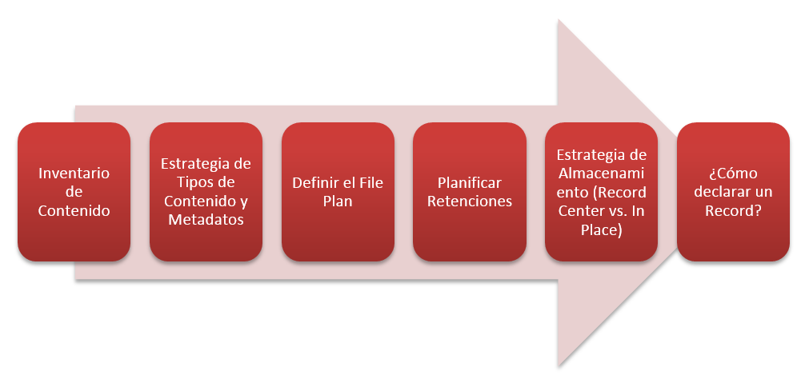

Hacer un inventario del contenido electrónico de la empresa, definir una estrategia, alineada con el negocio, de Tipos de Contenido de Metadatos empresariales, definir un plan de archivo para esos tipos de contenido, planificando las retenciones necesarias en cada caso y las distintas fases por las que un registro debe de pasar, todo esto teniendo claro cómo vamos a almacenar todas esta información en SharePoint, en las bases de datos de contenido o en Blob Storage, y documentar como y cuando se debe de declarar un registro.

**Centro de Registros**

El Centro de Registros es una plantilla de sitio en SharePoint que combina características estándar de gestión de proyectos empresariales con funcionalidades especializadas de gestión de registros. Por definición, los registros no serán nunca modificados por el Sistema y los administradores del sistema pueden configurarlo para prevenir modificaciones.

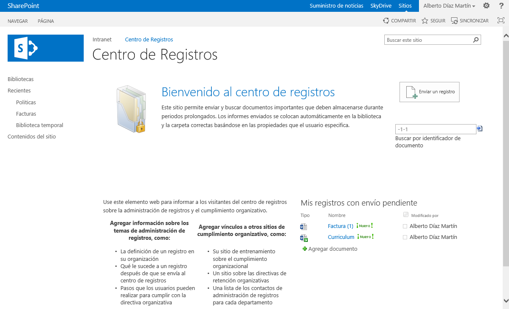

Mediante la definición de reglas del organizador de contenido, clasificamos los documentos que llegan al Centro de Registro. Esta clasificación se basa en el tipo de contenido del documento y los metadatos de los mismos, para enrutar el contenido.

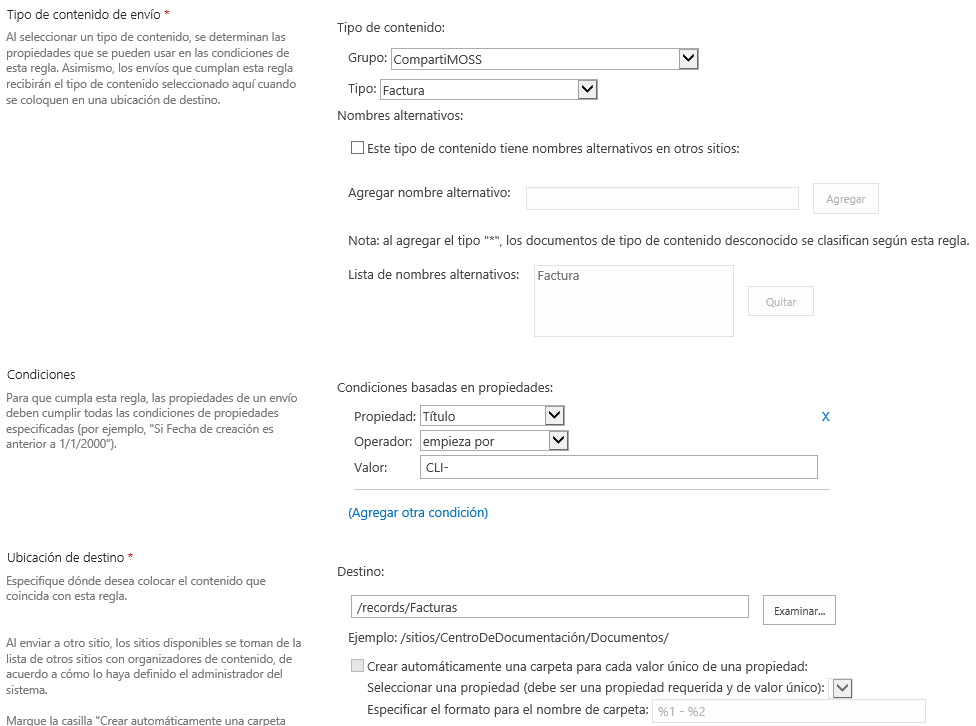

**Declaración de Registros**

Para declara un registro existen cuatro opciones: realizarlo usando las fases de la directiva de información del tipo de contenido, mediante un flujo de trabajo, que se cree automáticamente para todos los documentos de una biblioteca o que el usuario lo pueda realizar de forma manual, esto es, una vez que el documento se encuentra en el Centro de Registro, o en principio, en cualquier ubicación, existe una opción para realizar la declaración del documento como registro. Esto se tiene que configurar en la configuración de la colección de sitio, en la página de Configuración de declaración como registro o a nivel de biblioteca de documentos.

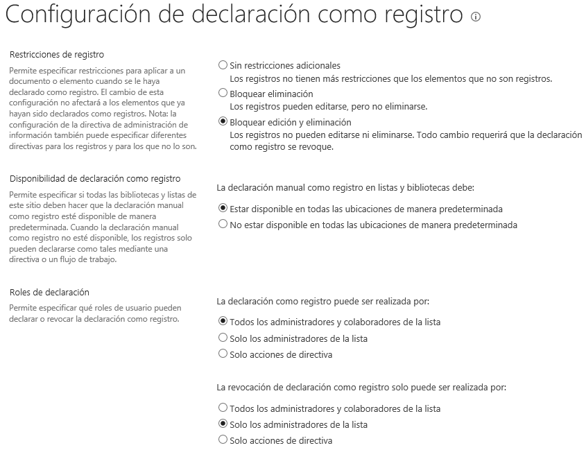

La declaración de un registro implica una configuración de restricciones de registro, que bloquean o no el documento para eliminación o edición, y la configuración de los roles que pueden declarar o revocar la declaración de un registro.

**Plan de Archivo**

Dentro de la gestión de registros se define el *File Plan* o Plan de Archivo. Este plan define las directivas de retención, teniendo en cuenta las distintas fases por las que un registro pasa y los niveles de auditorías necesarios para cada uno de los tipos de archivo o contenido. SharePoint permite definir estas políticas a nivel de sitio, como plantillas, a nivel de tipo de contenido o a nivel de biblioteca de documentos, pudiendo sobrescribir cualquier política aplicada desde un nivel superior.

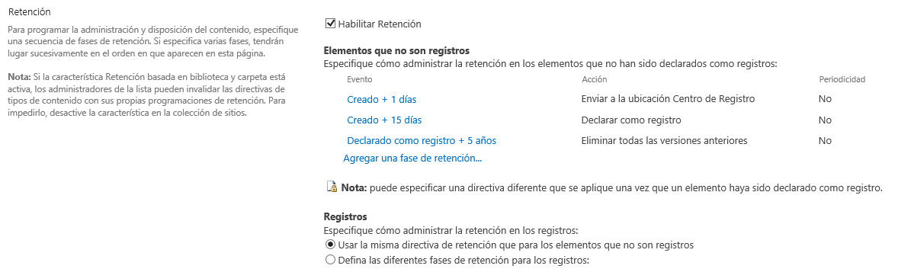

La configuración de retención anterior, define las siguientes fases:

- Creado + 1 días. La primera fase se activa 1 días después de la fecha de creación del documento y lo transfiere al Centro de Registro, moviéndolo y dejando un vínculo de enlace al mismo.

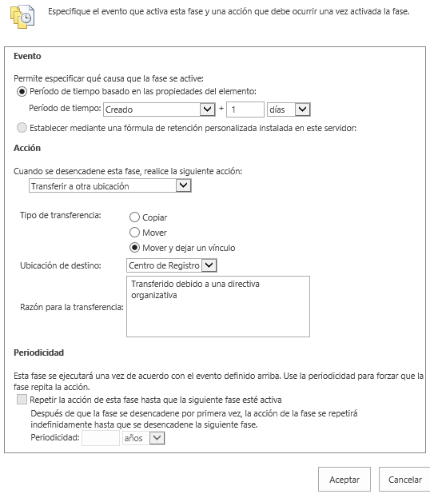

- Creado + 15 días. Una vez han pasado 15 días de la creación del documento, este es declarado como registro de forma automática.

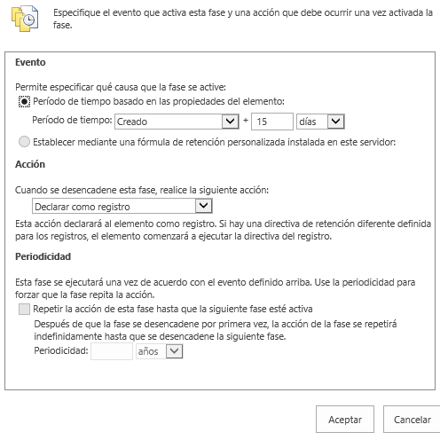

- Declarado como registro + 5 años. Cuando el documento es declarado como registro, manual o automáticamente, se eliminan todas las versiones anteriores.

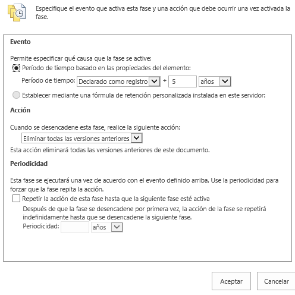

Por definición, los periodos puedes ser al Crear un documento, al Modificarlo o al Declararlo como registro, mientras que las acciones son:

- Mover a la papelera de reciclaje
- Eliminar permanentemente
- Transferir a otra ubicación
- Iniciar un flujo de trabajo
- Saltar a la siguiente fase
- Declarar como registro
- Eliminar borradores anteriores
- Eliminar todas las versiones anteriores

Además de poder habilitar los eventos que se van a auditar para este tipo de contenido:

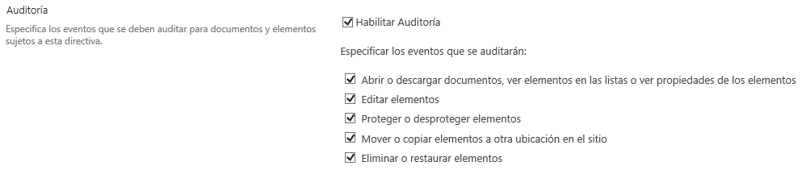

**Informes y cumplimiento**

Un punto importante para la gestión de registros es conocer para cada registro cuál es su estado. SharePoint nos ofrece una opción, para cada elemento o documento, que nos permite ver el detalle de cumplimiento de un documento.

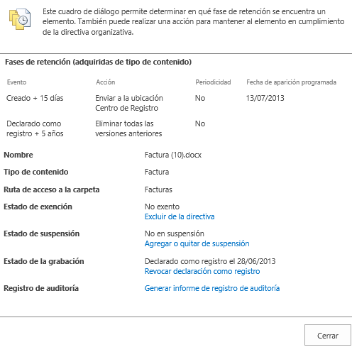

Este informe nos ofrece toda la información, del elemento actual, relativo a las fases y a las políticas que tiene que cumplir. Además, nos ofrece el estado de registro, el estado de suspensión y de exención, junto con un informe de registro de auditoría, si esta estuviera activada.

Desde la Administración del Centro de Registros podemos acceder a toda una serie de informes sobre actividades de contenido, directiva de administración de información y seguridad y configuración del sitio.

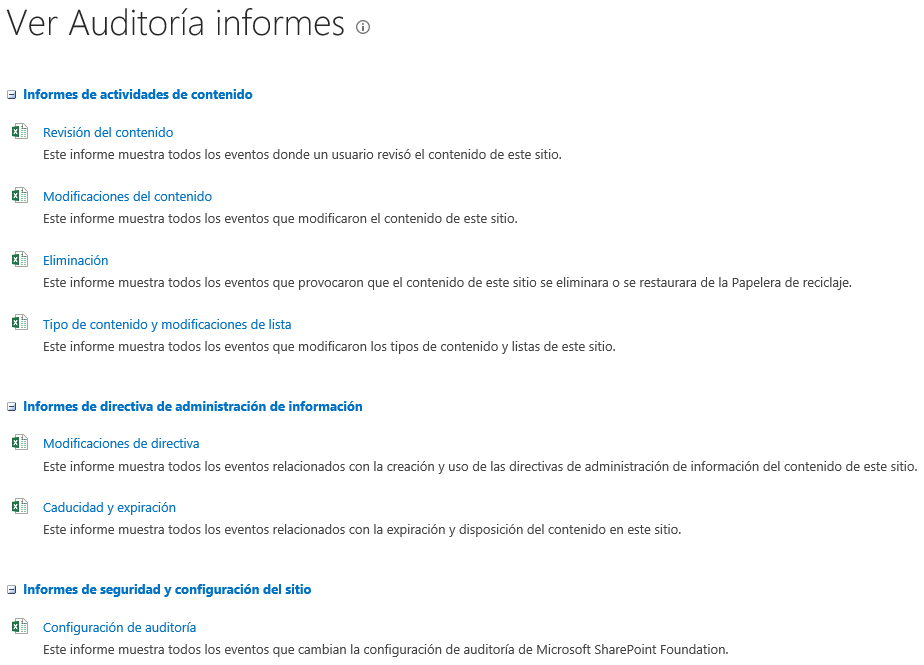

En cualquier momento, tenemos que poder extraer información sobre los registros y sus documentos asociados, por lo tanto, es importante que configuremos correctamente la auditoría de los contenidos.

**Suspensión**

Por motivos del negocio, cuando un registro está bajo investigación o auditoría, es posible ponerlo en estado de suspensión.  Cuando un registro se encuentra en suspensión, está suspendido para cualquier caducidad de alguna política que se le aplique, y está protegido ante la destrucción. De nuevo en la Administración del Centro de Registros, podemos buscar estos documentos y suspenderlo, además de poder crear motivos de suspensión, necesarios para suspender un documento.

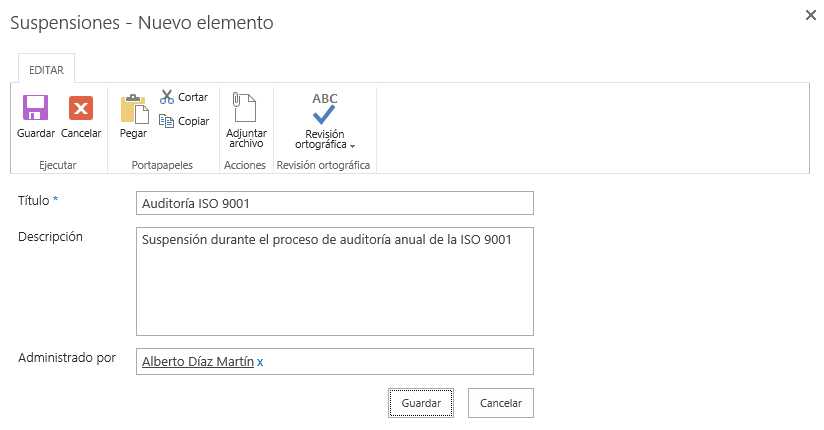

Que pueden ser aplicadas a nivel del centro de registro o para un registro en concreto.

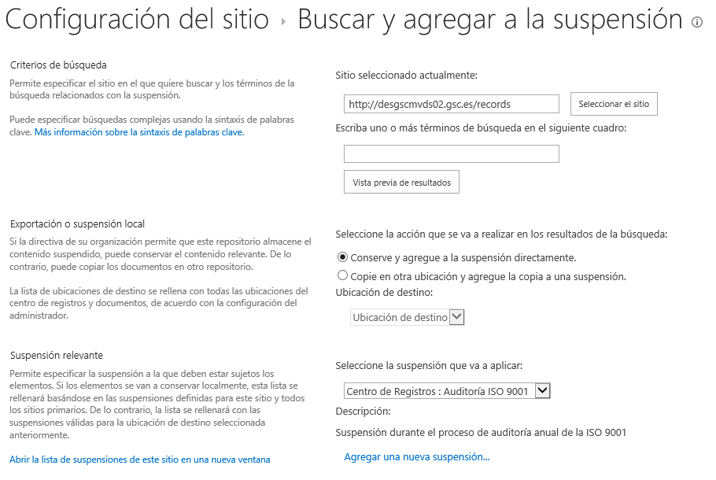

**Conclusiones**

Todas estas capacidades ponen a SharePoint 2013 en un lugar privilegiado dentro de los gestores de registros, aunque os recomiendo planificar cuidadosamente todo el proceso, porque son muchos componentes por separado que poner a jugar para el mismo rol. Por su puesto, tenemos ciertas limitaciones que SharePoint no cubre, como la gestión de registros físicos, la seguridad por metadatos, el reemplazo de políticas o elementos obsoletos, que se suelen necesitar en este tipo de gestiones, pero para esto, tenemos soluciones de terceros que amplían y mejoran las capacidades de SharePoint, por ejemplo, Collabware CLM.

**Alberto Diaz Martin**
MVP SharePoint Server
[http://geeks.ms/blogs/adiazmartin](http&#58;//geeks.ms/blogs/adiazmartin)
@adiazcan

