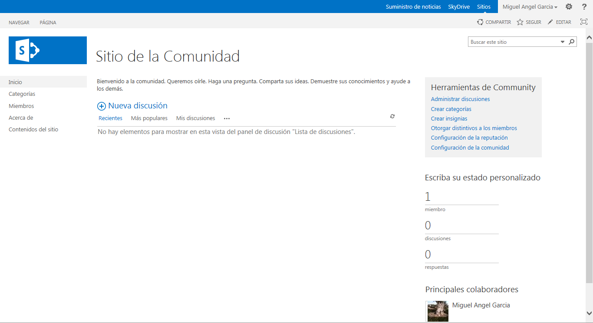
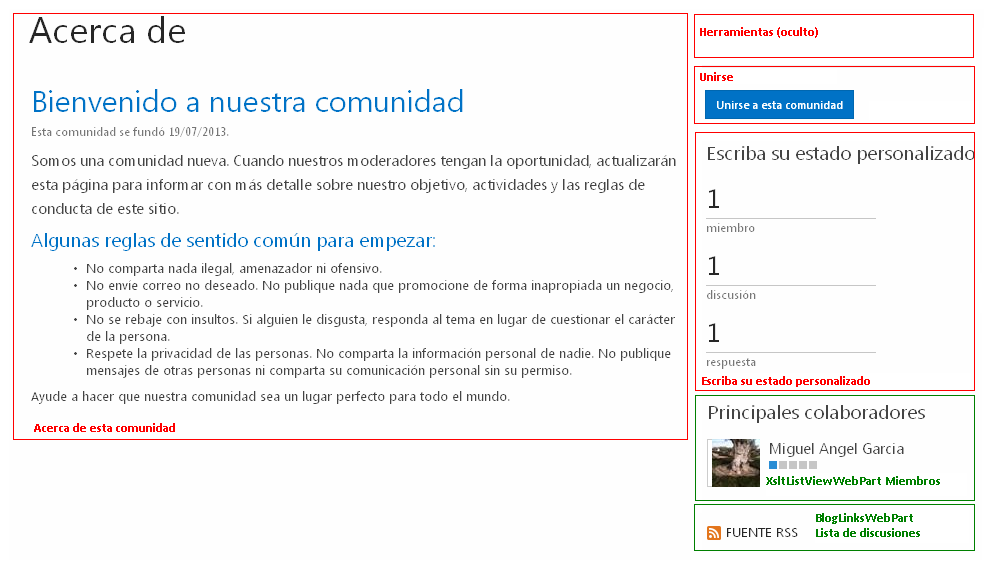
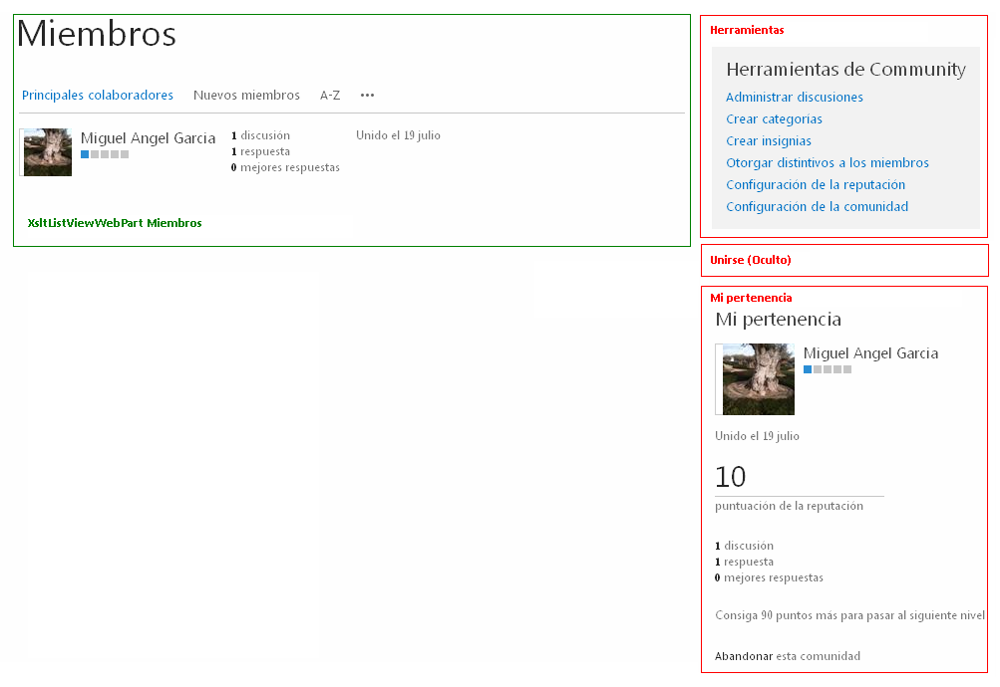
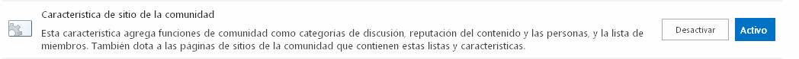

"Un lugar donde los miembros de la comunidad conversan sobre temas de interés común. Los miembros pueden examinar y descubrir contenido relevante si exploran las categorías, ordenan las discusiones por popularidad o eligen ver sólo los mensajes que tienen una mejor respuesta. Los miembros pueden obtener puntos de reputación al participar en actividades de la comunidad: iniciando discusiones y respondiendo a ellas, marcando las publicaciones que les gustan o indicando las mejores respuestas, entre otras".

Así define SharePoint 2013 esta plantilla de sitio que es novedad en esta versión. Pero ¿qué significa esto exactamente?

**Bibliotecas y Listas que se crean con esta plantilla**

| Listas / Bibliotecas | ​ | ​ |
| --- | --- | --- |
| Título | Plantilla | URL |
| Activos del sitio | DocumentLibrary | SiteAssets |
| Biblioteca de estilos (\*) | DocumentLibrary | Style Library |
| Categorías | 500 | Lists/Categorias |
| Lista de discusiones | DiscussionBoard | Lists/Discusion de comunidad |
| Miembros de la comunidad | 880 | Lists/Miembros |
| Páginas del sitio | WebPageLibrary | SitePages |
| Plantillas de formulario (\*) | DocumentLibrary | FormServerTemplates |
| AbuseReports (oculta) |   | AbuseReports |
| Distintivos (oculta) |   | Distintivos |

(\*)Esta plantilla de sitio puede utilizarse en la creación de una colección de sitios (Site) o bien como un subsitio (Web) dentro de una colección. Estas bibliotecas serán creadas si se trata de una colección de sitios.

Como puede apreciarse, la estructura básica consta de tres listas que se relacionan entre sí: Categorías, Lista de discusiones y Miembros de la comunidad.
 La lista Categorías se basa en el tipo de contenido del mismo nombre que nos permite la utilización de cuatro columnas de datos:

| Nombre columna | Tipo | Observaciones |
| --- | --- | --- |
| Nombre de la categoría | Una línea de texto |   |
| Descripción | Una línea de texto |   |
| Imagen de la categoría | Hipervínculo o imagen | Utilizada para la vista de mosaicos |
| Ultima publicación de | Persona o grupo |   |

Esta lista tiene dos vistas:

- Vista de administrador (AdminView.aspx).
- Mosaicos de categoría (CategoryTiles.aspx). Esta vista utiliza la columna Imagen de la categoría para mostrar las categorías en modo mosaico.

La lista Miembros de la comunidad se basa también en un tipo de contenido con el mismo nombre que utiliza dos columnas de datos:

| Nombre columna | Tipo | Observaciones |
| --- | --- | --- |
| Distintivo preferencial | Búsqueda | (Relacionada con la lista oculta Distintivos) |
| Miembro | Persona o grupo |   |

Esta lista tiene 5 vistas:

- Vista de miembros (MembersAllItems.aspx).
- Principales colaboradores (TopContributors.aspx).
- Nuevos miembros (NewMembers.aspx).
- Vista de administrador (AdminView.aspx).
- Vista de un solo miembro (SingleMemberView.aspx).

Por otra parte la Lista de discusiones se basa en dos tipos de contenido (similar a una DiscussionBoard de SharePoint 2010): Discusión y Mensaje generando las siguientes columnas de datos:

| Nombre columna | Tipo | Observaciones |
| --- | --- | --- |
| Asunto | Una línea de texto | Discusión, Mensaje |
| Categoría | Búsqueda | Discusión (Relacionada con Categorías) |
| Clasificación (0-5) | Clasificación (0-5) | Discusión, Mensaje |
| Cuerpo | Varias líneas de texto | Discusión, Mensaje |
| Número de clasificaciones | Número de clasificaciones | Discusión, Mensaje |
| Numero de Me gusta | Número de Me gusta | Discusión, Mensaje |
| Pregunta | Sí o No | Discusión |
| Modificado por | Persona o Grupo | Discusión, Mensaje |
| Autor del elemento primario | Persona o Grupo | Mensaje |
| Ultima respuesta de | Persona o Grupo | Discusión |

Esta lista tiene 5 vistas:

- Encadenada (Threaded.aspx).
- Plana (Flat.aspx).
- Asunto (AllItems.aspx).
- Administración (Management.aspx).
- Discusiones destacadas (FeaturedItems.aspx) Cuando un administrador marca una discusión como destacada aparecerá dentro del elemento web Discusiones destacadas en la página Categoría.aspx.

**Páginas**

Además de  las tres listas anteriores se crea una biblioteca de páginas con  las siguientes páginas de elementos web:

- Categoría.aspx
- Acerca de.aspx
- Miembros.aspx
- Página principal de la comunidad.aspx
- Tema.aspx
- Categorías.aspx

Cada una de ellas tiene insertados determinados elementos web que permiten la correcta gestión del sitio. Se detallan a continuación dichos elementos web en cada una de las páginas.

| Elementos web | Título | Lista |
| --- | --- | --- |
| Página: SitePages/Categoría.aspx | ​ | ​ |
| XsltListViewWebPart |   | Categorías |
| XsltListViewWebPart |   | Lista de discusiones |
| XsltListViewWebPart | Discusiones destacadas | Lista de discusiones |
| CommunityAdmin.webpart | Herramientas |   |
| XsltListViewWebPart |   | Miembros |
| Página: SitePages/Acerca de.aspx | ​ | ​ |
| AboutUs.webpart | Acerca de esta comunidad |   |
| CommunityAdmin.webpart | Herramientas |   |
| CommunityJoin.webpart | Unirse |   |
| Dashboard.webpart | Escriba su estado personalizado |   |
| XsltListViewWebPart |   | Miembros |
| BlogLinksWebPart |   | Lista de discusiones |
| Página: SitePages/Miembros.aspx | ​ | ​ |
| XsltListViewWebPart |   | Miembros |
| CommunityAdmin.webpart | Herramientas |   |
| CommunityJoin.webpart | Unirse |   |
| MyMembership.webpart | Mi pertenencia |   |
| Página: SitePages/Página principal de la comunidad.aspx" | ​ | ​ |
| XsltListViewWebPart |   | Lista de discusiones |
| CommunityAdmin.webpart | Herramientas |   |
| CommunityJoin.webpart | Unirse |   |
| Dashboard.webpart | Escriba su estado personalizado |   |
| XsltListViewWebPart |   | Miembros |
| Página: SitePages/Tema.aspx | ​ | ​ |
| XsltListViewWebPart |   | Lista de discusiones |
| CommunityAdmin.webpart | Herramientas |   |
| Página: SitePages/Categorías.aspx | ​ | ​ |
| XsltListViewWebPart |   | Categorías |
| CommunityAdmin.webpart | Herramientas |   |
| Dashboard.webpart | Escriba su estado personalizado |   |
| XsltListViewWebPart |   | Miembros |

A continuación se muestran dos imágenes correspondientes a las páginas "Acerca de.aspx" y "miembros.aspx" donde se aprecia cómo se distribuyen los elementos web dentro de las zonas. Se han señalado en rojo los elementos web propios de esta plantilla de sitio.

**Elementos web**

A continuación se describen los elementos web específicos de un sitio de la comunidad. Funcionarán en los sitios de comunidad o en cualquier otro sitio que tenga activadas las funciones de comunidad.

| Elemento web | Descripción |
| --- | --- |
| Acerca de esta comunidad | Este elemento web muestra la descripción de la comunidad y otras propiedades, como la fecha establecida.  |
| Herramientas | Proporciona a los propietarios y administradores de la comunidad vínculos rápidos a páginas de configuración comunes y listas de contenido para administrar un sitio de comunidad.  |
| Unirse   | Permite unirse a la comunidad a aquellos que no son miembros de un sitio de comunidad. El botón se oculta si el usuario ya es miembro.  |
| Escriba su estado personalizado | Muestra el número de miembros, temas y respuestas que hay dentro de un sitio de comunidad.  |
| Mi pertenencia | Muestra la información de reputación y pertenencia correspondiente al visitante actual de un sitio de comunidad.  |

El elemento web Herramientas  es una serie de vínculos que permite a los administradores desarrollar las siguientes tareas:

- Administrar discusiones. Vínculo a la vista "Management.aspx" que permite al administrador la gestión de la lista de discusiones. Adicionalmente permite marcar como destacadas  ciertas discusiones desde la pestaña Moderación.
- Crear categorías. Vínculo a la vista "AdminView.aspx" que permite agregar o  modificar categorías.
- Crear Insignias. Vínculo a la tabla oculta "Distintivos" que permite agregar o modificar los distintivos.
- Otorgar distintivos a los miembros.  Vínculo a la vista "AdminView.aspx" que permite desde la pestaña Moderación asignar un Distintivo a un miembro.
- Configuración de la reputación: Vínculo a la página del sistema "CommunityReputationSettings.aspx" que permite:
    - Especificar si se pueden clasificar los elementos de esta lista o no.
    - Elegir "Me gusta" o "Clasificación por estrellas" como la forma de clasificación del contenido.
    - Habilitar sistema de puntos de logros de los miembros, especificando los valores otorgados a los miembros  para una serie actividades.
    - Especificar el número de puntos que necesitan los miembros para llegar a cada nivel de logro.
    - Especificar si los niveles de logro aparecen como una serie de cuadros o como un título de texto que se puede personalizar.
- Configuración de la comunidad: Un vínculo a la página del sistema "CommunitySettings.aspx" que permite al administrador:
    - Cambiar la fecha de inicio de la comunidad.
    - Habilitar la aprobación automática para miembros que desean unirse a la comunidad.
    - Permitir a los miembros de la comunidad informar de contenido inapropiado, que los administradores pueden revisar y quitar.
- Revisar entradas notificadas. Vínculo a la página entradas notificadas.aspx que permite la gestión de las entradas que han sido notificadas como contenido inapropiado.

**Características**

Por último analizamos las características que se activan exclusivamente con estas plantillas de sitio:

| Feature | ID |
| --- | --- |
| CommunitySite | 961d6a9c-4388-4cf2-9733-38ee8c89afd4 |
| AbuseReportsList | c6a92dbf-6441-4b8b-882f-8d97cb12c83a |
| MembershipList | 947afd14-0ea1-46c6-be97-dea1bf6f5bae |
| CategoriesList | d32700c7-9ec5-45e6-9c89-ea703efca1df |

**Miguel Ángel García Rodríguez**
Analista SharePoint
[miganggarrrod@hotmail.com](mailto&#58;miganggarrrod@hotmail.com)

