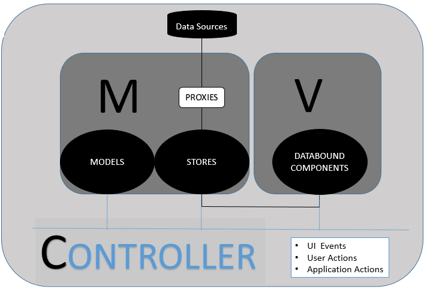
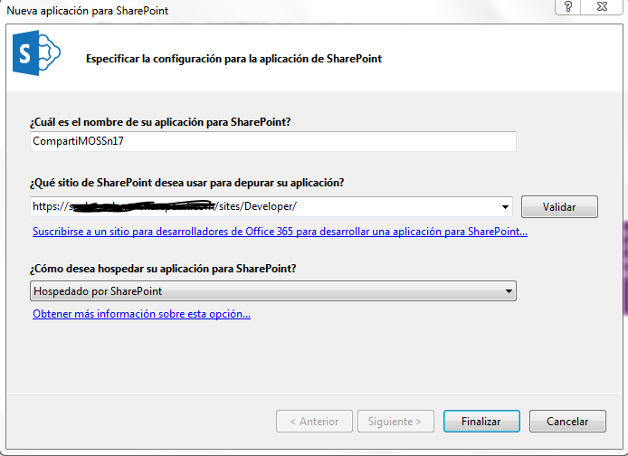
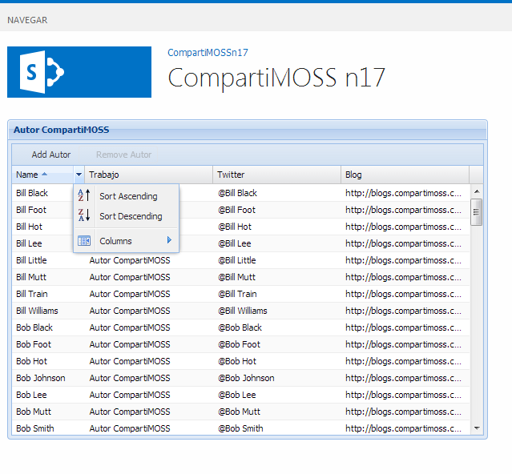
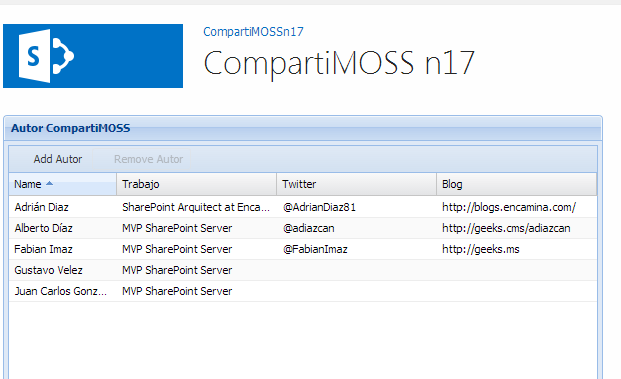
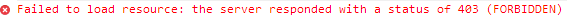
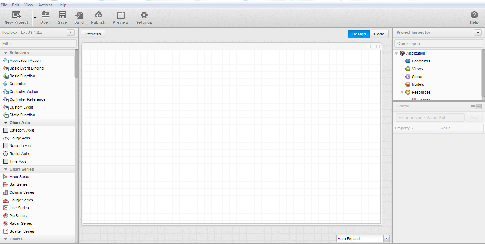

​ExtJS es uno de los Frameworks JavaScript más famosos del mercado cuya última versión es la 4.2. Se caracteriza por simplificar la creación de Apps.

Sus principales ventajas:

- Prototipos y APPS de una forma muy sencilla y rápida.
- Resultado obtenido es HTML5 con lo cual obtienes una compatibilidad con todos los navegadores y dispositivos.
- Posibilidad de crear aplicaciones móviles con un código muy semejante (ya lo veremos en otros artículos)
- Arquitectura MVC




El principal inconveniente que tiene es que su curva de aprendizaje no es tan rápida, y para hacer cosas relativamente interesantes con él, es necesario conocer  bastante bien JavaScript, lo que en los primeros proyectos nos puede hacer tirar la toalla y ocasionar un poco de frustración.

Al igual que en el anterior número, en este artículo vamos a explicar cómo desarrollar un APP en la que vamos a mostrar información de los Autores de CompartiMOSS. Vamos a poder realizar operaciones Create Read Update Delete contra una lista de SharePoint y visualizaremos la información obtenida en un GRID haciendo uso de la API REST  para leer la información y también utilizaremos el modelo de objetos cliente de JavaScript para ver cómo podemos integrar otras librerías con este Framework.

**Requisitos Previos**

Antes de ponernos a trabajar hay que descargarse el Framework Sencha de la siguiente página: [http://www.sencha.com/products/extjs/download/](http://www.sencha.com/products/extjs/download/). Su uso, siempre que no se implemente ninguna aplicación "comercial", es gratuito.

**Creación de la APP SharePoint-Hosted mediante Visual Studio**

Abrimos Visual Studio 2012 y seleccionamos un proyecto de este tipo:



En primer lugar, agregamos al proyecto una lista llamada Autores en la que añadiremos los datos que queremos mostrar en el Grid. Esta lista contendrá los campos mencionados anteriormente: (Autor, PuestoTrabajo, Twitter y Blog). A esta lista le añadiremos datos de ejemplo para comprobar el correcto funcionamiento, para ello basta con editar el archivo "elements.xml" que se encuentra ubicado dentro de la Instancia de la lista y añadir los datos que creamos conveniente.

El siguiente paso es añadir los ficheros JavaScript y CSS  que vienen en el Frameworks de Sencha en nuestro proyecto.  Los JavaScript los ubicaremos dentro de la carpeta de Scripts y los CSS dentro de la carpeta de Content.  Estos ficheros son los siguientes: ext-all.js, include-ext.js, options-toolbar.js, ext-theme-classic-all.css y example.css

En la página default.aspx añadimos referencias a las librerías JavaScript y archivos .CSS de la siguiente forma:

```
 <script type="text/javascript" src="../Scripts/App.js"></script> <script type="text/javascript"src="../Scripts/ext-all.js"></script> <script type="text/javascript" src="../Scripts/include-ext.js"></script> <script type="text/javascript" src="../Scripts/options-toolbar.js"></script>  <link rel="Stylesheet" type="text/css" href="../Content/App.css" />  <link rel="Stylesheet" type="text/css" href="../Content/ext-theme-classic-all.css" />  <link rel="stylesheet" type="text/css" href="../Contentent/example.css" />
```

En la<br />misma página default.aspx también vamos a incluir el siguiente div que es el<br />lugar donde vamos desplegar el desarrollo realizado.

```
 <div id="editor-grid"></div> 
```

Finalmente creamos un fichero JavaScript en blanco que le vamos a llamar "Row-editing.jg" que será donde realizaremos la implementación de la solución. Con esta parte ya nos podemos poner manos a la obra con el desarrollo JavaScript.

**Introducción al desarrollo con Sencha ExtjS**

Para introducirse en el desarrollo con ExtJS mi recomendación es leer los  tutoriales y ejemplos que hay en la Web del producto y una vez entendidos los casos bases, empezar a complicarlos. En los mismos ejemplos obtendremos y seremos conscientes de toda la potencia que tiene ExtJS. El consultar la ayuda nos indicará todos los eventos y valores que tienen los diversos artefactos que vamos a utilizar.

En este ejemplo lo que vamos a realizar es añadir un GRID en el que podemos realizar operaciones CRUD contra una lista de SharePoint, en nuestro ejemplo queremos consultar los Autores de la revista CompartiMOSS. Para ello el primer paso es crearnos un modelo en el que vamos a definir que valores va a tener, en nuestro caso: (Title, PuestoTrabajo, Blog, Twitter) para ello añadimos este código:

```
 Ext.define('Autor', { extend: 'Ext.data.Model', fields: [ 'Title', 'Trabajo', 'Blog', 'Twitter, ] }); 
```

Dado<br />que aún no vamos a realizar la llamada a la API REST de SharePoint, vamos a<br />introducir una serie de valores aleatorios con la finalidad de comprobar el<br />funcionamiento del grid:

```
// Generate mock employee data var data = (function() { var lasts = ['Jones', 'Smith', 'Lee', 'Wilson', 'Black', 'Williams', 'Lewis', 'Johnson', 'Foot', 'Little', 'Vee', 'Train', 'Hot', 'Mutt'], firsts = ['Fred', 'Julie', 'Bill', 'Ted', 'Jack', 'John', 'Mark', 'Mike', 'Chris', 'Bob', 'Travis', 'Kelly', 'Sara'], lastLen = lasts.length, firstLen = firsts.length, usedNames = {}, data = [], s = new Date(2007, 0, 1), eDate = Ext.Date, now = new Date(), getRandomInt = Ext.Number.randomInt,  generateName = function() { var name = firsts[getRandomInt(0, firstLen - 1)] + ' ' + lasts[getRandomInt(0, lastLen - 1)]; if (usedNames[name]) { return generateName(); } usedNames[name] = true; return name; };  while (s.getTime() < now.getTime()) { var ecount = getRandomInt(0, 3); for (var i = 0; i < ecount; i++) { var name = generateName(); data.push({ name : name, trabajo: name.toLowerCase().replace(' ', '.') + '@sencha-test.com', blog: 'http://compartimos.com/blog/'+name , twitter: '@' + name  }); } s = eDate.add(s, eDate.MONTH, 1); }  return data; })(); 
```

El siguiente paso es añadir un Store a nuestra APP. ¿Qué es un Store? Un Store es un objeto que encapsula el modelo de datos en la parte del cliente, de tal forma que en él sirva de *"cache de datos"* y sea el encargado de solicitar los datos a la API REST de SharePoint,  se encarga de mapear la información recibida con nuestro modelo de objetos que nos hemos creado anteriormente.  Además este objeto tendremos que configurarlo en los Grids, Combos y demás Widgets que queremos introducir en nuestros desarrollos.

```
 // create the Data Store var store = Ext.create('Ext.data.Store', { // destroy the store if the grid is destroyed autoDestroy: true, model: 'Autor', proxy: { type: 'memory' }, data: data, sorters: [{ property: 'name', direction: 'ASC' }] }); 
```

Los datos que le hemos pasado al Store es que se base en el modelo que hemos creado anteriormente, y que tenemos la información fija al seleccionar el tipo del proxy "memory" para ello lo que hacemos es indicarle que los datos corresponden con la variable "data" creado anteriormente.

El siguiente paso es crearnos el Grid donde se van a mostrar todos estos datos para ello tenemos que añadir el siguiente código:

```
 var rowEditing = Ext.create('Ext.grid.plugin.RowEditing', { clicksToMoveEditor: 1, autoCancel: false });  // create the grid and specify what field you want // to use for the editor at each column. var grid = Ext.create('Ext.grid.Panel', { store: store, columns: [{ header: 'Name', dataIndex: 'name', flex: 1, editor: { // defaults to textfield if no xtype is supplied allowBlank: true } }, { header: 'Trabajo', dataIndex: 'trabajo', width: 160, editor: { // defaults to textfield if no xtype is supplied allowBlank: true } }, { header: 'Twitter', dataIndex: 'twitter', width: 160, editor: { // defaults to textfield if no xtype is supplied allowBlank: true } }, { header: 'Blog', dataIndex: 'blog', width: 160, editor: { // defaults to textfield if no xtype is supplied allowBlank: true }  }], renderTo: 'editor-grid', width: 600, height: 400, title: 'Autor CompartiMOSS', frame: true, tbar: [{ text: 'Add Autor', iconCls: 'employee-add', handler: function () { rowEditing.cancelEdit();  // Create a model instance var r = Ext.create('Autor', {  });  store.insert(0, r); rowEditing.startEdit(0, 0); } }, { itemId: 'removeEmployee', text: 'Remove Autor', iconCls: 'employee-remove', handler: function () { var sm = grid.getSelectionModel(); rowEditing.cancelEdit(); store.remove(sm.getSelection()); if (store.getCount() > 0) { sm.select(0); } }, disabled: true }], plugins: [rowEditing], listeners: { 'selectionchange': function (view, records) { grid.down('#removeEmployee').setDisabled(!records.length); } } }); 
```


Este código es muy semejante al que utilizamos en cualquier desarrollo en .NET es decir, indicamos el origen de datos (Store), indicamos las Columnas que va a tener el Grid y su nombre en el Store, en cada columna podemos indicar el tipo de campo que es (fecha, número) del mismo modo que podemos indicar validaciones en los mismos.

También resulta bastante llamativo que hemos añadido dos funciones para poder añadir y eliminar registros sobre el propio Grid y que se queden reflejados en el Store.

Finalmente añadimos un plugin que permite poder editar registros directamente en el Grid. Si realizamos estas modificaciones y ejecutamos la APP el resultado sería el siguiente:



Como podemos observar ya tenemos los datos en el Grid, y también se aprecian alguna de las características de los mismos como son el orden de las columnas, seleccionar las columnas que queremos visualizar, además de la posibilidad de añadir, editar y eliminar datos desde el propio Grid.

**Consumir datos de SharePoint**

Una vez ya tenemos la aplicación funcionando con los datos de demostración, viene la parte más divertida y es como hacer que la App obtenga los datos de SharePoint. Para ello tenemos que realizar modificaciones en el Store definido previamente, en lugar de obtener los datos fijos, va a realizar una llamada a la API REST para obtener los datos y mostrarlos en el GRID, para ello tenemos que hacer las siguientes modificaciones en el Store:

```
    var store = Ext.create('Ext.data.Store', {
```

```
        // destroy the store if the grid is destroyed
```

```
        autoLoad:true,
```

```
        autoDestroy: true,
```

```
        model: 'Autor',
```

```
        proxy: {
```

```
            type: 'ajax',
```

```
            url: ' /_api/web/Lists/getbytitle(\'Autores\')/items()?$select=Title,Trabajo,Twitter,Blog',
```

```
            headers: { "Accept": "application/json; odata=verbose" },
```

```
            reader: {
```

```
                type: 'json',
```

```
                root: 'd.results'
```

```
            }
```

```
        },
```

```
        sorters: [{
```

```
            property: 'name',
```

```
            direction: 'ASC'
```

```
        }]
```

```
    });
```

La principal modificación es que hemos cambiado el Proxy por una consulta Ajax que lo que hace es realizar una petición a la API y obtiene los resultados en formato JSON. En la variable root, indicamos el lugar desde el que queremos obtener los datos, dependiendo de la llamada API REST que realicemos los datos se encuentran en una ubicación u otra.

Ahora observamos que se muestran los datos de nuestra lista de SharePoint.



Aún no hemos terminado con el desarrollo, si intentamos hacer cualquier operación CRUD en el Grid,  aunque no da error, el resultado no se refleja en nuestra lista. Esto es por dos motivos: el primero es el funcionamiento del Store, el Store es el "encargado" de almacenar los datos en local y posteriormente trasladar estos cambios a la lista. La primera parte lo hace correctamente, pero en el momento que se intenta sincronizar con la lista se produce este error:



¿Por qué se produce este error?, porque en el Store no hemos creado la estructura adecuada para la comunicación por REST. Para solucionarlo tenemos dos opciones: modificar estas llamadas a la API REST de SharePoint o bien añadir una función dentro del grid que cada vez que se realice una operación realice esta operación en la lista de SharePoint.

Para este ejemplo he decidido añadir una función que se encargue de hacer las operaciones en SharePoint. El motivo es demostrar que dentro de Sencha también podemos hacer uso de otras librerías, en este ejemplo voy a llamar al modelo de objetos JavaScript.

Para ello en primer lugar tenemos que añadir un Evento al listener al Store, de tal forma que cada vez que se añada/modifique o elimine un elemento al Store este sea notificado de tal forma que quedaría de la siguiente forma:

```
                  listeners: {
```

```
            'update': function (view, records) {
```

```
                if (records.data.Id == '') {
```

```
                    AddRecord(records.data);
```

```
                    
```

```
                }
```

```
                else
```

```
                {
```

```
                    UpdateRecord(records.data);
```

```
                }
```

```
                debugger;
```

```
                store.reload();
```

```
            },
```

```
            'remove': function (view, records) {
```

```
                RemoveRecord(records.data);
```

```
                store.reload();
```

```
            }
```

Una<br />vez realizada esta modificación tan solo nos queda definirnos las funciones<br />correspondientes para hacer las operaciones contra SharePoint. Estas funciones<br />quedarían de la siguiente forma:

```
var context = SP.ClientContext.get_current();
```

```
 
```

```
function AddRecord(data)
```

```
{
```

```
   var oList = context.get_web().get_lists().getByTitle('Autores');
```

```
        
```

```
    var itemCreateInfo = new SP.ListItemCreationInformation();
```

```
    this.oListItem = oList.addItem(itemCreateInfo);
```

```
    oListItem.set_item('Title', data.name);
```

```
    oListItem.set_item('Trabajo', data.Trabajo);
```

```
    oListItem.set_item('Twitter', data.Twitter);
```

```
    oListItem.set_item('Blog', data.Blog);
```

```
    oListItem.update();
```

```
 
```

```
    context.load(oListItem);
```

```
    context.executeQueryAsync(
```

```
        Function.createDelegate(this, this.onQuerySucceeded), 
```

```
        Function.createDelegate(this, this.onQueryFailed)
```

```
    );
```

```
}
```

```
 
```

```
function onQuerySucceeded() { 
```

```
alert('Acción Realizada');  
```

```
}
```

```
 
```

```
function onQueryFailed(sender, args) {  
```

```
alert('Error');
```

```
}
```

```
 
```

```
function  UpdateRecord(data)
```

```
{
```

```
    var oList = context.get_web().get_lists().getByTitle('Autores');
```

```
 
```

```
    this.oListItem = oList.getItemById(data.Id);
```

```
    oListItem.set_item('Title', data.name);
```

```
    oListItem.set_item('Trabajo', data.Trabajo);
```

```
    oListItem.set_item('Twitter', data.Twitter);
```

```
    oListItem.set_item('Blog', data.Blog);
```

```
    oListItem.update();
```

```
 
```

```
    context.executeQueryAsync(
```

```
        Function.createDelegate(this, this.onQuerySucceeded),
```

```
        Function.createDelegate(this, this.onQueryFailed)
```

```
    );
```

```
}
```

```
function RemoveRecord(data)
```

```
{
```

```
    var oList = context.get_web().get_lists().getByTitle('Autores');
```

```
    this.oListItem = oList.getItemById(data.Id);
```

```
    oListItem.deleteObject();
```

```
 
```

```
    context.executeQueryAsync(
```

```
        Function.createDelegate(this, this.onQuerySucceeded),
```

```
        Function.createDelegate(this, this.onQueryFailed)
```

```
    );
```

```
}
```

Con estas modificaciones ya tenemos listo el GRID.

**Reseña de Sencha Arquitect**

Sencha tiene un IDE propio para desarrollar sus aplicaciones JavaScript utilizando su propio IDE, se puede obtener una versión de evaluación desde el siguiente link [http://www.sencha.com/products/architect/](http://www.sencha.com/products/architect/).  Este IDE nos ahorra bastante trabajo ya que nos evita introducir gran cantidad de código. También tiene inconvenientes ya que es una interfaz muy poco intuitiva para introducir código, está más pensado para hacer bocetos de Apps y una vez el boceto esta validado empezamos a introducirle funcionalidad desde otro entorno.

Mi experiencia personal es que el IDE es bueno para el tema del diseño, y la arquitectura de la aplicación pero cuando hay que empezar a añadir funcionalidad a la aplicación aún le falta mucho.

Este es el entorno de trabajo de Sencha Arquitect



La pantalla está dividida en tres partes:

- A la izquierda las artefactos que podemos incluir en nuestra aplicación.
- En el centro la visualización del desarrollo que estamos implementando (o el código generado)
- A la derecha visualizamos la arquitectura del proyecto generado, y en caso de tener algún elemento seleccionado las propiedades, eventos y funciones que llevan asociados.


La gran ventaja de utilizarlo es que tenemos el código mucho mejor estructurado, cada artefacto introducido en nuestra App lo tenemos en un fichero separado. ¿Qué ventajas tiene? Pues de esta forma tenemos nuestro código mucho más escalable y mantenible. ¿y qué desventajas tenemos? Que tenemos una aplicación más pesada, ya que es necesario descargarse más ficheros para que empiece a funcionar.

**Conclusiones**

En estos o dos artículos hemos visto dos Frameworks JavaScript totalmente distintos, uno más estricto en cuanto a la forma de desarrollar como es ExtJS y otro un tanto más dinámico como es el de Kendo. Pero lo bueno es que ambos Frameworks los podemos utilizar dentro de SharePoint, ya que nuestro servidor favorito es una plataforma en la que podemos desarrollar haciendo uso de casi cualquier recurso existente, lo que hace cualquier desarrollador web pueda ser un desarrollador de SharePoint.

Ahora bien si me preguntáis cuál de los dos Frameworks expuestos me gusta más, mi respuesta es que depende de lo que queramos hacer y depende del proyecto.

Las  ventajas de Kendo son:

- Exige una curva de aprendizaje mucho menor por parte del desarrollador.
- Más sencillo de maquetar.
- Mucho más soporte en foros al basarse en JQuery.


Mientras que las ventajas de uso de ExtJS son:

- Aplicaciones mucho mejor estructuradas.
- Mejor funcionamiento en todos los navegadores.
- Posibilidad de crear aplicaciones móviles.
- Mucha más documentación.


**Adrián Diaz Cervera**
SharePoint Architect en Encamina
MCPD SharePoint 2010, MAP y MCC 2012 
[http://blogs.encamina.com/desarrollandosobresharepoint](http://blogs.encamina.com/desarrollandosobresharepoint)
[adiaz@encamina.com](mailto:adiaz@encamina.com) @AdrianDiaz81

 
 
import LayoutNumber from '../../../components/layout-article'
export default LayoutNumber
