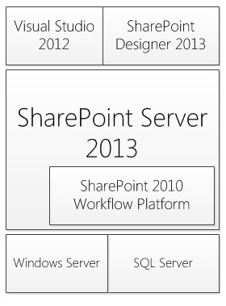
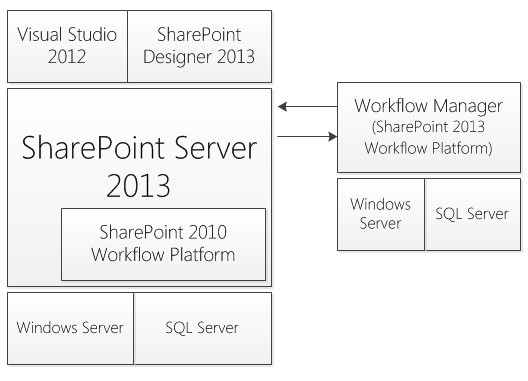
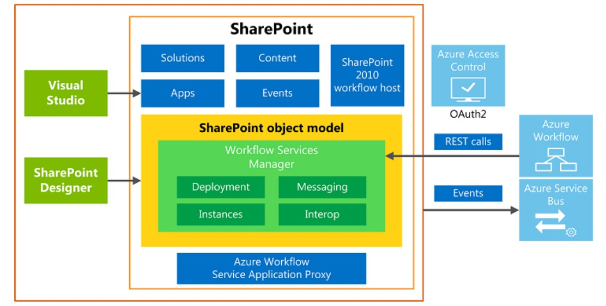
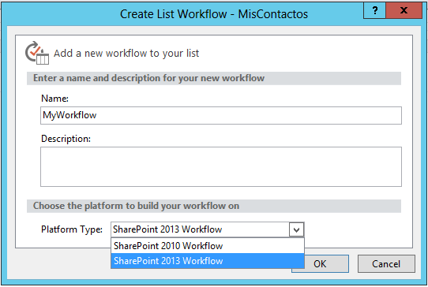
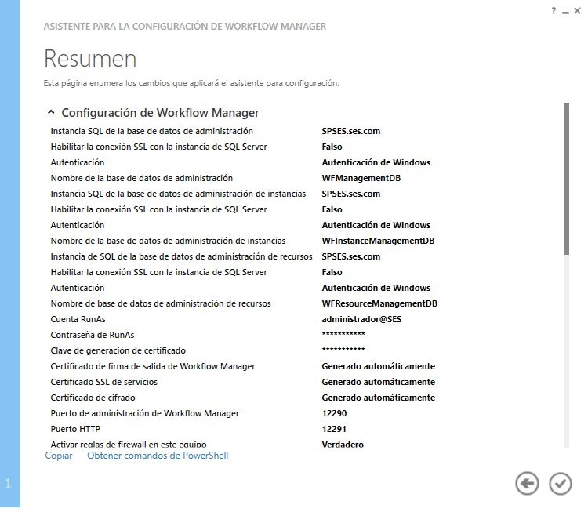

​La versión anterior de SharePoint, 2010, implementa el motor de flujos de trabajo implícitamente cuando la plataforma es instalada y está basado en el motor de flujos de Microsoft .Net Framework 3.5. Toda la carga necesaria para el funcionamiento de un flujo de trabajo, el proceso de hidratación y deshidratación de la misma esta provista por los mismos servidores que hospedaban SharePoint.  Por defecto, el motor de flujos en SharePoint 2010 viene pre-configurado con una serie de configuraciones que preservaban el uso de recursos en la granja, una de estas configuraciones limitaba a 15 la cantidad de instancias de flujos que podían ejecutarse simultáneamente en una implementación. La escalabilidad del motor de flujos, es decir, aumentar la capacidad de recursos disponibles en la granja para contar con mayor capacidad para ejecutar flujos estaba directamente relacionada con colocar más nodos de SharePoint, con lo cual diseñar una infraestructura para hospedar procesos de negocios basados en flujos de trabajo de SharePoint 2010 requería adicionar servidores. El estado de un flujo, es decir todo los valores de sus variables y configuración de ejecución son persistidos en la base de datos de contenido utilizada por la colección de sitios donde es asociado. En la siguiente figura podemos ver la arquitectura del motor de flujos de SharePoint 2010 disponible también como parte de SharePoint 2013 por cuestiones de compatibilidad hacia atrás.

SharePoint 2013 de forma nativa implemente la versión de Flujos de SharePoint 2010 y esta se instala por defecto cuando instalamos SharePoint 2013. Esta incorporación asegura que todos los flujos desarrollados para SharePoint 2010 utilizando el motor de flujos de Microsoft .Net Framework son compatibles con la nueva versión de la plataforma.

También se proporciona una nueva versión de flujos de trabajo basada en el nuevo motor de flujos de Microsoft .Net Framework 4.5 en la que el desarrollo de los mismos es totalmente declarativo, es decir,  no dispondremos de la capacidad de incorporar código personalizado dentro del flujo, por lo cual todos las reglas de negocio personalizadas que se deban codificar deberán ser realizas externamente mediante servicios expuestos y que se tendrán que invocar desde el propio flujo.

¿Por qué implementar el motor de flujos de Windows Azure en SharePoint 2013?

Porque la incorporación de este de motor proporciona mejoras circunstanciales a muchas de las problemáticas que se tienen al utilizar el motor de flujos de SharePoint 2010. En la siguiente imagen (extraída del sitio de MSDN de Microsoft) se puede ver la arquitectura del motor de flujos de SharePoint 2013:

Como se observa, el motor de flujos está fuera de la plataforma de SharePoint 2013 y debe instalarse de forma independiente. Más adelante veremos brevemente el proceso de instalación.  Dentro de las mejoras provistas se destacan:

- Independencia en la ejecución: esta ventaja se basa a que todo el proceso de ejecución necesario para que el motor de flujo funcione es provista por un servidor independiente sin que este deba tener SharePoint instalado. Si no se dispone de un servidor, se puede usar uno de los servidores de la granja de SharePoint.
- Escalabilidad: Se puede construir una graja de servidores basado en Windows Azure Workflow. Si los procesos de negocios basados en flujos de trabajo de SharePoint requieren un aumento de hardware para procesar los mismos, solo se deben agregar nuevos servidores a los existentes para aumentar la capacidad de procesamiento.
- Almacenamiento Propio: El nuevo motor de flujos implementa sus propias bases de datos para manejar la ejecución de los mismos. Esto quiere decir que la información del estado, la hidratación y la deshidratación no son manejados en la base de datos de contenidos de SharePoint.
- Comunicación REST y CSOM: Al ser un motor de flujos que se ejecuta por separado de la plataforma de SharePoint toda la comunicación desde y hacia SharePoint se realiza utilizando REST y/o CSOM. Esto habilita también que cualquier aplicación puede utilizar flujos basados en el motor de Windows Azure dentro de la granja que se está implementando.
- Seguridad y Acceso: Toda la validación y control de acceso se realiza utilizando OAuth, lo cual permite que el motor de flujos pueda chequear contra SharePoint si el usuario que está realizando la invocación tiene los permisos necesarios.

La siguiente imagen muestra un diagrama de la arquitectura ampliada del motor de flujos de SharePoint 2013 y sus respectivos componentes.

Si se procede con la instalación de este nuevo motor de flujos y se asocia a SharePoint 2013, la plataforma quedará configurada con la posibilidad de crear flujos para las dos versiones de SharePoint, como se puede ver en la siguiente imagen.

El proceso de instalación y configuración del nuevo motor de flujos se basa en la instalación de dos componentes:

- Workflow Manager 1.0, el cual instala todos los componentes del motor de flujos. Como se comentó el motor de flujos puede estar instalado en un servidor independiente (sin SharePoint instalado) o en un servidor frontal web de SharePoint. Si se está construyendo una ambiente de producción la recomendación es disponer de un servidor independiente para poder escalar en más servidores si fuese necesario.
- Workflow Manager Client 1.0, el cual instala los componentes necesarios para comunicarse con el servidor de flujos. Este componente debe ser instalado en todas la maquinas que deben comunicar con el servidor. Por ejemplo, si desea desarrollar flujos con Visual Studio este componente deberá estar presente para que la comunicación con el motor se lleve a cabo.

Al terminar de instalar Workflow Manager 1.0 el próximo paso es configurar la granja de flujos. En el servidor donde se instaló el componente se dispondrá de un acceso directo al asistente de configuración que lo guiara en una serié de pasos para introducir los parámetros de configuración, servidor de SQL Server que se utilizará para albergar todas las bases de datos necesarias y los protocolos de comunicación HTTP o HTTPS utilizados por el motor. En la siguiente imagen se puede ver la pantalla de resumen que presenta el asistente antes de proceder con la configuración.

Al terminar el asistente de configuración se dispondrá de los siguientes componentes configurados y listos para ser utilizados:

- Un sitio web en el IIS del servidor, este sitio es el punto de comunicación para SharePoint y otras aplicaciones que desean interactuar con el motor de flujos. La comunicación con el mismo se puede llevar a cabo usando HTTP o HTTPS según la configuración que se estableció previamente.
- Una serié de servicios a nivel del sistema operativo:
    - Workflow Manager Backend, este servicio es el corazón del motor de flujos siendo el responsable de la ejecución del propio flujo.
    - Service Bus Message Broker, este servicio provee el mecanismo de almacenamiento y procesamiento para todos los mensajes que se intercambien con el motor de flujos.
    - Service Bus Gateway, este servicio es el encargado de manejar todo el ruteo de mensajes que se producen en la comunicación con el motor de flujos.
- Una serié de bases de datos utilizadas por el motor de flujos y el bus de comunicación para almacenar los datos necesarios para que todo funcione correctamente.

Si se desea agregar más servidores a una granja existente de flujos, se debe instalar el componente "Workflow Manager 1.0" en el nuevo servidor que se desea agregar y en el asistente de configuración se debe seleccionar "Agregar a una granja existente de Flujos" para unir el nuevo servidor, tal cual se realiza en SharePoint cuando se desea agregar un nuevo nodo.

En próximos artículos se estará profundizando el motor de flujos, el desarrollo de flujos y como se lleva a cabo la comunicación entre los servidores de la granja para que todo funcione correctamente.

**Fabián Imaz**
 MVP SharePoint
[fabiani@siderys.com.uy](mailto&#58;fabiani@siderys.com.uy) 
 @fabianimaz 
 [http://www.siderysbsn.com](http&#58;//www.siderysbsn.com/)

