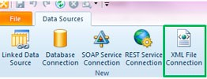
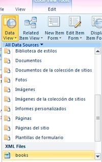
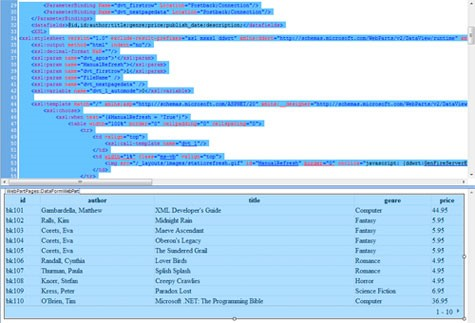
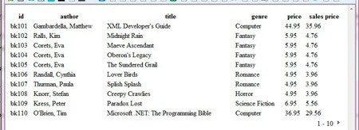

​ En SharePoint 2010 es fácil encontrarse con situaciones en las que necesitamos personalizar el diseño de nuestras vistas de datos. La customización de estas vistas pasa por la edición y creación de plantillas en XSLT. En este artículo introduciremos los conceptos básicos sobre este lenguaje y veremos cómo comenzar a trabajar con él para mejorar la presentación de nuestras vistas de datos en SharePoint 2010.

Como bien define la [W3C](http://www.w3.org/Style/XSL/), XSL (Extensible Stylesheet Language) es una familia de recomendaciones desarrolladas en el seno del consorcio; en concreto en sus grupos de trabajo sobre XSLT, [XQuery](http://www.w3.org/XML/Query/) y [XML Print and Page Layout](http://www.w3.org/XML/XPPL/).

Son tres los miembros de esta familia: [XSLT](http://www.w3.org/TR/xslt), XPath y XSL-FO

- XSLT (Transformaciones XSL), es un lenguaje para transformar XML.
- XPath, es el lenguaje de expresión utilizado por las XSLT para acceder y referenciar partes de un documento XML.
- XSL-FO (Formateado de Objetos XSL), es el vocabulario XML que permite especificar formateado semántico.


Una hoja de estilo XSLT se encarga de describir cómo debe transformarse un documento XML dado en otro que usa un vocabulario de formateado, mostrándose así de una manera determinada. En cuanto profundizamos en el trabajo diario con SharePoint 2010, nos damos cuenta de la importancia de conocer y saber trabajar con XSLT, que nos encontraremos siempre que haya una vista de datos a representar, como por ejemplo en las List View WebPart (LVWP).

Algunos de los conceptos que debemos tener claros tienen que ver con los templates o plantillas, que pueden ser llamadas desde cualquier punto de la hoja XSLT y que tienen la finalidad de devolver un resultado (una cadena de texto, un valor, HTML...) que se usará de un modo u otro.

Lo mejor para continuar comentando los aspectos más destacables de XSL es seguir un ejemplo. Para ello utilizaremos el famoso fichero [books.xml](http://msdn.microsoft.com/en-us/library/windows/desktop/ms762271%28v=vs.85%29.aspx) de Microsoft; en este XML se define un catálogo que contiene información relativa a 12 libros de diversas temáticas. La información de cada libro se compone de los siguientes datos:

- Un identificador.
- Su autor.
- El título.
- El género.
- Su precio.
- La fecha de publicación.
- Una breve descripción.


Lo primero que haremos será crear un nuevo origen de datos desde nuestro sitio en SharePoint Designer 2010. Con la aplicación abierta, en la sección de orígenes de datos picharemos sobre la opción "XML File Connection", que se encuentra bajo el grupo "New".



Esta acción nos abrirá una ventana de propiedades del origen en la que deberemos buscar el fichero XML que queremos vincular, en este caso el fichero de ejemplo books.xml. Una vez lo tengamos aceptaremos los cambios y veremos creado nuestro origen bajo el apartado "XML Files".

A continuación crearemos una nueva página ASPX y añadiremos una nueva vista de datos utilizando nuestro origen de datos XML desde la Ribbon, como en la imagen.



Automáticamente se creará todo el código fuente necesario para mostrar los datos tal y como los veremos.



Podemos identificar en él los siguientes aspectos:

- Definición de la conexión con nuestro origen de datos, entre las etiquetas &lt;DataSources&gt;….&lt;/DataSources&gt; .
- Definición de los campos que se mostrarán en la vista de datos, entre las etiquetas &lt;datafields&gt;…&lt;/datafields&gt; .
- Formateado de la vista para que se muestren los datos en forma de tabla básica, entre las etiquetas &lt;XSL&gt;…&lt;/XSL&gt; .


Por tanto es entre las etiquetas &lt;XSL&gt;…&lt;/XSL&gt; donde incluiremos la definición de todas las variables y plantillas que necesitemos para la transformación y presentación de nuestros datos.

Para definir una variable con un valor determinado, por ejemplo una cadena de texto lo haremos de la siguiente forma:

```
<xsl:variable name="MiTexto">                Lorem ipsum dolor sit amet  </xsl:variable>
```

De este modo ya podremos utilizarla, por ejemplo, dentro de un HTML que devolveremos en una plantilla. Para usar una variable es necesario anteponer a su nombre el caracter '$':

```
<a href=" http://es.lipsum.com">               <xsl:value-of select="$MiTexto " /> </a>
```

Las plantillas se encargan de recoger reglas (repetición, ordenación, condicionales, de conversión, etc…) que aplicaremos a nuestros documentos XML y a sus elementos, generando así, como el resultado de haber transformado los datos, un nuevo documento. En nuestras templates podemos definir parámetros y variables así como, mediante XPath, leer y trabajar con objetos globales de nuestro documento.

En el [apartado de referencias sobre XSLT](http://www.w3.org/TR/xslt)podemos la sintaxis para crear una plantilla. De forma básica podemos decir que es de la siguiente forma:

```
<xsl:template match = "pattern" name = "name" priority = "number" mode = "mode"> <!-- Content: (xsl:param*, template) --> </xsl:template> 
```

De entre estos atributos destacamos "name", que sirve para dar un nombre a la plantilla, y "match", con el que podremos señalar el nodo del documento para el que definimos la plantilla; además, este segundo atributo es opcional si está definido el nombre.

Unos ejemplos de valores asignados al atributo match que podríamos tener para nuestro XML de ejemplo serían los siguientes:

- match="/", indicando así que la plantilla se aplicaría para el documento completo
- match="book", la plantilla se aplicaría sólo para los elementos o nodos de 'book'


Como aparece señalado en la sintaxis anterior, si lo deseamos también podemos pasarle a un template parámetros, a los que obligatoriamente les estableceremos el atributo "name".

Finalmente, debemos tener en cuenta que la versión de XSLT que usa SharePoint 2010 es la 1.0 y no es hasta la 2.0 cuando se permite crear funciones personalizadas. La forma de conseguir crear funciones o métodos en XSLT 1.0 se traduce en crear plantillas o templates y, posteriormente, llamar a dichas plantillas pasándole los parámetros establecidos, si se requieren. La forma de llamar a un plantilla, como encontramos en [su referencia](http://www.w3.org/TR/xslt), es:

```
<xsl:call-template name = "name"> <!-- Content: xsl:with-param* --> </xsl:call-template> 
```

El atributo name, como ya comentamos antes, se obligatorio y debe corresponderse con el nombre de la plantilla creada a la que queramos referenciar. En caso de que dicha plantilla defina algún parámetro, deberemos pasárselos durante esta llamada. Para ello utilizaremos la etiqueta:

```
<xsl:with-param name="name" select="expression"/> 
```

De nuevo es obligatorio indicar qué parámetro estamos pasando, a través del nombre, y el valor, usando en este caso el atributo select.

Con estas nociones que acabamos de ver vamos a personalizar nuestra vista de datos de ejemplo para mostrar una nueva columna llamada "sales price" en la que aparezca el precio de cada libro con un descuento aplicado del 20%.

La solución será crear una función que dado un precio nos devuelva el valor rebajado. Este nuevo precio se mostrará en una nueva columna, que situaremos por ejemplo a continuación de la nombrada como "price".

En la siguiente imagen podemos ver el estado actual de nuestra vista de datos de libros:


En primer lugar, vamos a crear nuestra plantilla llamada precioOferta, que no tendrá ningún parámetro y que asociaremos a los elementos de tipo 'book'. Para calcular el nuevo precio del libro, con un descuento del 20% utilizaremos la sencilla operación matemática de multiplicar el valor recibido por el factor 0.8. Finalmente, para completar la función, formatearemos el valor calculado de modo que se nos devuelva con sólo dos decimales; para esto nos ayudaremos de la función predefinida en XSLT 'format-number', que se encarga de devolver el número redondeado y con el formato especificado. El código de la plantilla es el siguiente:

```
              <xsl:template name="precioOferta" match="book">                              <xsl:value-of select="format-number(price*0.8,'#.00')"/>               </xsl:template>
```

A continuación, editaremos el código HTML de la tabla de datos, que se define por defecto en la plantilla con nombre '*dvt\_1*'; de modo que añadamos una nueva columna cuya cabecera será "sales price". No entraremos ahora en detallar su estructura, pero debemos saber que es a partir de ella donde se genera todo el código necesario para mostrar finalmente los datos tal y como los vemos.

En la plantilla '*dvt\_1.rowview*' definiremos la llamada a nuestra función (en forma de plantilla), de modo que se pinte para cada libro su precio en oferta. La nueva columna quedará de la siguiente forma:

```
              <td class="ms-vb">                             <xsl:call-template name="precioOferta"/>               </td> 
```

Finalmente guardamos los cambios y veremos que nuestra vista de datos, una vez añadida nuestra nueva columna generada a partir de la transformación del precio original de cada libro, queda de la siguiente manera:



Como hemos visto a través de XSL podemos trabajar con la información de nuestros datos así como con su disposición y diseño, consiguiendo mediante la definición de plantillas vistas de datos más amigables que podemos controlar y usar según nuestras necesidades.

Pensar en XSL no es extremadamente costoso pero dependiendo del escenario al que nos enfrentemos puede llegar a ser complejo. Por fortuna esto ha cambiado en SharePoint 2013, donde podremos crear diseños fácilmente con JavaScript y que aplicaremos a nuestras vistas de datos gracias a la nueva propiedad JS Link, que nos permite hacer referencia a la URL de nuestro JavaScript personalizado, y que incluye la nueva versión de SharePoint.

**Elisa Gutiérrez Calderón**
 MCTS SharePoint 2010 
[elisa.gutierrez@unican.es](mailto:elisa.gutierrez@unican.es) 
 [http://www.unican.es](http://www.unican.es/)

 
 
import LayoutNumber from '../../../components/layout-article'
export default LayoutNumber
