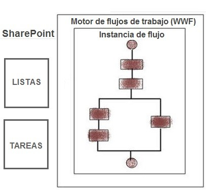
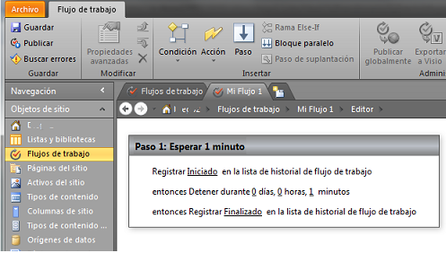
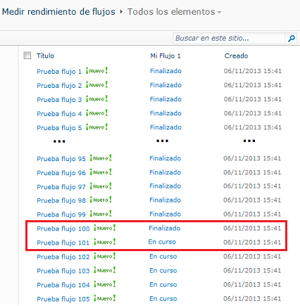
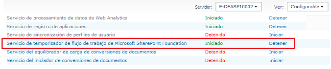
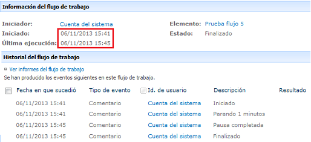

​​​Los flujos de trabajo ("Workflows") son una herramienta indispensable para diferentes necesidades colaborativas que se desarrollan en la plataforma Microsoft SharePoint. La necesidad de automatizar procesos donde se relacionen adecuadamente eventos, personas, recursos y tareas para lograr un objetivo, hacen necesario que esta plataforma esté configurada y administrada con un alto rendimiento para alcanzar las miles de peticiones que realizan las soluciones colaborativas allí implementadas.

SharePoint es una plataforma extensa, con diversas funcionalidades y complejos componentes que requieren estar bien administrados por un completo y estructurado plan de gobierno. Dicho plan debe ayudar a mantener una estructura organizada, un crecimiento controlado y un alto desempeño de las prestaciones según la topología seleccionada. De esta forma se podrá evitar un desbordamiento inesperado sin caer en alguna de sus limitaciones.

**Problemática**

Para el caso de los flujos de trabajo y aislando el factor humano, existen numerosos factores técnicos que afectan el rendimiento de éstos en la plataforma SharePoint y este artículo quiere destacar algunos, para evitar quedarse sin respuesta a preguntas como:

- ¿Por qué toma tanto tiempo en iniciar un flujo de trabajo?
- ¿Por qué el envío de correos y otros procesos no es inmediato?
- ¿Por qué el flujo de trabajo tarda tanto en ser procesado?
- ¿Por qué debido a una alta carga, los flujos de trabajo son puestos en una cola y luego son atendidos mucho tiempo después, frecuentemente hasta en días después?
- ¿Por qué si el flujo está programado para esperar 1 minuto tarda 5 minutos en continuar?
- ¿Por qué el flujo de trabajo genera un error al iniciar o no inicia?
- ¿Cuántos flujos de trabajo se pueden procesar al tiempo y por qué otros van a una cola de espera?
- ¿Cuál es el número de flujos concurrentes?
- ¿Por qué si el flujo es sencillo tarda tanto tiempo en terminar?

¿Por qué el rendimiento de los flujos es tan bajo si el servidor tiene recursos suficientes y nunca se evidencian altos picos de consumo de recursos?

El motor de flujos de trabajo de SharePoint está construido en "Windows Workflow Foundation" (WWF), ver imagen 1. Cada una de sus nuevas versiones ha incluido acciones o actividades más complejas que requieren tener una buena configuración y buen procesamiento tanto en cantidad de flujos procesados, como en tareas asignadas, ciclos, fases y otros procesos complejos de integración como servicios web, integraciones con SQL o con fuentes externas, conversión de documentos, máquinas de estado, etc. Estas nuevas acciones nativas del motor de flujos y herramientas complementarias como "Nintex Workflow", han generado que muchas necesidades actuales se solucionen con técnicas de flujos de trabajo (obviamente la herramienta fundamental en una plataforma colaborativa, son los flujos de trabajo) lo que compromete un esfuerzo mayor a nivel de rendimiento y en especial de configuración de todo el motor. Es allí, donde muchos parámetros asignados por defecto en una plataforma tan extensa como SharePoint comienzan a estar desnivelados debido a la cantidad de nuevas soluciones que se ven intervenidas por medio de flujos de trabajo y aunque existen muchos problemas que pueden ser resueltos con buenas prácticas de desarrollo y un mejoramiento en el diseño del flujo o con técnicas de "Divide y vencerás", realmente el factor de éxito está dado en un dimensionamiento de dicho crecimiento ("Capacity planning") y un buen conocimiento de los diferentes parámetros que usa el motor de flujos de SharePoint para procesar cada nueva instancia.

**Ejemplo**

Un ejemplo sencillo y muy práctico para identificar esta problemática es (ver imagen 2):

1. Crear un flujo de trabajo (SP2007, SP2010 o en SP2013 con el motor de flujos 2010) sobre una lista.
2. Agregar la acción inicial llamada "Registrar... en la lista de historial..." y personalizar esta acción con el mensaje de "Iniciado".
3. Agregar una acción llamada "Detener durante..." y personalizar esta acción para que espere 1 minuto.
4. Agregar una acción final llamada "Registrar... en la lista de historial..." y personalizar esta acción con el mensaje de "Finalizado".
5. Configurar para que el flujo inicie automáticamente cuando se cree un elemento.
6. Publicar.
7. Agregar masivamente 1000 elementos en dicha lista para que se inicien las instancias de flujo.

Muchos esperarían que después de 1 minuto, el motor de flujos de SharePoint completara estas 1000 instancias, pero varias de las instalaciones de la plataforma de SharePoint que se realizan no incluyen en sus "Planes de Gobierno" controles en el tema de flujos de trabajo y los valores por defecto de esta instalación nos ofrece como resultado, que el motor de flujos solo comienza a procesar la primera instancia después de 5 minutos y solo procesa 100 instancias en ese lapso de tiempo. Las demás 900 instancias del flujo son procesadas al cabo de 50 minutos, ya que son procesadas en grupos de 100 cada 5 minutos, ver imagen 3. En este punto es donde podemos comenzar a inferir sobre algunas de las preguntas mencionadas previamente.

El primer intento por tratar de resolver este inconveniente puede ser revisar la memoria, los picos de consumo de recursos y otras prestaciones de servidor, pero en general, este problema no se resuelve específicamente de esta forma. SharePoint tiene diferentes parámetros y funcionalidades que dependen no solo de una topología y de adicionar recursos, sino de una configuración detallada basada en las necesidades definidas en un buen plan de gobierno para controlar la plataforma y su crecimiento, ya que para algunos, las necesidades en flujos de trabajo son pocas, pero para otras organizaciones, los flujos son el eje de la plataforma colaborativa SharePoint y este comportamiento requiere ir más allá de una simple instalación de la plataforma.

**¿Cómo funciona el motor de flujos de trabajo?**

El mayor factor que afecta el rendimiento de los flujos de trabajo es el desconocimiento del funcionamiento de su motor, así como las diferentes configuraciones que se pueden realizar para alcanzar las necesidades de cada organización. En SharePoint, existen diferentes servicios que en conjunto con procesos programados ("Jobs") a nivel de cada Aplicación Web ("Webapp"), permiten administrar varias herramientas y funcionalidades de la plataforma. Para los flujos de trabajo, se tiene un sistema de colas que permite controlar la cantidad de operaciones que llegan al motor de flujos de trabajo.  Este sistema es llamado Servicio de Temporizador de flujo de trabajo ("Workflow Timer Service") y por medio de una serie de parámetros como: Frecuencia de Trabajo del Temporizador, Tamaño del lote, Tamaño de regulación, entre otros, se van asignando recursos para procesar cada una de las instancias de un nuevo flujo.

*Frecuencia de Trabajo del Temporizador ("Timer Job Frequency"):* Su valor por defecto es 5 minutos. Este parámetro determina el lapso de tiempo en el que se procesan las tareas pendientes que son puestas en el sistema de colas. Las tareas o acciones de un flujo de trabajo son puestas en el sistema de colas por diferentes razones: si se supera el tamaño de lote de actividades a procesar, si se ejecuta una tarea o acción de espera (ejemplo: Detener durante... o Detener hasta fecha...), si se supera el tiempo de espera realizando una acción, entre otras.

*Tamaño del lote ("Batch Size"):* Su valor por defecto es 100 elementos de trabajo. Este parámetro controla el número de elementos de trabajo que se encuentran en el sistema de colas y están listos para ser procesados en un lapso de tiempo según la frecuencia de trabajo del temporizador. Este parámetro evita una sobrecarga de actividades en el servidor y se debe tener en cuenta que cada acción o elemento de trabajo tiene diferente nivel de complejidad. Este valor también determina el momento en el que un flujo puede iniciar o debe esperar al final de la cola.

*Tamaño de regulación ("Throttle size"):* Su valor por defecto es 15. Este parámetro determina cuántos flujos pueden ser procesados al mismo tiempo por toda la granja de servidores. No determina la cantidad de flujos que están "En curso" al tiempo, sino cuántos pueden estar usando activamente el procesador. De superar este valor los flujos se agregan al sistema de colas. Este valor también determina el momento en el que un flujo puede iniciar o debe esperar y a su vez, controla la cantidad de recursos asignados al motor de flujos evitando un mal desempeño de la plataforma.

*Tiempo de espera ("Timeout"):* Su valor por defecto es 5 minutos. Este parámetro especifica la cantidad de minutos que tiene cada flujo de trabajo para ser completado antes de llegar a una actividad de espera, ejecución o terminación del flujo. Este valor está muy relacionado con la frecuencia de trabajo debido a que si la operación tarda más tiempo, se envía al sistema de colas hasta una nueva ejecución del temporizador.

De acuerdo a estos parámetros y su configuración por defecto, se pueden ahora dar razones claras sobre el funcionamiento del ejemplo presentado previamente. Al crear una tarea o acción de espera ("Detener durante...") se da la posibilidad de que el motor de flujos agregue al "sistema de colas" las 1000 instancias creadas del flujo; existen otras razones para que el motor tome esta decisión sin que nos demos cuenta, es posible que la acción a procesar no se complete según el "tiempo de espera" o cuando ya se ha alcanzado el máximo de "tamaño de regulación" o de "tamaño de  lote" a nivel de acciones a procesar. Al tener flujos pendientes por completar en el sistema de colas, este sistema se apoya en el temporizador y según su "frecuencia de trabajo", en un lapso de 5 minutos después de la última revisión, se procesan las primeras 100 instancias basados en el parámetro "Tamaño del lote", como se ve en la imagen 5, se supone que procesar estas acciones tiene a lo sumo 5 minutos según el "tiempo de espera" para no volver a quedar en la cola del sistema. En la mayoría de los casos 5 minutos puede ser un tiempo extenso para procesar solo 100 instancias, algunas pruebas muestran que el motor tiene un nivel de estabilización a razón de 30 flujos por segundos en una granja de 3 o 4 servidores Web.

Debido a este funcionamiento, las instancias de los flujos, solo son consumidos en grupos de 100 y no se inician al minuto uno (1) como se espera, sino al minuto cinco (5) debido al temporizador, ver imagen 5. Caso similar para otros temporizadores como en el tema de "Directivas de Retención" que solo se ejecuta por defecto cada 5 días y no con frecuencia diaria como se supone. Un nuevo grupo de 100 instancias es procesado después de casi 10 minutos, ver imagen 6.

Finalmente, después de casi 50 minutos, se terminan de procesar las 1000 instancias que requeríamos, obviamente todo debido a la configuración que tenemos por defecto, ver imagen 7. Incluso, podríamos tener mayores problemas si seguido de una actividad de espera continúa otra o tal vez, si sigue una acción más compleja, debido a que el flujo después de salir del sistema de colas, tendría que volver nuevamente al final de la cola y así sucesivamente hasta tener el espacio y disponibilidad suficiente para ser completado, por dicha razón, muchas veces un flujo puede tardar días o tal vez demorar en iniciar aun siendo un flujo sencillo.

Este comportamiento no sería diferente si se reinicia algún servicio o si se agregan nuevos recursos como memoria al servidor. Este comportamiento se debe a una configuración del motor de flujos y aunque no existen números mágicos o ideales, se evidencia la importancia de una configuración de acuerdo a las necesidades que se asuman para la plataforma SharePoint, ayudando a tener un ambiente bien administrado para que responda al rendimiento requerido sin ocasionar desperdicios ni sobrecargas de recursos. En el ejemplo descrito, se evidencia que el lote de 100 instancias es completado en menos de 20 segundos. Obviamente la complejidad del flujo es muy baja, pero buscando un punto medio, muy seguramente el 60% o 70% del lapso de tiempo de 5 minutos se desperdicia sin que el motor realice nuevos procesamientos, de allí, que sea importante re-configurar estos parámetros para lograr una buena estabilidad. Esto se logra al realizar configuraciones con diferentes parámetros y flujos, ejecutando procesos de monitoreo en el comportamiento de recursos como procesos internos y picos de memoria, y completando el plan de gobierno con un buen dimensionamiento para que los administradores de la plataforma tengan claro que se tiene y hasta donde se puede llegar.

Dejando a un lado el tema de configuración, también podemos identificar otros problemas generados por malas prácticas o flujos creados con una alta complejidad en la etapa de desarrollo, de ahí, que sea totalmente importante complementar una buena administración de flujos de trabajo con buenas lógicas de programación. Existen muchas confusiones entre los flujos de trabajo y los controladores de eventos ("event handler"), en ocasiones la lógica de un flujo de trabajo es desarrollada en un controlador de eventos y viceversa. Existen varios "blogs" donde se ayuda a identificar estas diferencias y tanto como las buenas practicas en desarrollo. Es importante tener esos elementos claros para lograr asignar adecuadamente el trabajo que debe completar cada motor. De esta forma se obtienen flujos de trabajo más livianos y con tareas más apropiadas para su naturaleza. Otros aspectos importantes en el momento de desarrollar un flujo de trabajo, es administrar adecuadamente la lista de tareas y de historial, para evitar un crecimiento desbordado, el ideal es tener listas independientes por cada flujo y junto con políticas de retención, hacer depuración de esta información.  Como última estrategia y como en todo ambiente de desarrollo, se puede aplicar el criterio de "divide y vencerás", si se logra dividir un problema en varios flujos de trabajo, no solo podemos ayudar a que el motor complete de forma más rápida los flujos de trabajo sino que habilitamos la posibilidad de regresar a una etapa o fase del flujo en caso de reinicio del flujo o falla.

**CONCLUSIÓN**

El desconocimiento en el comportamiento del motor de flujos de trabajo de la plataforma SharePoint puede generar dificultades a medida que las necesidades colaborativas crecen. En SharePoint existen diferentes parámetros por defecto, que no siempre cubren todas las necesidades de cada organización y de allí, que sea importante validar sus valores e identificar cómo lograr el mejor rendimiento por medio de diversas pruebas y monitoreo para evitar desaprovechar recursos, especialmente en un ambiente de producción. Una buena administración y configuración, nos evitará siempre acudir a la compra de nuevos recursos físicos y, junto con buenas prácticas de desarrollo y un buen plan de gobierno, se puede aprovechar en gran medida de todas las funcionalidades que nos ofrece esta gigantesca plataforma.

**Diego A. Campo A.**
 Director de Arquitectura | Microsoft Certified: TS 
 diegoc@e-deas.com.co 
 e-deas Ltda. http://www.e-deas.com.co

 
 
import LayoutNumber from '../../../components/layout-article'
export default LayoutNumber
